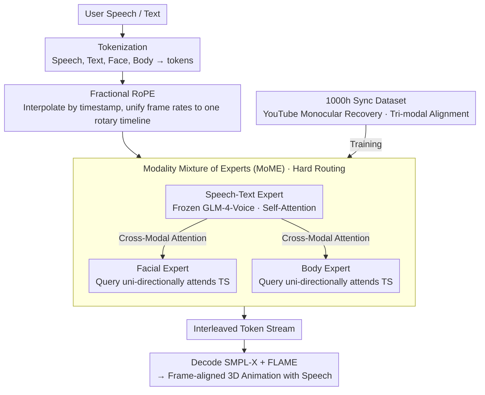

# ViBES: A Conversational Agent with Behaviorally-Intelligent 3D Virtual Body

**Conference**: CVPR 2026  
**arXiv**: [2512.14234](https://arxiv.org/abs/2512.14234)  
**Code**: [ai.stanford.edu/~juze/ViBES/](https://ai.stanford.edu/~juze/ViBES/)  
**Area**: Human Understanding / Multimodal Interaction  
**Keywords**: Conversational Virtual Human, Modality Mixture of Experts, Co-speech Gesture Generation, Speech-Motion Synchronization, 3D Body Animation

## TL;DR

ViBES is proposed as a 3D conversational agent that unifies language, speech, and body movement. Through a Modality Mixture of Experts (MoME) architecture and cross-modal attention mechanisms, it generates temporally aligned facial expressions and full-body motions while preserving the conversational intelligence of pre-trained speech LLMs, shifting the paradigm beyond viewing behavior as simple "modality translation."

## Background & Motivation

Existing conversational AI systems possess fluent text and speech interaction capabilities but **lack a body**—human communication is inherently multimodal, where speech, prosody, and body language collectively convey intent. Current methods that model behavior as "modality translation" (e.g., speech-to-gesture, text-to-motion) have fundamental flaws: they do not require intelligent decisions on "when to move, what to do, and how to adapt to multi-turn dialogues," resulting in temporal fragility and weak social grounding.

Intuitively, speech LLMs and motion generators could be concatenated (two-stage), but practical implementation faces significant hurdles: no unified timing or selection strategy, no shared dialogue state, and an inability to ensure consistency across turns. The most relevant works, LoM and SOLAMI, focus on modality alignment rather than preserving conversational intelligence.

Goal: Build a true "embodied conversational agent" that can not only generate co-speech gestures while answering but also follow explicit motion instructions (e.g., "Please take a step back and wave"). This requires elevating non-verbal behavior from "conditional generation" to "intelligent agent behavior."

## Method

### Overall Architecture

The core problem ViBES addresses is enabling a conversational model that can already "speak" to simultaneously develop a "body" and decide when to move, what to do, and how to coordinate with language in multi-turn dialogues. The approach involves tokenizing speech, language, face, and body into tokens, which are then interleaved on the same timeline and emitted auto-regressively—essentially treating "embodied behavior" as another output modality of the dialogue model rather than attaching a motion generator post-hoc.

The overall model is a Speech-Language-Behavior (SLB) model using MoME to separate three categories of parameters: the speech-text expert is frozen from the pre-trained GLM-4-Voice to handle dialogue intelligence; the facial expression and body motion experts are two lightweight sidecars responsible for translating intention in language/speech into specific actions. The three experts are coupled through SLB cross-modal attention, jointly generating an interleaved token stream on a unified timeline.

### Key Designs

**1. Modality Mixture of Experts (MoME): Enabling motion experts to "read" dialogue state without breaking existing LLM capabilities**

The most direct approach would be feeding all modalities into a large Transformer for dense fusion, but that would wash out the pre-trained dialogue capabilities of GLM-4-Voice—a cost that two-stage concatenation and methods like LoM/SOLAMI cannot avoid. The solution in ViBES is to equip each of the three experts with independent FFNs and LayerNorms, using hard routing: tokens are deterministically assigned to their corresponding expert based on modality labels, avoiding a learnable router. The attention topology is crucial—the Speech-Text (TS) expert performs self-attention, while the Query of facial and body experts only uni-directionally attends to the Key/Value of the TS expert. This allows the TS expert to maintain frozen GLM-4-Voice weights, while facial/body experts act as sidecars that "read" the TS dialogue state to decide actions without needing large-scale joint pre-training from scratch. Ablations confirm this topology: once conditioned on TS, face and body are nearly independent, and adding cross-attention between them yields no improvement.

**2. Fractional RoPE: Precisely aligning modalities with different frame rates on a single rotary timeline**

The frame rates for speech, motion, and body tokens are inconsistent (speech at 12.5fps, motion at 25fps, body at 6.25fps) ⚠️. Standard RoPE assumes positions are equally spaced integer indices, which cannot express cross-modal temporal correspondence like "motion frame $t$ falls between speech tokens $i$ and $i+1$." ViBES uses the TS stream as anchors at integer indices, while motion tokens obtain a fractional index via linear interpolation:

$$s_t = s_{a_i} + \alpha_t$$

Where $\alpha_t$ is the normalized position of the actual timestamp of the motion token between two adjacent TS anchors (0 to 1). The attention scores calculated via rotary position embeddings naturally reflect the true cross-modal temporal distance without requiring all modalities to be resampled to the same frame rate—making it more efficient and precise than frame resampling.

**3. 1000h Synchronized Dataset: Filling the gap in "tri-modal simultaneous alignment" training corpora**

The bottleneck for training such a unified agent is data: existing datasets mostly provide paired alignment (text-to-motion or audio-to-motion), lacking large-scale triples of audio-text-motion aligned simultaneously. ViBES automatically recovers 3D human motion from YouTube dialogue videos (interviews, podcasts, speeches)—using SMPL-X for the body/hands and FLAME for the face—and aligns them temporally with speech and text transcriptions. This is combined with existing motion datasets to create approximately 1000 hours of training data. The trade-off is noise from monocular recovery (occlusion, depth ambiguity), but experiments show the model still learns meaningful dialogue behavior patterns after large-scale training.

### Loss & Training

Standard next-token prediction loss is used for auto-regressive training. Facial tokens follow the LoM tokenizer (25fps), and body tokens use a compositional tokenizer for upper/lower body and hands (6.25fps), with all streams aligned to a 25fps master clock. Training is multi-stage: pre-training on large-scale data followed by fine-tuning on conversational interaction data.

## Key Experimental Results

### Main Results

| Task | Method | Key Metrics | Description |
|------|------|---------|------|
| Multi-turn Dialogue + Motion | Ours | Dialog-motion alignment / Quality / Social appropriateness are optimal | Comprehensive benchmark |
| Co-speech Gesture | Ours | SOTA | On BEAT2 benchmark |
| Text-to-Motion | Ours | SOTA | On HumanML3D benchmark |

### Ablation Study

| Configuration | Effect | Description |
|------|------|------|
| Enable Face $\leftrightarrow$ Body Attention | No improvement | Face/Body are independent once conditioned on TS |
| Remove Fractional RoPE | Drop in temporal alignment | Proves importance of precise temporal encoding |
| Two-stage (LLM+Motion Gen) | Poor consistency | Lack of shared dialogue state |

### Key Findings

- Hard modality routing + uni-directional cross-attention (Face/Body $\rightarrow$ TS) is the most effective architectural choice, superior to bi-directional or fully connected attention.
- Though monocular 3D motion recovered from YouTube is noisy, the model learns meaningful conversational behavior patterns after large-scale training.
- Fractional RoPE is vital for maintaining cross-modal temporal synchronization.

## Highlights & Insights

- **Elevating non-verbal behavior to "agentic behavior" rather than "modality translation"**: Ours not only generates gestures synced with speech but also understands and executes natural language motion instructions, a qualitative shift from generation to intelligence.
- **Frozen Pre-trained LLM + Lightweight Sidecar Experts** architecture: Avoids the astronomical data and compute requirements of training a tri-modal model from scratch, adaptable to other new modalities.
- **Fractional RoPE** elegantly solves temporal alignment for modalities with different frame rates, proving more refined than frame resampling.

## Limitations & Future Work

- 3D motion recovered from YouTube monocular video has limited quality (occlusion, depth ambiguity).
- No direct interaction modeling between face and body may miss subtle social signals like gaze-gesture coordination.
- Cache file truncation results in limited full experimental data.
- Currently only supports single-person agents; multi-person interaction scenarios are not covered.

## Related Work & Insights

- **vs LoM/SOLAMI**: Those only perform modality alignment, lack an LLM reasoning backbone, and do not support motion instructions.
- **vs Co-speech Methods**: Only perform audio-to-motion translation without dialogue understanding capabilities.
- **vs Two-stage Systems**: Lack unified strategy and shared dialogue state.

## Rating

- Novelty: ⭐⭐⭐⭐⭐ First to unify dialogue intelligence with embodied behavior in a 3D agent; MoME + Fractional RoPE design is ingenious.
- Experimental Thoroughness: ⭐⭐⭐⭐ Multi-task evaluation and ablations (partially limited by data truncation).
- Writing Quality: ⭐⭐⭐⭐⭐ Clear problem definition and detailed architectural description.
- Value: ⭐⭐⭐⭐⭐ Opens new directions for embodied conversational AI; datasets and framework are highly valuable to the community.

<!-- RELATED:START -->

## Related Papers

- [\[CVPR 2026\] SAM 3D Body: Robust Full-Body Human Mesh Recovery](sam_3d_body_robust_full-body_human_mesh_recovery.md)
- [\[CVPR 2026\] SyncMos: Scalable Motion Synchronisation for Multi-Agent Scene Interaction](syncmos_scalable_motion_synchronisation_for_multi-agent_scene_interaction.md)
- [\[CVPR 2026\] FusionAgent: A Multimodal Agent with Dynamic Model Selection for Human Recognition](fusionagent_a_multimodal_agent_with_dynamic_model_selection_for_human_recognitio.md)
- [\[CVPR 2026\] InterAgent: Physics-based Multi-agent Command Execution via Diffusion on Interaction Graphs](interagent_physics-based_multi-agent_command_execution_via_diffusion_on_interaction_graphs.md)
- [\[CVPR 2026\] Mobile-VTON: High-Fidelity On-Device Virtual Try-On](mobile_vton_ondevice_virtual_tryon.md)

<!-- RELATED:END -->
