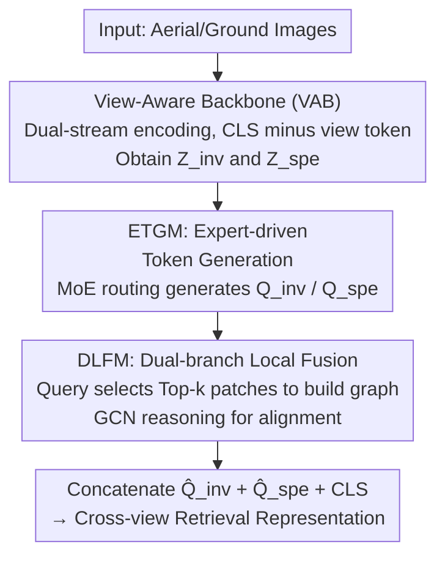

# View-Aware Semantic Alignment for Aerial-Ground Person Re-Identification

**Conference**: CVPR 2026  
**arXiv**: [2605.18192](https://arxiv.org/abs/2605.18192)  
**Code**: https://github.com/Cat-Zero/ViSA (Available)  
**Area**: Human Understanding / Person Re-Identification  
**Keywords**: Aerial-Ground Person Re-Identification, View-aware, Mixture of Experts, Graph Convolution, Feature Decoupling

## TL;DR
To address the drastic viewpoint differences between UAVs and ground cameras in Aerial-Ground Person Re-Identification (AGPReID), this paper proposes ViSA. Instead of pursuing forced "view-invariant" alignment of shared parts, it utilizes a set of Expert-driven Token Generation Modules (ETGM) to generate adaptive semantic queries. These queries are then anchored to their responsive local regions using a Dual-branch Local Fusion Module (DLFM) through graph reasoning. This simultaneously preserves view-invariant and view-specific identity cues, achieving a $10.06\%$ mAP improvement on the CARGO cross-view protocol.

## Background & Motivation
**Background**: Person Re-Identification (ReID) aims to match the same individual across non-overlapping cameras. The integration of UAVs into surveillance networks has given rise to Aerial-Ground Person Re-ID (AGPReID), where queries and the gallery come from top-down UAV views and eye-level fixed cameras, respectively, resulting in extreme viewpoint differences. Existing AGPReID methods primarily follow the "view-invariant" paradigm, such as VDT, which decouples view factors to align shared representations across views.

**Limitations of Prior Work**: The authors point out a neglected side effect of the "view-invariant" paradigm: it essentially forces **part-level alignment**. To match features between two views, the model is compelled to match only the shared parts visible in both, thereby **suppressing discriminative cues that are strongly related to identity but prominent only in a specific view** (e.g., legs in ground views, shoulders in aerial views). Furthermore, existing methods often rely on global representations. However, steep angles and occlusions in aerial views frequently lead to missing body parts, making global descriptors unreliable. Fine-grained identity evidence is actually hidden within local patches.

**Key Challenge**: From an information theory perspective, the representation $Z=f(X,V)$ entangles the identity factor $X$ and the view factor $V$. The ideal goal is to $\max I(Z;Y)$ while minimizing $I(Z;V)$. However, **strictly suppressing $I(Z;V)$ inherently reduces $I(Z;Y)$**, as view-related cues like clothing folds and body shape consistency are partially correlated with identity. Uniformly suppressing the viewpoint effectively discards useful discriminative information.

**Goal / Key Insight**: Rather than suppressing the viewpoint, it is better to **decouple and utilize it**. The authors explicitly split the representation into $Z=[Z_{inv}, Z_{spe}]$, constraining $I(Z_{inv};V)\approx 0$ (view-invariant, identity-preserving) and $I(Z_{spe};V)>0$ (explicitly encoding systematic appearance changes caused by the viewpoint), thus avoiding the information bottleneck caused by adversarial suppression.

**Core Idea**: Replace "view-invariant part alignment" with "view-aware semantic alignment." This involves using view-specific experts to generate adaptive queries and then aligning these queries with their respective responsive local regions to leverage both view-invariant and view-specific identity cues.

## Method

### Overall Architecture
ViSA is an encoder-decoder structure built upon the View-Decoupled Transformer (VDT). The **encoder** uses a dual-stream design: each layer introduces independent learnable view tokens for aerial and ground views. The `[CLS]` token subtracts the corresponding view token layer by layer to remove view bias and obtain a more view-invariant global representation while retaining view-sensitive semantics. Since a single `[CLS]` token cannot capture the fine-grained details dispersed across patches, the **decoder** follows with two complementary modules: the ETGM (Expert-driven Token Generation Module), which uses a Mixture-of-Experts (MoE) mechanism to route local patch information into a set of semantic queries while keeping invariant and view-dependent components separated; and the DLFM (Dual-branch Local Fusion Module), which uses graph reasoning to anchor each query to its most relevant local patches for structural alignment. Finally, the refined local features from both branches are concatenated with the global `[CLS]` to form the final discriminative representation for cross-view retrieval.

### Key Designs

**1. View-Aware Backbone (VAB): Explicitly splitting rather than erasing view factors**

To address the problem of losing identity cues in the view-invariant paradigm, ViSA no longer forces the backbone to approximate a single view-invariant feature. Instead, it follows the dual-stream approach of VDT: each Transformer layer is equipped with independent learnable view tokens for aerial and ground views. The `[CLS]` token subtracts its corresponding view token at each layer to obtain the debiased view-invariant representation $Z_{inv}$, while simultaneously retaining the view-specific representation $Z_{spe}$. Formalized as an information theory objective, the goal is $I(Z_{inv};V)\approx 0$ and $I(Z_{spe};V)>0$. This replaces "view suppression" with "view separation." Ablation studies show that adding VAB alone improves ALL mAP from $53.54\%$ to $55.20\%$, but larger gains rely on subsequent modules to recover dispersed local cues.

**2. Expert-driven Token Generation Module (ETGM): MoE routing of local cues into view-adaptive queries**

A single `[CLS]` token is insufficient to store fine-grained identity evidence spread across patches. ETGM thus constructs a set of view-aware experts for both view-invariant and view-specific components. Each expert is a set of learnable tokens $\{t_1,\dots,t_M\}$ that interact with input features through a Transformer block containing cross-attention, self-attention, and FFN: $T' = \text{FFN}(\text{SelfAttn}(\text{CrossAttn}(T, Z)))$, where $Z$ is $Z_{inv}$ or $Z_{spe}$. Cross-attention allows expert tokens to absorb input features, self-attention enables interaction between tokens, and the FFN performs non-linear transformation. An MoE router dynamically selects the Top-2 experts for each sample, and the weighted sum of their outputs forms the final queries $Q_{inv}$ and $Q_{spe}$. The objective is for $Q_{inv}$ to be view-independent ($I(Q_{inv};V)\approx 0$) while $Q_{spe}$ retains identity information under a given view ($I(Q_{spe};Y\mid V)>0$). Consequently, the downstream DLFM receives "dispersed and specialized" query guidance rather than a single global vector.

**3. Dual-branch Local Fusion Module (DLFM): Query-guided sparse graph reasoning for local grounding**

Performing direct cross-attention between queries $Q$ and all local features $F=\{f_i\}_{i=1}^N$ ignores the inherent structural relationships between patches. DLFM utilizes graph reasoning instead. Each query first selects the Top-$k$ most relevant local tokens based on cosine similarity: $\mathcal{N}_k(Z)=\text{TopK}(\cos(Z,F))$, forcing semantic locality and suppressing irrelevant patches. A fully connected graph is built with these neighbors, where edge weights are pairwise cosine similarities $A_{ij}(Z)=\cos(f_i,f_j)$. The query token $Q$ is inserted as an additional node ($\mathcal{N}_{qv}(Q)=[Q,\mathcal{N}_k(Z)]$), embedding the query into the local feature manifold. A specialized GCN $g_{qv}$ updates the nodes using Laplacian normalized adjacency: $\mathcal{N}^*_{qv}(Q)=g_{qv}(\mathcal{N}_{qv}(Q),\hat{A}_{qv}(Q))$. The refined query is then extracted: $\hat{Q}=\mathcal{N}^*_{qv}(Q)[0,:]$. This process runs separately for the view-invariant and view-specific branches. Finally, $\hat{Q}_{inv}$, $\hat{Q}_{spe}$, and the `[CLS]` token are fused via a self-attention block to produce the local representation $F_{local}=\text{Attn}([\hat{Q}_{inv},\hat{Q}_{spe},\text{CLS}])$. The combination of sparsification (Top-$k$) and dual-branch decoupling allows the invariant branch to provide robust identity features while the view branch models systematic viewpoint changes, together enhancing cross-view discriminative power. Adding DLFM alone improves ALL Rank-1 from $61.54\%$ to $67.31\%$, making it the most significant contributor.

### Loss & Training
The total objective jointly supervises identity learning, view decoupling, and expert utilization:

$$\mathcal{L}=(\mathcal{L}_{id}^{global}+\mathcal{L}_{tri}^{global})+(\mathcal{L}_{id}^{local}+\mathcal{L}_{tri}^{local})+\mathcal{L}_{o}+\mathcal{L}_{view}+\lambda\mathcal{L}_{balance}$$

- **Identity Supervision**: $\mathcal{L}_{id}$ (Cross-entropy) + $\mathcal{L}_{tri}$ (Triplet loss with margin $m$), applied to both global and refined local features.
- **View Classification**: $\mathcal{L}_{view}$ a lightweight binary classifier predicts the camera domain (Ground vs. Aerial) from view tokens.
- **Orthogonal Decoupling**: $\mathcal{L}_{o}=\frac{1}{|B|}\sum_i |\cos(f_i^{inv}, f_i^{spe})|$, explicitly constraining invariant and view-specific features to be orthogonal to further separate identity from viewpoint.
- **MoE Load Balancing**: $\mathcal{L}_{balance}=E\sum_{j=1}^E \bar{p}_j^2$ (where $\bar{p}_j$ is the average routing probability for the $j$-th expert), preventing expert collapse and encouraging uniform utilization, weighted by $\lambda$.

Training Details: ViT backbone (ImageNet pre-trained), input $256\times128$, single RTX 4090, 120 epochs, SGD + momentum, learning rate $8\times10^{-3}$ with cosine annealing to $1.6\times10^{-6}$; batch size 256 (64 IDs × 4 instances). ETGM uses 8 experts per category, routing to Top-2, with $\lambda=0.001$.

## Key Experimental Results

### Main Results
Comparison with SOTA on the synthetic CARGO dataset (Rank-1 / mAP, %). ALL represents overall retrieval; A↔G / G↔G / A↔A represent specific retrieval modes:

| Method | Source | ALL R1 | ALL mAP | A↔G R1 | A↔G mAP |
|------|------|--------|---------|--------|---------|
| VDT | CVPR'24 | 64.10 | 55.20 | 48.12 | 42.76 |
| DTST | ICME'25 | 64.42 | 55.73 | 50.63 | 43.39 |
| CLIP-ReID | AAAI'23 | 68.27 | 64.25 | 55.62 | 53.83 |
| SeCap | CVPR'25 | 68.59 | 60.19 | 69.43 | 58.94 |
| **Ours** | - | **70.51** | **65.46** | **71.28** | **69.00** |

Under the ALL protocol, ViSA improves by $+1.92\%$ Rank-1 / $+5.27\%$ mAP over the previous best; most importantly, on the **A↔G cross-view protocol**, mAP increases from SeCap's $58.94\%$ to $69.00\%$, achieving the claimed **+10.06% mAP Gain**. Ours also achieves the highest mAP and first or second-place Rank-1 on real datasets AG-ReID.v2 and LAGPeR (detailed tables in supplementary material).

### Ablation Study
Component analysis on CARGO (%):

| VAB | ETGM | DLFM | ALL R1 | ALL mAP | A↔G R1 | A↔G mAP |
|-----|------|------|--------|---------|--------|---------|
| | | | 61.54 | 53.54 | 43.13 | 40.11 |
| ✓ | | | 64.10 | 55.20 | 48.12 | 42.76 |
| | | ✓ | 67.31 | 62.86 | 65.96 | 66.72 |
| ✓ | | ✓ | 68.59 | 62.40 | 68.09 | 65.53 |
| | ✓ | ✓ | 69.55 | 64.06 | 69.15 | 66.59 |
| ✓ | ✓ | ✓ | **70.51** | **65.46** | **71.28** | **69.00** |

### Key Findings
- **DLFM has the largest contribution**: Adding DLFM to the ViT baseline improves ALL Rank-1 from $61.54\%$ to $67.31\%$ and mAP from $53.54\%$ to $62.86\%$. The A↔G mAP jumps from $40.11\%$ to $66.72\%$, indicating that anchoring queries to local patches with graph reasoning is critical for cross-view scenarios.
- **ETGM facilitates explicit separation**: Removing ETGM causes A↔G Rank-1 to drop from $71.28\%$ to $68.09\%$, as the mechanism for separating identity cues from view-dependent changes is lost.
- **Hyperparameter Sensitivity**: The number of experts $E=8$ is optimal (excessive experts lead to redundancy/competition); activating $k=2$ experts per sample works best; $\lambda=0.001$ for load balancing is optimal (too large forces uniform utilization and suppresses specialization).

## Highlights & Insights
- **Compelling Paradigm Reversal**: The authors clarify the hidden cost of "view-invariant = part-level alignment" and use information theory to argue why viewpoints should be decoupled and utilized rather than suppressed.
- **MoE for the "View" Dimension**: Unlike previous ReID MoE methods that group by attributes (e.g., MoSCE, HAMoBE), this work assigns experts to different viewpoints, exploring a less-traveled path in AGPReID that could be applied to other tasks with systematic domain gaps.
- **Query-Augmented Graph Trick**: Treating abstract query tokens as additional nodes in a graph of local patches allows "semantic queries" to truly ground into "specific local regions" better than standard cross-attention. This query-to-manifold embedding approach is transferable to any query-based local alignment scenario.

## Limitations & Future Work
- **Reliance on Supplementary Material**: Main results for AG-ReID.v2 / LAGPeR and visualizations are in the appendix, making the main text's verifiability slightly weaker.
- **Quantification of Complexity**: With dual-stream encoding, MoE with 16 experts, and dual-branch GCNs, many modules are stacked. The paper lacks analysis of parameter counts or inference latency to justify the overhead for the $+5.27\%$ mAP gain.
- **Dependency on VDT and View Labels**: Built upon the VDT dual-stream backbone, the method requires aerial/ground labels for $\mathcal{L}_{view}$, which might limit application in scenarios without clear domain labels.
- **Gains are Most Prominent on Synthetic Data**: The most impressive $+10.06\%$ mAP occurs on the synthetic CARGO; improvements on real-world datasets are more moderate.

## Related Work & Insights
- **vs. VDT (CVPR'24)**: VDT also does view decoupling but pursues "view-invariance"—subtracting the view factor to align shared representations, which is essentially part-level alignment. Ours builds on VDT but preserves and utilizes $Z_{spe}$, recovering view-specific cues via MoE and graph reasoning.
- **vs. SeCap (CVPR'25)**: SeCap uses prompt learning to capture local features. Ours leads significantly in A↔G mAP ($69.00$ vs $58.94$), with the gap coming from the explicit invariant/view-specific decoupling rather than just prompts.
- **vs. MoE in ReID (MoSCE / HAMoBE)**: These methods group experts by attributes; ViSA groups them by viewpoint to explicitly model cross-view differences.
- **vs. GCN in ReID (GPS / ADGC / RTGAT)**: Prior works use GCN for human topology or occlusion. ViSA uses GCN to extract view-aware topological information from local features to serve cross-view semantic alignment.

## Rating
- Novelty: ⭐⭐⭐⭐ The "view-invariant → view-aware" paradigm shift is insightful.
- Experimental Thoroughness: ⭐⭐⭐⭐ Covering three benchmarks, ablation, and hyperparameter analysis is comprehensive, though main tables are sparse.
- Writing Quality: ⭐⭐⭐⭐ Well-motivated by information theory with clear module responsibilities.
- Value: ⭐⭐⭐⭐ Significant cross-view mAP gain; the query-graph fusion idea is transferable.

<!-- RELATED:START -->

## Related Papers

- [\[CVPR 2026\] WHU-MARS: A Multispectral Aerial-Ground Benchmark Towards Any-Scenario Person Re-Identification](whu-mars_a_multispectral_aerial-ground_benchmark_towards_any-scenario_person_re-.md)
- [\[CVPR 2026\] Towards Cross-Modal Preservation, Consistency and Alignment for Privacy-Preserving Visible-Infrared Person Re-Identification](towards_cross-modal_preservation_consistency_and_alignment_for_privacy-preservin.md)
- [\[CVPR 2026\] SSM-Aware Token-Efficient VMamba via Adaptive Patch Pruning and Merging for Person Re-Identification](ssm-aware_token-efficient_vmamba_via_adaptive_patch_pruning_and_merging_for_pers.md)
- [\[CVPR 2026\] Composite-Attribute Person Re-Identification via Pose-Guided Disentanglement](composite-attribute_person_re-identification_via_pose-guided_disentanglement.md)
- [\[CVPR 2026\] Vision-Language Attribute Disentanglement and Reinforcement for Lifelong Person Re-Identification](vision-language_attribute_disentanglement_and_reinforcement_for_lifelong_person_.md)

<!-- RELATED:END -->
