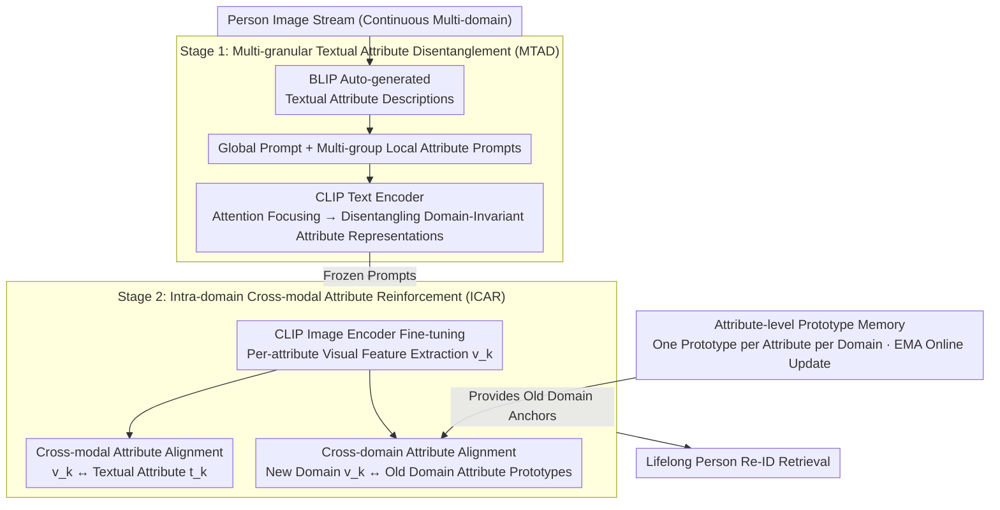

# Vision-Language Attribute Disentanglement and Reinforcement for Lifelong Person Re-Identification

**Conference**: CVPR 2026  
**arXiv**: [2603.19678](https://arxiv.org/abs/2603.19678)  
**Code**: [https://github.com/zhoujiahuan1991/CVPR2026-VLADR](https://github.com/zhoujiahuan1991/CVPR2026-VLADR)  
**Area**: Pedestrian Understanding  
**Keywords**: Lifelong Person Re-Identification, Vision-Language Models, Attribute Disentanglement, Cross-modal Alignment, Forgetting Mitigation

## TL;DR

VLADR proposes leveraging fine-grained attribute knowledge from Vision-Language Models (VLMs) to enhance lifelong person re-identification. Through a two-stage training process involving Multi-granular Textual Attribute Disentanglement (MTAD) and Intra-domain Cross-modal Attribute Reinforcement (ICAR), it explicitly models cross-domain shared human attributes to achieve efficient knowledge transfer and forgetting mitigation. It outperforms the Prev. SOTA by 1.9%-2.2% in anti-forgetting and 2.1%-2.5% in generalization.

## Background & Motivation

**Background**: Lifelong Person Re-Identification (LReID) requires a model to learn from a continuous stream of data across different domains to build a unified pedestrian retrieval system. Unlike standard ReID, LReID faces the catastrophic forgetting problem, where learning new domain knowledge often leads to the loss of prior domain knowledge. Existing methods primarily start from vision-only pre-trained models and utilize strategies like knowledge distillation, prototype memory, and distribution modeling to mitigate forgetting.

**Limitations of Prior Work**: Although Vision-Language Models (e.g., CLIP) have demonstrated powerful generalization capabilities, existing LReID methods show significant deficiencies when directly adapted to VLMs—they only consider global representation learning and neglect the utilization of fine-grained attribute knowledge. Global representations are easily disturbed by domain-specific redundant information such as background and lighting during domain shifts, whereas human attributes (e.g., clothing color, body shape, accessories) are cross-domain stable semantic anchors that have been severely undervalued.

**Key Challenge**: The core challenge of LReID lies in the conflict between "new knowledge acquisition" and "old knowledge preservation." Global representations are sensitive to domain changes, leading to the learning of the new at the expense of the old. Conversely, fine-grained attributes (e.g., "wearing a red top, carrying a black backpack") are domain-invariant semantic descriptors that can theoretically serve as bridges for cross-domain knowledge transfer—but existing methods lack an explicit attribute modeling mechanism.

**Goal**: To design a VLM-driven LReID framework that (1) explicitly decouples global and local human attributes, (2) utilizes cross-modal attribute alignment to achieve fine-grained knowledge transfer, and (3) mitigates forgetting through cross-domain attribute alignment.

**Key Insight**: The authors observe that human attributes exhibit "cross-domain commonality"—the semantics of "wearing blue jeans" remain consistent whether in the Market-1501 or MSMT17 datasets. If these shared attributes can be explicitly decoupled and aligned across modalities, they can serve as anchors for cross-domain knowledge transfer.

**Core Idea**: Use a VLM (BLIP) to automatically generate multi-granular textual descriptions of pedestrian images, then decouple global and local attributes in the textual space using learnable prompts. Finally, inject attribute knowledge into the vision encoder through cross-modal and cross-domain multi-layer alignment to achieve attribute-guided lifelong learning.

## Method

### Overall Architecture

VLADR adopts a two-stage training workflow: **Stage 1 (MTAD)**—Multi-granular textual attribute disentanglement is performed at the CLIP text encoder side to learn prompt representations for global and local attributes; **Stage 2 (ICAR)**—The weights of the prompts from Stage 1 are frozen, and the CLIP image encoder is fine-tuned using pre-extracted textual descriptions. Knowledge transfer is achieved through cross-modal attribute alignment and cross-domain attribute alignment. The base architecture is built upon the CLIP-ReID and DASK frameworks.

### Key Designs

**1. Multi-granular Textual Attribute Disentanglement (MTAD): Decomposing pedestrian descriptions into global + multiple domain-invariant local attributes**

Directly using the global representation of CLIP for LReID suffers from an old problem—identity information and domain-specific noise (background, lighting) are entangled in the global vector, making it easy to forget the old while learning the new. MTAD explicitly extracts "what is stable" from the language side: BLIP is used to automatically generate a textual description for each pedestrian image (e.g., "a person wearing a red shirt and blue jeans, carrying a black backpack"). Then, two sets of learnable prompts are prepared—a **global prompt** capturing the overall appearance and multiple **local attribute prompts**, each targeting an attribute dimension (clothing color, pant type, accessories, etc.). By concatenating the descriptions and prompts through the CLIP text encoder, attention mechanisms allow each prompt to focus on the corresponding segment of the description. This decouples semantic units like "red shirt," "blue jeans," and "black backpack" into independent attribute representations in the textual space. These local attributes are cross-domain shared—the semantics of "wearing blue jeans" remain consistent across Market-1501 and MSMT17, providing a much more stable unit for cross-domain knowledge transfer than global vectors laden with domain noise.

**2. Intra-domain Cross-modal Attribute Reinforcement (ICAR): Injecting decoupled textual attributes into the vision encoder and locking them across domains**

Decoupling attributes in the textual space is insufficient; the image encoder, which performs the actual retrieval, must "understand" these attributes rather than reverting to domain-specific cues. ICAR employs two layers of alignment. First is **Cross-modal Attribute Alignment**: Prompts from Stage 1 are frozen, and matching losses between image features and corresponding textual attribute features are calculated per attribute dimension. This forces the visual encoder to align visual features $\mathbf{v}_k$ extracted for the $k$-th attribute with the textual attribute $\mathbf{t}_k$, effectively "translating" linguistic semantics into recognizable visual features. Second is **Cross-domain Attribute Alignment**: When training on a new domain, instead of global distillation, each attribute representation in the new domain is pulled toward the prototype of the same attribute in old domains, preventing drift. The granularity is key—forgetting is often fine-grained; some attributes are overwritten by new domains while others remain stable. Maintaining knowledge dimension-by-dimension at the attribute level is far more precise than global vector distillation, explaining why "Global + IDA" achieves 49.2% while "Attribute + IDA" reaches 52.3% in ablations.

**3. Attribute-level Prototype Memory: Replacing expensive exemplar replay with one prototype per attribute per domain**

Cross-domain alignment requires anchors representing "what the old domain looks like." While exemplar replay is a direct method, it is storage-intensive and operates in the raw feature space. Here, the authors maintain only one prototype vector for each attribute dimension of each learned domain, updated online via Exponential Moving Average (EMA). When learning a new domain, new attribute representations are aligned with these old prototypes. This offers three benefits: prototypes are significantly more compact than ensembles of exemplars; alignment occurs in the semantic attribute space rather than the raw pixel/feature space, aligning with the goal of "preserving identity semantics"; and because attributes are cross-domain shared, prototypes naturally serve as valid alignment anchors, unlike instances that become obsolete across domains.

### Loss & Training

**Stage 1 Loss**:
- Text-Image Matching Loss: Ensures global and local attribute prompts align with corresponding textual descriptions.
- Attribute Orthogonality Loss: Encourages different local attribute prompts to focus on distinct attribute dimensions to avoid redundancy.
- Standard cross-entropy and triplet losses for identity classification.

**Stage 2 Loss**:
- Cross-modal Attribute Alignment Loss: $\mathcal{L}_{\text{CMA}} = \sum_{k=1}^{K} \text{dist}(\mathbf{v}_k, \mathbf{t}_k)$, aligning the $k$-th visual attribute feature $\mathbf{v}_k$ with the corresponding textual attribute feature $\mathbf{t}_k$.
- Cross-domain Attribute Alignment Loss: $\mathcal{L}_{\text{IDA}} = \sum_{k=1}^{K} \text{dist}(\mathbf{v}_k^{\text{new}}, \mathbf{p}_k^{\text{old}})$, aligning new domain attribute representations with old domain attribute prototypes.
- Standard ReID losses (cross-entropy + triplet).

The two stages are trained separately. Stage 2 loads the prompt checkpoints from Stage 1 and pre-extracted BLIP textual descriptions.

## Key Experimental Results

### Main Results

| Metric | VLADR | KRKC (Prev. SOTA) | Gain |
|------|-------|---------------|------|
| Anti-forgetting mAP (Setting 1) | ~52.3% | ~50.1% | +2.2% |
| Anti-forgetting Rank-1 (Setting 1) | ~68.2% | ~66.3% | +1.9% |
| Generalization mAP (Setting 1) | ~34.5% | ~32.0% | +2.5% |
| Generalization Rank-1 (Setting 1) | ~49.8% | ~47.7% | +2.1% |
| Anti-forgetting mAP (Setting 2) | ~48.7% | ~46.8% | +1.9% |
| Generalization mAP (Setting 2) | ~31.2% | ~28.8% | +2.4% |

Ours achieves consistent improvements across two standard LReID evaluation settings. Anti-forgetting metrics measure average performance across all seen domains, while generalization metrics measure transferability to unseen domains.

### Ablation Study

| Configuration | Anti-forgetting mAP | Generalization mAP | Description |
|------|-----------|---------|------|
| Baseline (CLIP-ReID + LReID) | 47.1% | 28.5% | Direct VLM adaptation |
| + MTAD (Stage 1 only) | 49.6% | 30.8% | Effectiveness of attribute disentanglement |
| + CMA (Cross-modal Alignment) | 51.0% | 32.3% | Injecting attribute knowledge into vision encoder |
| + IDA (Cross-domain Alignment) | 52.3% | 34.5% | Attribute-level knowledge transfer for forgetting mitigation |
| Global Representation + IDA (No Disentanglement) | 49.2% | 30.1% | Global granularity is inferior to attribute granularity |
| Random Attribute Partition (Replaces MTAD) | 48.8% | 29.7% | Learned disentanglement is better than random |

### Key Findings

- MTAD's attribute disentanglement is the foundation for performance gains: +2.5% anti-forgetting mAP, +2.3% generalization mAP.
- Cross-modal Attribute Alignment (CMA) effectively injects textual attribute knowledge into the vision encoder, providing an additional +1.4% / +1.5% boost.
- Cross-domain Attribute Alignment (IDA) provides precise knowledge preservation during new domain learning, yielding a further +1.3% / +2.2% improvement.
- Attribute-granular knowledge transfer significantly outperforms global-granular transfer: Global + IDA reaches only 49.2%, whereas Attribute + IDA reaches 52.3%.
- Gains are consistent across both LReID settings, proving the robustness of the method.

## Highlights & Insights

- The idea of using **attributes as a cross-domain bridge** is compelling: human attributes like clothing and body shape are naturally shared across domains, making them more stable semantic units for knowledge transfer than global representations.
- The **two-stage disentanglement-reinforcement** design employs a divide-and-conquer strategy: Stage 1 focuses on attribute mining in the textual space, while Stage 2 focuses on attribute injection in the visual space.
- **Utilizing BLIP for automatic attribute description generation** avoids the overhead of manual attribute labeling, making the method highly scalable.
- **Attribute-level prototype memory** is more compact and efficient than instance replay, and operating at the semantic level is more meaningful.
- The code is open-source and built upon the CLIP-ReID and DASK frameworks, ensuring good reproducibility.

## Limitations & Future Work

- The quality of attribute descriptions depends on the descriptive capacity of the BLIP model; it may generate inaccurate descriptions for pedestrians with severe occlusion or poor image quality.
- The number of attributes (number of local prompts $K$) needs to be predefined, and the optimal value may vary across datasets.
- The current method assumes attributes are domain-invariant, but certain attributes (e.g., culturally specific attire) may exhibit domain specificity.
- Future work could explore extending attribute disentanglement from discrete prompts to a continuous attribute space for more flexible modeling.
- Combining with Large Language Models (LLMs) for finer attribute reasoning (e.g., inferring profession from "wearing a uniform") is a promising direction.
- Extending the method to related tasks such as open-set ReID and text-to-image person retrieval.

## Related Work & Insights

- **DASK (AAAI 2025)**: Previous work by the same team, mitigating forgetting via distribution rehearsal; VLADR introduces attribute-level knowledge transfer on top of this.
- **CLIP-ReID**: Baseline framework adapting CLIP for ReID tasks; VLADR further explores the fine-grained attribute potential of VLMs.
- **LSTKC (AAAI 2024)**: Long-short term knowledge integration by the same team; VLADR elevates knowledge from general features to attribute semantics.
- **Continual Learning**: The concept of attribute-level knowledge transfer can be generalized to other continual learning tasks such as object detection and semantic segmentation.
- Insight: In the VLM era, "how to better utilize structured knowledge from the language side" is a valuable and universal problem.

## Rating

- Novelty: ⭐⭐⭐⭐ (Combination of attribute disentanglement and cross-domain reinforcement is innovative, though individual components are relatively mature.)
- Experimental Thoroughness: ⭐⭐⭐⭐ (Two settings + complete ablations, though verification on larger-scale datasets is missing.)
- Writing Quality: ⭐⭐⭐⭐ (Clear structure, well-defined motivation.)
- Value: ⭐⭐⭐⭐ (Inspirational for VLM-driven lifelong learning; the attribute transfer concept is highly versatile.)

<!-- RELATED:START -->

## Related Papers

- [\[CVPR 2026\] Prompt-Anchored Vision–Text Distillation for Lifelong Person Re-identification](prompt-anchored_vision-text_distillation_for_lifelong_person_re-identification.md)
- [\[CVPR 2026\] Composite-Attribute Person Re-Identification via Pose-Guided Disentanglement](composite-attribute_person_re-identification_via_pose-guided_disentanglement.md)
- [\[CVPR 2026\] Dynamic Magic: Unleashing Restricted Knowledge for Lifelong Person Re-Identification](dynamic_magic_unleashing_restricted_knowledge_for_lifelong_person_re-identificat.md)
- [\[CVPR 2026\] Towards Cross-Modal Preservation, Consistency and Alignment for Privacy-Preserving Visible-Infrared Person Re-Identification](towards_cross-modal_preservation_consistency_and_alignment_for_privacy-preservin.md)
- [\[CVPR 2026\] Tackling Alignment Ambiguity in Person Retrieval through Conversational Attribute Mining](tackling_alignment_ambiguity_in_person_retrieval_through_conversational_attribut.md)

<!-- RELATED:END -->
