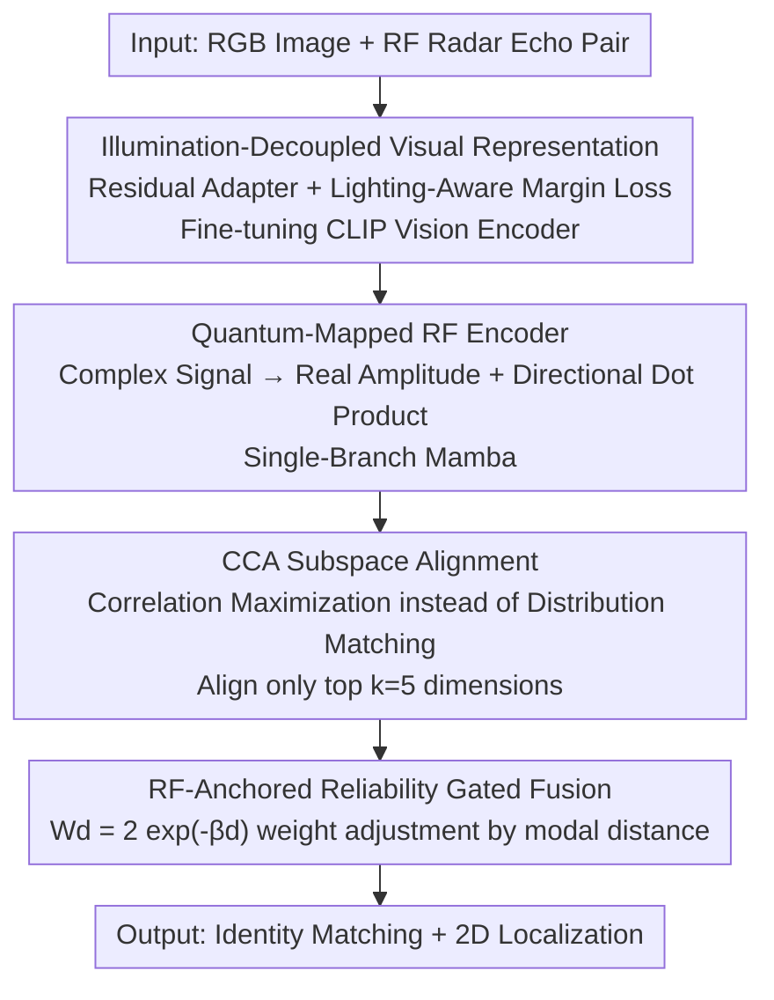

<!-- Automatically generated by tmp/gen_cvf_stubs.py (CVF-only, no arXiv) -->
# VRCLIP: Multimodal Canonical Correlation Alignment for CLIP-Driven Vision-Radio Person Re-Identification

**Conference**: CVPR 2026  
**Paper**: [CVF Open Access](https://openaccess.thecvf.com/content/CVPR2026/html/Zhang_VRCLIP_Multimodal_Canonical_Correlation_Alignment_for_CLIP-Driven_Vision-Radio_Person_Re-Identification_CVPR_2026_paper.html)  
**Code**: None (Authors commit to open-sourcing the VRR dataset)  
**Area**: Human Understanding / Person Re-Identification / Vision-Radio Multimodal Fusion  
**Keywords**: Person Re-Identification, Vision-RF Fusion, Canonical Correlation Analysis (CCA), CLIP, Adaptive Gating

## TL;DR
VRCLIP fuses RGB images and low-frequency Radio Frequency (RF) signals for person re-identification. The core idea is to replace "distribution alignment" with "correlation maximization" using Canonical Correlation Analysis (CCA), aligning shared semantics while retaining modality-specific features. Combined with illumination-decoupled fine-tuning of the CLIP vision encoder and RF-anchored adaptive gated fusion, it achieves 93.9% mAP on a self-collected dataset of 650,000 VRR pairs.

## Background & Motivation
**Background**: The mainstream approach for person re-identification (ReID) relies on matching the same identity utilizing RGB images. To tackle scenarios such as nighttime, smoke, and occlusions, several works have introduced additional modalities like Near-Infrared (NIR), Thermal Infrared (TIR), and depth.

**Limitations of Prior Work**: Visible light and its infrared variants still fail when completely occluded by non-metallic obstacles like walls and furniture—optical sensors simply cannot capture what is physically blocked. Low-frequency RF signals can penetrate non-metallic obstacles and are unaffected by illumination, making them an ideal complementary modality. However, RGB and RF exhibit extreme heterogeneity: RGB is rich in structural textures, while RF only encodes amplitude and phase, possessing low resolution and high sparsity. Consequently, they present entirely different feature distributions and geometric structures for the same identity.

**Key Challenge**: Traditional cross-modal fusion heavily relies on "distribution alignment" (point-to-point or distribution-level matching, e.g., triplet loss). However, when the structural similarity between the two modalities is extremely low (such as in RGB-RF), forcing two inherently distinct distributions together leads to **over-regularization**, erasing the discriminative information unique to each modality—erasing both the fine-grained texture of RGB and the penetrative spectral dynamics of RF. Furthermore, paired RGB-RF data is extremely scarce, making models trained on small datasets prone to memorizing modality noise or scene-specific biases.

**Goal**: (1) Align the shared semantics of RGB-RF without compromising modality-specific features; (2) Compensate for the scarcity of paired data using large-scale pre-trained knowledge; (3) Adaptively switch dependence to the RF modality when RGB intermittently fails (e.g., due to occlusion or low light).

**Key Insight**: The authors make a key observation: when projecting features of both modalities into the **canonical correlation subspace** learned by CCA, even if the raw distributions are vastly different, samples of the same identity exhibit **highly consistent discriminative patterns** in this subspace (the CCA correlation coefficients of identical identity pairs are significantly higher than those of different identity pairs). In other words, "align correlations, not distributions."

**Core Idea**: Reformulate cross-modal alignment as a **canonical correlation maximization** problem. Replacing hard distribution matching with CCA subspace projection allows the model to adaptively balance "semantic class separability" with "retaining modality specificity." Additionally, the CLIP vision encoder is utilized as a semantic anchor to transfer large-scale vision pre-training knowledge to the RF domain.

## Method

### Overall Architecture
VRCLIP is a three-stage sequential training framework. The input consists of synchronously captured RGB image and RF (radar echo) signal pairs, and the output is the person identity matching result (along with 2D localization). The three stages progress sequentially: **Stage 1** fine-tunes the CLIP vision encoder to be robust to illumination using a residual adapter and lighting-aware margin loss, ensuring that features of the same person under different illumination remain distinguishable; **Stage 2** freezes the vision encoder and trains a lightweight Mamba RF encoder, employing a CCA loss to align RF features with the visual semantic subspace; **Stage 3** uses the RF features as a stable anchor to dynamically assign fusion weights based on the distance between RGB and RF. These three stages correspond to the three core contribution components of the paper, in addition to a quantum mapping module within the RF encoder.

### Key Designs

**1. Illumination-Decoupled Visual Representation: Identifying the Same Person Under Low Light**

Extracting RGB features directly using the original CLIP vision encoder is highly sensitive to illumination. t-SNE visualizations show that feature centroids under different lighting conditions lie very close to each other (weak cross-illumination separability), while features within the same lighting condition are overly dispersed, leading to intra-class distances exceeding the inter-class threshold and causing feature confusion in visually blurred regions. To address this, the authors insert lightweight residual adapters into the shallow layers (first $K$ layers) of ViT-B/16 to perform targeted adaptation while preserving the pre-trained knowledge of CLIP. For the $i$-th layer feature $x_i$, the residual representation is first calculated as $x_i^{res}=\text{Norm}(\text{Act}(x_iW^i))$, followed by weighted fusion $x_i^{enh}=\lambda x_i+(1-\lambda)x_i^{res}$, where $\lambda$ balances generalization and task adaptation. At the objective level, a **Lighting-Aware Margin Loss** is introduced to explicitly widen the distance between centroids of different lighting domains:

$$L_{corr}=1-\frac{\sum_{i=1}^{B}(\delta_i-\bar{\delta})(r_i-\bar{r})}{\sqrt{\sum_i(\delta_i-\bar{\delta})^2}\sqrt{\sum_i(r_i-\bar{r})^2}}$$

where $\delta_i=\|f_\theta(x_i^{(d_i)})-f_\theta(x_i^{(1)})\|_2$ is the Euclidean distance between the features of the degraded image and the original image, $r_i=1/d_i$, and $d_i$ is the illumination degradation coefficient (smaller values indicate more severe degradation). This loss essentially measures the correlation between "illumination degradation severity" and "feature centroid displacement," encouraging cooperation and decoupling. During training, $d_i$ is randomly sampled from $[0,1]$. During testing, the model is evaluated on five fixed coefficients $\{0.1,0.3,0.5,0.8,1.0\}$ to select the checkpoint with the best average performance. An additional linear classification head is used to calculate the cross-entropy loss for IDs. Ablation results show that removing this stage (LoRA adaptation + margin loss) drops the mAP by 5.3%.

**2. CCA Subspace Alignment: Aligning Correlation Rather than Distribution to Preserve Modality Specificity**

This is the soul of the paper. Forcing distribution matching in traditional fusion tends to erase the unique discriminative information of RF and RGB. The authors first conduct experiments to substantiate an insight: when performing CCA on the two modal features extracted by ResNet50/VGG-16, the correlation coefficient $\rho_i$ of identical identity pairs is significantly higher than that of different identity pairs $\rho_j$ ($\rho_j\ll\rho_i$), demonstrating that the CCA subspace captures **modality-invariant semantic features**. Furthermore, the cumulative contribution rate of the top $k=5$ canonical correlation coefficients exceeds 99% ($\frac{\sum_{i=1}^{5}\rho_i^2}{\sum_j\rho_j^2}>0.99$), indicating that cross-modal semantics are highly concentrated in the first few dimensions. Aligning only the top $k$ dimensions is sufficient and also helps suppress high-frequency noise in the low-SNR RF signals. Based on this, the alignment objective is formulated as **maximizing the sum of squared canonical correlations** (equivalent to minimizing its negative):

$$L_{CCA}(X,Y)=-\sum_{i=1}^{k}\rho_i^2$$

where $X\in\mathbb{R}^{B\times d_{rf}}$ represents the RF features and $Y\in\mathbb{R}^{B\times d_{clip}}$ represents the CLIP visual features. $\rho_i$ denotes the singular values of the matrix $T=\Sigma_{XX}^{-1/2}\Sigma_{XY}\Sigma_{YY}^{-1/2}$, where $\Sigma_{XX}$ and $\Sigma_{YY}$ are the intra-modality covariances, and $\Sigma_{XY}$ is the inter-modality covariance. These covariances are computed on the zero-centered features with a regularization term $\lambda I$ added to guarantee invertibility and prevent overfitting. Compared to hard alignment, it only aligns the directions containing the highest correlation. This not only eases the difficulty of optimization but also allows RGB to retain fine-grained textures and RF to preserve its penetrative spectral dynamics. Replacing CCAL with the commonly used InfoNCE in ablation studies drops the mAP by 7.8%. More importantly, the localization error increases from 0.205m to 0.236m (+15.1%), indicating that CCAL preserves the spatial localization information of RF much better while aligning semantics.

**3. Quantum-Mapped RF Encoder: Processing Amplitude and Phase with a Single Branch**

RF signals are complex-valued and typically long in sequence length. Existing approaches like RFMamba utilize a dual-branch structure for amplitude and phase, which doubles the computational overhead. Inspired by the real-valued measurement of wave functions in quantum mechanics, the authors design a **quantum mapping module**: it first converts the complex signal $c_i$ into a real-valued magnitude $|c_i|=\sqrt{(\text{Re}(c_i))^2+(\text{Im}(c_i))^2}$, and then preserves the directional (phase) information via a dot product with a learnable vector $v$, i.e., $\langle c_i,v\rangle=\text{Re}(c_i)v_{Re}+\text{Im}(c_i)v_{Im}$. Consequently, a **single-branch** RF encoder can simultaneously capture amplitude and phase with only 4.94M parameters and 1.34 GFLOPs. The backbone utilizes a State Space Model (Mamba) with linear complexity to process long sequences, followed by a lightweight MLP supervised by MSE to regress pedestrian 2D coordinates, fully exploiting the inherent spatial cues in RF.

**4. RF-Anchored Reliability Gated Fusion: Relying on RF When RGB is Unreliable**

In practice, RGB can fail intermittently due to occlusion or low light. Leveraging the intrinsic robustness of RF signals, the authors treat RF features as a **stable anchor** to evaluate the reliability of RGB: when the embedding distribution of RGB is close to that of RF, it indicates that RGB is reliable, and thus assigned a higher weight; when the distributions diverge, the weight of RGB is reduced, increasing reliance on RF. The gated weight is formulated as:

$$W_d=2\exp(-\beta d)\in(0,2)$$

where $\beta$ is a constant (empirically set to 5), and $d=\|\mu_{rgb}-\mu_{rf}\|_2$ is the Euclidean distance between the centroids of the two modalities within the current mini-batch. The centroids $\mu_{rgb},\mu_{rf}$ are averaged across the batch and temporal dimensions. This adaptive gating dynamically modulates the contribution of RGB based on cross-modal similarity. Replacing it with naive feature concatenation in the ablation studies causes the mAP to plummet by 11.9%—the largest drop among all components, indicating that adaptive gating is the key to robust fusion in scenarios with intermittent modality absence.

### Loss & Training
Optimization is conducted in three stages: Stage 1 optimizes the lighting-aware margin loss $L_{corr}$ + ID cross-entropy; Stage 2 freezes the vision encoder and trains the RF encoder using $L_{CCA}$ alignment + coordinate regression MSE; Stage 3 trains the gated fusion. The overall framework is implemented in PyTorch using the AdamW optimizer (initial learning rate $3\times10^{-4}$ and weight decay $1\times10^{-4}$) with a cosine annealing schedule, a batch size of 50, and trained for 50 epochs.

## Key Experimental Results

### Main Results
On the VRR dataset, the proposed method is compared against single-modality baselines CAL (RGB-only), RFMamba (RF-only), and multimodal fusion baselines DeMo, MambaPro, covering indoor (fully visible, occluded, dynamically occluded, overexposed) and outdoor (morning, noon, night) scenarios.

| Scenario (Avg) | Metric | VRCLIP | RFMamba | DeMo | MambaPro | CAL |
|--------|------|------|------|------|------|------|
| All-Scenario Avg | mAP | **93.9** | 93.0 | 78.8 | 75.9 | 70.9 |
| All-Scenario Avg | F1 | **81.5** | 77.7 | 68.8 | 66.5 | 55.3 |
| Indoor Occlusion | mAP | **94.1** | 92.8 | 24.3 | 19.1 | 8.4 |
| Outdoor Night | mAP | **94.1** | 93.6 | 74.9 | 68.5 | 76.5 |

The most illustrative case is the indoor occlusion scenario: the RGB-only baseline CAL completely collapses to 8.4% mAP, and fusion models designed for RGB+infrared like DeMo and MambaPro only manage 24.3% and 19.1% mAP respectively, whereas VRCLIP maintains a solid 94.1% mAP thanks to RF. Compared to DeMo and MambaPro, the average mAP of the proposed method is higher by 19.1% and 23.7%, and the F1 score is higher by 18.4% and 22.5%, respectively.

Cross-dataset generalization on the THP dataset (9-subject resampled subset) also validates the advantages:

| Method | mAP | Prec | F1 | CMC-1 |
|------|------|------|------|------|
| VRCLIP | **98.7** | 94.1 | 92.3 | 91.9 |
| RFMamba | 97.6 | 95.6 | 95.3 | 95.3 |
| DeMo | 95.4 | 88.8 | 80.7 | 81.3 |
| MambaPro | 87.1 | 78.7 | 70.8 | 71.3 |
| CAL | 65.1 | 66.4 | 27.6 | 32.5 |

### Ablation Study

| Configuration | mAP | Description |
|------|------|------|
| VRCLIP (Full) | 94.1 | Full Model |
| w/o Radio | 78.0 | Remove RF modality, drops 16.1% |
| w/o Vision | 76.4 | Remove visual modality, drops 17.7% |
| w/o LoRA (Illumination Decoupled) | 88.8 | Remove residual adapter + margin loss, drops 5.3% |
| w/o CCAL | 87.3 | Replace CCA alignment with InfoNCE, drops 7.8%, localization error +15.1% |
| w/o AFM (Gating) | 84.1 | Replace adaptive fusion with concatenation, drops 11.9% |

### Key Findings
- **Gated fusion (AFM) contributes the most**: Removing it drops the mAP by 11.9%, far exceeding the performance drop of removing illumination decoupling (5.3%) and CCAL (7.8%). This suggests that in scenarios with intermittent modality absence, "when to trust which modality" is more critical than "how to align them."
- **CCAL is not just for alignment**: Replacing it with InfoNCE not only drops the mAP by 7.8% but also increases the localization error from 0.205m to 0.236m. This proves that correlation alignment preserves the spatial information of RF, which would otherwise be erased by hard alignment.
- **RF is a lifesaver in occluded scenarios**: Removing either Radio (dropping to 78.0) or Vision (dropping to 76.4) leads to severe performance degradation. However, under extreme occlusion, RF-only still achieves over 90% accuracy, whereas RGB-only collapses to single digits.
- The mean absolute error (MAE) of RF localization is only 0.205m, maintaining sub-meter accuracy even in indoor occluded and outdoor nighttime scenarios.

## Highlights & Insights
- **"Aligning correlation instead of distribution" is a transferable paradigm**: When structural similarity between two modalities is extremely low (e.g., RGB-RF, text-protein sequences, audio-brain signals), hard distribution alignment inevitably damages modality specificity. CCA subspace alignment offers a universal alternative: "aligning only shared semantic directions while preserving unique information." The discovery that the top-$k$ dimensions are sufficient (capturing 99% of energy) keeps the computation highly manageable.
- **The quantum mapping module is clever in using a dot product to preserve phase**: Translating complex signals to real values typically discards phase information. The authors encode phase into a real-valued representation via magnitude + a learnable directional dot product, thereby reducing a dual-branch structure into a single branch and slashing parameters to 4.94M—a highly practical, lightweight trick.
- **RF serves as an anchor rather than equal fusion**: While traditional multimodal approaches treat each modality equally, this work reverses the intuition—acknowledging the superior robustness of RF and treating it as a "referee" to evaluate the reliability of RGB. This asymmetric design is highly referable for scenarios where a dominant modality is recognizable.
- **Solid dataset contribution**: VRR is the first large-scale vision-radio ReID dataset, composed of 650,000 synchronized pairs and 31 subjects under various environments (indoor/outdoor, multiple illumination, multiple occlusions). It is of immense value in driving this underdeveloped yet important direction.

## Limitations & Future Work
- **Small participant scale**: VRR only features 31 subjects, and THP only has 9 subjects. Real-world ReID deployments typically involve thousands of identities. A closed-set evaluation of 31 subjects makes it difficult to justify whether the discriminative power of RF features generalizes to open-world scenarios.
- **Dependence on synchronized radar hardware**: The proposed method assumes strict temporal synchronization and a shared field-of-view between RGB and RF. Deployments require dedicated radar-camera calibration and synchronization hardware, resulting in high migration costs. Crucially, the paper does not discuss robustness against synchronization errors.
- **Misleading "Quantum Mapping" terminology**: The module is essentially a complex magnitude extraction followed by learnable projections. Borrowing concepts from quantum mechanics serves purely as an analogy, without any actual quantum computing components; hence, the naming can be misleading.
- **Gating relies only on batch centroid distance**: $W_d$ is based on the Euclidean distance of centroids within a mini-batch, which constitutes a coarse-grained, global signal that fails to gauge reliability at an individual sample level. Since occlusions and lighting drops are often local and transient, sample-wise or region-wise gating might yield higher precision.
- The three-stage sequential training is somewhat tedious. Furthermore, freezing the vision encoder in Stage 2 prevents end-to-end joint optimization between Vision and RF, potentially limiting performance upper bounds.

## Related Work & Insights
- **vs RFMamba**: RFMamba is an RF-only method featuring a dual-branch design for amplitude/phase, which doubles computational costs. This work adopts its Mamba-based pipeline but streamlines it to a single branch using the quantum mapping module, while additionally fusing RF with vision. Although pure RF is robust, it lacks semantics; VRCLIP addresses this by leveraging CLIP to fill in the semantic gap, yielding a higher overall mAP.
- **vs DeMo / MambaPro**: These two multimodal fusion models were originally designed for RGB + Near-Infrared/Thermal Infrared, heavily relying on structural texture cues. Applying them directly to texture-less RF for fine-grained fusion leads to failure, with performance dropping to around 20% mAP in occluded scenarios. VRCLIP's CCA alignment does not assume structural similarity and thereby outperforms them by a wide margin (+19~24% mAP) on the extremely heterogeneous RGB-RF pairing.
- **vs CAL (RGB-only)**: CAL is highly competitive in well-lit scenarios but fails completely under occlusion or nighttime. VRCLIP not only further improves scores under favorable conditions but also relies on RF to secure robust results in harsh environments, demonstrating the true value of complementary fusion.
- **Insights**: Utilizing CCA-as-alignment can be extended to any fusion task containing a clearly defined "dominant modality + highly structurally disparate auxiliary modality." The asymmetric reliability evaluation of RF-anchored gating is also applicable to multi-sensor fusion under fluctuating sensor qualities (e.g., dynamic weight assignment for LiDAR, cameras, and radars in autonomous driving).

## Rating
- Novelty: ⭐⭐⭐⭐⭐ Reformulates cross-modal alignment as CCA correlation maximization and pioneers vision-radio ReID; provides a highly novel perspective backed by solid experimental insights.
- Experimental Thoroughness: ⭐⭐⭐⭐ Features evaluations across multiple scenarios, cross-dataset generalization, and thorough ablation studies, though the number of subjects remains small (31/9 people).
- Writing Quality: ⭐⭐⭐⭐ Structurally logical and step-by-step motivated, save for the slightly over-exaggerated "Quantum Mapping" terminology.
- Value: ⭐⭐⭐⭐⭐ Open-sources the first large-scale VRR dataset and introduces a transferable correlation-alignment paradigm, significantly promoting the niche yet highly practical vision-radio direction.

<!-- RELATED:START -->

## Related Papers

- [\[CVPR 2026\] Prompt-Anchored Vision–Text Distillation for Lifelong Person Re-identification](prompt-anchored_vision-text_distillation_for_lifelong_person_re-identification.md)
- [\[CVPR 2026\] View-Aware Semantic Alignment for Aerial-Ground Person Re-Identification](view-aware_semantic_alignment_for_aerial-ground_person_re-identification.md)
- [\[CVPR 2026\] Vision-Language Attribute Disentanglement and Reinforcement for Lifelong Person Re-Identification](vision-language_attribute_disentanglement_and_reinforcement_for_lifelong_person_.md)
- [\[CVPR 2026\] Towards Cross-Modal Preservation, Consistency and Alignment for Privacy-Preserving Visible-Infrared Person Re-Identification](towards_cross-modal_preservation_consistency_and_alignment_for_privacy-preservin.md)
- [\[CVPR 2026\] Pose-guided Enriched Feature Learning for Federated-by-camera Person Re-identification](pose-guided_enriched_feature_learning_for_federated-by-camera_person_re-identifi.md)

<!-- RELATED:END -->
