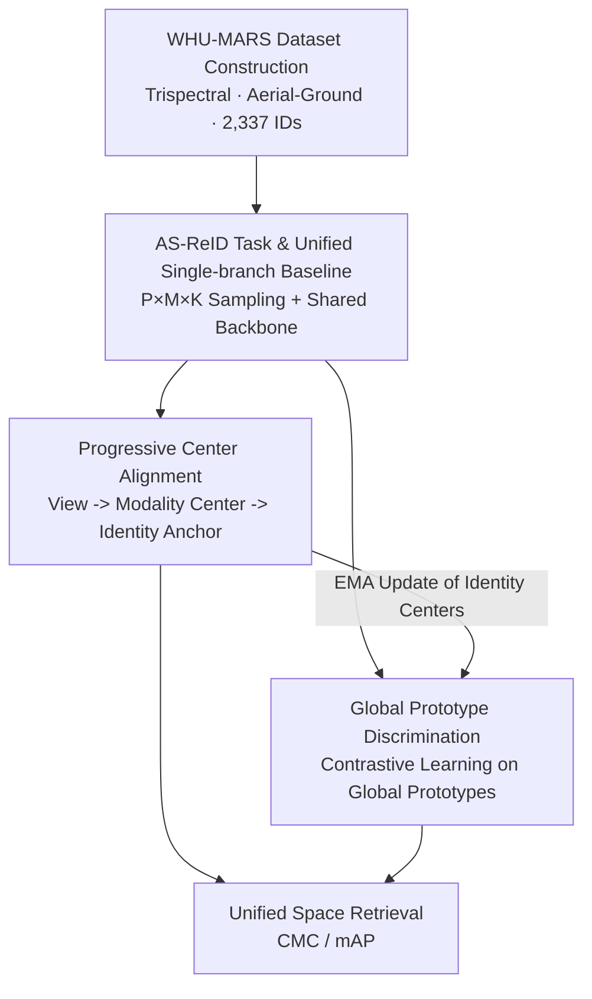

# WHU-MARS: A Multispectral Aerial-Ground Benchmark Towards Any-Scenario Person Re-Identification

**Conference**: CVPR 2026  
**Paper**: [CVF Open Access](https://openaccess.thecvf.com/content/CVPR2026/html/Zhao_WHU-MARS_A_Multispectral_Aerial-Ground_Benchmark_Towards_Any-Scenario_Person_Re-Identification_CVPR_2026_paper.html)  
**Code**: https://github.com/msm8976/WHU-MARS  
**Area**: Person Re-Identification  
**Keywords**: Person Re-Identification, Multispectral, Aerial-Ground Collaboration, Unified Representation, Benchmark

## TL;DR
This paper proposes the "Any-Scenario Person Re-Identification" (AS-ReID) task, which requires a single model to perform any-to-any retrieval across heterogenous galleries mixing all modalities and viewpoints. The authors construct WHU-MARS, the largest multispectral aerial-ground dataset to date (2,337 identities, 430k RGB/NIR/TIR images, ground + UAV). They further introduce the UAD framework, which achieves state-of-the-art results with minimal parameters on AS-ReID through progressive center alignment and global prototype discrimination, without requiring multi-branch architectures or pairwise alignment.

## Background & Motivation

**Background**: Person Re-Identification (ReID) has evolved from single RGB cameras to heterogeneous sensing—Near-Infrared (NIR) for low light, Thermal Infrared (TIR) for penetration through smoke/camouflage, and Unmanned Aerial Vehicles (UAVs) for flexible wide-area perspectives. This led to various sub-settings: conventional ReID, Visible-Infrared ReID (VI-ReID), Aerial-Ground ReID (AG-ReID), and Multimodal ReID (MM-ReID).

**Limitations of Prior Work**: These tasks are organized around **predefined scenario pairs** (e.g., "Visible-Infrared" or "Aerial-Ground" pairs), where a dedicated model is trained for each pair and evaluated using specific protocols. In real-world deployments, queries may come from any modality or viewpoint, while the gallery contains a mixture of all scenarios. Pairwise designs fragment retrieval into sub-tasks, making it impossible to train or evaluate a "universal" model. Furthermore, as modalities and viewpoints increase, multi-branch or pairwise alignment losses exhibit **quadratic expansion relative to the number of scenarios**, leading to parameter and complexity explosions. Regarding data, existing datasets are mostly split by scenario pairs, offer limited cross-scenario coverage for each identity, and are biased toward daytime, omitting the nighttime conditions where infrared sensors are most useful.

**Key Challenge**: Integrating all scenarios into a single heterogeneous gallery introduces two entangled representation problems: (a) **Scenario-agnostic intra-class aggregation**: features of the same identity across different modalities/viewpoints are scattered and must be gathered in a unified space; (b) **Large-margin inter-class discrimination**: the mixed gallery introduces numerous "look-alike" hard negatives, requiring clear global margins between features.

**Goal**: (I) Break away from predefined scenario pairs to establish a unified retrieval paradigm across any scenario; (II) Construct a real-world aligned benchmark with broad scenario coverage; (III) Design a scalable single-branch model that learns heterogeneous sources while satisfying (a) and (b).

**Core Idea**: "Any-to-any retrieval" is explicitly defined as the AS-ReID task. A shared single-branch backbone is used for unified representations. **Progressive Center Alignment** (aggregation before alignment) is proposed to resolve intra-class aggregation, and **Global Prototype Discrimination** is used for inter-class discrimination. The approach lacks pairwise assumptions and scales linearly with the number of scenarios.

## Method

### Overall Architecture

The paper's contributions follow a logical chain: **New Task (AS-ReID) → New Dataset (WHU-MARS) → New Framework (UAD)**.

AS-ReID defines a scenario as a combination of "Modality $\times$ Viewpoint": modality set $\mathcal{M}=\{\text{RGB, NIR, TIR}\}$, viewpoint set $\mathcal{V}=\{\text{ground, aerial}\}$, and scenario space $\mathcal{S}=\mathcal{M}\times\mathcal{V}$. Each image is labeled as $(y,s,c)$ (identity, scenario, camera). The task requires a single model $f_\theta:\mathcal{X}\to\mathbb{R}^d$ to map images into a unified space. Queries from any scenario retrieve the same identity from a gallery spanning all scenarios (evaluations exclude cross-camera gallery items as per VI-ReID conventions).

To support this, synchronized RGB/NIR/TIR videos were recorded using two UAV platforms (DJI H20T, 20–50m altitude) and five ground nodes (custom trispectral cameras, ~1.5m). Data was collected over 7 months, covering day/night, multiple seasons, and weather conditions, resulting in WHU-MARS: 2,337 identities, 434,620 images, 13 sessions, and 38 hours of video. Two versions are provided: the full WHU-MARS-2337 and the frame-synchronized trispectral subset WHU-MARS-1000.

The UAD framework consists of a shared single-branch backbone with two complementary regularization terms: ProCA for intra-class aggregation and GPD for inter-class discrimination. The workflow is summarized below:

### Key Designs

**1. WHU-MARS Dataset: Full Trispectral + Aerial-Ground Coverage per Identity**

Addressing the gap where existing datasets are split by scenario pairs and lack nighttime data, WHU-MARS ensures **every identity** appears synchronized across RGB, NIR, and TIR modalities and both ground and UAV viewpoints. It spans day/night, seasons, and weather, enabling AS-ReID and standard protocols (AG/VI/MM-ReID) to be evaluated on the same data. With 2,337 identities and 434,620 images, it is the largest multispectral ReID dataset. To balance real-world non-pairwise nature with task comparability, WHU-MARS-1000 provides 61,974 sets of frame-synchronized trispectral triplets. Faces are automatically blurred for privacy.

**2. AS-ReID Task and Unified Single-branch Baseline: Exposing Heterogeneous Conditions**

Formulating "any-to-any retrieval," the authors avoid multi-branch architectures, opting for a minimal unified single-branch baseline. The key is the $P\times M\times K$ sampler ($P$ identities, $M=|\mathcal{M}|$ modalities, $K$ images per identity/modality), ensuring cross-modality and cross-view variations within every mini-batch. Images pass through a shared backbone and BNNeck to obtain representations $z=\mathrm{BN}(f)$. The BN layers and classifiers are shared to force learning in a unified space. The baseline loss is $\mathcal{L}_{base}=\mathcal{L}_{ce}+\mathcal{L}_{WRT}$ (Weighted Regularization Triplet + Cross-Entropy). This baseline proves that a single model without scenario-specific modules is a viable reference.

**3. Progressive Center Alignment (ProCA): Aggregating Views into Modality Centers, then Modalities into Identity Anchors**

Heterogeneous sensing introduces scenario-specific biases. Directly aligning scenario pairs scales quadratically or requires image-level pairing. ProCA uses **two-stage progressive alignment**. First, $K$ views of the same identity and modality are averaged and normalized into a modality center: $\boldsymbol{\mu}_{y,m}=\mathrm{norm}\big(\tfrac{1}{K}\sum_{k=1}^{K}f^{y}_{m,k}\big)$, which implicitly suppresses viewpoint noise and scale variations. Second, modality centers are aggregated into an identity anchor $\boldsymbol{\mu}_{y}=\mathrm{norm}\big(\tfrac{1}{|\mathcal{M}|}\sum_{m}\boldsymbol{\mu}_{y,m}\big)$, treated as a **stop-gradient anchor**. Finally, each modality center is pulled toward the identity anchor to minimize intra-identity cross-scenario divergence:

$$\mathcal{L}_{ProCA}=\frac{1}{P}\sum_{y\in\mathcal{B}}\frac{1}{|\mathcal{M}|}\sum_{m\in\mathcal{M}}\big\|\boldsymbol{\mu}_{y,m}-\boldsymbol{\mu}_{y}\big\|_2^2.$$

This sequence digests viewpoints within modalities before aligning modalities at the identity level, producing cleaner identity centers $\boldsymbol{\mu}_y$ and providing stable anchors for GPD.

**4. Global Prototype Discrimination (GPD): Contrasting Samples against All Identity Prototypes for Global Margin**

While ProCA clusters identity features, the heterogeneous gallery requires strong inter-class discrimination to handle hard negatives. Metric losses like triplet loss only shape local geometry within mini-batches. GPD maintains an $\ell_2$-normalized identity-level prototype memory $\mathcal{P}^{(t)}=\{p_y\}$. In each iteration, it performs global contrastive learning on fixed prototypes, then updates them using identity centers $\boldsymbol{\mu}_y$ via Exponential Moving Average (EMA): $p_y\leftarrow\mathrm{norm}\big(\alpha\,p_y+(1-\alpha)\,\boldsymbol{\mu}_y\big)$. The objective pulls each sample $f_i$ toward its truth prototype $p_{y_i}$ and pushes it away from all others:

$$\mathcal{L}^{(i)}_{GPD}=-\log\frac{\exp(f_i^\top p_{y_i}/\tau)}{\sum_{y\in\mathcal{Y}_{train}}\exp(f_i^\top p_{y}/\tau)},$$

where $\tau$ is the temperature. This pushes each sample away from every other identity, enforcing global separation.

### Loss & Training

The total UAD objective combines both regularization terms with the baseline, acting on the pre-BN features $f$:

$$\mathcal{L}_{UAD}=\mathcal{L}_{base}+\lambda_{ProCA}\,\mathcal{L}_{ProCA}+\lambda_{GPD}\,\mathcal{L}_{GPD}.$$

**Implementation**: ViT-Base (ImageNet pretrained) backbone; images resized to 128×256; $P{=}16, M{=}3, K{=}4$; SGD optimizer for 120 epochs (5-epoch warm-up + cosine decay); EMA $\alpha{=}0.8$, $\tau{=}0.03$, $\lambda_{ProCA}{=}0.01$, $\lambda_{GPD}{=}1.0$.

## Key Experimental Results

### Main Results

Under the AS-ReID protocol (Table 3), UAD consistently outperforms existing methods on WHU-MARS-1000/2337 while utilizing significantly fewer parameters (85.7M) compared to other Transformer-based approaches.

| Method | Params | 1000 mAP | 1000 R-1 | 2337 mAP | 2337 R-1 |
|------|------|---------|---------|---------|---------|
| BoT (CVPRW19) | 23.5M | 5.9 | 18.4 | 4.6 | 14.8 |
| TransReID (ICCV21) | 99.9M | 7.4 | 17.1 | 5.5 | 13.1 |
| TransReID-SSL (2021) | 88.4M | 10.1 | 26.7 | 9.2 | 24.4 |
| CLIP-ReID (AAAI23) | 125.3M | 10.6 | 26.6 | 9.3 | 24.1 |
| SeCap (CVPR25) | 130.9M | 10.4 | 26.4 | 8.0 | 21.4 |
| **UAD (Ours)** | **85.7M** | **11.0** | **29.5** | **9.6** | **25.7** |

Expanding from the 1000 to the 2337 split causes a performance drop for all methods due to increased hard negatives and domain shifts, validating the benchmark's scalability and difficulty. UAD also excels in traditional protocols: AG-ReID (11.5 / 13.3 mAP for A→G / G→A) and VI-ReID (TIR→RGB: 9.04% R-1), as unified training allows TIR to benefit from RGB/NIR supervision.

### Ablation Study

AS-ReID protocol on WHU-MARS-1000:

| Configuration | mAP | R-1 | R-5 | R-10 |
|------|-----|-----|-----|------|
| $\mathcal{L}_{base}$ only | 8.9 | 23.9 | 41.4 | 50.5 |
| base + ProCA | 9.3 | 24.5 | 42.0 | 50.7 |
| base + GPD | 10.9 | 28.7 | 45.9 | 54.2 |
| base + ProCA + GPD (Full) | 11.0 | 29.5 | 46.3 | 54.8 |

### Key Findings
- **GPD provides the largest contribution**: Adding GPD alone increases R-1 from 23.9% to 28.7% (+4.8%), suggesting that the global prototype structure is the primary source of discriminative power. ProCA further stabilizes these prototypes to reach the best performance.
- **Transferability of Unified Representation**: A single UAD model yields reasonable results across all 3x3 modality query-gallery pairs. While same-modality retrieval is easiest (RGB→RGB R-1 40.47%), TIR-related tasks are hardest, yet the single model covers all VI-ReID sub-tasks without scenario-specific branches.
- **Scale as Difficulty**: The drop in performance from the 1000 split to the 2337 split across all methods highlights that more identities/scenarios introduce significant hard negative challenges.

## Highlights & Insights
- **Consolidating Fragmented Tasks**: AS-ReID treats Tr/VI/AG/MM-ReID as special cases of "any-to-any retrieval," moving away from the closed-world assumption of "one model per pair." This problem redefinition is as valuable as the performance gains.
- **Progressive Center Hierarchies**: First-stage modality averaging naturally suppresses view noise, while second-stage identity alignment uses stop-gradients to provide stable anchors for GPD. This hierarchical approach scales linearly with scenarios.
- **Closed-loop between ProCA and GPD**: Low-noise identity centers from ProCA update the prototype memory, while global supervision from GPD pushes identity centers further apart. The two terms are synergistically linked.
- **Parameter Efficiency**: UAD achieves state-of-the-art results on AS-ReID with only 85.7M parameters by avoiding redundant branches.

## Limitations & Future Work
- **Low Absolute Metrics**: Peak mAP is only 11.0, and R-1 is 29.5, indicating that AS-ReID remains a challenging research frontier far from practical application.
- **Campus Collection Bias**: Data is limited to a single university campus; diversity in urban geography and crowd demographics needs further validation.
- **Modality Scalability**: Currently instantiated for RGB/NIR/TIR $\times$ Ground/UAV. Scaling to further modalities (depth, event cameras, text) may require investigating if ProCA and GPD maintain their linear scalability.
- **TIR Performance Weakness**: TIR-related results are significantly lower (TIR→RGB R-1 ~9%). Future work should focus on thermal degradation modeling or stronger cross-spectral alignment.

## Related Work & Insights
- **Comparison with VI-ReID (e.g., CAJ, DEEN, PMT)**: These methods often use modality-specific branches or pairwise alignment losses that scale quadratically. UAD trains a single model across three modalities without pairwise assumptions, surpassing them in difficult TIR→RGB tasks.
- **Comparison with AG-ReID (e.g., VDT, SeCap)**: These target viewpoint invariance. UAD's unified representation naturally mitigates scale and perspective changes, achieving top mAP in A→G/G→A tasks.
- **Comparison with Benchmarks (e.g., SYSU-MM01, AG-ReID.v2)**: WHU-MARS-2337 provides more comprehensive multi-scenario observations and nighttime data, pushing the scale to 430,000 images.

## Rating
- Novelty: ⭐⭐⭐⭐⭐ (Redefined task + largest multispectral dataset + unified framework).
- Experimental Thoroughness: ⭐⭐⭐⭐⭐ (Covers AS/AG/VI/MM protocols, two scales, 3x3 pairs, and visualization).
- Writing Quality: ⭐⭐⭐⭐ (Clear logic and formulas; however, absolute metrics are low, and analysis on failure cases is brief).
- Value: ⭐⭐⭐⭐⭐ (Constructs a realistic benchmark and a scalable baseline for the ReID community).

<!-- RELATED:START -->

- **TransReID**: Transformer-based Object Re-Identification (ICCV 2021)
- **SYSU-MM01**: RGB-Infrared Cross-Modality Person Re-Identification (ICCV 2017)
- **SeCap**: Aerial-Ground Person Re-Identification via Semantic Coupling (CVPR 2025)

<!-- RELATED:END -->

## Related Papers

- [\[CVPR 2026\] View-Aware Semantic Alignment for Aerial-Ground Person Re-Identification](view-aware_semantic_alignment_for_aerial-ground_person_re-identification.md)
- [\[CVPR 2026\] Composite-Attribute Person Re-Identification via Pose-Guided Disentanglement](composite-attribute_person_re-identification_via_pose-guided_disentanglement.md)
- [\[CVPR 2026\] Pose-guided Enriched Feature Learning for Federated-by-camera Person Re-identification](pose-guided_enriched_feature_learning_for_federated-by-camera_person_re-identifi.md)
- [\[CVPR 2026\] SSM-Aware Token-Efficient VMamba via Adaptive Patch Pruning and Merging for Person Re-Identification](ssm-aware_token-efficient_vmamba_via_adaptive_patch_pruning_and_merging_for_pers.md)
- [\[CVPR 2026\] Prompt-Anchored Vision–Text Distillation for Lifelong Person Re-identification](prompt-anchored_vision-text_distillation_for_lifelong_person_re-identification.md)

<!-- RELATED:END -->
