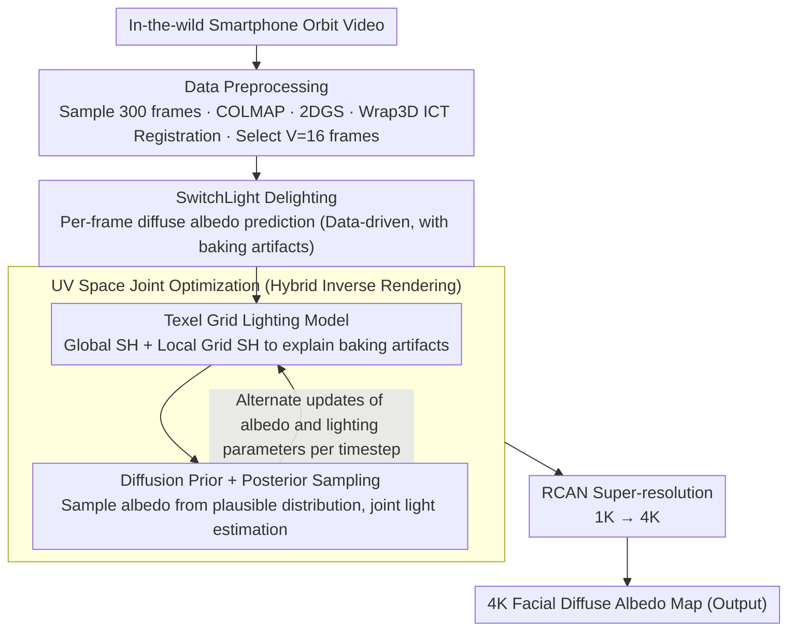

# WildCap: Facial Albedo Capture in the Wild via Hybrid Inverse Rendering

**Conference**: CVPR2026  
**arXiv**: [2512.11237](https://arxiv.org/abs/2512.11237)  
**Code**: [Released](https://arxiv.org/abs/2512.11237) (Code release declared in paper)  
**Area**: Human Understanding  
**Keywords**: facial albedo capture, inverse rendering, diffusion prior, texel grid lighting, in-the-wild

## TL;DR

WildCap is proposed as a hybrid inverse rendering framework (data-driven SwitchLight delighting + model-based texel grid lighting optimization + diffusion prior sampling). It reconstructs high-quality 4K facial diffuse albedo maps from smartphone in-the-wild videos, significantly narrowing the quality gap between uncontrolled capture and professional light stage methods.

## Background & Motivation

1.  **Facial albedo capture is core to digital humans**: Cloning real people into the digital world requires high-quality facial reflectance maps, a problem researched for over two decades.
2.  **Existing high-quality methods rely on controlled lighting**: From professional Light Stage setups to smartphone flashes, these methods assume specific illumination, increasing capture cost and limiting usability.
3.  **Model-based inverse rendering is unstable under complex lighting**: Optimizing lighting and reflectance to match observed images is highly ill-posed and unstable when complex light transport effects like shadows are present.
4.  **Data-driven methods are robust but suffer from baking artifacts**: Networks like SwitchLight can predict reflectance components directly but inevitably "bake" some lighting effects (e.g., shadows) into the output.
5.  **Complementary nature of the two approaches**: Model-based methods produce physically plausible decompositions but lack robustness; data-driven methods are robust but imperfect. Combining them is a natural progression.
6.  **Immense practical value for in-the-wild capture**: Enabling high-quality facial capture from casual smartphone videos would drastically lower the barrier to digital human creation.

## Method

### Overall Architecture

WildCap aims to reconstruct high-quality 4K facial diffuse albedo, previously requiring Light Stage setups, using only casual smartphone "orbit" videos. The core idea combines two distinct approaches: data-driven methods (e.g., SwitchLight), which are robust but bake shadows into predictions, and model-based inverse rendering, which is physically grounded but ill-posed. The pipeline consists of three stages: First, data preprocessing involves sampling 300 frames (960×720) from the video, using COLMAP for camera calibration, 2DGS for mesh reconstruction, Wrap3D for ICT template registration, and selecting $V=16$ frames for estimation. Second, SwitchLight predicts diffuse albedo $\{I^i\}$ per frame, compressing messy in-the-wild lighting into a constrained condition. Finally, remaining baking artifacts from SwitchLight are treated as "lighting effects" in UV space. A texel grid lighting model and diffusion prior sampling are jointly optimized to recover a clean albedo map $A$. Finally, RCAN upscales the 1K map to 4K. While DoRA takes 508 minutes for 4K sampling, WildCap requires only 8 minutes on a 24GB RTX 4090.

### Key Designs

**1. Texel Grid Lighting Model: Explaining Baking Artifacts with Non-physical Local Lighting**

Since SwitchLight outputs are not generated by physical sources, traditional Spherical Harmonic (SH) environment light models cannot account for non-physical shadow baking artifacts. TGL addresses this by assigning additional local SH lighting to artifact-prone facial regions, re-interpreting artifacts as a combination of "clean albedo + dark local lighting." It uses a global SH $\gamma^g \in \mathbb{R}^{N_c}$ for base illumination, superimposed with a 2D UV grid $V \in \mathbb{R}^{\frac{H}{g} \times \frac{W}{g} \times N_c}$ storing local SH parameters, modulated by a binary mask $M$: $\gamma = \gamma^g + \gamma^V \cdot M[u][v]$. The grid size is $g=96$, using 2nd-order SH ($N_c=27$) with bilinear interpolation. The mask $M$ is obtained via manual selection or automated DiFaReli shadow detection. Ablations show that global SH alone leaves visible shadows, whereas the grid successfully explains these artifacts.

**2. Diffusion Prior + Posterior Sampling: Regularizing Ill-posed Optimization**

Increased lighting model expressivity exacerbates scale ambiguity between lighting and albedo, requiring prior constraints. WildCap trains a 64×64 patch-level diffusion model on 48 Light Stage scans, modeling 7-channel signals (3ch diffuse albedo + 3ch normal + 1ch specular albedo). During sampling, it initializes from a scan $x_0^{ref}$ with closely matched skin tone from the training set, adding $T_{init}=0.6T$ steps of noise to reduce sampling time. Each timestep alternately updates the reflectance map $x_t$ (via denoising and photometric gradient guidance) and lighting parameters $\theta_t$ (via gradient descent and regularization). This coupling of "sampling albedo from a reasonable distribution" and "joint light estimation" stabilizes the ill-posed problem.

### Loss & Training

- **Photometric Loss**: $\mathcal{L}_{pho} = \|I_{UV} - \Gamma_\theta(A, N_c)\|_2^2$
- **Lighting Regularization**: $\mathcal{L}_{reg} = 0.1 \cdot \mathcal{L}_{TV} + \mathcal{L}_{neg}$
    - TV regularization ensures spatial smoothness of lighting.
    - Negative shading regularization $\mathcal{L}_{neg}$ ensures local lighting produces darkening effects (to explain shadow baking).
- **Texture Map Construction**: Minimizes LPIPS + gradient-space L1 loss.

## Key Experimental Results

### Main Results (Facial Reconstruction, Average of 6 Subjects)

| Method | PSNR ↑ | SSIM ↑ | LPIPS ↓ |
|------|--------|--------|---------|
| DeFace* | 22.20 | 0.9279 | 0.1192 |
| FLARE* | 27.81 | 0.9411 | 0.0929 |
| **WildCap (Ours)** | **28.79** | **0.9520** | **0.0610** |

### Main Results (Synthetic Data Digital Emily, Albedo Reconstruction)

| Method | PSNR ↑ | SSIM ↑ | LPIPS ↓ |
|------|--------|--------|---------|
| DeFace* | 28.43 | 0.9791 | 0.0826 |
| FLARE* | 22.48 | 0.9742 | 0.0571 |
| **WildCap (Ours)** | **28.71** | **0.9802** | **0.0388** |

### Ablation Study

- **w/o Hybrid** (Optimizing on raw images): Failed to effectively separate specularities and shadows under complex lighting.
- **w/o TGL** (Global SH only): Could not explain non-physical baking artifacts, leaving significant shadow residue.
- **w/o Prior** (No diffusion prior, direct Adam optimization): Produced severe artifacts and failed to converge to a plausible reflectance map.
- **Grid size ablation**: $g=1/24$ lacked expressivity, $g=384$ was over-smoothed, $g=96$ provided the best balance.

## Highlights & Insights

1.  **Clever Hybrid Inverse Rendering**: Elegantly combines the robustness of data-driven methods with the physical plausibility of model-based approaches.
2.  **Novel Texel Grid Lighting**: Breaks the limitations of physical lighting models by using a more expressive, non-physical local SH grid to explain baking artifacts in network predictions.
3.  **Elegant Scale Ambiguity Solution**: Uses a diffusion prior to sample albedo from a plausible distribution while jointly optimizing lighting, converting an ill-posed problem into a well-posed one.
4.  **High Efficiency**: Requires only 8 minutes (vs. 508 minutes for DoRA), while maintaining quality comparable to controlled lighting methods.
5.  **Thorough Evaluation**: Includes extensive ablations, synthetic quantitative evaluation, cross-setting comparisons with DoRA, diverse scene demonstrations, and failure case analysis.

## Limitations & Future Work

1.  **Dependency on SwitchLight**: SwitchLight is a closed-source commercial model available only via API, hindering reproducibility.
2.  **Automatic Shadow Detection**: Relies on DiFaReli; iterative diffusion sampling is slow and may miss effects like ambient occlusion.
3.  **Lighting Continuity**: Continuous grid representations struggle to fully remove sharp shadow boundaries (e.g., from direct noon sun) present in SwitchLight predictions.
4.  **Training Data Scale**: The diffusion prior was trained on only 48 Light Stage scans, lacking ethnic/skin tone diversity (33 Caucasian / 9 African / 6 Asian).
5.  **Required Skin Tone Reference**: While it can be automated, providing a target skin tone adds an extra step.

## Related Work & Insights

- **vs DeFace**: DeFace segments the face into limited regions (5-10), each with a trainable network; WildCap's texel grid is significantly finer.
- **vs FLARE**: FLARE uses a split-sum approximation for lighting; the physical model cannot account for non-physical baking artifacts.
- **vs DoRA** (Controlled Methods): WildCap achieves quality comparable to DoRA in challenging in-the-wild settings, preserves personal traits (e.g., moles) better, and is roughly 63x faster.
- **vs Rainer et al.**: Uses small MLPs for shading, which is difficult to optimize within a diffusion posterior sampling framework; WildCap's grid is easier to optimize.
- **Test Scenarios**: Previous methods were tested on mild shadow scenarios; WildCap handles challenging, strong cast shadows.

## Rating

- Novelty: ⭐⭐⭐⭐ — Hybrid framework and Texel Grid Lighting are novel; joint optimization with diffusion priors is skillful.
- Experimental Thoroughness: ⭐⭐⭐⭐⭐ — Comprehensive ablations, quantitative/qualitative comparisons, synthetic data evaluation, and failure analysis.
- Writing Quality: ⭐⭐⭐⭐ — Generally clear, well-motivated, and documented with extensive supplementary materials.
- Value: ⭐⭐⭐⭐ — Significantly lowers the barrier for facial appearance capture, providing practical utility for digital human creation.

<!-- RELATED:START -->

## Related Papers

- [\[ICCV 2025\] Monocular Facial Appearance Capture in the Wild](../../ICCV2025/human_understanding/monocular_facial_appearance_capture_in_the_wild.md)
- [\[CVPR 2026\] RAM: Recover Any 3D Human Motion in-the-Wild](ram_recover_any_3d_human_motion_in-the-wild.md)
- [\[CVPR 2026\] Occluded Human Body Capture with Frequency Domain Denoising Prior](occluded_human_body_capture_with_frequency_domain_denoising_prior.md)
- [\[CVPR 2026\] HyperGait: Unleashing the Power of Parsing for Gait Recognition in the Wild via Hypergraph](hypergait_unleashing_the_power_of_parsing_for_gait_recognition_in_the_wild_via_h.md)
- [\[CVPR 2026\] Bridging Facial Understanding and Animation via Language Models](bridging_facial_understanding_and_animation_via_language_models.md)

<!-- RELATED:END -->
