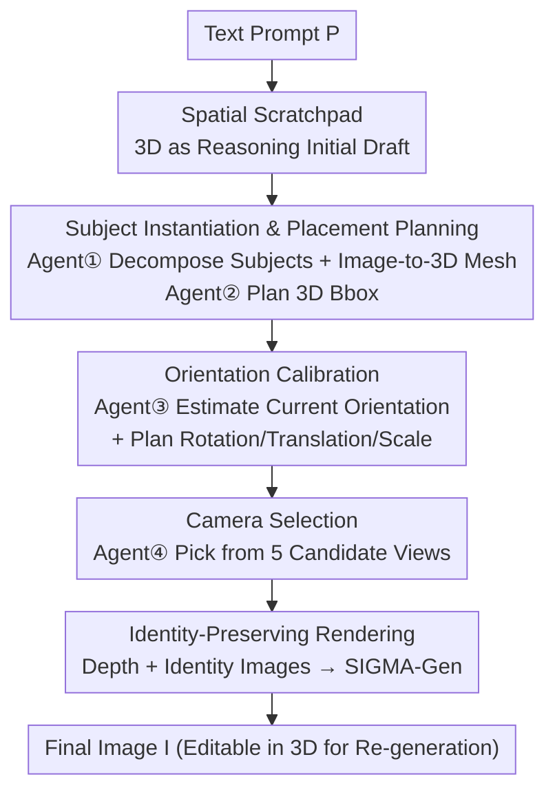

# 3D Space as a Scratchpad for Editable Text-to-Image Generation

**Conference**: CVPR 2026  
**Paper**: [CVF Open Access](https://openaccess.thecvf.com/content/CVPR2026/html/Saha_3D_Space_as_a_Scratchpad_for_Editable_Text-to-Image_Generation_CVPR_2026_paper.html)  
**Code**: https://oindrilasaha.github.io/3DScratchpad/ (Project page available)  
**Area**: Diffusion Models / Image Generation / Controllable Generation  
**Keywords**: 3D Spatial Reasoning, Spatial Scratchpad, Agentic Planning, Compositional Generation, Editable Generation

## TL;DR
This paper proposes treating an editable **3D scene as a "spatial scratchpad"** for text-to-image generation. A suite of LLM agents parses text prompts into subject meshes, plans placements/orientations/cameras in 3D, and renders this layout into an image via identity-preserving depth-conditioned generation. It achieves a **32% training-free improvement** in text alignment on GenAI-Bench and supports consistent image updates through simple 3D modifications.

## Background & Motivation

**Background**: A core lesson from LLMs in reasoning tasks is that "externalizing" intermediate thought processes into an explicit workspace (scratchpad, chain-of-thought, or tool-augmented workflows like ReAct/PAL/Toolformer) significantly improves reasoning quality. While text-to-image models (VLMs/Diffusion Models) can synthesize high-fidelity images, they lack a corresponding "spatial workspace" to deliberate on geometric relationships before execution.

**Limitations of Prior Work**: Highly compositional prompts—involving multiple subjects, relative positions, orientations, counts, or negations—frequently fail in generation. Common issues include misplaced positions, incorrect orientations, semantic bleeding of identities, and incorrect counts. Current controllable generation methods mostly operate on **2D layouts** (masks, bounding boxes, segmentation maps, or regional prompts like ControlNet, GLIGEN, LayoutGPT, RPG, SLD), providing only "coarse planar spatial cues."

**Key Challenge**: Many spatial attributes are inherently 3D (e.g., occlusion/depth, facing the camera vs. profile, perspective scaling). **Restricting reasoning to planar entities** prevents reliable expression and editing of these relationships. Furthermore, 2D layout modifications are difficult to propagate consistently back to the final image while preserving subject identities.

**Goal**: To provide the generative model with an intermediate medium that allows it to "think through 3D geometry before drawing." This medium should precisely align with textual intent and natively support 3D edits (translation/rotation/scaling) that reliably reflect in the resulting image.

**Key Insight**: The authors **reposition 3D as a "reasoning scratchpad" rather than a "rendering target."** The 3D scene is not the final product but an intermediate workspace connecting linguistic intent and pixel synthesis. By grounding subjects in 3D, constraints such as translation, rotation, and rescale can be reliably propagated to the image.

**Core Idea**: Replace 2D layouts with a **spatial scratchpad** as the reasoning medium. A sequence of specialized LLM agents plans the scene, followed by the "painting" of the 3D layout using identity-preserving depth-conditioned generation.

## Method

### Overall Architecture

Given a text prompt $P$, the goal is to generate an image $I$ faithful to $P$. For complex compositions, first an **intermediate 3D scratchpad** is constructed: an empty scene with a ground plane, fixed XYZ boundaries, and fixed lighting. Subjects are instantiated, placed, and oriented within this scene before being rendered. The pipeline is divided into four sub-tasks, each assigned to LLM agents, followed by multi-subject identity-coordinated generation:

- **Agent ①**: Decomposes the prompt into $n$ subjects $S$ and a background, generating an enhanced prompt $P'$. Each subject undergoes text-to-image generation for an identity image $S^I$, followed by image-to-3D to obtain an untextured mesh $S^M$.
- **Agent ②** (BboxPlanner): Plans a 3D bounding box $S_{BBOX}$ for each subject, places the meshes into the scene, and provides natural language target orientations $S^{O}_{tgt}$ (e.g., "facing the camera," "lying flat").
- **Agent ③**: Adjusts the rotation/translation/scaling of each subject. This is subdivided into two agents: an OrientationEstimator, which estimates the current absolute orientation $S^{O}_{est}$ from the subject's crop in the current render, and a TransformPlanner, which suggests transformations $S_{TR}$ based on target/estimated orientations and multi-view renders $R$.
- **Agent ④** (CameraPicker): Selects the best camera view from 5 candidates that encapsulate all subjects and best fit the prompt.

Finally, using the depth, identity images $S^I$, and enhanced prompt $P'$, SIGMA-Gen produces the final image $I$.

### Key Designs

**1. Spatial Scratchpad: 3D Scene as Reasoning Draft, Not Rendering Target**

This paradigm shift directly addresses the inability of 2D layouts to express true 3D relationships. A virtual 3D scene with fixed boundaries and lighting is constructed, where subjects are instantiated as meshes. Constraints like "who is in front of whom" or "size proportions" become computable geometric quantities. Importantly, the scratchpad is **not rendered for final visual output**; it is a workspace for the model (and user) to resolve spatial structures before pixel synthesis. For efficiency, subjects use untextured meshes with fixed colors, which the LLM uses to map identities.

**2. Subject Instantiation & 3D Placement: Image-to-3D followed by LLM Bbox Planning**

To transform linguistic subjects into geometric entities, Agent ① conducts **"Text-to-Image → Image-to-3D"** instead of direct Text-to-3D. This produces identity images $S^I$ used for final identity control (Figure 3 in the paper proves that depth+prompt alone leads to poor text alignment). Agent ② (BboxPlanner) plans 3D bboxes in a coordinate space $D$ defined relative to a front camera $C_{front}$:

$$S_{BBOX} = \text{BboxPlanner}(P', S^P, S^I, S^A, D)$$

By processing the global prompt $P'$, subject prompts $S^P$, and 3D aspect ratios $S^A$ simultaneously, the LLM generates reliable 3D bboxes.

**3. Orientation Calibration: Decoupling Estimation and Planning**

LLMs are proficient at planning 3D placements but struggle with absolute 3D rotations. The task is split: the OrientationEstimator estimates absolute orientations $S^{O}_{est}$ from **local crops of subjects** in a trial generation. TransformPlanner then suggests transformations based on multi-view renders $R$ (front/left/right/top) and target orientations:

$$S_{TR} = \text{TransformPlanner}(P', R, S^{O}_{est}, S^{O}_{tgt}, S^P, D)$$

Decoupling current state estimation from delta planning prevents the LLM from having to guess rotation coordinates in a single step.

**4. Camera Selection & Identity-Preserving Generation**

To avoid sub-optimal composition from fixed views, CameraPicker **evaluates 5 rendered candidate views** containing all subjects. The agent performs a selection task rather than an open-ended coordinate regression. For the final output, **SIGMA-Gen** is used to control multi-subject identities and depth structures within a single denoising pass. For editing, inpainting removes the subject to be modified, and the subject is re-inserted at the new 3D position/orientation, preserving the background.

## Key Experimental Results

### Main Results

Evaluated on GenAI-Bench advanced (870 prompts) and CompoundPrompts (540 prompts) using VQAScore for alignment and Q-Align for image quality.

| Method | Reasoning Medium | GenAI Text Align | GenAI Image Quality | Compound Text Align | Compound Image Quality |
|------|----------|------|------|------|------|
| Flux.1[dev] | None | 0.63 | 4.75 | 0.85 | 4.84 |
| Idea2Img | Text | 0.80 | 4.76 | 0.87 | 4.76 |
| RPG - SDXL | 2D | 0.60 | 4.65 | 0.71 | 4.66 |
| RPG - Flux | 2D | 0.71 | 4.81 | 0.84 | 4.83 |
| **Ours** | **3D** | **0.83** | 4.81 | **0.91** | 4.84 |

Text alignment on GenAI-Bench improved by ~32% relative to the Flux baseline while maintaining image quality and enabling consistent editing.

### Ablation Study

| Configuration | Text Alignment | Image Quality | Description |
|------|---------|---------|------|
| ①+② | 0.821 | 4.81 | Subject decomp + 3D bbox placement only |
| ①+②+③ | 0.824 | 4.80 | Added orientation calibration agent |
| ①+②+③+④ | 0.830 | 4.81 | Added camera selection agent (Full) |
| ground plane | 0.821 | 4.82 | Render without rulers |
| ground plane + rulers | 0.830 | 4.81 | Add XYZ rulers to scratchpad render |

### Key Findings
- **Agentic increments provide consistent gains**: Adding orientation (③) and camera (④) agents sequentially improves alignment (0.821→0.824→0.830).
- **Quantized spatial references**: Adding "rulers" to the scratchpad render improves alignment from 0.821 to 0.830, providing a quantified frame of reference for the LLM.
- **Identity preservation is crucial**: Generating based only on depth and prompt (without $S^I$) fails to maintain alignment.
- **Synergy with Idea2Img**: Combining the 3D scratchpad with Idea2Img(full) pushes GenAI alignment to 0.85.

## Highlights & Insights
- **3D as a Spatial Scratchpad**: Translating the LLM "Chain-of-Thought" paradigm into a 3D geometric reasoning space is a significant conceptual contribution.
- **Conversion to Selection Tasks**: The strategy of converting hard regression problems (camera/orientation coordinates) into selection tasks (choosing from candidates) or iterative delta planning is highly effective for LLM-based systems.
- **Untextured Meshes with Colors**: A clever engineering trade-off that bypasses expensive texture generation while allowing the LLM to ground objects via color mapping.
- **Intrinsic Editability**: 3D modifications automatically propagate to the image, offering consistency that 2D layout methods cannot achieve.

## Limitations & Future Work
- **Reliance on Proprietary Models**: The system depends heavily on GPT-5/GPT-4o for planning, posing concerns for cost and reproducibility.
- **Untextured Mesh Limitations**: Absolute orientations must be estimated from preview renders because untextured meshes do not show surface details.
- **Pipeline Latency**: The multi-stage process (T2I → I23D → Planning → Rendering → Final Gen) is computationally intensive.
- **Extreme Scenarios**: Scalability to scenes with dozens of subjects or extreme occlusions remains untested.

## Related Work & Insights
- **vs. RPG / SLD / LayoutGPT (2D Layouts)**: While prior works use LLMs for 2D planning, this work operates in **3D space**, enabling truthful representation of depth and orientation.
- **vs. SceneCraft / Scenethesis**: These focus on 3D scene generation as the output; this work uses 3D as a **hidden reasoning layer** to improve 2D image fidelity.
- **vs. Idea2Img**: This work uses explicit geometry rather than multi-turn text feedback, achieving higher alignment in a single pass than Idea2Img does in three.

## Rating
- Novelty: ⭐⭐⭐⭐⭐ 
- Experimental Thoroughness: ⭐⭐⭐⭐ 
- Writing Quality: ⭐⭐⭐⭐⭐ 
- Value: ⭐⭐⭐⭐ 

<!-- RELATED:START -->

## Related Papers

- [\[CVPR 2026\] FG-Portrait: 3D Flow Guided Editable Portrait Animation](fg-portrait_3d_flow_guided_editable_portrait_animation.md)
- [\[CVPR 2026\] SeeThrough3D: Occlusion Aware 3D Control in Text-to-Image Generation](seethrough3d_occlusion_aware_3d_control_in_text-to-image_generation.md)
- [\[CVPR 2026\] Synthetic Curriculum Reinforces Compositional Text-to-Image Generation](synthetic_curriculum_reinforces_compositional_text-to-image_generation.md)
- [\[CVPR 2026\] Vinedresser3D: Agentic Text-guided 3D Editing](vinedresser3d_agentic_text-guided_3d_editing.md)
- [\[CVPR 2026\] ShapeAR: Generating Editable Shape Layers via Autoregressive Diffusion](shapear_generating_editable_shape_layers_via_autoregressive_diffusion.md)

<!-- RELATED:END -->
