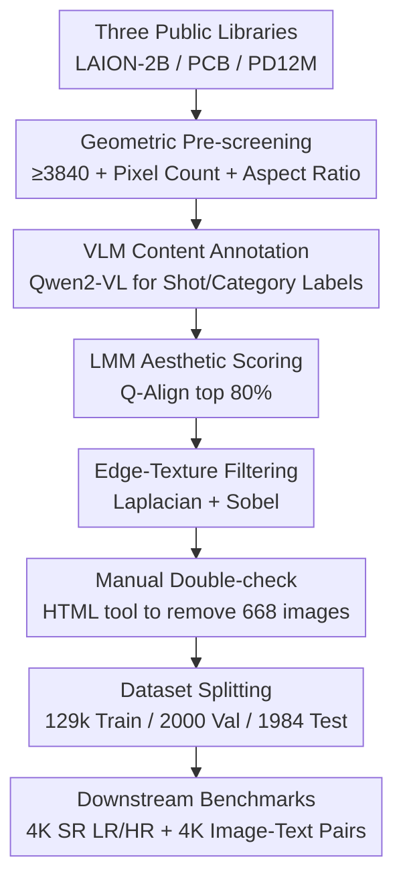

# 4KLSDB: A Large-Scale Dataset for 4K Image Restoration and Generation

**Conference**: CVPR 2026  
**arXiv**: [2605.24762](https://arxiv.org/abs/2605.24762)  
**Code**: https://4klsdb.github.io/ (Project Page)  
**Area**: Diffusion Models / Image Generation / Super-Resolution / Dataset  
**Keywords**: 4K Dataset, Native High Resolution, Super-Resolution, Text-to-Image, Multi-stage Screening  

## TL;DR
This paper constructs 4KLSDB—a large-scale dataset containing 129,000 **native 4K** ($\geq 3840 \times 2160$, non-upscaled) training images covering multiple categories such as nature, urban, people, food, artwork, and CGI. Through a multi-stage pipeline of "geometric pre-screening $\to$ LMM quality scoring $\to$ edge-texture filtering $\to$ manual double-check," approximately 390,000 candidates were refined into a high-quality subset. It provides paired LR/HR 4K super-resolution benchmarks and image-text pairs. Experiments demonstrate that fine-tuning models such as SwinIR, MambaIR, and Sana on this dataset significantly improves the fidelity and perceptual quality of 4K super-resolution and 4K text-to-image generation.

## Background & Motivation

**Background**: For both image restoration tasks like super-resolution (SR) and text-to-image (T2I) diffusion models, it is a consensus that "higher resolution and more diverse training data typically lead to sharper reconstructions and stronger generalization." Native high-resolution training samples are essential for training modern generative and restoration models capable of outputting $2048^2$ or $4096^2$ images.

**Limitations of Prior Work**: Public datasets are generally limited to HD/2K. DIV2K contains only 1,000 2K images, which is too small. LSDIR scales up to 87,000 images but remains primarily HD/2K. DIV8K offers 8K resolution but only has 1,500 training images, which is insufficient. Generative datasets like DiffusionDB and HQ-Edit provide image-text pairs, but their resolutions rarely exceed $1024^2$, and they do not provide the paired LR/HR data required for SR.

**Key Challenge**: Existing resources are **fragmented**—datasets supporting restoration lack native 4K scale, while those supporting generation are not designed as public 4K benchmarks for both restoration and generation. Consequently, many studies rely on synthetically upscaled images or private datasets, hindering reproducibility and fair comparison.

**Goal**: To create a **unified**, public, native 4K resource that serves both 4K restoration (including paired LR/HR benchmarks) and 4K generation (including aligned image-text pairs) while ensuring the images are genuine 4K with excellent visual quality.

**Key Insight**: Simply meeting the "resolution requirement" is insufficient—many images have enough pixels but suffer from compression artifacts, blurriness, or sparse textures. Therefore, the key is not just "finding 4K images," but **how to extract the truly high-quality, texture-rich images from a large pool of seemingly qualified 4K candidates at a low manual cost**.

**Core Idea**: Utilizing a complementary three-layer multi-stage pipeline consisting of "rules + Large Multimodal Model (LMM) scoring + manual sampling" to refine 129k native 4K high-quality images from public corpora including LAION-2B, Photo Concept Bucket, and PD12M, directly providing downstream benchmarks for both restoration and generation.

## Method

### Overall Architecture
The core of 4KLSDB is a **funnel-like filtering pipeline**: starting from three large public image libraries, it passes through four increasingly strict stages to refine the raw candidate pool into a high-quality, aesthetically aligned 4K dataset. The design philosophy is to "eliminate the majority using inexpensive automated rules at the beginning, followed by refined selection of small batches using increasingly costly methods (LMM, manual)," thereby minimizing labor costs at a massive scale.

### Key Designs

**1. Geometric Pre-screening: Defining "4K Candidates" with Three Hard Constraints**

The first step is to determine which images in the noisy raw libraries are eligible for the 4K pool. The authors use three geometric hard rules that must be met simultaneously: ① **Minimum side constraint**—at least one side of the image must be $\geq 3840$ pixels; ② **Total pixel count constraint**—total pixels $\geq 3840 \times 2160$; ③ **Aspect ratio constraint**—the aspect ratio must fall within $[0.6, 1.6]$ to exclude extreme panoramas or narrow strips. This ensures that the images entering the next stage are close to standard 4K formats and are not "fake high-resolution" images.

**2. VLM Content Annotation: Labeling Shot Scale and Content Category to Ensure Diversity**

High resolution alone is not enough; the authors ensure the final dataset is **balanced in terms of categories and shot scales**. Qwen2-VL-7B is used to annotate each image with two types of labels: **Shot scale** (long shot / medium shot / close-up / extreme close-up) and **Content category** (natural scenes / game CGI / anime / painting). These labels are used to **monitor and maintain content diversity** when splitting the train/val/test sets.

**3. LMM Aesthetic Scoring: Pruning Low-Quality Images via Q-Align**

Pre-screening only considers size, but many 4K images still contain compression artifacts, blur, or poor aesthetics. The authors apply **Q-Align** to approximately 390,000 Phase-1 images to calculate both "image quality scores" and "aesthetic scores." By performing visual inspections on various retention ratios, the **top 80%** was selected as the optimal trade-off between quality and data volume.

**4. Laplacian + Sobel Texture Filtering: Preserving High-Frequency Information for Supervised Training**

This is the most technical stage, addressing the problem that overly flat, blurry, or low-contrast images have little value for high-frequency learning in SR and 4K T2I. Two complementary edge operators are used to quantify texture richness.

*Global Edge Intensity (Laplacian)*: A Laplacian kernel $K_L$ is used to obtain $L = I * K_L$, followed by calculating its response variance $\operatorname{Var}(L)=\frac{1}{N}\sum_{x,y}[L(x,y)-\mu_L]^2$. Images with variance outside empirical ranges are removed—too small indicates overall smoothness/blur, while outliers indicate abnormal sharpening or noise.

*Local Texture (Sobel Flat-patch Ratio)*: Sobel gradient magnitude $M(x,y)=\sqrt{G_x^2+G_y^2}$ is calculated, and $M$ is partitioned into non-overlapping $s\times s$ ($s=240$) patches. If a patch's variance $\operatorname{Var}(P_k) < T_{\text{flat}}$, it is judged as a "flat patch." The image is rejected if its flat-patch ratio $R_{\text{flat}}=\frac{1}{N_p}\sum_{k=1}^{N_p}\mathbb{I}[\operatorname{Var}(P_k)<T_{\text{flat}}]$ exceeds $T_{\text{ratio}}$. Through pilot experiments, the authors set $T_{\text{flat}}=100$ and $T_{\text{ratio}}=65\%$.

**5. Manual Double-check and Dataset Splitting: Correcting Machine Errors with HTML Tools**

After the automated pipeline, an intermediate pool of approximately 134,136 images remained. Human annotators used an **HTML online review tool** to inspect images individually, removing **668** unqualified images. From the remaining pool, the authors split **2,000 validation images**, **1,984 test images**, and **129,484 training images**. Importantly, val/test samples maintain native 4K resolution without scaling or low-res cropping.

## Key Experimental Results

The experimental strategy involves fine-tuning representative models using **conventional low-resolution datasets** versus **4KLSDB** to evaluate the gain.

### Main Results: Classic Super-Resolution (PSNR/SSIM, higher is better)

Evaluated on the 4KLSDB test set and the cross-domain DIV8K set, three architectures (HiT-SR, SwinIR, MambaIR) all showed improvement. Taking HiT-SR as an example:

| Test Set | Model | ×4 PSNR | ×8 PSNR | ×16 PSNR |
|----------|-------|---------|---------|----------|
| 4KLSDB   | HiT-SR (baseline) | 24.50 | 22.25 | 19.47 |
| 4KLSDB   | HiT-SR (Ours) | **29.27** | **24.75** | **23.69** |
| DIV8K    | HiT-SR (baseline) | 26.51 | 21.90 | 19.99 |
| DIV8K    | HiT-SR (Ours) | **31.71** | **23.22** | **24.61** |

HiT-SR on 4KLSDB showed PSNR gains of approximately **+4.77 / +2.47 / +4.22 dB** for ×4/×8/×16.

### Real Blind SR (4KLSDB Test Set, Baseline / Ours)

| Method | Scale | PSNR↑ | SSIM↑ | LPIPS↓ | FID↓ |
|--------|-------|-------|-------|--------|------|
| SeeSR  | ×4 | 27.01 / **28.25** | 0.700 / **0.734** | 0.523 / **0.451** | 38.95 / **33.88** |
| OSEDiff| ×16 | 22.65 / **22.69** | 0.621 / 0.597 | 0.657 / **0.487** | 51.76 / **33.97** |

### 4K Text-to-Image (Sana, Baseline vs. 4KLSDB Fine-tuned)

| Model | pCLIPScore↑ | pNIQE↓ |
|-------|-------------|--------|
| Sana (baseline) | 28.62 | 5.21 |
| Sana + 4KLSDB | **29.27** | **4.63** |

Patch-level metrics show improved local image-text consistency and perceptual quality. In a double-blind user study, the preference for the fine-tuned version was: **Overall 57.34%**, **Realism 74.27%**.

### Key Findings
- **Texture filtering (Design 4) is the core of data "value"**: Removing flat/blurry images determines the model's ability to learn high-frequency details.
- **Native 4K supervision value increases with magnification**: Gains for ×8 and ×16 are generally more significant than for ×4.
- **Gains are cross-domain**: Improvements on DIV8K suggest that 4KLSDB provides a strong general high-resolution prior.
- **Realism improvement is most prominent**: The 74.27% preference for realism suggests 4KLSDB mainly enhances perceptual quality and local details.

## Highlights & Insights
- **Funnel-like pipeline**: A cost-layered approach using cheap geometric rules, mid-cost Q-Align scoring, and final manual review.
- **Decoupling resolution from quality**: Hard texture metrics (Laplacian and Sobel) are more reproducible than subjective LMM scores alone.
- **Unified data for dual tasks**: Providing paired LR/HR for restoration and aligned text-image pairs for generation.
- **Native 4K Validation/Testing**: Allows the evaluation of scale-related artifacts (over-smoothing, repeated textures, boundary distortion) that are hidden after downscaling.

## Limitations & Future Work
- **Lack of deduplication/overlap analysis**: Being derived from public libraries like LAION-2B, potential overlap with existing benchmarks or privacy/copyright issues are not deeply discussed.
- **Empirical thresholds**: Thresholds like $T_{\text{flat}}=100$ and $T_{\text{ratio}}=65\%$ are based on pilot experiments and may require re-tuning for other domains.
- **Single-model generation verification**: 4K T2I was only verified on Sana; effectiveness on other architectures like SDXL or PixArt is unknown.
- **$\times 16$ Real Blind SR**: The trade-off between perception and fidelity remains a challenge at extreme scales.
- **Future Work**: Adding fine-grained annotations for repeated textures or small objects to support multi-modal tasks like high-resolution captioning and VQA.

## Related Work & Insights
- **vs. DIV2K / LSDIR**: These are classic but limited to 2K; 4KLSDB achieves both native 4K and 129k scale.
- **vs. DIV8K**: DIV8K has higher resolution (up to 8K) but only 1,500 training images, insufficient for large-scale training.
- **vs. DiffusionDB / HQ-Edit**: These focus on generation and lack paired LR/HR data; 4KLSDB bridges the gap between generation and restoration.

## Rating
- Novelty: ⭐⭐⭐⭐ 
- Experimental Thoroughness: ⭐⭐⭐⭐ 
- Writing Quality: ⭐⭐⭐⭐ 
- Value: ⭐⭐⭐⭐⭐ 

<!-- RELATED:START -->

## Related Papers

- [\[CVPR 2026\] Pico-Banana-400K: A Large-Scale Dataset for Text-Guided Image Editing](pico-banana-400k_a_large-scale_dataset_for_text-guided_image_editing.md)
- [\[CVPR 2026\] StyleText: A Large-Scale Dataset and Benchmark for Stylized Scene Text Inpainting](styletext_a_large-scale_dataset_and_benchmark_for_stylized_scene_text_inpainting.md)
- [\[CVPR 2026\] CG-Floor: Centroid-Guided Diffusion for Large-Scale Floorplan Generation](cg-floor_centroid-guided_diffusion_for_large-scale_floorplan_generation.md)
- [\[NeurIPS 2025\] UltraHR-100K: Enhancing UHR Image Synthesis with A Large-Scale High-Quality Dataset](../../NeurIPS2025/image_generation/ultrahr-100k_enhancing_uhr_image_synthesis_with_a_large-scale_high-quality_datas.md)
- [\[CVPR 2026\] MRT: Masked Region Transformer for Layered Image Generation and Editing at Scale](mrt_masked_region_transformer_for_layered_image_generation_and_editing_at_scale.md)

<!-- RELATED:END -->
