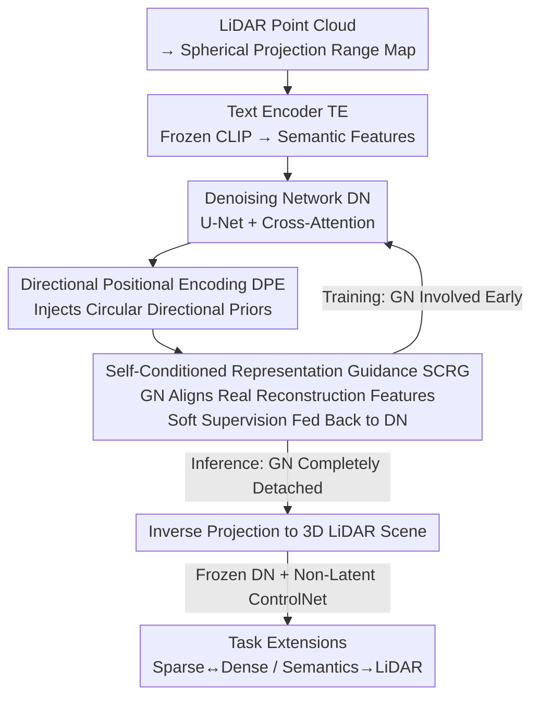

# A Self-Conditioned Representation Guided Diffusion Model for Realistic Text-to-LiDAR Scene Generation

**Conference**: CVPR 2026  
**Paper**: [CVF Open Access](https://openaccess.thecvf.com/content/CVPR2026/html/Qu_A_Self-Conditioned_Representation_Guided_Diffusion_Model_for_Realistic_Text-to_LiDAR_Scene_CVPR_2026_paper.html)  
**Code**: https://github.com/QWTforGithub/T2LDM  
**Area**: Diffusion Models / Autonomous Driving / 3D Scene Generation  
**Keywords**: Text-to-LiDAR generation, Diffusion models, Representation guidance, Directional positional encoding, Controllability evaluation

## TL;DR
T2LDM utilizes a "Guidance Network" (SCRG) that provides geometric reconstruction supervision during training but is discarded at inference, along with Directional Positional Encoding (DPE) to correct street distortion from spherical projection. It generates finely structured and controllable LiDAR scenes despite the extreme scarcity of Text-LiDAR pairs, and introduces the controllability benchmark T2nuScenes and the TBR metric.

## Background & Motivation
**Background**: LiDAR point clouds accurately capture geometric and spatial relationships in driving scenes, but physical collection is costly and data for extreme weather is scarce. Inspired by the success of text-to-image models, researchers have begun using Diffusion Models (DDPM) for "Text-to-LiDAR" generation to conveniently customize large-scale, diverse, and controllable 3D data for downstream perception models.

**Limitations of Prior Work**: Text-to-image models are trained on billions of Text-Image pairs, whereas LiDAR collection and annotation are expensive, making high-quality Text-LiDAR pairs extremely scarce (< 35K pairs in nuScenes). Insufficient training priors directly lead to **over-smoothed and homogeneous** results—objects in the scenes lack clear structure and realistic details (Fig. 1). Furthermore, existing benchmarks (like original nuScenes annotations) use "unnatural" text (e.g., "Turn right at intersection, cross bridge, many peds") and lack controllability evaluation metrics.

**Key Challenge**: Diffusion models require sufficient training priors to fit the LiDAR data distribution $P_{RM}$, but Text-LiDAR data is inherently scarce, creating a direct conflict. The image domain commonly uses "pre-trained representation priors" to enhance model expressiveness, but this path requires large-scale pre-training knowledge and multi-stage training, which is neither data-efficient nor cost-effective for LiDAR.

**Goal**: To enable the denoising network to learn rich geometric details from limited LiDAR distributions without relying on external pre-trained priors or increasing inference overhead; to resolve directional confusion caused by range map spherical projection; and to fill the gap in Text-LiDAR controllability evaluation and prompt paradigms.

**Key Insight**: The authors observed that the denoising network in diffusion training already "sees" perturbed features at multiple scales. By aligning these with **reconstruction representations of real coordinates** via another network, geometric details can be fed back to the denoising network as soft supervision. Crucially, this auxiliary network only participates in early training and is discarded during inference, effectively providing "free" regularization.

**Core Idea**: Use **Self-Conditioned Representation Guidance (SCRG)** to distill geometric reconstruction details from the data distribution into the denoising network, combined with **Directional Positional Encoding (DPE)** to correct spherical projection orientation, achieving end-to-end Text-to-LiDAR generation with zero additional inference cost.

## Method

### Overall Architecture
T2LDM compresses LiDAR scenes into Range Maps (RM, storing depth $r$ and intensity $I$ per pixel) via spherical projection, performs conditional DDPM generation on the RM, and restores the 3D point cloud via inverse projection. The pipeline consists of three components: **Text Encoder TE** (frozen CLIP, outputting 768-dim semantic features) $\rightarrow$ **Denoising Network DN** (U-Net, determining final quality, integrating text via cross-attention and injecting timestep and DPE into residual blocks) $\rightarrow$ **Guidance Network GN** (providing reconstruction signals to DN during training, discarded at inference).

The input consists of noisy RM $x_t$, text condition $c$, and timestep $t$. DN predicts the $v$ target for denoising, with the standard v-prediction objective $L(\theta)=\mathbb{E}_{\epsilon}\lVert v - v_\theta(x_t,t,c)\rVert^2$. Unconditional generation is treated as $c=\varnothing$, enabling classifier-free guidance. SCRG and DPE are enhancement modules attached to this backbone; additionally, a non-latent ControlNet can be added to a frozen unconditional DN to extend to tasks like sparse $\rightarrow$ dense or semantics $\rightarrow$ LiDAR generation.

### Key Designs

**1. Self-Conditioned Representation Guidance (SCRG): Distilling Geometric Details via a Detachable Guidance Network**

Addressing the core pain point: "Scarce Text-LiDAR data $\rightarrow$ Insufficient priors $\rightarrow$ Over-smoothed generation." SCRG introduces a **Guidance Network GN ($x_\phi$)** that receives multi-layer noisy features $F^{v_\theta}_{noise}$ from DN while performing geometric reconstruction targeting **real coordinates $x_0$**, constrained by $L(\phi)=\lVert x_0 - x_\phi(x_0, F^{v_\theta}_{noise})\rVert^2$. GN thus learns reconstruction representations $F^{x_\phi}_{recon}$ of what geometric details should look like under multi-level perturbation.

DN's noisy features are then aligned with GN's multi-scale reconstruction features via a regularization term:
$$L_{SCRG} = l_{recon}\big(F^{x_\phi}_{recon} - F^{v_\theta}_{noise}\big),$$
where $l_{recon}(\cdot)$ uses cosine similarity. This provides "soft supervision from the data distribution itself," forcing DN to preserve high-frequency geometric semantics during denoising. The engineering highlight is that **GN only participates in backpropagation during early training (the first 100K steps), is then frozen, and is completely detached during inference**—resulting in **zero inference overhead** and faster convergence (see Tab. 8 / Fig. 9).

**2. Directional Positional Encoding (DPE): Correcting Street Distortion from Spherical Mappings**

RM involves "flattening" a 360° sphere into a 2D map, but standard convolution or local attention treats it as a rectangular map, causing **directional confusion**. This typically manifests as **bent or broken streets** (Fig. 2c) because the starting angle is often defined at the street center. 

DPE explicitly assigns real horizontal angles $\theta$ and vertical angles $\phi$ to each RM pixel $(i,j)$:
$$\theta = 2\pi - 2\pi\cdot(i+0.5)/w, \qquad \phi = f_{up} - (f_{up}-f_{down})\cdot(j+0.5)/h,$$
followed by a $K$-order Fourier expansion $Fourier^K(\theta,\phi)$ and adaptive feature injection via a learnable gate $\alpha$: $x' = x + \alpha\cdot \mathrm{DPE}(\theta,\phi)$. This provides multi-scale directional priors, allowing the model to correctly perceive relative orientations and positions, preserving continuous street structures.

**3. T2nuScenes Benchmark + TBR Metric + Prompt Paradigm: Making Text-to-LiDAR Controllable and Evaluable**

To address unnatural text and lack of metrics, the authors re-annotated 34,149 frames of nuScenes based on **3D detection box priors**, building the content-composable T2nuScenes benchmark. Using 3D boxes ensures higher accuracy, better generality, and better evaluability.

They proposed the **TBR (Text-Box matching Rate)** metric: running a detector on 10,000 generated samples and calculating the match rate between detected boxes and input prompt text. Analysis revealed an intuitive yet important discovery: **explicit location prompts perform the worst and have the lowest controllability**, while scene-level (weather/location) descriptions are significantly better. This is explained by the **sample distribution**: more dispersed distributions produce richer text but exacerbate the lack of training priors in data-scarce regimes. The recommended paradigm is prompts that are "concise and clear while retaining sufficient semantics," specifically the "weather, location" template.

### Loss & Training
The total loss is the sum of denoising loss, GN reconstruction loss, and SCRG regularization:
$$L_{total} = L(\theta) + L(\phi) + \lambda\, L_{SCRG},$$
where $\lambda$ is an epoch-adjusted weight. The guidance network $x_\phi$ participates in gradients only during the **first 100K steps**. At inference, $x_\phi$ is detached, and only $v_\theta$ is used for iterative denoising.

## Key Experimental Results

### Main Results
On KITTI-360 (unconditional), T2LDM significantly leads in FID-like metrics (FSVD/FPVD):

| Method | FSVD↓ | FPVD↓ | JSD↓ | MMD↓ |
|------|-------|-------|------|------|
| LiDM | 211.68 | 230.19 | 0.35 | 4.78 |
| R2DM | 31.82 | 35.94 | 0.32 | 4.05 |
| Text2LiDAR | 51.55 | 54.82 | 0.33 | 4.11 |
| **Ours** | **21.12** | **25.39** | **0.30** | **3.35** |

On nuScenes (text-guided), T2LDM leads in both quality and controllability:

| Method | FSVD↓ | FPVD↓ | JSD↓ | MMD↓ | TBK(%)↑ |
|------|-------|-------|------|------|---------|
| R2DM | 91.15 | 88.55 | 0.45 | 5.11 | 15.45 |
| Text2LiDAR | 90.13 | 87.62 | 0.38 | 4.01 | 17.15 |
| **Ours** | **66.93** | **65.84** | **0.28** | **3.05** | **23.44** |

### Ablation Study
Effectiveness of components (nuScenes, text-guided). $\varnothing$=w/o DPE+SCRG, D=DPE only, S=SCRG only:

| Config | FSVD↓ | FPVD↓ | JSD↓ | TBK(%)↑ |
|------|-------|-------|------|---------|
| T2LDM$_\varnothing$ | 73.64 | 71.91 | 0.34 | 19.32 |
| T2LDM$_D$ | 71.32 | 70.44 | 0.32 | 20.95 |
| T2LDM$_S$ | 68.45 | 67.77 | 0.30 | 22.15 |
| **Ours** | **66.93** | **65.84** | **0.28** | **23.44** |

### Key Findings
- **SCRG contributes more than DPE**: SCRG (S) alone shows better metrics than DPE (D) alone, indicating that learning geometric details from the distribution is the primary driver of performance.
- **Significant Convergence Acceleration**: At 30k iterations, T2LDM's FSVD is 47.29, compared to 91.32 for T2LDM$_D$ and 175.82 for R2DM.
- **End-to-End is Critical**: SCRG must be trained jointly; using a pre-trained GN results in performance degradation as it cannot provide adaptive regularization for DN's features.
- **Zero Additional Inference Cost**: T2LDM has 30.4M parameters during inference, which is lower than R2DM (31.1M) and Text2LiDAR (45.8M).

## Highlights & Insights
- **Detachable Guidance Network**: SCRG replaces external pre-trained priors with "self-conditioned" reconstruction supervision, saving multi-stage training while incurring zero inference cost.
- **Geometric Inductive Bias in Positional Encoding**: DPE addresses the root cause of orientation confusion in spherical projections with a lightweight Fourier encoding and learnable gating.
- **Closed-loop Controllability Evaluation**: TBR uses off-the-shelf detectors to verify if the text prompt and generated result match, providing an objective metric for text-to-3D generation.

## Limitations & Future Work
- The method relies on the 2D Range Map representation; adapting to voxel or raw point cloud representations would require redesigning DPE.
- TBR metrics depend on the accuracy of the external detector.
- Current benchmarks are focused on nuScenes/KITTI-360; generalization to more diverse sensor configurations remains to be verified.

## Related Work & Insights
- **vs. Pre-training Guided (e.g., REPA [23,62])**: These rely on large-scale pre-training and multi-stage training. Ours uses a self-conditioned, end-to-end, detachable GN.
- **vs. R2DM / Text2LiDAR**: Previous methods suffer from smoothing and poor multi-object detail. T2LDM significantly lowers FID and improves controllability with fewer inference parameters.
- **vs. Box-conditioned Generation**: While box-feeding is less flexible, this paper uses 3D box priors to **label text**, combining flexibility with quantifiable controllability.

## Rating
- Novelty: ⭐⭐⭐⭐
- Experimental Thoroughness: ⭐⭐⭐⭐⭐
- Writing Quality: ⭐⭐⭐⭐
- Value: ⭐⭐⭐⭐

<!-- RELATED:START -->

## Related Papers

- [\[CVPR 2026\] StyleTextGen: Style-Conditioned Multilingual Scene Text Generation](styletextgen_style-conditioned_multilingual_scene_text_generation.md)
- [\[ECCV 2024\] DCDM: Diffusion-Conditioned-Diffusion Model for Scene Text Image Super-Resolution](../../ECCV2024/image_generation/dcdm_diffusion-conditioned-diffusion_model_for_scene_text_image_super-resolution.md)
- [\[CVPR 2026\] CTCal: Rethinking Text-to-Image Diffusion Models via Cross-Timestep Self-Calibration](ctcal_rethinking_text-to-image_diffusion_models_via_cross-timestep_self-calibrat.md)
- [\[CVPR 2026\] SRA 2: Variational Autoencoder Self-Representation Alignment for Efficient Diffusion Training](sra_2_variational_autoencoder_self-representation_alignment_for_efficient_diffus.md)
- [\[CVPR 2026\] Self-Evaluation Unlocks Any-Step Text-to-Image Generation](self-evaluation_unlocks_any-step_text-to-image_generation.md)

<!-- RELATED:END -->
