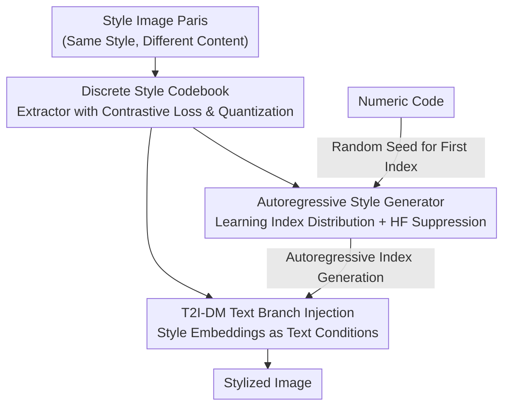

# A Style is Worth One Code: Unlocking Code-to-Style Image Generation with Discrete Style Space

**Conference**: CVPR 2026  
**Paper**: [CVF Open Access](https://openaccess.thecvf.com/content/CVPR2026/html/Liu_A_Style_is_Worth_One_Code_Unlocking_Code-to-Style_Image_Generation_CVPR_2026_paper.html)  
**Code**: https://kwai-kolors.github.io/CoTyle/ (Project Page)  
**Area**: Image Generation / Diffusion Models  
**Keywords**: Style Generation, Discrete Codebook, Autoregressive Generation, Code-to-Style, Diffusion Models  

## TL;DR
CoTyle conjures novel and reproducible visual styles using a single numeric code. It accomplishes "one number = one style" for the first time in the open-source community by training a discrete style codebook to compress images into style indices, a T2I diffusion model to generate images conditioned on these indices, and an autoregressive generator to create new style index sequences from scratch.

## Background & Motivation
**Background**: Stylized image generation currently relies on three main types of conditions: text prompts ("in Chinese ink wash style..."), reference style images, or pre-trained style LoRAs. All can guide diffusion models to produce stylized outputs.

**Limitations of Prior Work**: Each of these three categories has inherent flaws. Text prompts suffer from poor style consistency—producing vast visual differences for the same description. While reference images and LoRAs offer better consistency, their "style" is essentially derived from existing images, showing **poor creativity** (unable to create unseen styles). Furthermore, sharing a style requires transferring pixel-level reference images or heavy LoRA weights, leading to **poor reproducibility**. In other words, existing methods fail to achieve consistency, creativity, and reproducibility simultaneously.

**Key Challenge**: The "carrier of representation" for the style determines its upper limit. As long as style is bound to "entities" like reference images or weights, it remains difficult to both create new styles and achieve lightweight reproduction.

**Goal**: To identify a minimal, portable, and generative style representation that allows users to obtain a **novel**, **consistent**, and **precisely reproducible** style using only a single numeric input.

**Key Insight**: The industry (e.g., Midjourney) already supports "inputting a numeric code for a specific style," but academic technical reports remain blank. The goal is to open-source and make this capability reproducible. The key observation is: if styles are encoded into **discrete indices**, these indices naturally fit autoregressive next-token prediction—making "generating a new style" equivalent to "autoregressively generating a new index sequence."

**Core Idea**: Train a **discrete style codebook** as a style extractor, followed by an **autoregressive style generator** to sample new style index sequences determined by a numeric code acting as a random seed. Finally, a T2I diffusion model generates images based on these indices.

## Method

### Overall Architecture
CoTyle decomposes the "code → style image" process into three serial training stages, which are combined during inference. **Stage 1** trains a discrete style codebook: using contrastive loss to compress images with the "same style but different content" into similar distributions while pushing "different styles" apart, allowing any image to be quantized into a sequence of discrete style indices. **Stage 2** integrates the codebook into a pre-trained T2I diffusion model (DiT), teaching it to generate images "conditioned on style embeddings"—at this point, the model can perform image-driven style transfer. **Stage 3** separately trains an autoregressive Transformer (**style generator**) to learn the distribution of codebook index sequences (unconditional, next-token prediction), enabling it to generate entirely new, self-consistent style index sequences.

During inference (Fig. 3c): A user-provided numeric code serves as a random seed → A seed-fixed initial index $I_0$ is sampled → The remaining $N-1$ indices are completed autoregressively → The codebook provides style embeddings → The T2I-DM generates images based on these indices. Since the same code always produces the same sequence, the style is precisely reproducible; a different code results in a different style.

### Key Designs

**1. Discrete Style Codebook: Decoupling "Style" from Content via Contrastive Loss**

The challenge is that the autoregressive generator requires a **discrete** representation containing **only style and no content**. The authors train a codebook $\mathcal{F}(\cdot)$ as a style extractor using ViT features. Unlike traditional codebooks for image reconstruction, the goal is not high-fidelity restoration but encoding "same style, different content" images into the same distribution. This utilizes a contrastive loss $\mathcal{L}_{\text{contrast}} = \frac{1}{B}\sum_i [\,y_i (1-s_i)^2 + (1-y_i)(\text{ReLU}(s_i-m))^2\,]$, where $s_i$ is the cosine similarity between the features of the $i$-th pair, and $y_i=1$ denotes the same style (pull together), while $y_i=0$ denotes different styles (push beyond margin $m$). Without this loss, the model would map all styles to a single embedding.

To prevent **codebook collapse**, a reconstruction loss $\mathcal{L}_{\text{recon}}$ is added to keep the style embedding $\mathcal{F}(\mathbf{v})$ close to the original ViT feature $\mathbf{v}$ (aligning with the VLM image encoder distribution). Standard vector quantization loss $\mathcal{L}_{\text{VQ}}=\frac{1}{N}\sum_i(\|z_i-\text{sg}[e_i]\|_2^2 + \gamma\|z_i-e_i\|_2^2)$ pulls continuous codes $z_i$ to the nearest codeword $e_i$. Total loss is $\mathcal{L}_{\text{style}}=\mathcal{L}_{\text{contrast}}+\alpha\mathcal{L}_{\text{recon}}+\beta\mathcal{L}_{\text{vq}}$. Quantization serves two purposes: indices facilitate next-token prediction, and the process suppresses irrelevant content information, "pooling" style features cleanly.

**2. Text-branch Injection: Style Embeddings as "Text" Conditions for DiT**

Traditional style transfer often narrows "style" to color and uses visual branches (concatenating style and noise features), which often captures only tones and loses semantic-level style elements. The authors argue style contains rich semantic features and instead use a VLM as a text encoder, **letting style embeddings replace the original image feature positions to be injected into the DiT via the text branch**. During training, given a pair $(x_1, x_2)$ of the same style, features from $x_1$ are quantized into $\mathcal{F}(v_1)$, and $x_2$ is generated using rectified flow matching conditioned on $\mathcal{F}(v_1)$ and the text prompt $y_2$. This aligns style information with human perception. Ablations show visual branch injection might capture the red tones of paper-cutting but misses semantic styles like "circular outlines," whereas text-branch injection can generate styles like "human body composed of crystal blocks."

**3. Autoregressive Style Generator + High-Frequency Suppression: Novel Style Generation via Numeric Codes**

Since stage 2 embeddings come from **existing images**, new styles cannot be created. The authors train an autoregressive Transformer (Qwen2-0.5B architecture, **trained from scratch**) to learn the distribution of index sequences for each image. It becomes an **unconditional** style generator. Inference (Alg. 1): Numeric code $n$ sets the seed → First index $I_0\sim U\{0,\dots,K\}$ is sampled → Full sequence is generated → Decoded into style embeddings → DiT generates the image.

Direct sampling reveals that a few indices appear with high frequency, acting as "meaningless placeholders." Sampling only high-frequency indices causes images to **degrade into realistic photos without specific style**. The authors propose high-frequency suppression: multiplying logit for index $i$ by a suppression coefficient $s(i)=1$ (if frequency $f(i)<\tau$) or $e^{-k(f(i)-\tau)}$ (if $f(i)\ge\tau$). This significantly boosts style intensity and diversity.

### Loss & Training
Three components are trained in stages: ① Codebook: Vocab size 1024, embedding dim 64, 20k steps, batch 128, lr 1e-5; ② DiT: Initialized from pre-trained T2I-DM, 60k steps, batch 64, lr 4e-6; ③ Style Generator: Qwen2-0.5B from scratch, 100k steps, batch 64, lr 1e-5. Style reference images are scaled to 392×392, each encoded into 196 style tokens (sequence length $N=196$).

## Key Experimental Results

### Main Results
Evaluation uses CSD for style consistency and diversity, CLIP-T for text-image alignment, and QualityCLIP for aesthetics. In the code-to-style task, 500 codes are sampled, with 4 images per code (2000 total).

| Method | Condition | Diversity ↑ | Aesthetics ↑ | CLIP-T ↑ | Consistency ↑ |
|------|------|------|------|------|------|
| Midjourney (Closed-source) | Code | **0.8088** | 0.5948 | 0.3090 | 0.4734 |
| **CoTyle (Ours)** | Code | 0.7764 | **0.7173** | 0.3119 | **0.6007** |
| USO | Image | - | 0.7153 | 0.3331 | 0.4395 |
| InstantStyleXL | Image | - | 0.7135 | 0.3134 | 0.5753 |
| **CoTyle\* (Ours, Img Cond)** | Image | - | 0.7178 | 0.3230 | **0.5791** |

In code-to-style, CoTyle (Ours) achieves significantly higher consistency (0.6007) and aesthetics (0.7173) than Midjourney. Diversity (0.7764) is slightly lower than Midjourney (0.8088), attributed to training data breadth. Under image-conditioned settings, CoTyle\* also outperforms open-source reference image methods in consistency.

### Ablation Study

| Configuration | Aesthetics ↑ | CLIP-T ↑ | Consistency ↑ | Description |
|------|------|------|------|------|
| Full $\mathcal{L}_{\text{style}}$ | 0.7178 | 0.3230 | **0.5791** | Contrastive + Recon + VQ |
| w/o Negative Samples | 0.7174 | 0.3260 | 0.4890 | All pairs same style, consistency drops |
| w/o $\mathcal{L}_{\text{recon}}$ | 0.7001 | 0.3237 | 0.4102 | Codebook collapse |

| Configuration | Diversity ↑ | Aesthetics ↑ | CLIP-T ↑ | Consistency ↑ |
|------|------|------|------|------|
| CoTyle (with $s(i)$) | **0.7764** | 0.7173 | 0.3119 | **0.6007** |
| w/o $s(i)$ | 0.7488 | 0.7177 | 0.3210 | 0.5301 |

### Key Findings
- **Reconstruction loss is vital against collapse**: Removing $\mathcal{L}_{\text{recon}}$ causes consistency to plummet from 0.5791 to 0.4102 due to codebook collapse. Negative samples (contrastive) primarily ensure consistency.
- **High-frequency suppression is a style vs. realism trade-off**: Removing $s(i)$ drops diversity (0.7488) and consistency (0.5301) as codes degrade to realism. CLIP-T slightly increases (0.3210), suggesting realistic images align more "accurately" with text, though style is lost.
- **Text branch > Visual branch**: Visual branch injection captures only tones, while text branch understands semantic-level styles like "crystal textures."

## Highlights & Insights
- **Bridging "discrete indices = generative style" is clever**: Quantizing style into tokens transforms "style creation" into next-token generation, a task LMs excel at.
- **Numeric code as seed is the essence of reproducibility**: Style is no longer bound to large assets; a single number allows for trivial sharing and reproduction.
- **High-frequency indices as placeholders**: The observation explains why models degrade to realism without suppression and provides a simple logit-based fix.
- **Text-branch injection** challenges the convention that "style = color" and suggests styles are semantic concepts.

## Limitations & Future Work
- **Diversity constrained by data**: The diversity is slightly lower than Midjourney due to the training set; scaling data is a direct path for improvement.
- **Subjective metrics**: Evaluation relies on CLIP-based automatic metrics. Large-scale human evaluation is needed for "novelty" and "aesthetics."
- **Fixed Hyperparameters**: Sequence length $N=196$ and vocab 1024 limit the style space capacity; their impact needs systematic study.
- **Staged Training**: Whether end-to-end joint training is more efficient remains an open question.

## Related Work & Insights
- **vs. Text-to-Style**: Text prompts lack the deterministic consistency of CoTyle's code-to-index mapping.
- **vs. Reference/LoRA (USO, CSGO, etc.)**: These methods cannot create new styles and require large asset transfers; CoTyle creates new styles and uses a single number for reproduction.
- **vs. Midjourney (Closed-source)**: CoTyle is the first open-source framework to replicate this capability, showing better consistency/aesthetics with slightly lower diversity.

## Rating
- Novelty: ⭐⭐⭐⭐⭐ First open-source code-to-style; bridges discrete indices and style creativity.
- Experimental Thoroughness: ⭐⭐⭐⭐ Solid ablations, though lacks large-scale human evaluation.
- Writing Quality: ⭐⭐⭐⭐⭐ Clear three-stage pipeline explanation.
- Value: ⭐⭐⭐⭐⭐ Direct utility for creative tools and communities by open-sourcing "numeric style" generation.

<!-- RELATED:START -->

## Related Papers

- [\[CVPR 2026\] Evaluating Generative Models via One-Dimensional Code Distributions](evaluating_generative_models_via_one-dimensional_code_distributions.md)
- [\[CVPR 2026\] Style-GRPO: Semantic-Aware Preference Optimization for Image Style Transfer Guided by Reward Modeling](style-grpo_semantic-aware_preference_optimization_for_image_style_transfer_guide.md)
- [\[CVPR 2026\] StyleTextGen: Style-Conditioned Multilingual Scene Text Generation](styletextgen_style-conditioned_multilingual_scene_text_generation.md)
- [\[CVPR 2026\] SplitFlux: Learning to Decouple Content and Style from a Single Image](splitflux_learning_to_decouple_content_and_style_from_a_single_image.md)
- [\[CVPR 2026\] StyleDoctor: Towards Specialist Reward Model for Style-centric Generation Tasks](styledoctor_towards_specialist_reward_model_for_style-centric_generation_tasks.md)

<!-- RELATED:END -->
