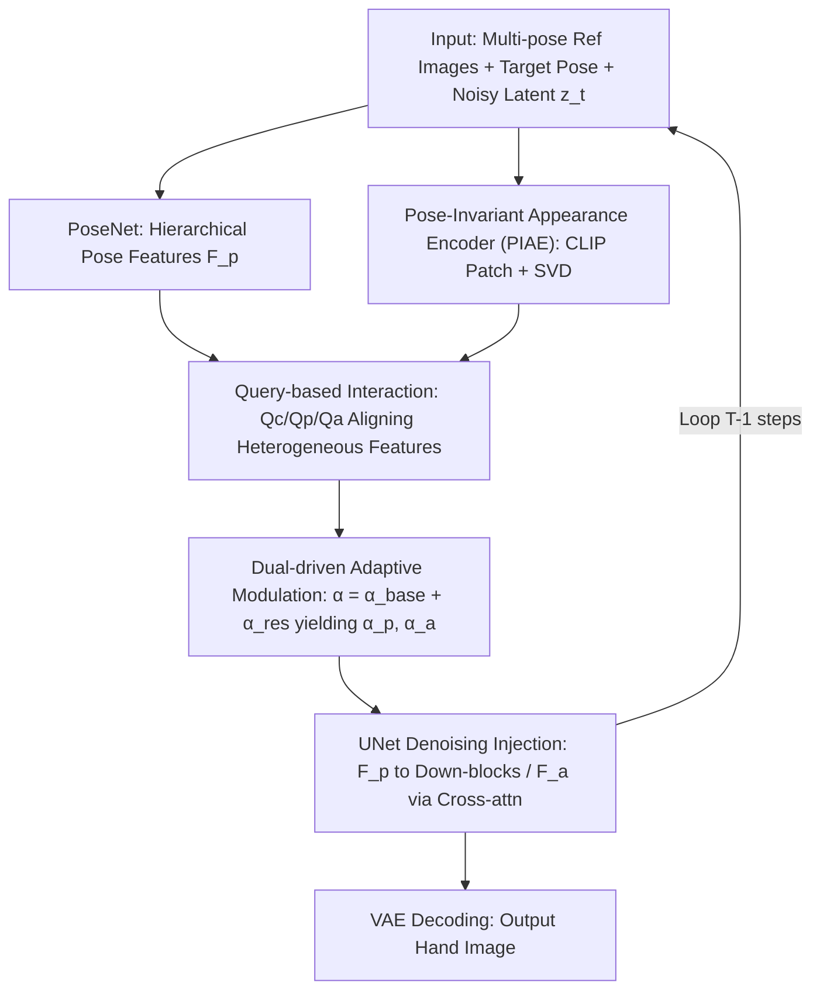

# A Temporal and Content Co-Awareness Latent Diffusion for Controllable Hand Image Generation

**Conference**: CVPR 2026  
**Paper**: [CVF Open Access](https://openaccess.thecvf.com/content/CVPR2026/html/Hao_A_Temporal_and_Content_Co-Awareness_Latent_Diffusion_for_Controllable_Hand_CVPR_2026_paper.html)  
**Code**: https://github.com/samukahs/TCCA  
**Area**: Diffusion Models / Controllable Image Generation  
**Keywords**: Controllable Hand Image Generation, Latent Diffusion, Adaptive Modulation, Pose-Appearance Decoupling, SVD Orthogonal Decomposition

## TL;DR
Addressing the limitation where pose/appearance control signals are injected with fixed intensity across all denoising steps in controllable hand generation, this paper proposes TCCA. It utilizes a set of learnable queries to align heterogeneous features—noisy latents, 3D pose, and appearance—into a unified space to **dynamically adjust** injection intensity **step-by-step**. Complementing this is a pose-invariant appearance encoder using SVD orthogonal decomposition to remove pose artifacts. The method outperforms FoundHand across FID/LPIPS/PCK metrics on datasets like InterHand2.6M.

## Background & Motivation

**Background**: The goal of controllable hand image generation is to synthesize hand images that are both "pose-accurate" and "appearance-consistent" given one or more reference appearance images and a target pose. Such models are used to supplement scarce high-quality hand data in AR/VR, 3D hand pose estimation, and robotics. Current mainstream diffusion models inject pose and appearance as conditional signals into the UNet via either **input-level fusion** (concatenating conditions with noisy latents) or **feature-level modulation** (via cross-attention).

**Limitations of Prior Work**: Regardless of the injection method, most current approaches apply control signals with the **same fixed intensity across all denoising timesteps** (static modulation). However, the denoising process is inherently progressive—early steps determine global structure while later steps refine local textures. Fixed intensity ignores this progression, often resulting in distorted poses or blurred local textures.

**Key Challenge**: The authors conducted a "time-segmented feature injection" experiment (Fig. 2: masking pose or appearance signals at different denoising intervals and measuring LPIPS/PCK changes) and uncovered two overlooked phenomena: (1) **Strong coupling of pose and appearance in early stages**—these two jointly determine the global layout rather than being independent; lacking pose conditions early on not only collapses the structure but also destroys appearance consistency (e.g., color banding, blurred textures). (2) **Condition complexity strongly impacts denoising**—regions with complex poses or rich textures require stronger structural and appearance constraints; for instance, pose conditions significantly affect geometric consistency for "complex poses" in later stages, but have almost no impact on "simple poses." In short, the optimal modulation intensity for pose/appearance depends on both the **denoising state** and **condition complexity**, rather than being constant.

**Goal**: To equip the model with "temporal and content co-awareness," dynamically allocating pose/appearance injection intensity based on the current denoising state and condition complexity. The challenge lies in the fact that noisy latents, 3D poses, and hand appearances represent different semantic distributions and information densities; direct fusion would lead to semantic misalignment and feature competition.

**Key Insight**: Using a set of learnable queries to project three types of heterogeneous features into a **unified representation space** for structured cross-domain interaction. This allows the model to infer "how much pose/appearance control is needed at this moment" and inject it via a dual-driven approach (base weight + residual correction). For the appearance side, a PIAE is designed to extract **pose-invariant** stable appearance representations from multi-pose reference images using SVD orthogonal decomposition.

## Method

### Overall Architecture

During training, inputs include multiple reference appearance images $\{X_{ra}^i\}$ of the same identity (ID), corresponding reference poses $\{X_{rp}^i\}$, and a target pose $X_{tp}$. The objective is to reconstruct the ground truth (GT) image $X_g$. The entire pipeline is built on the LDM of Stable Diffusion 1.5. First, a lightweight **PoseNet** extracts hierarchical pose features $F_p=[f_1,f_2,f_3,f_4]$. A **PIAE** extracts stable appearance features $F_a$ from multi-pose reference images. These conditions are no longer injected with fixed intensity; instead, they enter the **TCCA module**, which uses learnable queries to align noisy latents $z_t$, pose, and appearance into a unified space to infer the pose weight $\alpha_p$ and appearance weight $\alpha_a$ for the current denoising step. Scaled $F_p$ and $F_a$ are then injected into the UNet (pose features are added to the end of each downsampling block, while appearance features are injected into each UNet block via cross-attention). This cycle repeats for $T-1$ steps, after which the VAE decodes the target hand image.

### Key Designs

**1. Query-based Cross-domain Interaction: Aligning Heterogeneous Features**

To achieve "awareness of both denoising state and condition complexity," the model must allow noisy latents, 3D pose, and appearance features to interact. However, their different domains and information densities lead to feature competition if simply concatenated. The authors set three groups of **learnable queries** $(Q_c, Q_p, Q_a)$ to extract semantic factors across "temporal-content" dimensions: $Q_c$ infers the **current denoising state** from latent $z_t$, $Q_p$ learns **geometric priors** from the last scale of pose features $f_4$, and $Q_a$ captures **fine-grained appearance** from $F_a$. These queries project heterogeneous features into a **unified representation space**, making cross-domain interaction controllable.

**2. Dual-driven Adaptive Modulation: Temporal Baseline + Content Residuals**

The model transforms semantic factors into scalar injection strengths using a "base weight + residual correction" approach. A **base weight** $\alpha_p^{base}$ is predicted from timestep embedding $t_{emb}$ via an MLP, with the appearance base weight being its complement $\alpha_a^{base}=1-\alpha_p^{base}$. This encodes the temporal prior (early focus on structure, late focus on appearance). Then, content factors $Q_p, Q_a$ interact with the temporal factor $Q_c$ via a Transformer encoder to predict **residual corrections**. Given the different granularities of pose and appearance, the model generates **channel-wise** residuals $\alpha_p^{res}$ (for pose) and **token-wise** residuals $\alpha_a^{res}$ (for appearance). The final modulation is defined as:

$$F_p^t = \alpha_p \odot F_p,\quad \alpha_p = \alpha_p^{base} + \alpha_p^{res}$$
$$F_a^t = \alpha_a \odot F_a,\quad \alpha_a = \alpha_a^{base} + \alpha_a^{res}$$

**3. Pose-Invariant Appearance Encoder (PIAE): SVD-based Feature Decoupling**

To handle multi-view references with self-occlusion, PIAE uses a **CLIP image encoder** to extract patch-level features $\{f_a^i\in\mathbb{R}^{H\times W\times D}\}$. The key is **SVD orthogonal decomposition**: patch features from different poses of the same ID are clustered into an "Identity-Specific Appearance Space" (ISAS) embedding $e_p$. This is reshaped into a matrix $M\in\mathbb{R}^{Q\times D}$, and SVD $M=U\Sigma V^\top$ is performed. The first $r$ singular vectors form a projection matrix $P_{proj}$ representing pose-related components. The appearance is then projected onto the orthogonal complement to filter out pose artifacts:

$$e_p' = e_p - e_p^T P_{proj}$$

This yields $e_p'$, which is pose-invariant yet detail-rich. Spatial attention further aggregates these into compact tokens combined with the CLIP `[CLS]` token for a stable appearance representation $F_a$.

### Loss & Training

The standard LDM noise prediction objective is used. Training is based on Stable Diffusion 1.5 using an RTX 4090 with AdamW and a learning rate of $10^{-5}$. Classifier-free guidance is applied with weights $w_{pose}=w_{id}=2.0$, and conditions are dropped with a probability of $\eta=10\%$ during training.

## Key Experimental Results

Evaluations were performed on InterHand2.6M. Metrics include FID/LPIPS/SSIM/PSNR for quality and PCK/MPE for geometric consistency.

### Main Results

Image quality comparison on InterHand2.6M:

| Method | FID↓ | LPIPS↓ | SSIM↑ | PSNR↑ |
| :--- | :--- | :--- | :--- | :--- |
| GestureGAN | 31.089 | 0.6720 | 0.3850 | 12.418 |
| CosHand | 17.343 | 0.5082 | 0.4211 | 13.772 |
| CFLD | 15.690 | 0.4701 | 0.4982 | 13.521 |
| FoundHand | 10.462 | 0.4390 | 0.5374 | 14.394 |
| **Ours (TCCA)** | **9.046** | **0.4078** | **0.5714** | **14.965** |

In pose evaluation, **Ours** achieved a PCK@0.05 of 87.34 and MPE of 7.81, significantly outperforming FoundHand (83.93 / 8.76). On hand-object interaction (FoundHand-10M), FID improved to 8.183 compared to FoundHand's 9.981.

### Ablation Study

Ablation of PIAE and TCCA components:

| Type | Configuration | FID↓ | LPIPS↓ | SSIM↑ | Note |
| :--- | :--- | :--- | :--- | :--- | :--- |
| PIAE | PAT (Patch only) | 15.423 | 0.5422 | 0.4709 | Lacks global semantics; color drift |
| PIAE | CLS ([CLS] only) | 14.002 | 0.5081 | 0.4839 | Poor appearance fidelity |
| PIAE | ENG (Entangled w/o SVD) | 12.946 | 0.5117 | 0.5363 | Pose leakage into appearance space |
| PIAE | Ours (w/o TCCA) | 11.089 | 0.4390 | 0.5413 | Full PIAE without TCCA |
| TCCA | FH (Simple MLP fusion) | 11.436 | 0.4881 | 0.5010 | Feature competition |
| TCCA | CT (Coarse temporal) | 10.263 | 0.4201 | 0.5175 | Content-agnostic |
| TCCA | CA (Content-aware only) | 9.804 | 0.4572 | 0.5693 | Lacks temporal layers; over-smoothing |
| TCCA | TA (Time-aware only) | 9.652 | 0.4299 | 0.5673 | Geometric inconsistency in complex cases |
| — | **Ours (full)** | **9.046** | **0.4078** | **0.5714** | Full model |

### Key Findings
- **SVD Orthogonal Decomposition is critical for PIAE**: Without it (ENG), FID is 12.946. Pose leakage causes significant color bias and structural distortion, proving the necessity of removing pose artifacts.
- **Both Temporal and Content Awareness are necessary**: Time-aware (TA) alone fails in complex geometries, while Content-aware (CA) alone lacks temporal progression leading to over-smoothing. Their coordination is optimal.
- **Interpretable Modulation Weights**: Visualization shows pose weight $\alpha_p$ is strong early (defining geometry) and decays as denoising proceeds (shifting to appearance).

## Highlights & Insights
- **Learning "How Much Control to Apply"**: Unlike previous works focusing on "how to inject," this paper asks "how much to inject at each step," utilizing a base + residual strategy for dynamic modulation.
- **`[CLS]` Token as a Coordination Hub**: Using $t_{emb}$ as a `[CLS]` token to aggregate dependencies between pose, appearance, and time factors through self-attention creates a clean architecture.
- **Decoupling via SVD Orthogonal Complement**: Using SVD to extract the "pose subspace" and projecting into its orthogonal complement serves as an effective unsupervised decoupling method.
- **Diagnostic Methodolog**: The time-segmented injection experiment provides a clear way to quantify temporal behavior of conditions in diffusion models.

## Limitations & Future Work
- Evaluation is primarily on InterHand2.6M; generalization to more diverse "in-the-wild" scenes requires further validation.
- Performance is capped by off-the-shelf models like CLIP (appearance) and HaMer (pose assessment).
- The rank $r$ for SVD is a sensitive hyperparameter not fully explored for adaptive selection.
- Robustness to extreme self-occlusion in single-reference scenarios remains a challenge.

## Related Work & Insights
- **vs FoundHand**: While FoundHand tightens the coupling in the input level leading to distortions in HOI, **Ours** decouples them via fine-grained extraction and dynamic modulation for more natural interactions.
- **vs CosHand / CFLD**: These use fixed-intensity feature-level modulation; **Ours** highlights that this ignores the progressive nature of denoising.
- **vs DSW**: Unlike refinement methods that fix geometry post-generation, **Ours** ensures geometric consistency directly during the generative process.

## Rating
- Novelty: ⭐⭐⭐⭐ Strong motivation derived from diagnostic experiments; dynamic modulation and SVD decoupling are effective.
- Experimental Thoroughness: ⭐⭐⭐⭐ Complete baseline comparisons and ablation studies; insightful visualizations.
- Writing Quality: ⭐⭐⭐⭐ Clear logical flow from motivation to method.
- Value: ⭐⭐⭐⭐ Highly transferable strategy for other controllable diffusion tasks.

<!-- RELATED:START -->

<!-- RELATED:END -->

## Related Papers

- [\[CVPR 2026\] Learning Latent Proxies for Controllable Single-Image Relighting](learning_latent_proxies_for_controllable_single-image_relighting.md)
- [\[CVPR 2026\] MoCoDiff: A Controllable Autoregressive Diffusion Model for Expressive Motion Generation](mocodiff_a_controllable_autoregressive_diffusion_model_for_expressive_motion_gen.md)
- [\[CVPR 2026\] Unified Latent Space for Understanding and Generation via Semantic Auto-encoder](unified_latent_space_for_understanding_and_generation_via_semantic_auto-encoder.md)
- [\[CVPR 2025\] FoundHand: Large-Scale Domain-Specific Learning for Controllable Hand Image Generation](../../CVPR2025/image_generation/foundhand_large-scale_domain-specific_learning_for_controllable_hand_image_gener.md)
- [\[CVPR 2026\] Self-Corrected Image Generation with Explainable Latent Rewards](self-corrected_image_generation_with_explainable_latent_rewards.md)

<!-- RELATED:END -->
