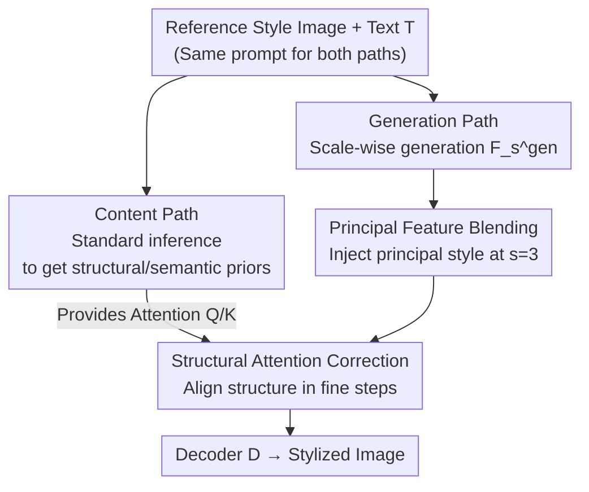

# A Training-Free Style-Personalization via SVD-Based Feature Decomposition

**Conference**: CVPR 2026  
**Paper**: [CVF Open Access](https://openaccess.thecvf.com/content/CVPR2026/html/Lee_A_Training-Free_Style-Personalization_via_SVD-Based_Feature_Decomposition_CVPR_2026_paper.html)  
**Code**: To be confirmed  
**Area**: Image Generation  
**Keywords**: Style Personalization, Training-Free, SVD Feature Decomposition, Scale-wise Autoregressive Model, Attention Correction

## TL;DR
Based on the scale-wise autoregressive model Infinity, this work discovers that the **largest singular value component** of the 3rd feature $F_3$ in the generation process specifically encodes style information. Consequently, a training-free approach is proposed to inject the style of a reference image into this feature step using SVD (Principal Feature Blending), while stabilizing the structure via attention maps from a content branch (Structural Attention Correction). This achieves style fidelity comparable to fine-tuning methods in 3.58 seconds, which is up to 195 times faster.

## Background & Motivation

**Background**: Style-personalized image generation (generating images with the same style as a reference image but different content based on text) currently follows two main paradigms: either fine-tuning a model instance for each style (e.g., DreamBooth/LoRA) or using adapters like IP-Adapter. Almost all underlying architectures are built on diffusion models.

**Limitations of Prior Work**: ① Fine-tuning methods require retraining for every new style, which is not scalable for deployment; ② Iterative denoising in diffusion models is inherently slow, often taking tens to hundreds of seconds per image (StyleDrop 520s, DreamStyler 699s), making them unsuitable for real-time/interactive scenarios; ③ While many methods achieve high style similarity ($S_{img}$), they often suffer from **content leakage** or mode collapse, where the reference image's content leaks into the output, failing to align with the text prompt.

**Key Challenge**: There is a direct trade-off between style fidelity (high $S_{img}$) and text fidelity (high $S_{txt}$, i.e., content compliance). Injecting style features as a whole improves style but causes content leakage. Being conservative with injection results in clean content but poor style. The root cause is that existing methods **mix** "style" and "content" at the feature level, lacking a means to separate them cleanly.

**Goal**: To break this trade-off within a **training-free, single-reference, and fast inference** framework by identifying a feature operation that modifies only style without affecting content.

**Key Insight**: Instead of diffusion models, the authors utilize the scale-wise autoregressive model Infinity (next-scale prediction via 12-step generation, which is much faster than diffusion). They perform a step-wise profile of the generation process to locate "which step and which component" carries the style information.

**Core Idea**: Step-wise analysis identifies that the 3rd feature $F_3$ dominates both content and style. SVD spectral analysis reveals that the **first principal component (the component with the largest singular value) of $F_3$ almost exclusively encodes style**. By replacing only this principal component, the style can be transferred without altering content, all without training.

## Method

### Overall Architecture

The method is built on a frozen Infinity-2B model (12-step scale-wise generation, reconstructed by decoder $D$ to $1024\times1024$). The core findings are: (1) **Step-wise analysis** reveals that replacing the prompt at step $\hat{s}=2$ causes the most significant change in the final image, implying the succeeding feature $F_3$ determines both content and style; (2) **Key stage feature analysis** applies SVD $F_3=U\Sigma V^\top$ and reconstructs $F_3^{svd}$ using only the largest singular value $\sigma_1$. It is found that replacing the target feature's principal component with the reference's results in a sharp increase in color/style similarity while object content similarity remains nearly unchanged, proving the first principal component mainly carries style.

Based on this, the inference adopts a **dual-stream** structure, both using the same text prompt $T$ ("\<content\> in \<style\>") to avoid semantic misalignment:

- **Content path**: Standard inference of the original model without modification, producing structure-stable and semantically aligned content feature sequences $\{F_s^{con}\}$ to serve as a structural prior.
- **Generation path**: Follows the same update rules, but its features $\{F_s^{gen}\}$ are modified by two modules to output the stylized result.

The two modules act only on the generation branch: **PFB (Principal Feature Blending)** injects the principal component style at $s=3$, and **SAC (Structural Attention Correction)** injects attention Query/Key from the content branch into the generation branch for all fine steps $S_{fine}=\{3,4,\dots,S\}$ to stabilize structure.

### Key Designs

**1. Principal Feature Blending (PFB): Modifying Only the Principal Component of $F_3$ to Transfer Style Without Content Leakage**

Directly replacing entire features (REP) leads to high style but severe content leakage. PFB extracts multi-scale style features $\{F_1^{sty},\dots,F_S^{sty}\}$ from the reference using a pretrained image encoder $E_I$, focusing on $F_3^{sty}$. A **style extraction function $\mathcal{\Phi}$** is designed using **exponential re-weighting** of the singular value spectrum to emphasize the principal component while smoothly retaining minor components:

$$\Phi(F)\triangleq \mathbf{U}\mathbf{W}\boldsymbol{\Sigma}\mathbf{V}^\top,\quad F=\mathbf{U}\boldsymbol{\Sigma}\mathbf{V}^\top,\quad \mathbf{W}=\mathrm{diag}\big(e^{-0\cdot\alpha},e^{-1\cdot\alpha},\dots,e^{-(r-1)\alpha}\big)$$

Where $r$ is the rank and $\alpha>0$ (set to $1.0$) controls the decay rate. The update formula replaces the principal component while keeping the residual:

$$\hat{F}_3^{gen}=\Phi(F_3^{sty})+\big(F_3^{gen}-\Phi(F_3^{gen})\big)$$

The intuition is that $\big(F_3^{gen}-\Phi(F_3^{gen})\big)$ removes the style of the generation branch while keeping its structure, then adds the reference's style principal component $\Phi(F_3^{sty})$.

**2. Structural Attention Correction (SAC): Using Content Branch Attention to Fix Structural Distortion**

PFB may occasionally disrupt structural coherence. SAC leverages the idea that Query-Key interactions in self-attention preserve spatial/structural relationships. It replaces the **generation branch's self-attention Q and K with those from the content branch** for all fine steps $s\in S_{fine}=\{3,\dots,S\}$:

$$Q_s^{gen}\leftarrow Q_s^{con},\quad K_s^{gen}\leftarrow K_s^{con},\quad Q_s^{con}=W_Q F_s^{con},\ K_s^{con}=W_K F_s^{con}$$

By aligning the attention maps to the structural-stable content branch, the fine-tuning process is guided by a "structural prior" without washing away the style carried in the Values ($V$).

### Mechanism Example

Given a target prompt "A photo of a \<red\> \<truck\>" and a reference "A photo of a \<blue\> \<bunny\>": ① Baseline outputs a red truck; ② Full replacement of $\hat{F}_3$ results in a blue bunny (content leakage); ③ SVD-guided replacement of only the first principal component results in a blue truck. This confirms "first principal component $\approx$ style."

## Key Experimental Results

Implementation: Frozen Infinity-2B, 12 steps; PFB at $s=3$, SAC for $s \in \{3..12\}$; $\alpha=1.0$. Generating one $1024^2$ image on an A6000 takes **3.58 seconds**. Metrics: $S_{txt}$ (text/content fidelity), $S_{img}$ (style fidelity), and $S_{harmonic}$ (harmonic mean of both).

### Main Results: Comparison with 8 SOTA Methods

| Metric | Ours | IP-Adapter | StyleAligned | DB-LoRA | B-LoRA | StyleAR |
|------|------|-----------|--------------|---------|--------|---------|
| $S_{harmonic}$ ↑ | **0.437** | 0.433 | 0.438 | 0.420 | 0.410 | 0.434 |
| $S_{txt}$ ↑ | **0.334** | 0.302 | 0.315 | 0.323 | 0.324 | 0.314 |
| $S_{img}$ ↑ | 0.630 | 0.763 | 0.716 | 0.602 | 0.559 | 0.701 |
| Inference (s) ↓ | **3.58** | 10.13 | 64.58 | 342.01 | 630.42 | 346.68 |

StyleAligned and IP-Adapter show high $S_{img}$ (0.72/0.76) but much lower $S_{txt}$ due to content leakage. Fine-tuning methods like DB-LoRA/B-LoRA take hundreds of seconds. Ours achieves the **highest $S_{txt}$** and a competitive $S_{harmonic}$ while being up to 195× faster than fine-tuning.

### Ablation Study: Impact of PFB and SAC

| # | Configuration | $S_{txt}$ ↑ | $S_{img}$ ↑ | $S_{harmonic}$ ↑ | Description |
|---|------|-------------|-------------|------------------|------|
| (a) | Infinity (baseline) | **0.348** | 0.559 | 0.429 | No style modulation, highest content fidelity |
| (b) | + REP (Full replacement) | 0.279 | **0.696** | 0.398 | Maximum style but severe content leakage |
| (c) | + PFB | 0.321 | 0.631 | 0.426 | SVD blending mitigates leakage |
| (d) | + PFB + SAC (Full) | 0.334 | 0.630 | **0.437** | Balanced; highest harmonic score after fixing structure |

### Key Findings
- (a)→(b): Full replacement serves as a style fidelity upper bound (0.696) but crashes $S_{txt}$ from 0.348 to 0.279, proving "whole feature injection = content leakage."
- (b)→(c): Switching to SVD principal component blending recovers $S_{txt}$ to 0.321 while maintaining $S_{img}$ at 0.631, verifying the core design.
- (c)→(d): Adding SAC further improves $S_{txt}$ to 0.334 with minimal style loss, showing SAC primarily stabilizes structure.
- User Study (n=30): Ours leads in text fidelity preference (35.3% vs IP-Adapter's 4.3%), while remaining competitive in style fidelity (32.0%).

## Highlights & Insights
- **The discovery "First Principal Component $\approx$ Style" is the most valuable insight**: Through SVD-guided controlled experiments, the authors turned an intuitive hypothesis into a verifiable conclusion for separating style and content in the feature spectrum.
- **The "subtract own style, add reference style" formula is clever**: $\Phi(F_3^{sty})+(F_3^{gen}-\Phi(F_3^{gen}))$ preserves intrinsic structure by specifically removing only the style component of the generation branch.
- **Decoupling structure and content via $Q/K$ replacement**: Replacing attention $Q/K$ (where to attend) while keeping $V$ (what to attend) is a lightweight trick applicable to other dual-branch generation or editing tasks.
- **Backbone Selection**: Choosing a scale-wise AR model instead of diffusion is the primary reason for the 3.58s inference speed.

## Limitations & Future Work
- The method relies heavily on the finding that $F_3$'s first principal component encodes style in the Infinity model; its portability to other architectures (Diffusion, other AR models) is not guaranteed ⚠️.
- Style control is focused on a single principal component at step $s=3$. Complex styles with intricate textures might require more nuanced multi-scale or multi-component injection.
- Parameters like decay rate $\alpha$ and the choice of step $s=3$ are empirically set; there is no adaptive mechanism for different styles yet.

## Related Work & Insights
- **vs StyleAligned / IP-Adapter**: These achieve higher style similarity ($S_{img}$) but suffer from content leakage ($S_{txt}$ suffers). Ours sacrifices some $S_{img}$ for significantly better $S_{txt}$ and semantic alignment.
- **vs DB-LoRA / B-LoRA (Fine-tuning)**: These require hundreds of seconds and retraining per style; ours is training-free and 195× faster with better style fidelity than B-LoRA.
- **vs Classical Style Transfer (AdaIN / WCT)**: While those align global feature statistics, this method moves style control to specific spectral components within a generative model's internal features, offering better interpretability.

## Rating
- Novelty: ⭐⭐⭐⭐⭐ The discovery "Principal Component $\approx$ Style" and its application to AR models is a fresh direction for training-free control.
- Experimental Thoroughness: ⭐⭐⭐⭐ Extensive comparison with 8 SOTAs and user studies, though primarily validated on a single backbone.
- Writing Quality: ⭐⭐⭐⭐⭐ Strong logical flow from analysis to hypothesis to design.
- Value: ⭐⭐⭐⭐ High utility for real-time interactive stylization due to its training-free nature and speed.

<!-- RELATED:START -->

## Related Papers

- [\[CVPR 2026\] CRAFT-LoRA: Content-Style Personalization via Rank-Constrained Adaptation and Training-Free Fusion](craft-lora_content-style_personalization_via_rank-constrained_adaptation_and_tra.md)
- [\[CVPR 2026\] VDE: Training-Free Accelerating Rectified Flow Model via Velocity Decomposition and Estimation](vde_training-free_accelerating_rectified_flow_model_via_velocity_decomposition_a.md)
- [\[CVPR 2026\] OrthoFuse: Training-free Riemannian Fusion of Orthogonal Style-Concept Adapters for Diffusion Models](orthofuse_training-free_riemannian_fusion_of_orthogonal_style-concept_adapters_f.md)
- [\[CVPR 2026\] StyleGallery: Training-free and Semantic-aware Personalized Style Transfer from Arbitrary Image References](stylegallery_training-free_and_semantic-aware_personalized_style_transfer_from_a.md)
- [\[CVPR 2026\] Training-free Mixed-Resolution Latent Upsampling for Spatially Accelerated Diffusion Transformers](training-free_mixed-resolution_latent_upsampling_for_spatially_accelerated_diffu.md)

<!-- RELATED:END -->
