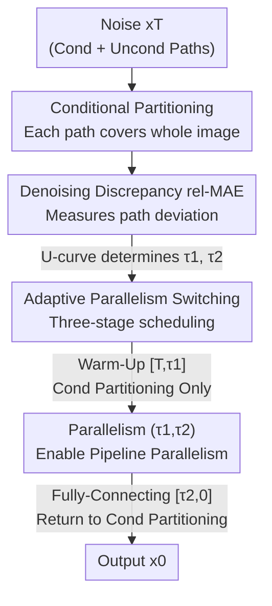

# Accelerating Diffusion via Hybrid Data-Pipeline Parallelism Based on Conditional Guidance Scheduling

**Conference**: CVPR 2026  
**Paper**: [CVF Open Access](https://openaccess.thecvf.com/content/CVPR2026/html/Jung_Accelerating_Diffusion_via_Hybrid_Data-Pipeline_Parallelism_Based_on_Conditional_Guidance_CVPR_2026_paper.html)  
**Code**: https://github.com/kaist-dmlab/Hybridiff  
**Area**: Diffusion Models / Inference Acceleration / Distributed Parallelism  
**Keywords**: Diffusion model acceleration, Hybrid parallelism, Conditional partitioning, Pipeline parallelism, Classifier-Free Guidance

## TL;DR
Addressing the pain points of "sub-linear speedup and quality degradation" in multi-GPU diffusion inference, this paper leverages the inherent "conditional/unconditional dual-path" of Classifier-Free Guidance as the data parallelism splitting dimension (Conditional Partitioning). It then uses a metric for noise discrepancy (rel-MAE) to adaptively determine when to enable pipeline parallelism. On two RTX 3090 GPUs, it achieves 2.31× and 2.07× speedups for SDXL and SD3, respectively, with almost no loss in image quality.

## Background & Motivation
**Background**: While diffusion models offer high quality, their inference is slow due to the sequential bottleneck of iterative denoising. Single-card acceleration (reducing steps, compression, mathematical approximation) often requires additional training and involves a hard trade-off between quality and speed. Multi-card distributed parallelism offers a path to improve throughput without retraining, represented by training-free works like DistriFusion (data parallelism) and AsyncDiff (pipeline parallelism).

**Limitations of Prior Work**: Both types of parallelism fail to achieve ideal $N\times$ linear speedup and cause quality degradation. DistriFusion splits an image into $N$ patches across $N$ GPUs, but since each patch is only a local sub-region, seam artifacts appear at boundaries; furthermore, all-gather synchronization of features incurs high communication overhead, resulting in only 1.2× speedup on 2 GPUs. AsyncDiff splits the U-Net into $N$ pipeline stages, feeding outputs asynchronously, but this asynchronous denoising accumulates estimation errors, yielding only 1.3× speedup on 2 GPUs.

**Key Challenge**: Naively combining the two into "hybrid parallelism" (patch splitting + model partitioning) theoretically exceeds linear speedup but compounds quality degradation—local patches bring boundary artifacts, and asynchronous communication brings error accumulation. The root cause is that **patch splitting disrupts global consistency**, while the **static switching points** of pipelines do not align with the dynamic behavior of conditional guidance during denoising.

**Key Insight**: The authors observe that in conditional diffusion, CFG naturally calculates two paths: conditional noise $\epsilon_\theta(x_t,c,t)$ and unconditional noise $\epsilon_\theta(x_t,t)$. Each path covers the **entire image**, providing two naturally parallelizable data streams. Moreover, the discrepancy between them follows a U-shaped pattern over timesteps—large in the early stages, converging in the middle, and diverging again at the end. This provides a unified physical basis for the problems of "data splitting" and "parallelism timing."

**Core Idea**: From the data parallelism side, "patch splitting" is replaced by "conditional/unconditional partitioning" (preserving global consistency). From the model parallelism side, "static switching" is replaced by "adaptive switching based on denoising discrepancy." These are fused into a unified hybrid parallelism framework.

## Method

### Overall Architecture
Input isotropic noise $x_T$ enters two denoising branches simultaneously: the unconditional path $f_\theta(x_t,t)$ and the conditional path $f_\theta(x_t,c,t)$. The entire process is divided into three stages based on the dynamic influence of conditions over time: **Warm-Up stage $[T,\tau_1]$**, **Parallelism stage $(\tau_1,\tau_2)$**, and **Fully-Connecting stage $[\tau_2,0]$**. The boundaries $\tau_1, \tau_2$ are not manually tuned constants but are determined automatically in real-time based on "denoising discrepancy."

Intuition: Early on, the discrepancy is large (condition builds global semantic skeleton, unconditional stabilizes structure), and asynchronous parallelism would cause divergence, so **only conditional partitioning data parallelism is used without pipelining**. In the middle, the paths converge and the discrepancy stabilizes, so **adaptive pipeline parallelism is enabled** for high acceleration. At the end, fine-grained conditional cues dominate and discrepancy increases again, so the system **reverts to conditional partitioning** to merge paths for final refinement. Formally, denoising on $N$ GPUs is expressed as $x^{(n)}_{t-1}=f_{\theta^{(n)}}(x^{(n)}_t, c^{(b_n)}, t)$, where $\theta^{(n)}$ is the subset of model parameters assigned to the $n$-th GPU (adaptive pipeline), and $b_n\in\{\text{cond},\text{uncond}\}$ marks whether the GPU handles the conditional or unconditional branch (conditional partitioning).

### Key Designs

**1. Conditional Partitioning Data Parallelism: Using CFG paths as splitting dimension to avoid patch artifacts**

The fundamental flaw of patch splitting is that each block is local, which inevitably creates artifacts at seams and requires frequent all-gather synchronization. This paper splits the "conditional dimension" instead of space: CFG requires computing conditional noise $\epsilon_c=\epsilon_\theta(x_t,c,t)$ and unconditional noise $\epsilon_u=\epsilon_\theta(x_t,t)$, which are assigned to two different GPUs. Critically, **each path processes the entire image**, preserving global consistency and eliminating patch seam issues. Communication for feature aggregation is significantly reduced. This essentially utilizes the dual-path computation already required by CFG—converting serial execution into parallel without increasing the total inference workload.

**2. Denoising Discrepancy (rel-MAE): Quantifying when paths should interact vs. remain independent**

To decide when to switch to parallelism, a metric characterizing "path alignment" is needed. The paper defines **denoising discrepancy** as the relative Mean Absolute Error (rel-MAE) of the noise predictions:

$$\text{rel-MAE}_t(\epsilon_c,\epsilon_u)=\frac{\mathbb{E}_{x,\epsilon}\big[\lVert\epsilon_\theta(x_t,c,t)-\epsilon_\theta(x_t,t)\rVert_1\big]}{\mathbb{E}_{x,\epsilon}\big[\lVert\epsilon_\theta(x_t,t)\rVert_1\big]}$$

A higher value indicates greater deviation and stronger conditional influence. Measured across 5000 prompts from MS-COCO 2014, this curve exhibits a clear **U-shape**: high early on, near zero in the middle, and rising at the end. Via score decomposition, it can be approximated as the ratio of conditional information intensity to the unconditional data prior: $\text{rel-MAE}_t\approx\frac{\lVert\nabla_{x_t}\log p(c|x_t)\rVert_1}{\lVert s_u(x_t,t)\rVert_1}$. Early on, $x_t$ is near pure noise and the conditional gradient dominates (large discrepancy). In the middle, the unconditional score reconstructs structure and the two are comparable (discrepancy near zero, signaling the start of parallelism). Finally, details are refined (discrepancy rises slightly).

**3. Adaptive Parallelism Switching: Determining τ₁ and τ₂ via rel-MAE instead of static switching**

Using the U-shaped rel-MAE, the two transition points are found automatically. **Determining $\tau_1$**: The average slope $G_t=\frac{M_t-M_{t-L}}{L}$ of the discrepancy over the last $L$ steps is calculated. $\tau_1'$ is the first point where the slope stops falling rapidly: $\tau_1'=\min\{t\mid 0\le G_t<g_{\text{slope}}\}$. Combined with a safety upper bound $\tau_{\text{cap}}$ (the global minimum of the curve), $\tau_1=\min(\tau_1',\tau_{\text{cap}})$. **Determining $\tau_2$**: In the parallel segment, $\epsilon_c$ and $\epsilon_u$ have converged, so fixed $k$ steps are used: $\tau_2=\tau_1+k$. $k$ serves as the speed-quality trade-off knob. Unlike AsyncDiff's static warm-up, this ties parallelism to the model's own denoising dynamics, minimizing error propagation.

### Loss & Training
This method is a **purely inference-time** scheduling strategy. It requires no additional training or fine-tuning and can be applied directly to pre-trained diffusion models. It supports both U-Net (noise prediction $\epsilon$) and DiT (flow matching velocity field $v$), using $\text{rel-MAE}_t(v_c,v_u)$ similarly. Scaling beyond 2 GPUs uses **Batch-level scaling** ($N$ GPUs produce multiple images concurrently) or **Layer-level pipeline scaling** (splitting the optimal parallel window into $N$ finer pipeline stages).

## Key Experimental Results

### Main Results
Testing on SDXL (U-Net) and SD3 (DiT flow-matching) with 5000 prompts from MS-COCO 2014 at 1024×1024 resolution. FID/LPIPS (lower is better), PSNR (higher is better).

| Model | GPUs | Method | Latency(s)↓ | Speedup↑ | Comm.(GB)↓ | FID(w/ Orig.)↓ |
|------|------|------|---------|-------|----------|----------------|
| SDXL | 1 | Original | 16.49 | — | — | — |
| SDXL | 2 | DistriFusion | 13.53 | 1.22× | 0.525 | 4.864 |
| SDXL | 2 | AsyncDiff (stride=1) | 12.54 | 1.31× | 9.830 | 4.103 |
| SDXL | 2 | **Ours (k=5)** | **7.12** | **2.31×** | **0.516** | **4.100** |
| SDXL | 4 | **Ours (k=5)** | 4.83 | 3.41× | 0.751 | 5.544 |
| SD3 | 1 | Original | 19.36 | — | — | — |
| SD3 | 2 | AsyncDiff (stride=1) | 9.82 | 1.97× | 1.290 | 2.032 |
| SD3 | 2 | Parastep | 9.98 | 1.94× | 0.032 | 3.350 |
| SD3 | 2 | xDiT-Ring | 14.31 | 1.35× | 121.646 | 1.909 |
| SD3 | 2 | **Ours (k=5)** | **9.33** | **2.07×** | **0.189** | **1.878** |
| SD3 | 4 | **Ours (k=5)** | 5.53 | 3.50× | 0.572 | 2.109 |

On 2 GPUs, it achieves 2.31× speedup for SDXL (vs. 1.22× for DistriFusion and 1.31× for AsyncDiff), with communication reduced by ~19.6× compared to AsyncDiff, while maintaining a better FID.

### Ablation Study
SDXL, 1024×1024, 2 GPUs:

| Configuration | Latency(s)↓ | Speedup↑ | FID(w/ Orig.)↓ | Description |
|------|---------|-------|----------------|------|
| Original Model | 16.49 | — | — | Single-card baseline |
| Full Condition-Based Partitioning | 9.24 | 1.78× | 3.623 | Cond Partitioning only, no pipeline |
| **Ours (Hybrid Parallelism)** | 7.12 | 2.31× | 4.100 | Cond Partitioning + Adaptive Switching |

### Key Findings
- **Conditional Partitioning is the main driver**: Alone it provides 1.78× speedup with minimal quality loss.
- **$k$ is a Speed-Quality knob**: $k=5$ is the sweet spot. As $k$ increases, speed rises but FID degrades.
- **Much lower communication**: Communication is 0.189 GB on SD3, compared to 121.6 GB for xDiT-Ring (ring attention is expensive).
- **Scalability**: For SDXL, speedup remains consistent or improves with resolution (2.72× at 1024², 1.62× at 2560²).

## Highlights & Insights
- **Inverting CFG Redundancy**: Instead of eliminating the redundancy of conditional/unconditional paths, this work turns them into a "free" parallelism dimension, avoiding patch seams.
- **Interpretable Scheduling**: The U-shaped rel-MAE curve transforms an engineering problem into a theoretical one supported by score decomposition.
- **Architecture Agnostic**: Works for both U-Net and DiT by swapping $\epsilon$ for $v$, making it more versatile than transformer-specific solutions like ring attention.

## Limitations & Future Work
- **Optimized for 2 GPUs**: Beyond 2 GPUs, speedup efficiency in single-image generation slightly decreases compared to the super-linear performance of the 2-GPU case.
- **CFG Dependency**: Requires the dual-path structure of CFG; cannot be applied to unconditional generation or single-path guidance.
- **Empirical $k$**: While $\tau_1$ is adaptive, $\tau_2$ depends on a fixed $k$, which may require tuning for different datasets.

## Related Work & Insights
- **vs DistriFusion**: Replaces patch-level parallelism with conditional-level partitioning to ensure global consistency and lower communication.
- **vs AsyncDiff**: Replaces static warm-up with adaptive scheduling based on discrepancy, significantly reducing error accumulation.
- **vs xDiT-Ring**: Provides architecture-neutral acceleration with vastly lower communication overhead compared to ring attention.

## Rating
- Novelty: ⭐⭐⭐⭐⭐ 
- Experimental Thoroughness: ⭐⭐⭐⭐ 
- Writing Quality: ⭐⭐⭐⭐ 
- Value: ⭐⭐⭐⭐⭐ 

<!-- RELATED:START -->

## Related Papers

- [\[CVPR 2026\] FastHybrid: Accelerating Hybrid Autoregressive Image Generation with Lookahead and Guided Decoding](fasthybrid_accelerating_hybrid_autoregressive_image_generation_with_lookahead_an.md)
- [\[CVPR 2026\] DDiT: Dynamic Patch Scheduling for Efficient Diffusion Transformers](ddit_dynamic_patch_scheduling_for_efficient_diffusion_transformers.md)
- [\[CVPR 2025\] Rectified Diffusion Guidance for Conditional Generation](../../CVPR2025/image_generation/rectified_diffusion_guidance_for_conditional_generation.md)
- [\[CVPR 2026\] SenCache: Accelerating Diffusion Model Inference via Sensitivity-Aware Caching](sencache_accelerating_diffusion_model_inference_via_sensitivity-aware_caching.md)
- [\[NeurIPS 2025\] Tortoise and Hare Guidance: Accelerating Diffusion Model Inference with Multirate Integration](../../NeurIPS2025/image_generation/tortoise_and_hare_guidance_accelerating_diffusion_model_inference_with_multirate.md)

<!-- RELATED:END -->

## Related Papers

- [\[ICLR 2026\] Harpoon: Generalised Manifold Guidance for Conditional Tabular Diffusion](../../ICLR2026/others/harpoon_generalised_manifold_guidance_for_conditional_tabular_diffusion.md)
- [\[CVPR 2026\] OntoAug: Rethinking Generative Data Augmentation via Ontology Guidance](ontoaug_rethinking_generative_data_augmentation_via_ontology_guidance.md)
- [\[CVPR 2026\] AVGGT: Rethinking Global Attention for Accelerating VGGT](avggt_rethinking_global_attention_for_accelerating_vggt.md)
- [\[ICML 2026\] AMDP: Asynchronous Multi-Directional Pipeline Parallelism for Large-Scale Models Training](../../ICML2026/others/amdp_asynchronous_multi-directional_pipeline_parallelism_for_large-scale_models_.md)
- [\[CVPR 2026\] Smart Replay: Adaptive Scheduling of Memory Rehearsal for Computational Resource-Aware Incremental Learning](smart_replay_adaptive_scheduling_of_memory_rehearsal_for_computational_resource-.md)

<!-- RELATED:END -->
