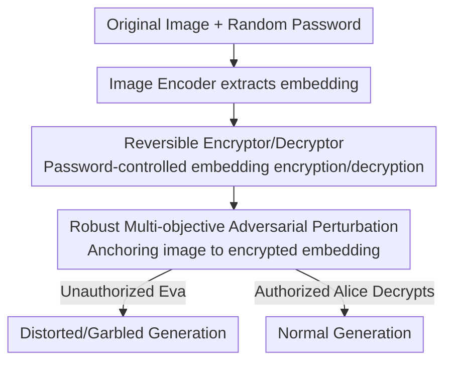

# Adapter Shield: A Unified Framework with Built-in Authentication for Preventing Unauthorized Zero-Shot Image-to-Image Generation

**Conference**: CVPR 2026  
**Paper**: [CVF Open Access](https://openaccess.thecvf.com/content/CVPR2026/html/Jia_Adapter_Shield_A_Unified_Framework_with_Built-in_Authentication_for_Preventing_CVPR_2026_paper.html)  
**Code**: To be confirmed  
**Area**: Diffusion Models / Image Copyright Protection  
**Keywords**: Zero-shot Image Generation, Adversarial Perturbation, Identity Protection, Style Anti-plagiarism, Authenticatable Encryption

## TL;DR
Aiming at zero-shot image-to-image generation methods like IP-Adapter and InstantID that "clone faces or styles with a single image," this paper proposes Adapter Shield. It utilizes a pair of trainable "encryptor/decryptor" modules to map image encoder embeddings into garbled code based on a password. Multi-objective adversarial perturbations are then used to "anchor" the original image to these garbled embeddings. This causes unauthorized users to generate distorted results, while authorized users with the correct password can decrypt the embeddings for normal use—marking the first unified framework in this field to combine "protection" and "authentication."

## Background & Motivation
**Background**: Image-to-image generation in diffusion models has entered the "zero-shot" stage. Methods represented by IP-Adapter, IP-Adapter FaceID, InstantID, and PhotoMaker no longer require fine-tuning model weights with a small batch of images like LoRA or DreamBooth. Instead, they use an image encoder (CLIP or ArcFace) to extract embeddings from a reference image and inject them into the UNet via an additional cross-attention module. Consequently, a single portrait or painting can be used to replicate high-fidelity facial identities or artistic styles.

**Limitations of Prior Work**: This convenience brings severe risks to copyright and portrait rights—deepfakes can be created from a single selfie, and artistic styles can be mass-produced from a single stolen artwork. Existing protection methods (Mist, CAAT, ACE, Pretender, Anti-DreamBooth, Glaze, etc.) are almost entirely designed to "prevent fine-tuning." They assume attackers will fine-tune the model and thus add perturbations to the "gradient paths used during fine-tuning." Since zero-shot methods do not modify weights, these protections largely fail. The only zero-shot specific method, IDProtector, has two major flaws: (1) Irreversibility—even trusted parties cannot recover the true identity, lacking flexibility; (2) Narrow focus—it only handles facial identity forgery and ignores artistic style plagiarism.

**Key Challenge**: A truly usable protection scheme must satisfy two conflicting requirements. First, **Universality**: it must be effective against multiple zero-shot methods, various threats (face forgery + style plagiarism), and even post-processing attacks (blurring, noise, JPEG). Second, **Authentication**: image owners should define "who can use it and how." Authorized parties should generate normally, while unauthorized ones get failures. This implies protection must be **reversible**, which purely destructive schemes cannot achieve.

**Goal**: To add a "protective coating" at the data source (the image itself) to cause unauthorized zero-shot generation to fail, while providing a password-based key for authorized parties to restore the original embedding.

**Core Idea**: Since the vulnerability of zero-shot methods lies in the "embeddings extracted by the image encoder," this paper uses **password-controlled reversible encryption to scramble the embeddings, then uses adversarial perturbations to anchor the original image to these encrypted embeddings**. Both destruction and authentication are linked by the same set of encrypted embeddings.

## Method

### Overall Architecture
The input to Adapter Shield is an original image $I_{ori}$ and a random password $P_{crt}$ chosen by the owner. The output is a "poisoned" protected image $I_{pro}$ that is visually indistinguishable. The pipeline consists of two sequential phases: **Phase I trains an encryptor/decryptor pair offline** to transform the image encoder's embedding space into a "password-encrypted/decrypted" space; **Phase II performs per-image adversarial optimization** to push the original image's pixels toward producing the "encrypted embedding."

Specifically, the image encoder $\mathbf{IE}$ extracts the original embedding $\mathcal{E}_{ori}=\mathbf{IE}(I_{ori})$. The encryptor $\mathbf{Enc}$, controlled by password $P_{crt}$, maps it to an encrypted embedding $\mathcal{E}_{enc}$ that is as dissimilar to the original as possible. The decryptor $\mathbf{Dec}$ restores $\mathcal{E}_{enc}$ back to $\mathcal{E}_{dec}$ (close to $\mathcal{E}_{ori}$) given the correct password. This "garbled embedding" serves as the target $\mathcal{E}_{tar}$ for the Phase II adversarial attack: by adding invisible perturbation $\delta$ to the image, the encoder is forced to output an embedding approaching $\mathcal{E}_{tar}$. Thus, unauthorized parties receive encrypted embeddings resulting in distorted outputs, while authorized parties decrypt first to generate normally.

The threat model involves three parties: the owner **Bob**, the authorized party **Alice**, and the unauthorized party **Eva**.

### Key Designs

**1. Password-Controlled Reversible Embedding Encryption: Linking "Destruction" and "Authentication"**

The limitation of IDProtector stems from its irreversibility. Ours addresses this by training a pair of models: encryptor $\mathbf{Enc}$ and decryptor $\mathbf{Dec}$, each composed of self-attention, cross-attention, and fully connected layers. The cross-attention makes the encryption **password-dependent**—the password (same dimension as the embedding) acts as the other input to the cross-attention, ensuring different passwords map the same embedding to different garbled codes. Encryption aims for $\mathcal{E}_{enc}=\mathbf{Enc}(\mathcal{E}_{ori},P_{crt})$ to be as different from $\mathcal{E}_{ori}$ as possible, while decryption aims for recovery.

Training utilizes cosine similarity losses (clamped to $[0,1]$). Each iteration uses one correct password $P_{crt}$ and $n$ wrong passwords $P_{wrg}$. The encryption loss requires both correct and wrong passwords to produce results deviating from the original:

$$\mathcal{L}_{enc}=\mathbf{CosSim}(\mathbf{Enc}(\mathcal{E}_{ori},P_{crt}),\mathcal{E}_{ori})+\sum_{i=0}^{n-1}\mathbf{CosSim}(\mathbf{Enc}(\mathcal{E}_{ori},P_{wrg\_i}),\mathcal{E}_{ori})$$

The decryption loss $\mathcal{L}_{dec}=1-\mathbf{CosSim}(\mathbf{Dec}(\mathcal{E}_{enc\_crt},P_{crt}),\mathcal{E}_{ori})$ pulls the correct password's result back to the original.

**2. Wrong Password Protection + Dual Diversity Constraints: Preventing Brute-Force and Collisions**

To prevent Eva from guessing passwords, a wrong password loss is introduced to ensure decryption with incorrect passwords still deviates from the original: $\mathcal{L}_{wrg}=\sum_{i=0}^{n-1}\mathbf{CosSim}(\mathbf{Dec}(\mathcal{E}_{enc\_crt},P_{wrg\_i}),\mathcal{E}_{ori})$. To avoid "collisions"—where different passwords or images produce similar garbled codes—two diversity losses are designed: $\mathcal{L}_{div}$ separates all $b\times(2n+1)$ embeddings in a batch, while $\mathcal{L}_{div\_s}$ handles different images under the same password.

The total loss is $\mathcal{L}=\lambda_1\mathcal{L}_{enc}+\lambda_2\mathcal{L}_{dec}+\lambda_3\mathcal{L}_{wrg}+\lambda_4\mathcal{L}_{div}+\lambda_5\mathcal{L}_{div\_s}$ (with $\lambda=1,5,1,1,1$). Ablations show that without diversity losses, similarity is as high as 0.98+ (total collision), while it drops to 0.03~0.09 with them.

**3. Robust Multi-objective Adversarial Perturbation: One Coating for Multiple Encoders and Post-processing**

Phase II applies protection to the image. The goal is to optimize an invisible perturbation $\delta$ ($|\delta|\le\epsilon$) such that the protected image $I_{pro}=I_{ori}+\delta$ forces various encoders to output embeddings approaching the encrypted targets $\mathcal{E}_{tar\_i}$. Two challenges are addressed: (1) Eva might use different encoders (different versions of ArcFace or different CLIP layers); (2) Eva might use blurring, noise, or JPEG to remove the coating.

For the first challenge, a **multi-objective adversarial loss** targets $m$ encoders: $\mathcal{L}_{mt}=\sum_{i=0}^{m-1}\big(1-\mathbf{CosSim}(\mathcal{E}_{pro\_i},\mathcal{E}_{tar\_i})\big)$. FGSM is used for iterative updates. For the second challenge, **differentiable distortion** operations are inserted during iteration as data augmentation, making the coating robust to noise and blur. Ablation shows that $\mathcal{L}_{mt}$ ($m=2$) reduces "Unseen Similarity" (similarity on encoders not seen during training) from 0.29~0.51 to 0.10~0.19.

### Loss & Training
- Phase I: Each image encoder trains its own encryptor/decryptor pair. 1 correct + $n$ wrong passwords per iteration.
- Phase II: FGSM-based iterative attack. Perturbation budget $\epsilon$ set to 11/255 (face) and 21/255 (art). Similarity threshold $th_s$ at 0.75 / 0.65. Includes differentiable distortion.
- For CLIP hidden states (257×1280), $b$ rows are randomly sampled to save memory ($b=32$ for face, $b=8$ for art).

## Key Experimental Results

### Main Results
Two tasks: Face identity protection (CelebA training, FFHQ test) and Art style protection (Wikiart training/test). Metrics: ISM↓ (Identity similarity), AFR↑ (Abnormal face rate), ESM↓ (Embedding similarity for art), PSNR↑/LPIPS↓ (Image quality).

| Method | FaceID ISM↓ | InstantID ISM↓ | IP-Adapter ESM↓ | IP-Adapter Plus ESM↓ |
|------|-------------|----------------|------------------|------------------------|
| No Protect | 1.0 | 1.0 | 1.0 | 1.0 |
| Pretender | 0.869 | 0.872 | 0.816 | 0.739 |
| Mist | 0.898 | 0.909 | 0.844 | 0.754 |
| ACE | 0.930 | 0.935 | 0.792 | 0.724 |
| CAAT | 0.956 | 0.960 | 0.847 | 0.733 |
| **Ours (specific)** | **0.051** | **−0.011** | **0.016** | 0.239 |
| **Ours (general)** | 0.142 | 0.069 | 0.118 | **0.271** |

Anti-fine-tuning methods fail significantly in zero-shot scenarios (ISM/ESM 0.7~0.96), whereas Adapter Shield reduces similarity to around 0.05 while maintaining PSNR at 30~32. Generalization was also verified on DiT-based models (SD-3.5 and Flux).

### Key Findings
- **$\mathcal{L}_{div}$ is critical for diversity**: Without it, similarity is 0.98+; with it, it drops to 0.02~0.09.
- **Diversity vs. Security trade-off**: Diversity increases the random password guess rate slightly, but it remains under 5%.
- **$\mathcal{L}_{mt}$ determines generalization**: Multi-objective optimization reduces unseen encoder similarity from 0.29 to 0.105.
- **JPEG remains the weakest link**: Adversarial perturbations are naturally vulnerable to DCT and quantization used in JPEG compression.

## Highlights & Insights
- **Unified Destruction and Authentication**: Unlike previous methods that were purely destructive or lacked authentication, Ours links them via encrypted embeddings. It reuses the encrypted embedding as the authentication protocol.
- **Attacking Embeddings rather than Pixel Distributions**: Since zero-shot methods rely on the image encoder, targeting the embedding output is more effective than pixel-level poisoning designed for fine-tuning.
- **In-loop Differentiable Distortion**: Integrating post-processing simulations into the optimization loop is a robust trick applicable to any adversarial protection task.

## Limitations & Future Work
- **Weak JPEG Robustness**: Quantization significantly weakens the protective coating, which is a major gap for social media deployment.
- **Computational Cost**: Phase II optimization for art tasks can take up to 480s per image, making large-scale deployment expensive.
- **Visual Artifacts**: PSNR (~30) and LPIPS (0.10~0.15) indicate perceptible perturbations; future work aims to improve visual quality.

## Related Work & Insights
- **vs IDProtector**: IDProtector is irreversible and face-only. Ours is reversible, authenticatable, and universal for both face and style tasks.
- **vs Anti-fine-tuning methods (Mist/CAAT/ACE)**: These target "gradient paths during weight updates." Ours targets the "encoder output," making it the correct "antidote" for zero-shot "don't-change-weights" methods.

## Rating
- Novelty: ⭐⭐⭐⭐⭐ 
- Experimental Thoroughness: ⭐⭐⭐⭐ 
- Writing Quality: ⭐⭐⭐⭐ 
- Value: ⭐⭐⭐⭐⭐ 

<!-- RELATED:START -->

## Related Papers

- [\[CVPR 2026\] Uni-DAD: Unified Distillation and Adaptation of Diffusion Models for Few-step Few-shot Image Generation](uni-dad_unified_distillation_and_adaptation_of_diffusion_models_for_few-step_few.md)
- [\[CVPR 2026\] Taming Video Models for 3D and 4D Generation via Zero-Shot Camera Control](taming_video_models_for_3d_and_4d_generation_via_zero-shot_camera_control.md)
- [\[CVPR 2025\] UNIC-Adapter: Unified Image-Instruction Adapter with Multi-modal Transformer for Image Generation](../../CVPR2025/image_generation/unic-adapter_unified_image-instruction_adapter_with_multi-modal_transformer_for_.md)
- [\[CVPR 2026\] UniGenDet: A Unified Generative-Discriminative Framework for Co-evolutionary Generation and Detection](unigendet_a_unified_generative-discriminative_framework_for_co-evolutionary_imag.md)
- [\[ECCV 2024\] MultiGen: Zero-Shot Image Generation from Multi-modal Prompts](../../ECCV2024/image_generation/multigen_zero-shot_image_generation_from_multi-modal_prompts.md)

<!-- RELATED:END -->
