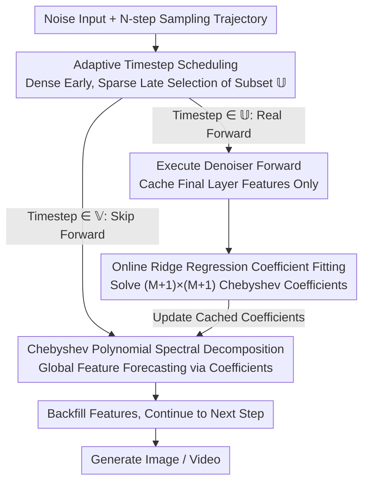

# Adaptive Spectral Feature Forecasting for Diffusion Sampling Acceleration

**Conference**: CVPR 2026  
**arXiv**: [2603.01623](https://arxiv.org/abs/2603.01623)  
**Code**: [GitHub](https://hanjq17.github.io/Spectrum)  
**Area**: Diffusion Models / Image Generation  
**Keywords**: Diffusion Sampling Acceleration, Feature Caching, Chebyshev Polynomials, Spectral Methods, training-free

## TL;DR

The authors propose Spectrum, a global spectral-domain feature forecasting method based on Chebyshev polynomials. By treating the intermediate features of the diffusion model denoiser as functions of time and fitting coefficients via ridge regression, it achieves long-range feature forecasting where errors do not accumulate with step size. Spectrum achieves a $4.79 \times$ speedup on FLUX.1 and $4.67 \times$ on Wan2.1-14B with nearly no loss in quality.

## Background & Motivation

Diffusion models (especially Diffusion Transformers) generate high-quality images and videos, but inference requires dozens to hundreds of denoiser forward passes, incurring extreme computational costs. Among existing acceleration schemes, **feature caching and reuse** is a training-free approach that skips expensive network computations by caching features at selected timesteps and reusing them in subsequent steps.

However, existing caching methods rely on **local approximations**:
- **Naive reusing**: Directly copying the most recently cached features, which oversimplifies temporal dynamics.
- **TaylorSeer**: Local forecasting based on discrete Taylor expansion; however, its error grows at a rate of $((j-k)\delta_t)^{P+1}$—**the larger the step size, the greater the error**, leading to severe quality degradation at high acceleration ratios.

**Key Challenge**: High acceleration ratios require large-stride steps, yet the error of local predictors deteriorates sharply specifically at these large strides. Theoretical analysis by the authors reveals the worst-case error of Taylor predictors and points to its fundamental limitation: the inability to capture the global long-range dynamics of the sampling trajectory.

**Key Insight**: **Shift from time-domain local approximation to frequency-domain global modeling**. By treating each feature channel of the denoiser output as a function of time and approximating it globally using Chebyshev polynomials—a set of orthogonal bases with favorable numerical properties—the error bottleneck of local forecasting can be overcome.

## Method

### Overall Architecture

Spectrum addresses a direct problem: diffusion sampling requires numerous denoiser forward passes; can these be reduced by "forecasting" skipped steps without collapsing quality even at high skip rates? The approach selects a subset of timesteps $\mathbb{U}$ for actual network execution to cache features, while the remaining timesteps $\mathbb{V} = \mathbb{T} \setminus \mathbb{U}$ are handled by a spectral-domain predictor. The pipeline follows a "fitting-then-forecasting" strategy: at each real forward step, the spectral coefficients are refitted using the currently cached feature points, and these coefficients are then used to forecast features for skipped steps. The critical difference is that while previous methods use local expansion in the time domain (losing accuracy far from the cache point), Spectrum treats features as curves over time and performs global approximation over the entire trajectory, using the same set of global bases regardless of the skip distance.

### Key Designs

**1. Chebyshev Spectral Decomposition: Replacing Local Taylor Expansion with Global Orthogonal Bases**

The primary drawback of TaylorSeer is that its error grows with $((j-k)\delta_t)^{P+1}$—as the skip stride $(j-k)\delta_t$ increases, the error worsens exponentially. Spectrum adopts a different mathematical tool: every channel of the denoiser output feature $\mathbf{h}_t = [h_1(t), \cdots, h_F(t)]$ is treated as a function of time, approximated by an $M$-th order Chebyshev polynomial over normalized time $\tau = 2t - 1$,

$$h_i(t) = \sum_{m=0}^{M} c_{m,i} T_m(\tau)$$

As Chebyshev polynomials are orthogonal bases, the approximation accuracy is determined solely by the order $M$ and is independent of the distance between the forecasting point and the cache point. This is theoretically grounded: for functions that can be analytically extended to a Bernstein ellipse (parameter $\rho$), the truncation error of the Chebyshev series decays exponentially at $\rho^{-M}$ (Theorem 3.2). Furthermore, the overall forecasting error bound (Theorem 3.3) depends only on the order $M$, the minimum singular value of the design matrix $\sigma_{\min}(\mathbf{\Phi})$, and the regularization strength $\lambda$, **entirely independent of the step size $\tau_j - \tau_k$**. This conclusion—that error does not accumulate with skipping—is the foundation for its stability at $4–5 \times$ acceleration.

**2. Online Ridge Regression Coefficient Fitting: Solving Coefficients with Minimal Overhead**

The spectral coefficients are not pre-trained but are fitted in real-time during sampling, ensuring the method is training-free. At each real forward step $t_j$, the design matrix $\mathbf{\Phi}_{t_j}$ (where each row contains Chebyshev basis values at a cached time) and the feature matrix $\mathbf{H}_{t_j}$ are constructed to solve a regularized least squares problem:

$$\mathbf{C}_{t_j} = (\mathbf{\Phi}_{t_j}^\top \mathbf{\Phi}_{t_j} + \lambda \mathbf{I})^{-1} \mathbf{\Phi}_{t_j}^\top \mathbf{H}_{t_j}$$

Real-time calculation is feasible because the matrix to be inverted is only $(M+1) \times (M+1)$ (with $M$ typically being 4). Solving this via Cholesky decomposition takes negligible time compared to a network forward pass. The regularization term $\lambda$ is crucial: since cached points are sparse, pure least squares can easily overfit to noise. Adding $\lambda \mathbf{I}$ suppresses overfitting and improves the condition number of $\mathbf{\Phi}^\top\mathbf{\Phi}$ ($\lambda=0.1$ was found to be optimal).

**3. Adaptive Timestep Scheduling: Allocating Resources to Early Stages**

Uniformly selecting real forward steps ignores the fact that diffusion is an ODE integration process where early errors propagate and amplify. Spectrum employs a schedule that is dense in the early stages and sparse later, specifically selecting $\mathbb{U} = \{\tau_j : j = \lfloor\alpha \frac{r(r+1)}{2}\rfloor\}$, where the interval grows quadratically with index $r$. A larger hyperparameter $\alpha$ leads to more aggressive skipping and higher acceleration. This anchors the baseline accuracy with more real computation early on, allowing the predictor to handle the smooth segments of the trajectory later. Ablation studies show this adaptive scheduling is $1–2$ dB PSNR more stable than fixed intervals at high acceleration.

**4. Cache Final Layer Only: Avoiding L-fold Overhead**

TaylorSeer performs caching and forecasting for every layer, multiplying memory and fitting costs by the number of layers $L$. Spectrum instead instantiates the spectral predictor only at the output of the final attention block. This significantly reduces memory usage while maintaining or even improving quality, suggesting that the long-range dynamics determining generation results are primarily reflected in the final features.

## Key Experimental Results

### Main Results I: Text-to-Image Generation (DrawBench, Table 1)

| Method | FLUX Speedup | FLUX PSNR↑ | FLUX SSIM↑ | FLUX LPIPS↓ | FLUX ImageReward↑ |
|------|-------------|-----------|-----------|------------|------------------|
| 50 steps (ref) | 1.00× | - | - | - | 1.00 |
| TaylorSeer (N=4,O=1) | 3.13× | 22.31 | 0.841 | 0.215 | 0.99 |
| TaylorSeer (N=4,O=2) | 3.03× | 20.76 | 0.812 | 0.247 | 1.02 |
| **Spectrum (α=0.75)** | **3.47×** | **24.32** | **0.854** | **0.217** | 0.99 |
| TaylorSeer (N=6,O=1) | 4.14× | 20.24 | 0.785 | 0.294 | 1.00 |
| **Spectrum (α=3.0)** | **4.79×** | **22.21** | **0.788** | **0.261** | 1.00 |

### Main Results II: Text-to-Video Generation (VBench, Table 2)

| Method | Wan2.1-14B Speedup | PSNR↑ | SSIM↑ | VBench Quality↑ |
|------|-------------------|-------|-------|----------------|
| 50 steps (ref) | 1.00× | - | - | 83.15 |
| TaylorSeer (N=4,O=1) | 3.01× | 19.46 | 0.660 | 82.74 |
| **Spectrum (α=0.75)** | **3.40×** | **22.78** | **0.749** | **82.80** |
| TaylorSeer (N=6,O=1) | 3.94× | 17.24 | 0.585 | 81.38 |
| **Spectrum (α=3.0)** | **4.67×** | **21.24** | **0.694** | **82.21** |

In high acceleration scenarios ($4–5 \times$), Spectrum provides a $2–4$ dB PSNR advantage over TaylorSeer.

### Ablation Study

- **Regularization Strength $\lambda$**: Performance is poor at $\lambda = 0$; $\lambda = 0.1$ is optimal, proving regularization is critical to prevent overfitting.
- **Polynomial Order $M$**: $M = 4$ is sufficient; higher orders yield no significant gains.
- **Adaptive Scheduling vs. Fixed Interval**: Adaptive scheduling outperforms fixed intervals by $1–2$ dB PSNR at high acceleration.
- **Final Layer Cache vs. Per-layer Cache**: Caching only the final layer is more memory-efficient and yields superior results.

### Key Findings

- Taylor predictors exaggerate local details but lose global semantics at high acceleration ratios; Spectrum maintains color consistency and semantic correctness.
- The computational overhead of Spectrum is negligible relative to the network forward pass (complexity dominated by $O(K(M+1)F)$, where $K$ and $M$ are small).
- The method is effective for both image and video diffusion models and is compatible with different ODE solvers.

## Highlights & Insights

1. **Paradigm Shift from Local to Global**: Advancing feature caching from time-domain local approximation to spectral-domain global modeling represents a methodological leap.
2. **Theoretical Guarantees**: The theorem proving that error does not accumulate with step size is the central theoretical contribution, providing confidence for high acceleration scenarios.
3. **Engineering Simplicity**: The method only requires ridge regression and Cholesky decomposition, incurring minimal overhead.
4. **Broad Applicability**: Demonstrated effectiveness across four SOTA models (FLUX.1, SD3.5-Large, Wan2.1-14B, and HunyuanVideo).

## Limitations & Future Work

- Requires at least $M+1$ cached points to begin forecasting, necessitating full network execution in the initial phase.
- The assumption that features are analytic functions of time (extendable to a Bernstein ellipse) requires further validation for different feature distributions.
- The adaptive scheduling hyperparameter $\alpha$ may require tuning for different models.
- Joint usage with orthogonal techniques like distillation or token pruning has not yet been explored.

## Related Work & Insights

- **TaylorSeer**: The most direct baseline, using discrete Taylor expansion for feature forecasting.
- **TeaCache**: A scheme that dynamically decides when to cache, which is complementary to Spectrum's scheduling strategy.
- **FORA/ToCa**: Methods based on direct cache reuse, which are less effective than forecasting-based approaches.
- **Insight**: The classic role of Chebyshev polynomials in numerical analysis is cleverly introduced to deep learning inference acceleration, suggesting that other mathematical tools (e.g., Fourier bases, wavelets) might also be applicable in similar contexts.

## Rating

- Novelty: ⭐⭐⭐⭐⭐ First introduction of spectral methods to diffusion feature caching with solid theoretical analysis.
- Experimental Thoroughness: ⭐⭐⭐⭐⭐ Covers 4 SOTA models (image + video), two acceleration tiers, and comprehensive ablations.
- Writing Quality: ⭐⭐⭐⭐⭐ Clear theoretical derivation, natural motivation stemming from Taylor error analysis, and a complete logical chain.
- Value: ⭐⭐⭐⭐⭐ Achieves $4-5 \times$ acceleration with nearly lossless quality, training-free, and high practical utility.

<!-- RELATED:START -->

## Related Papers

- [\[CVPR 2026\] Region-Adaptive Sampling for Diffusion Transformers](region-adaptive_sampling_for_diffusion_transformers.md)
- [\[CVPR 2026\] ResCa: Residual Caching for Diffusion Transformers Acceleration](resca_residual_caching_for_diffusion_transformers_acceleration.md)
- [\[CVPR 2026\] Denoising as Path Planning: Training-Free Acceleration of Diffusion Models with DPCache](dpcache_denoising_path_planning_diffusion_accel.md)
- [\[CVPR 2026\] TAP: A Token-Adaptive Predictor Framework for Training-Free Diffusion Acceleration](tap_a_token-adaptive_predictor_framework_for_training-free_diffusion_acceleratio.md)
- [\[AAAI 2026\] ProCache: Constraint-Aware Feature Caching with Selective Computation for Diffusion Transformer Acceleration](../../AAAI2026/image_generation/procache_constraint-aware_feature_caching_with_selective_computation_for_diffusi.md)

<!-- RELATED:END -->
