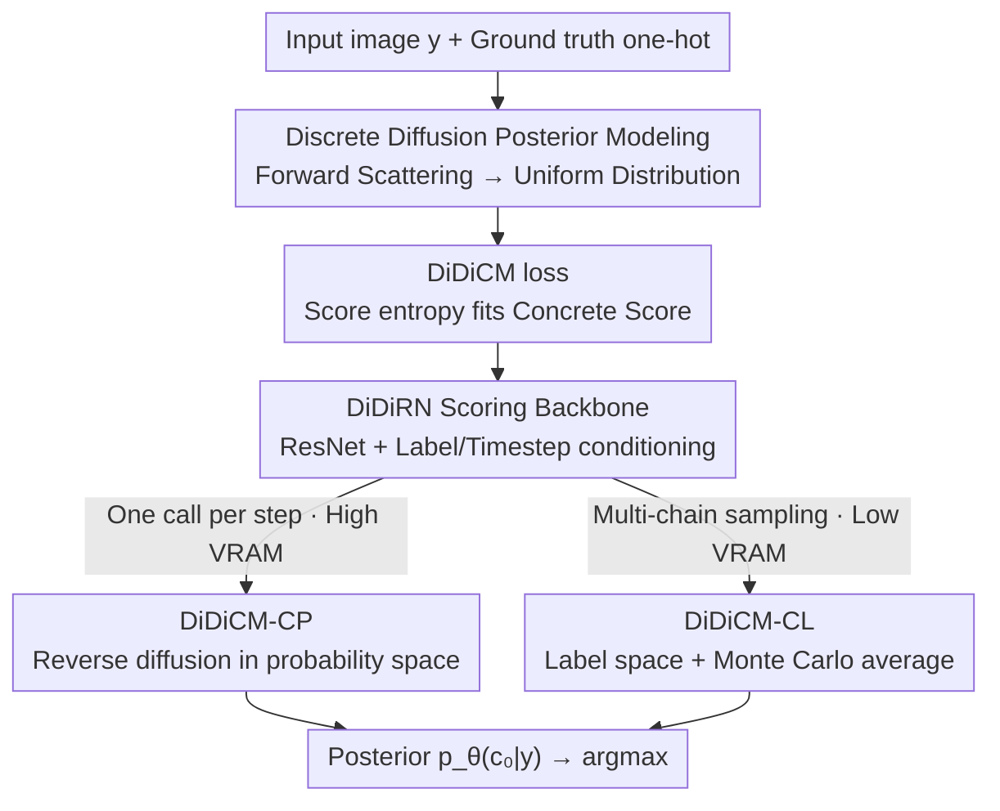

# Advancing Image Classification with Discrete Diffusion Classification Modeling

**Conference**: CVPR 2026  
**Paper**: [CVF Open Access](https://openaccess.thecvf.com/content/CVPR2026/html/Belhasin_Advancing_Image_Classification_with_Discrete_Diffusion_Classification_Modeling_CVPR_2026_paper.html)  
**Code**: https://github.com/omerb01/didicm  
**Area**: Diffusion Models / Image Classification  
**Keywords**: Discrete Diffusion, Image Classification, Concrete Score, Posterior Modeling, Uncertainty  

## TL;DR
The authors transform image classification from "one-shot label prediction" into "running a diffusion process in a discrete class label space to approximate the posterior $P(c\mid y)$." By predicting a Concrete Score for iterative denoising, the method outperforms equivalent ResNets on ImageNet with only a few diffusion steps, with the performance gap Widening as input degradation (low resolution / sparse data) increases.

## Background & Motivation
**Background**: The mainstream paradigm for image classification has remained unchanged for over a decade: a network $f_\theta(y)$ directly regresses $K$-dimensional class probabilities from input images $y$, trained using cross-entropy $\ell_{CE}(y,c)=-\log f_\theta(y)_c$. While architectures (ResNet/ViT) and training recipes have advanced, the "input $\to$ label in one step" approach has persisted.

**Limitations of Prior Work**: In high-uncertainty scenarios (degraded images, scarce training data, e.g., medical imaging or autonomous driving), this paradigm suffers. The authors identify the root cause: when observations $y=h(x)$ are derived from clean images $x$ via unknown, potentially stochastic, and irreversible transformations, cross-entropy optimizes over $c\sim P(c\mid x)$, whereas the true objective is to model $c\sim P(c\mid y)$. This discrepancy injects irreducible stochastic bias into optimization, which becomes more pronounced with less data.

**Key Challenge**: Traditional classifiers treat labels as deterministic targets to fit, ignoring the intrinsic uncertainty introduced by the degradation from $x$ to $y$. They fail to explicitly model label distribution ambiguity conditioned on degraded observations.

**Goal**: Directly and analytically approximate the posterior under degraded observations $p_\theta(c\mid y)\approx P(c\mid y)$ without the massive computational overhead of reconstructing clean images prior to classification.

**Key Insight**: Diffusion models have proven capable of modeling complex distributions in continuous spaces. The authors observe that the target space for classification is **finite and discrete** ($K$ classes, prior $P(c)$ is fully enumerable). This tractability resolves the summation explosion issues encountered by discrete diffusion in language domains. They ask: "Can the diffusion mechanism be ported to the discrete label space specifically for classification?"

**Core Idea**: Replace one-step prediction with a discrete diffusion framework (DiDiCM) defined on the **class label space** for forward and backward processes. The model learns a **Concrete Score** (a generalization of the continuous score function to discrete domains), using a few reverse diffusion steps to refine a uniform distribution into a posterior.

## Method

### Overall Architecture
DiDiCM treats classification as "diffusion on the $K$-dimensional class label simplex." The **forward process** starts from the one-hot ground truth label and progressively "scatters" it according to a continuous-time Markov process, eventually degrading to a uniform distribution over all classes at $t=1$. During **training**, instead of direct label prediction, a scoring model $s_\theta(y,c_t,t)$ is trained to approximate the Concrete Score (the ratio of class probabilities in the noisy distribution) using a score entropy loss tailored for classification. During **inference**, the process starts from a uniform distribution and runs several reverse steps to converge to the posterior $p_\theta(c_0\mid y)$, with the argmax taken as the result.

The authors provide two simulation modes for the reverse process to balance computation and memory: **DiDiCM-CP** (operates in the class probability space, one model call per step, $O(K^2)$ VRAM) and **DiDiCM-CL** (operates on sampled labels, $O(K+N)$ VRAM, requiring multiple sampling chains for Monte Carlo averaging). The scoring model uses a modified **DiDiRN** backbone—standard ResNet with conditioning modules for noisy labels and timesteps—allowing for fair comparison with ResNets.

### Key Designs

**1. Reformulating classification as discrete diffusion of the label posterior: Concrete Score instead of direct prediction**

To address the issue of ignoring degradation uncertainty, the authors explicitly model $P(c\mid y)$. The forward process is defined by a linear ODE $\frac{dq(c_t\mid y)}{dt}=R_t\cdot q(c_t\mid y)$, where $R_t=\sigma_t(\mathbf{1}\mathbf{1}^T-KI)$ is a uniform transition rate matrix. This transitions the current label to others at a specific rate, reaching a uniform distribution at $t\to1$. Using the eigen-decomposition $R=U\Lambda U^{-1}$, the forward distribution for any noise level has a closed-form solution $q(c_t\mid y)=U\exp(\bar\sigma_t\Lambda)U^{-1}\cdot q(c_0\mid y)$.

The model learns the **Concrete Score** matrix $S_t(i,j;y):=q(c_t{=}i\mid y)/q(c_t{=}j\mid y)$, representing the pairwise probability ratios. This is effective because the score characterizes the direction of increasing probability; the reverse ODE only requires this to pull the noisy state back to the posterior. Since $K$ is finite, this approach avoids the tractability issues of language-based discrete diffusion.

**2. DiDiCM loss: A tractable score entropy variant for classification**

As the true $S_t$ is unavailable, the objective is to train $s_\theta(y,c_t,t)\approx[S_t(1,c_t;y),\dots,S_t(K,c_t;y)]^T$ (constrained such that $s_\theta(\cdot)_{c_t}=1$). The authors adapt score entropy into the DiDiCM loss, weighted by noise $\sigma_t$ and conditioned on $y$:

$$\mathcal{L}_{\text{DiDiCM}}(\theta)=\mathbb{E}_{t,\,y,c_t}\Big[\tfrac{\sigma_t}{K}\big(\mathbf{1}^T A(S_t(\cdot,c_t;y))+\mathbf{1}^T s_\theta(y,c_t,t)-S_t(\cdot,c_t;y)^T\log s_\theta(y,c_t,t)\big)\Big]$$

where $A(a)=a(\log a-1)$ is applied element-wise. This pushes $s_\theta$ toward the ground truth $S_t$. Unlike in language modeling where this sum is intractable, for classification $K$ is limited and $S_t$ is computable via the closed-form forward distribution.

**3. DiDiCM-CP: Rank-one structure for one-call-per-step efficiency**

Naive reverse diffusion would require constructing the full $S_t^\theta\in\mathbb{R}^{K\times K}$ via $K$ model calls per step. The authors observe that $S_t$ is a **rank-one matrix** $S_t=q(c_t\mid y)\big(1/q(c_t\mid y)\big)^T$. Thus, knowing the column $q_\theta(c_t\mid y)$ allows reconstruction of the matrix. This is obtained from a single model output: $q_\theta(c_t\mid y)=s_\theta(y,j,t)/\sum_i s_\theta(y,j,t)_i$.

Complexity is reduced to $1/\Delta t$ calls. Empirical results show that selecting $j:=\arg\min p_\theta(c_t\mid y)$ (the class with the lowest probability in the current posterior) is optimal. This variant is compute-optimized but requires $O(K^2)$ memory for the transition matrix.

**4. DiDiCM-CL: Label-space diffusion + Monte Carlo averaging for linear VRAM**

For large $K$, the $O(K^2)$ memory of CP becomes a bottleneck. DiDiCM-CL conditions the reverse process on **sampled discrete labels $c_t$**. The reverse transition simplifies to a $K$-dimensional vector depending on one $s_\theta$ column, reducing VRAM to $O(K+N)$. To compensate for single-chain noise, $N$ independent chains are run to estimate the posterior: $p_\theta(c_0\mid y)\approx\frac1N\sum_i e_{c_0^i}$. This is memory-optimized, favoring $N/\Delta t$ calls over VRAM usage.

**5. DiDiRN: Noise label/timestep conditioning for fair comparison**

The scoring model $s_\theta(y,c_t,t)$ requires two additional inputs compared to standard classifiers. The DiDiRN architecture adds lightweight conditioning modules to ResNet: labels and timesteps are embedded and summed into a vector, which is then added to skip connections in residual blocks via SiLU+Linear layers, followed by GroupNorm+SiLU. This keeps the convolutional backbone intact to ensure that performance gains are attributed to the diffusion framework rather than architecture changes.

### Loss & Training
The objective is the DiDiCM loss (Eq. 5) executed via Algorithm 1. Training follows the ResNet-SB A1 recipe, with "Weak Aug" (standard PyTorch) and "Strong Aug" (full ResNet-SB) settings to isolate the source of improvements.

## Key Experimental Results

### Main Results
On ImageNet-1k, DiDiCM-CP (8 steps, DiDiRN-50) is compared against standard ResNet-50. Input resolution (224/112/56) and training data percentage (1.0/0.5/0.25) are used to represent 9 levels of uncertainty. 

| Configuration (Strong Aug) | Metric | Standard ResNet-50 | DiDiCM-CP | Gain |
|--------------------|------|----------------|-----------|------|
| Low Uncertainty (res224, 100%) | Top-1 | 80.42 | 80.40 | ≈0 |
| Low Uncertainty (res224, 100%) | Top-5 | 94.60 | 95.29 | +0.69 |
| High Uncertainty (res56, 25%) | Top-1 | 53.77 | 59.05 | +5.3 |
| High Uncertainty (res56, 25%) | Top-5 | 76.03 | 81.93 | +5.9 |

Under Weak Aug, the gap is larger: at the highest uncertainty level, DiDiCM achieves gains of +13.1 (Top-1) and +13.8 (Top-5). Gains scale monotonically with uncertainty.

### Ablation Study
Quality-efficiency analysis (res56, full data, Top-1):

| Method | Budget for near-upper-bound | Notes |
|------|------------------------|------|
| DiDiCM-CP | Only 2 diffusion steps | 1 call per step, most compute efficient |
| DiDiCM-CL | 32 NFEs (2 steps × $N{=}16$) | $O(K+N)$ VRAM, multi-chain |
| Standard Classifier | 1 NFEs | Basline performance |

| Design Choice | Effect | Notes |
|----------|------|------|
| CP using $j=\arg\min p_\theta$ | Best | Outperforms other strategy selections |
| Weak Aug DiDiCM vs Strong Aug Standard | Bests Standard in high uncertainty | Suggests DiDiCM is easier to train |

### Key Findings
- **Monotonic Scaling**: Gains increase from negligible at res224/100% to +13% at res56/25%, supporting the value of posterior modeling for degradation.
- **Efficiency**: CP nears upper-bound accuracy with only 2 steps, mitigating concerns about sequential diffusion overhead.
- **Framework vs. Backbone**: DiDiRN accuracy (80.4%) matches standard ResNet-50 when uncertainty is low, proving that high-uncertainty gains come from the diffusion process.

## Highlights & Insights
- **Perspective Shift**: Viewing classification as a discrete diffusion posterior estimation is clean; traditional classification becomes a 0-step special case of DiDiCM.
- **Rank-One Insight**: Reducing $K \times K$ costs to a single model call is the practical breakthrough for ImageNet-scale discrete classification.
- **Dual Variants**: CP/CL provide a flexible "compute vs. memory" trade-off curve applicable to other discrete structure prediction tasks.
- **Tractability**: By leveraging the finite class space, the authors make score entropy (intractable in NLP) fully computable for vision.

## Limitations & Future Work
- **Limitations**: Sequential evaluation is slower than one-shot classification (even with 2 steps); $O(K^2)$ VRAM in CP limits scalability for $K \gg 1000$.
- **Critique**: Experiments focus on ResNet-50/ImageNet-1k; lacks modern ViT backbones. Resolution is a controlled proxy for degradation, but its gap with real-world corruption (beyond ImageNet-C in Appendix) needs more exploration.
- **Future Work**: Exploring sparse/low-rank transition matrices for massive $K$; investigating adaptive step counts based on sample uncertainty to reduce average inference cost.

## Related Work & Insights
- **vs. Standard Cross-Entropy**: CE optimizes $P(c\mid x)$, while DiDiCM models $P(c\mid y)$, showing robustness to degradation at the cost of multiple forward passes.
- **vs. Diffusion Classifiers**: Unlike methods that use generative models for classification (which are computationally heavy), DiDiCM optimizes directly in label space.
- **vs. Discrete NLP Diffusion (SEDD/D3PM)**: Inherits Concrete Score principles but avoids summation explosion by utilizing the finite class set.
- **vs. ESC**: While ESC reconstructs clean signals first, DiDiCM estimates the label posterior directly from observations, significantly decreasing complexity.

## Rating
- Novelty: ⭐⭐⭐⭐⭐ First discrete diffusion framework specifically for classification; the posterior diffusion perspective is cohesive.
- Experimental Thoroughness: ⭐⭐⭐⭐ Systematic across uncertainty levels and augmentation recipes, though limited in backbone variety.
- Writing Quality: ⭐⭐⭐⭐ Solid derivations and clear logic.
- Value: ⭐⭐⭐⭐ Significant and interpretable gains in high-uncertainty classification; transferable insights.

<!-- RELATED:START -->

## Related Papers

- [\[CVPR 2026\] Prototype-based Causal Intervention for Multi-Label Image Classification](prototype-based_causal_intervention_for_multi-label_image_classification.md)
- [\[ECCV 2024\] Active Generation for Image Classification](../../ECCV2024/others/active_generation_for_image_classification.md)
- [\[CVPR 2026\] Revisiting F-measure Optimization in Multi-Label Classification: A Sampling-based Approach](revisiting_f-measure_optimization_in_multi-label_classification_a_sampling-based.md)
- [\[CVPR 2026\] Hyperbolic Defect Feature Synthesis for Few-Shot Defect Classification](hyperbolic_defect_feature_synthesis_for_few-shot_defect_classification.md)
- [\[CVPR 2026\] EXOTIC: External Vision-driven Incomplete Multi-view Classification](exotic_external_vision-driven_incomplete_multi-view_classification.md)

<!-- RELATED:END -->
