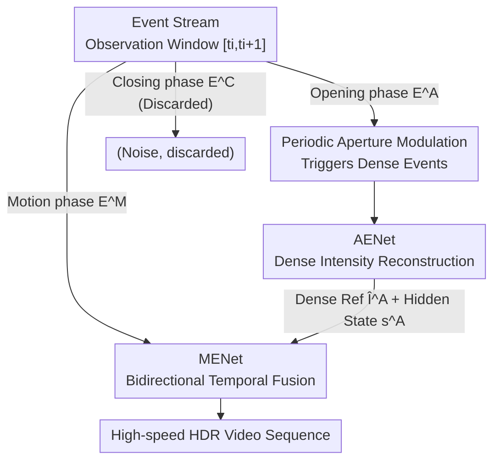

# AE2VID: Event-based Video Reconstruction via Aperture Modulation

**Conference**: CVPR 2026  
**Paper**: [CVF Open Access](https://openaccess.thecvf.com/content/CVPR2026/html/Bai_AE2VID_Event-based_Video_Reconstruction_via_Aperture_Modulation_CVPR_2026_paper.html)  
**Code**: https://github.com/a1henu/AE2VID/ (Available, to be open-sourced)  
**Area**: Image/Video Restoration · Event Camera  
**Keywords**: Event camera, video reconstruction, aperture modulation, bidirectional recurrent network, high dynamic range

## TL;DR
Addressing the pain points where event-based video reconstruction fails in static regions and suffers from error accumulation when relying solely on sparse motion events, this paper actively modulates the aperture periodically. This "passively triggers" dense events even in static regions, allowing for the resolution of dense intensity reference maps. A dual-network architecture (AENet for aperture events and MENet for bidirectional fusion of motion events) is then used to reconstruct high-speed HDR video, achieving a 27.4% reduction in MSE compared to the SOTA on EvAid.

## Background & Motivation
**Background**: Event cameras record log intensity changes with microsecond latency (event-to-video, or E2VID). Mainstream approaches feed event streams into recurrent networks (E2VID, FireNet, V2V-E2VID, BDE2VID) to reconstruct video frames rolling from motion events.

**Limitations of Prior Work**: Motion events are triggered **only at object edges or regions with motion**, making them extremely sparse spatially and providing almost no signal for static backgrounds. This leads to two major issues: first, static regions (background walls, fences) lack events, resulting in blurry reconstructions; second, recurrent networks rolling from a reference time **accumulate errors over time**, causing significant drift far from the reference frame.

**Key Challenge**: Reconstructing video from pure motion events is inherently an ill-posed problem—events only provide the **relative change** $\mathbf{S}(t_0,t)$ of light intensity but lack any **absolute intensity reference** $\mathbb{I}(\mathbf{r},t_0)$. Without a reference, the true brightness of static pixels remains unknown.

**Goal**: Inject "dense absolute intensity references" into the system without additional cameras or reliance on active indoor lighting, while periodically resetting the reference to suppress error accumulation.

**Key Insight**: The aperture is a standard component of almost all imaging systems and is easily controlled. **Actively modulating the aperture diameter** changes the irradiance received by each pixel, thereby "forcing" events even in static regions. Furthermore, the trigger time of the First Positive Event (FPE) when opening the aperture is inversely proportional to the pixel's intrinsic brightness, allowing for the **direct calculation of a dense intensity map**.

**Core Idea**: Use "dense events triggered by aperture modulation" as a complementary signal source to motion events, employing a specialized sub-network to resolve dense intensity references, which are then fused into the recurrent reconstruction of motion events.

## Method

### Overall Architecture
The core of AE2VID consists of **two types of events, two sub-networks, and periodic resets**. The system periodically opens the aperture from a fully closed state and then closes it, with an interval $\tau$. Within each observation window $[t_i, t_{i+1}]$, events are segmented into three periods: the opening phase $[t_i, t_i+\delta t]$ produces **aperture modulation events** $\mathbb{E}^A_i$, the stable middle phase $[t_i+\delta t, t_{i+1}-\delta t]$ produces **motion events** $\mathbb{E}^M_i$, and the closing phase produces $\mathbb{E}^C_i$. The authors found that closing events are noisy and uninformative (due to unknown initial voltage), so $\mathbb{E}^C_i$ is discarded, and only the first two types are used.

Aperture events are fed into **AENet** to resolve dense intensity references $\hat{\mathbb{I}}^A_i$ and hidden states $\mathrm{s}^A_i$. Motion events, along with the references $\hat{\mathbb{I}}^A_i, \hat{\mathbb{I}}^A_{i+1}$ and hidden states from adjacent windows, are fed into **MENet** for bidirectional reconstruction of a $K$-frame sequence $\{\hat{\mathbb{I}}^M_{i,k}\}$ within that window. Re-opening the aperture every $\tau$ effectively "resets the observation window and provides a reliable reference frame" for the recurrent network, suppressing error accumulation at its root.

### Key Designs

**1. Periodic Aperture Modulation: "Planting" Dense Intensity References by Active Opening/Closing**

This design directly addresses the "sparse motion events and lack of signal in static regions" issue. The event trigger condition is based on the log irradiance change exceeding a threshold $C$: $\left|\log\frac{\mathbb{I}(\mathbf{r},t)+I_{\mathrm{dark}}}{\mathbb{I}(\mathbf{r},t-\Delta t)+I_{\mathrm{dark}}}\right|\ge C$. When the aperture opens from fully closed (transmittance $\mathrm{TR}(0)=0$), the pixel irradiance $\mathbb{I}(\mathbf{r},t)=\mathbb{I}_{\max}(\mathbf{r})\cdot\mathrm{TR}(t)$ rises from the dark current level, causing **almost every pixel to trigger at least one positive event**—even in static backgrounds. The key is that the trigger time of the first positive event (FPE), $t^\star(\mathbf{r})$, carries intrinsic brightness information:

$$\mathbb{I}_{\max}(\mathbf{r}) = \frac{(e^{C}-1)\cdot I_{\mathrm{dark}}}{\mathrm{TR}(t^\star(\mathbf{r}))} \propto \frac{1}{\mathrm{TR}(t^\star(\mathbf{r}))}$$

In other words, **pixels where the FPE triggers earlier (at lower transmittance) are brighter**. A dense intensity map can thus be resolved from a single aperture opening, serving as the missing absolute reference $\mathbb{I}(\mathbf{r},t_0)$ in the equation $\mathbb{I}(\mathbf{r},t)=\mathbb{I}(\mathbf{r},t_0)\cdot\exp(\mathbf{S}(t_0,t))$. Compared to adding a frame camera (spatial-temporal alignment errors, high cost) or active lighting (not viable outdoors), modulating the aperture is a "built-in, outdoor-ready, low-cost" dense observation method. The **periodicity** (opening every $\tau$) combats error accumulation: a single opening provides only one reference point, and predictions drift over time; periodic re-opening repeatedly "refreshes" reliable anchors. ⚠️ Events from closing the aperture are explicitly excluded because the initial voltage is unknown, making derivation impossible.

**2. AENet: Purifying Noisy FPE Timing Maps into Dense References and Hidden States**

Although aperture events are dense, the FPE timing matrix is noisy. Direct use as a reference would contaminate downstream tasks. AENet uses three modules: **FIR (FPE-based Intensity Reconstruction)** constructs a timing matrix and resolves the initial intensity map $\hat{\mathbb{I}}^{FIR}_i$; **IDN (Image Denoising)** uses SwinIR (with pre-trained weights from [1]) to denoise the initial map into a clean $\hat{\mathbb{I}}^A_i$ (these weights provide super-resolution effects, which the authors downsample back to original resolution); **HSG (Hidden State Generation)** provides reliable initialization for MENet—it stacks the denoised frame $\hat{\mathbb{I}}^A_i\in\mathbb{R}^{H\times W}$ $b$ times to form a frame volume $V^A_i\in\mathbb{R}^{b\times H\times W}$ homologous to the event voxel, then produces the hidden state $\mathrm{s}^A_i$. To align the HSG hidden state with the MENet feature space, HSG reuses the structure of the MENet ConvLSTM and predicts a pseudo-frame $\hat{\mathbb{I}}^{A'}_i$ constrained by $\ell_1$ loss: $\{\hat{\mathbb{I}}^{A'}_i\},\mathrm{s}^A_i=\mathrm{HSG}(V^A_i)$. Thus, MENet begins with an "aligned dense background prior" rather than starting from zero.

**3. MENet: Bidirectional Recursion + Pixel-wise Mixer for Consistent Video Fusion**

MENet solves how to fuse sparse motion events with AENet's dense references while maintaining long-term temporal consistency. The backbone is based on E2VID's ConvLSTM, but the authors found that unidirectional recursion loses static background fidelity over long ranges. Thus, it is changed to **bidirectional**: running both forward (starting from $\mathrm{s}^A_i$) and backward (starting from $\mathrm{s}^A_{i+1}$, with reversed event voxels $\mathrm{rev}(\cdot)$) recursions within a window to obtain forward candidates $\hat{\mathbb{I}}^{M,\mathrm{fwd}}_{i,k}$ and backward candidates $\hat{\mathbb{I}}^{M,\mathrm{bwd}}_{i,k}$. Finally, a lightweight **pixel-wise mixer** $\mathcal{M}$ fuses the four paths: forward candidate, backward candidate, left reference $\hat{\mathbb{I}}^A_i$, and right reference $\hat{\mathbb{I}}^A_{i+1}$. It predicts softmax weights $\alpha_{i,k}\in[0,1]^{4\times H\times W}$ per pixel:

$$\hat{\mathbb{I}}^M_{i,k}=\alpha^{(0)}_{i,k}\odot\hat{\mathbb{I}}^{M,\mathrm{fwd}}_{i,k}+\alpha^{(1)}_{i,k}\odot\hat{\mathbb{I}}^{M,\mathrm{bwd}}_{i,k}+\alpha^{(2)}_{i,k}\odot\hat{\mathbb{I}}^A_i+\alpha^{(3)}_{i,k}\odot\hat{\mathbb{I}}^A_{i+1}$$

The advantage of pixel-wise weighting is **adaptability**: foreground pixels with intense motion and rich events trust the motion event branches more, while static background pixels trust the dense reference branches.

### Loss & Training
The total loss is defined per window: $\mathcal{L}=\lVert\hat{\mathbb{I}}^{A'}-\hat{\mathbb{I}}^A\rVert_1+\sum_{k}\mathcal{L}^k_{\mathrm{rec}}+\lambda_{\mathrm{TC}}\sum_{k=L_0}^{K}\mathcal{L}^k_{\mathrm{TC}}$. The reconstruction term $\mathcal{L}^k_{\mathrm{rec}}=\lVert\hat{\mathbb{I}}^M_k-\mathbb{I}^M_k\rVert_1+\mathrm{LPIPS}(\hat{\mathbb{I}}^M_k,\mathbb{I}^M_k)$ balances fidelity and perception. The temporal consistency term $\mathcal{L}_{\mathrm{TC}}$ is **only applied to the latter half of frames** ($L_0=10$) to avoid "dirty window" artifacts. Constants are set as $K=20, \lambda_{\mathrm{TC}}=1$. Training is two-stage: first, freeze MENet and fine-tune HSG for 10 epochs (for state alignment), then fine-tune the whole system for 10 epochs using cosine annealing ($10^{-5}\to10^{-7}$). HSG and MENet are initialized with V2V-E2VID weights. Data includes 1000 ESIM-simulated sequences + 500 custom Blender sequences (random foreground motion with MS-COCO textures).

## Key Experimental Results

### Main Results
AE2VID was compared against 7 SOTA methods on semi-realistic datasets EvAid and HQF (competitors used official code/weights and processed only motion events). AE2VID led in most metrics, reducing MSE by **27.4%** on EvAid:

| Dataset | Metric | Ours | Prev. Best | Gain |
|--------|------|------|----------|------|
| EvAid | MSE↓ | **0.037** | 0.051 (ETNet) | −27.4% |
| EvAid | SSIM↑ | **0.707** | 0.642 (V2V-E2VID) | +0.065 |
| EvAid | MS-SSIM↑ | **0.544** | 0.524 (V2V-E2VID) | +0.020 |
| EvAid | LPIPS↓ | 0.411 | **0.409** (V2V-E2VID) | Comparable |
| HQF | MSE↓ | **0.039** | 0.041 (BDE2VID) | Slight lead |
| HQF | SSIM↑ | **0.585** | 0.523 (BDE2VID) | +0.062 |
| HQF | MS-SSIM↑ | **0.503** | 0.477 (BDE2VID) | +0.026 |
| HQF | LPIPS↓ | 0.352 | **0.272** (BDE2VID) | Second to BDE2VID |

The gain on HQF is smaller because it features mostly global motion where dense references yield limited benefits; EvAid contains significant local motion, where dense references excel.

### Ablation Study

| Configuration | Focus | Description |
|------|--------|------|
| Full model | — | AENet + MENet + Bidirectional + 2-stage training |
| Uni vs. Bi pipeline | Temporal Consistency | Without backward recursion, static background fidelity drops significantly over time |
| 2-stage vs. 1-stage | State Alignment | Without pre-aligning HSG, dense references do not match MENet feature space |
| AENet structure | Reference Quality | Removing IDN causes FPE noise to contaminate reference frames |

### Key Findings
- **Aperture control has a "sweet spot"**: If final diameter $A_E$ is too large or opening speed $v_A$ too slow, the opening phase drags on, harming motion cues. If $A_E$ is too small, some pixels fail to trigger FPE; if $v_A$ is too fast, the sensor's event rate limit is exceeded. Best results: $A_E=$ 1/4 max diameter, $\delta t\approx0.13$ s, $\tau-2\delta t=5$ s.
- **Gains depend on scene motion type**: Scenes dominated by local motion (EvAid) benefit most.
- **Closing events are useless**: Empirically, $\mathbb{E}^C$ contains neither dense intensity nor motion cues; discarding them and using interpolation yields cleaner results.

## Highlights & Insights
- **Turning "passive hardware" into an "active information encoder"**: The aperture, typically for exposure control, is used to "plant" dense events in static regions—solving the dense observation constraint with the cheapest available component.
- **The FPE time ↔ pixel brightness inverse relationship** is clever: The physical process of opening the aperture naturally encodes "brightness" into the "timestamp of the first event," providing an absolute intensity map for free.
- **Pixel-wise four-path softmax mixer** is a transferable fusion trick: When multiple complementary sources exist, allowing the network to learn weights per pixel is more robust than fixed weighting or single-branch approaches.
- **Periodic reset to combat error accumulation**: This concept can be generalized to any long-range recurrent reconstruction task—periodically injecting a reliable anchor is more fundamental than simply increasing model capacity.

## Limitations & Future Work
- **Hardware parameters are fixed per segment**: The current prototype sets a fixed $A_E, v_A, \tau$ per capture, preventing dynamic adjustment based on lighting or motion speed.
- **Degradation in extreme scenes**: Quality drops under ultra-high-speed motion or extremely low light.
- ⚠️ **Semi-realistic evaluation**: EvAid/HQF only contain motion events; the aperture opening frames $\hat{\mathbb{I}}^{FIR}$ are **synthesized** based on degradation models from [1]. While qualitative results on real AMED data are provided, quantitative gains should be viewed with this in mind.
- **Dependency on external pre-training**: Relies on SwinIR and V2V-E2VID weights; the effect of training from scratch is not fully explored.

## Related Work & Insights
- **vs. Motion-only methods (E2VID, BDE2VID, etc.)**: These rely on sparse events; AE2VID introduces aperture-modulated dense events as absolute references to fix static backgrounds and drift.
- **vs. Multi-camera solutions**: Frame cameras have alignment errors and higher costs; aperture modulation provides dense observations on the same sensor, avoiding alignment issues.
- **vs. Active illumination (Chen et al.)**: Active lighting is limited to indoor controlled environments; aperture modulation works outdoors.
- **vs. Static aperture imaging (Bao et al.)**: They also use FPE for dense reconstruction but **only for static scenes**; AE2VID integrates this into a video pipeline with bidirectional fusion for dynamic content.

## Rating
- Novelty: ⭐⭐⭐⭐⭐ First to introduce active aperture modulation for event video reconstruction.
- Experimental Thoroughness: ⭐⭐⭐⭐ Good semi-realistic quantification and real-world qualitative analysis, though core ablations are in the supplement.
- Writing Quality: ⭐⭐⭐⭐⭐ Clear logic from physical derivation to network design.
- Value: ⭐⭐⭐⭐ Provides a new sensing paradigm and the AMED dataset; highly practical for the event vision community.

<!-- RELATED:START -->

## Related Papers

- [\[CVPR 2026\] Time-Specialized Event-Image Alignment for Blur-to-Video Decomposition](time-specialized_event-image_alignment_for_blur-to-video_decomposition.md)
- [\[CVPR 2026\] LRHDR: Learning Representation-enhanced HDR Video Reconstruction](lrhdr_learning_representation-enhanced_hdr_video_reconstruction.md)
- [\[CVPR 2026\] One-Shot Flow, Any-Time Frame: A Bidirectional Warping Framework for Event-Based Video Frame Interpolation](one-shot_flow_any-time_frame_a_bidirectional_warping_framework_for_event-based_v.md)
- [\[CVPR 2026\] From Events to Clarity: The Event-Guided Diffusion Framework for Dehazing](from_events_to_clarity_the_event-guided_diffusion_framework_for_dehazing.md)
- [\[CVPR 2026\] Event-Based Motion Deblurring Using Task-Oriented 3D Gaussian Event Representations](event-based_motion_deblurring_using_task-oriented_3d_gaussian_event_representati.md)

<!-- RELATED:END -->
