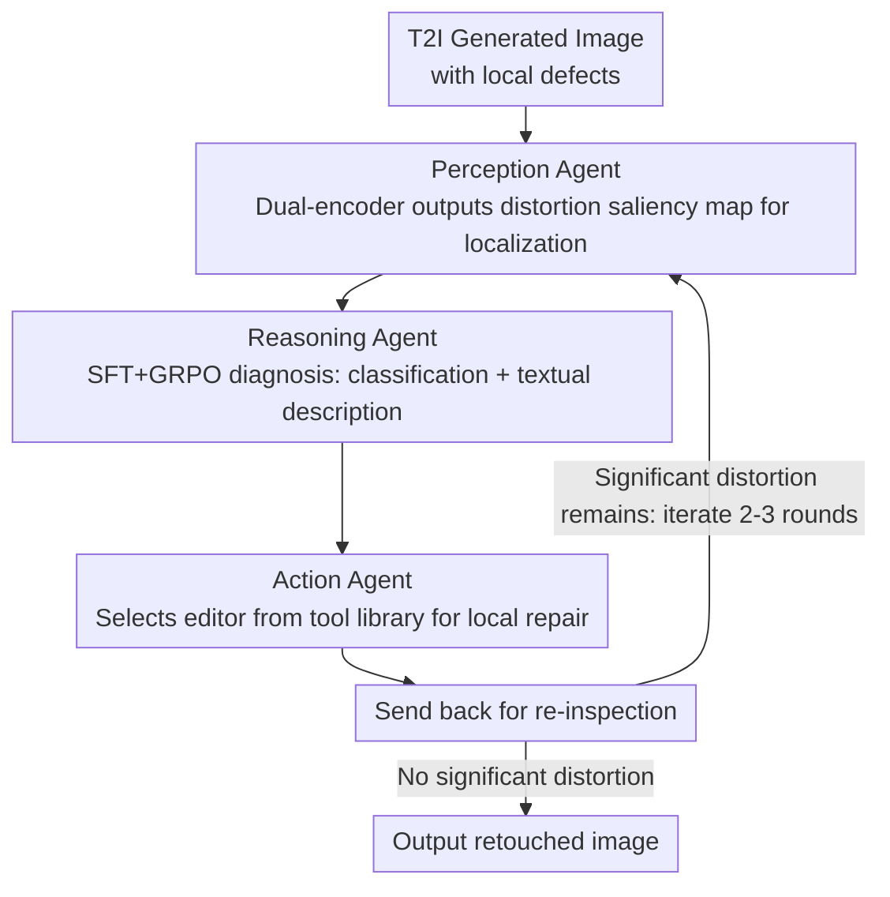

# Agentic Retoucher for Text-To-Image Generation

**Conference**: CVPR 2026  
**arXiv**: [2601.02046](https://arxiv.org/abs/2601.02046)  
**Code**: None  
**Area**: Image Generation / Agent / Image Quality Assessment  
**Keywords**: T2I Post-processing, Perception-Reasoning-Action Loop, Distortion Detection, Local Inpainting, GenBlemish-27K  

## TL;DR
Agentic Retoucher reformulates defect repair after T2I generation into a human-like "Perception $\rightarrow$ Reasoning $\rightarrow$ Action" closed-loop decision process. Utilizing three collaborative agents for context-aware distortion detection, human-aligned diagnostic reasoning, and adaptive local repair, it improves plausibility by 2.89 points on GenBlemish-27K, with 83.2% of results rated by humans as superior to the original images.

## Background & Motivation
While T2I diffusion models (SDXL, FLUX, etc.) generate high-quality images, local distortions—such as deformed fingers, facial asymmetry, unreadable text, and misaligned limbs—remain frequent. Existing repair solutions either require expensive full-image regeneration or rely on VLMs for automated assessment. However, current VLMs exhibit weak spatial localization (e.g., misjudging images with six fingers as normal). An automated system capable of **autonomous discovery $\rightarrow$ diagnosis $\rightarrow$ repair** of local defects is currently lacking.

## Core Problem
How to empower T2I models with autonomous perception and repair capabilities for generation defects? How to address the unreliability of VLMs in fine-grained defect detection (false judgments caused by hallucinations)?

## Method

### Overall Architecture

Agentic Retoucher addresses local defects in T2I generated images (deformed fingers, asymmetric faces, unreadable text, misaligned limbs). Existing solutions are either too costly (full regeneration) or rely on VLMs with weak spatial localization. It reformulates the repair process as a human-like "Perception $\rightarrow$ Reasoning $\rightarrow$ Action" closed loop: the Perception Agent generates a distortion saliency map to localize problematic areas; the Reasoning Agent performs diagnostic reasoning on the localized regions (classification + textual description); the Action Agent selects appropriate editing tools from a library for local repair; after repair, the image is sent back to the Perception Agent for re-inspection, iterating 2-3 rounds until no significant distortions remain.

### Key Designs

**1. Context-aware Perception Agent: Defect Localization via Saliency Maps**

General VLMs struggle to accurately localize defects. Consequently, a specialized detector is required as the first step. The Perception Agent employs a dual-encoder (ViT for images + T5 for prompts) to fuse visual and textual features via self-attention, outputting a distortion saliency map $S \in [0,1]^{H \times W}$. Training uses a hybrid loss $\mathcal{L}_{sal} = \alpha \mathcal{L}_{MSE} + (1-\alpha) \mathcal{L}_{KLD}$, where the KLD term aligns the predicted distribution with human fixation patterns. This allows it to outperform traditional saliency models and general VLMs by over 10 percentage points on AUC-Judd, ensuring reliable localization.

**2. Human-aligned Reasoning Agent: Two-stage Training to Suppress Hallucination**

After localization, the system must determine the type of defect, a step where VLMs are highly prone to hallucination. The Reasoning Agent is based on Qwen2.5-VL-7B with LoRA fine-tuning, involving two stages: first, SFT (LoRA rank=64) to establish a structured output format and distortion classification capability; second, GRPO for preference alignment to reduce hallucinations. Both stages are essential—ablation studies show that using GRPO without SFT results in an accuracy of only 58.97%, while SFT+GRPO achieves a classification accuracy of 80.10% (compared to GPT-5's zero-shot accuracy of 61.31%), with a SimCSE score of 0.8517 for semantic description.

**3. Adaptive Action Agent: Decoupled from Specific Repair Tools**

Following diagnosis, the Action Agent decides how to perform the repair. It selects from a modular tool library based on the reasoning results—options include VLM-based tools like Qwen-Edit and Gemini 2.5 Flash Image, or Mask-based tools like Flux-Fill and SD-inpainting. It determines the spatial scope and instructions for the repair before closing the loop with a re-inspection. Tools are plug-and-play; ablation experiments indicate improvements regardless of the specific tool used with the framework, demonstrating that effectiveness stems from the framework architecture rather than a specific editor.

### A Complete Example: Repairing a Six-fingered Hand

Given an image generated by SDXL featuring an extra finger: the Perception Agent first highlights the hand region in the saliency map, localizing the deformity. The Reasoning Agent analyzes this region, classifies it as "finger deformity," and provides a textual description. Based on this, the Action Agent selects the Mask-based Flux-Fill to locally inpaint the hand, removing the extra finger according to the description. The repaired image is then returned to the Perception Agent for re-inspection. If residues remain, it enters the next round, iterating 2-3 times until it converges to a state with no significant distortion. This "Perception $\rightarrow$ Reasoning $\rightarrow$ Action $\rightarrow$ Re-perception" process distinguishes it from one-off repair methods—it can recognize and correct its own incomplete repairs.

### Loss & Training
- Perception Agent: MSE + KLD hybrid loss.
- Reasoning Agent: SFT (Cross-Entropy) + GRPO (Preference Optimization, with rewards based on classification accuracy and text alignment).

## Key Experimental Results

| Dataset | Condition | Plausibility | Aesthetics | Alignment | Overall |
|--------|------|------|----------|------|------|
| GenBlemish-27K | Original | 44.21 | 53.69 | 57.89 | 47.15 |
| GenBlemish-27K | Ours w/ Qwen-Edit | **47.10** | **55.75** | **59.54** | **49.27** |
| SynArtifacts-1K | Ours w/ Gemini Flash | 65.96 | 65.27 | 62.94 | **58.43** |

Human Evaluation: 83.2% of the refined results were judged superior to the original (48.8% significantly better + 34.4% slightly better).

### Ablation Study
- **Perception Agent**: Removing the attention mechanism reduces SIM and CC; removing the KLD loss reduces NSS and AUC-Judd.
- **Reasoning Agent**: GRPO only (without SFT) performs poorly (58.97% accuracy); SFT+GRPO is optimal (80.10%).
- **Tool Selection**: All tools (Qwen-Edit, Gemini, Flux-Fill, SD-inpainting) show improvements when paired with Agentic Retoucher, confirming the framework is tool-agnostic.
- **GPT-5 and Gemini 2.5 Pro Zero-Shot**: Achieved only 61.31%/60.28% in distortion reasoning, indicating that general VLMs are not proficient at this task.

## Highlights & Insights
- First to model T2I post-processing repair as a "Perception-Reasoning-Action" closed-loop agent system rather than a simple one-off fix.
- The GenBlemish-27K dataset provides 27K pixel-level annotated distortion regions covering 12 defect categories, making it the first large-scale T2I defect annotation dataset.
- Experiments prove that VLMs (including GPT-5) cannot reliably detect distortions in AI-generated images in zero-shot settings—a significant finding.
- The framework is decoupled from specific repair tools, allowing for the plug-and-play use of different editing models.

## Limitations & Future Work
- Iterative repair introduces additional computational overhead (2-3 rounds of inference).
- Current repair tools are predefined and cannot learn new repair strategies.
- Primarily targets local geometric distortions (fingers, faces), with weaker coverage of style inconsistencies or global semantic errors.
- Hand distortions account for 46.8% of GenBlemish-27K, indicating a skewed data distribution.

## Related Work & Insights
- **vs RichHF**: RichHF focuses on evaluation without repair and over-concentrates on facial/limb regions. Agentic Retoucher performs both evaluation and closed-loop repair.
- **vs AgenticIR/JarvisArt**: These are general image restoration/editing agents. Agentic Retoucher is specifically designed for unique defect types in AI-generated images.
- **vs Imagic/Step1x-Edit**: These require manual masks or editing instructions. Agentic Retoucher automates both localization and repair.

## Insights & Related Concepts
- The "Perception-Reasoning-Action" closed-loop paradigm provides inspiration for other generative tasks requiring automated quality control (e.g., video or 3D generation).
- The distortion classification system in GenBlemish-27K (12 categories across 6 dimensions) can serve as a standardized tool for evaluating T2I model quality.
- The failure cases of VLMs in fine-grained spatial localization warrant attention—specialized spatial understanding training may be required.

## Rating
- Novelty: ⭐⭐⭐⭐ Applying an agent system to T2I post-processing is a new perspective, though individual components (saliency detection, VLM reasoning, inpainting) are established.
- Experimental Thoroughness: ⭐⭐⭐⭐ Two datasets + multiple repair tools + ablations + human evaluation, though comparison with end-to-end repair methods is missing.
- Writing Quality: ⭐⭐⭐⭐ Clear structure with high-quality figures.
- Value: ⭐⭐⭐⭐ Fills a gap in automated T2I quality repair; the GenBlemish-27K dataset holds independent value.

<!-- RELATED:START -->

## Related Papers

- [\[CVPR 2026\] OctoT2I: A Self-Evolving Agentic Text-to-Image Router](octot2i_a_self-evolving_agentic_text-to-image_router.md)
- [\[CVPR 2026\] Vinedresser3D: Agentic Text-guided 3D Editing](vinedresser3d_agentic_text-guided_3d_editing.md)
- [\[ICML 2026\] AtelierEval: Agentic Evaluation of Humans & LLMs as Text-to-Image Prompters](../../ICML2026/image_generation/ateliereval_agentic_evaluation_of_humans_llms_as_text-to-image_prompters.md)
- [\[CVPR 2026\] Resolving the Identity Crisis in Text-to-Image Generation](resolving_the_identity_crisis_in_text-to-image_generation.md)
- [\[CVPR 2026\] GenColorBench: A Color Evaluation Benchmark for Text-to-Image Generation](gencolorbench_a_color_evaluation_benchmark_for_text-to-image_generation.md)

<!-- RELATED:END -->
