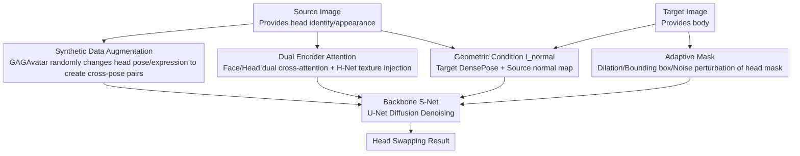

# AHS: Adaptive Head Synthesis via Synthetic Data Augmentations

**Conference**: CVPR 2026  
**arXiv**: [2604.15857](https://arxiv.org/abs/2604.15857)  
**Code**: None  
**Area**: Image Generation  
**Keywords**: Head Swapping, Data Augmentation, Head Reenactment, Diffusion Models, Facial Synthesis

## TL;DR

AHS overcomes the limitations of self-supervised training by utilizing a head reenactment model (GAGAvatar) to generate synthetic augmented data. Combined with a dual-encoder attention mechanism and an adaptive mask strategy, it achieves SOTA performance in head swapping tasks for full-body images.

## Background & Motivation

**Background**: Head swapping aims to seamlessly integrate a source head onto a target body while reenacting the target's head orientation and expression. This task holds significant value in fashion design, virtual character customization, and digital marketing.

**Limitations of Prior Work**: Existing methods face three core issues: (1) most methods are trained only on face-cropped data, limiting them to frontal perspectives and failing to handle diverse head orientations; (2) the lack of ground truth data forces reliance on self-supervised training, leading to poor generalization across variations in expression and head pose; (3) the high variability of hair length and style requires the model to consider a broader spatial range, which is much more challenging than face swapping.

**Key Challenge**: Self-supervised training (self-reconstruction) ensures the model only observes source and target images with identical poses, preventing it from learning the ability to swap heads across different poses and expressions. Furthermore, the head size and hairstyle of the source and target can differ significantly.

**Goal**: Design a zero-shot head swapping method capable of effectively handling diverse head orientations, expressions, and hairstyles in full-body images.

**Key Insight**: Utilize an animatable head avatar model to generate synthetic data with varying head orientations and expressions as training augmentations to break the constraints of self-supervised training.

**Core Idea**: Use GAGAvatar to generate synthetic augmented data for head reenactment, allowing the model to encounter cross-pose/cross-expression head swapping scenarios during training, thereby enhancing zero-shot generalization.

## Method

### Overall Architecture

AHS addresses the task of "replacing the target body's head with the source head while making the head follow the target's orientation and expression." The difficulty lies in the absence of paired training data and the frequent discrepancies between source and target poses or hairstyles. The entire workflow is integrated into a diffusion model: the backbone U-Net (S-Net) is responsible for generating the final image, a parallel reference network (H-Net) extracts low-level details like hair strands and accessories from the source head, and two cross-attention paths (Face Encoder and Head Encoder) inject the identity information of the source head. Geometric guidance is provided by a composite condition map $I_{normal}$—it concatenates the DensePose map of the target body with the normal map of the source head; the former dictates "where the body is and what orientation the head should take," while the latter defines "what the 3D shape of the head looks like." The key to training lies not in the network architecture itself, but in two data handling techniques: using GAGAvatar to offline synthesize cross-pose/cross-expression training pairs and applying adaptive perturbations to the head masks.

### Key Designs

**1. Synthetic Data Augmentation: Creating cross-pose pairs that self-supervision cannot provide using a head reenactment model**

Head swapping naturally lacks ground truth—it is impossible to obtain a real image of "one person's head on another person's body." Consequently, the field typically relies on self-reconstruction (cropping a head and pasting it back), but models trained this way only learn to "copy" the head in the same pose, failing when source and target poses differ. AHS breaks this by employing GAGAvatar, an animatable head avatar model: for each training image, it randomly alters the head orientation and facial expression while preserving identity to generate a synthetic version of "the same person in a different pose/expression." By pairing the original and augmented images during training, the model is forced to learn how to "reenact the head from Pose A to Pose B before pasting," rather than simply memorizing and copying. This is the most critical component—removing it causes the model to revert to self-reconstruction, zeroing out its cross-pose capabilities.

**2. Dual Encoder Attention: High-level identity and low-level appearance injected via separate paths**

Head swapping must maintain two levels: high-level "who it is" (face shape, facial identity) and low-level "what the head looks like" (hair flow, glasses, skin tone). Relying on a single encoder often leads to one aspect being compromised for the other. AHS utilizes three parallel injection paths: the Face Encoder follows the PhotoMaker approach, fusing facial features with text embeddings and injecting them into S-Net via cross-attention for high-level semantic identity; the Head Encoder follows the IP-Adapter approach, injecting head embeddings via an additional set of cross-attention layers; and H-Net injects low-level texture details directly into the backbone through self-attention key-value concatenation. The two cross-attention paths are summed in S-Net:

$$\text{Attention}(Q, K_f, V_f) + \text{Attention}(Q, K_h, V_h)$$

where subscripts $f$ and $h$ correspond to the Face and Head paths, respectively. This division of labor also accelerates convergence, compensating for H-Net's lack of specialized pre-training.

**3. Adaptive Mask: Preventing the model from "cheating" by guessing head size from mask contours**

If the model is always fed perfect segmented head masks during training, it learns to be "lazy"—simply following the mask contour to determine head size and hairstyle. Consequently, if the source and target head sizes or hair volumes differ significantly, unnatural artifacts appear (e.g., if the target has long hair and the source has short hair, the model might force the head into the long hair contour). AHS replaces these masks with various variants during training: dilated masks, enlarged bounding box masks, or masks merged with random noise. Once the mask shape becomes unreliable, the model must instead infer the correct target head size and shape from the source image and $I_{normal}$ condition, eliminating artifacts.

### Loss & Training

The training objective is the standard diffusion denoising loss without additional auxiliary losses. The input to S-Net consists of four concatenated parts: the VAE encoding of the target image, the target encoding with the head masked out, the head mask itself, and the normal map condition. GAGAvatar augmentations are generated once offline before training begins and do not enter the online training loop.

## Key Experimental Results

### Main Results

Quantitative and qualitative evaluations demonstrate that AHS outperforms baseline methods in several aspects:

| Aspect | AHS Performance |
|------|---------|
| Identity Preservation | Significantly better than HID and other baselines |
| Expression Reenactment | Accurately transfers target expressions |
| Accessory Retention | Maintains glasses and accessories even under large pose changes |
| Hair Naturalness | Natural integration of long, short, and complex hairstyles |

### Ablation Study

| Configuration | Effect |
|------|------|
| Full AHS | Best Identity Preservation + Expression Reenactment |
| w/o Synthetic Augmentation | Unable to handle cross-pose swapping; pose mismatch occurs |
| w/o Adaptive Mask | Artifacts appear when source/target head sizes differ significantly |
| w/o H-Net | Loss of low-level details (hair strands, accessories) |

### Key Findings

- Synthetic data augmentation is the most critical component; without it, the model degrades to self-reconstruction and loses cross-pose capability.
- The dual-encoder cross-attention design accelerates convergence and compensates for the lack of specialized H-Net training.
- A simple combination of Normal maps and DensePose maps provides sufficient geometric guidance without the need for complex 3D modeling.
- AHS exhibits strong robustness in scenarios involving extreme expression changes and large head rotations.

## Highlights & Insights

- **Synthetic augmentation breaks self-supervision bottlenecks**: Using an existing head reenactment model to generate training data is a concise and elegant solution. This approach can be transferred to other image editing tasks that lack paired data.
- **Normal map as a conditional signal**: Compared to pure DensePose, adding normal maps extracted via EMOCA provides explicit 3D geometric information, which is simple but effective.
- **Advantages of a unified framework**: Unifying head reenactment and blending within a single diffusion model avoids the error accumulation typical of two-stage pipelines.

## Limitations & Future Work

- Dependence on the quality of GAGAvatar augmentations; artifacts in the reenactment model may affect training.
- Normal maps depend on the quality of EMOCA’s 3D face reconstruction, which may be inaccurate for extreme profiles.
- Lack of standardized quantitative evaluation benchmarks, relying primarily on user studies and qualitative comparisons.
- Temporal consistency for video scenarios has not yet been explored.

## Related Work & Insights

- **vs HID**: HID injects hairstyle and face ID via text embeddings, but the lack of feature-level injection leads to artifacts; AHS is more precise using feature-level dual-encoder injection.
- **vs Face Swapping**: Face swapping only operates on the facial region, ignoring hairstyles and head orientation; AHS processes the full head region, which is more practical.
- **vs Few-shot methods**: Few-shot methods require video data preprocessing and typically involve two independent models; AHS is a zero-shot, single-model solution.

## Rating

- Novelty: ⭐⭐⭐⭐ The synthetic augmentation strategy is simple and effective, offering a practical solution to break the self-supervised training bottleneck.
- Experimental Thoroughness: ⭐⭐⭐ Lacks standardized quantitative metrics, relying heavily on qualitative comparisons.
- Writing Quality: ⭐⭐⭐⭐ Problems are clearly defined, and methodology is detailed.
- Value: ⭐⭐⭐⭐ An effective solution for head swapping tasks; the synthetic augmentation concept is widely applicable.

<!-- RELATED:START -->

## Related Papers

- [\[CVPR 2026\] ChimeraLoRA: Multi-Head LoRA-Guided Synthetic Datasets](chimeralora_multi-head_lora-guided_synthetic_datasets.md)
- [\[CVPR 2026\] OntoAug: Rethinking Generative Data Augmentation via Ontology Guidance](ontoaug_rethinking_generative_data_augmentation_via_ontology_guidance.md)
- [\[CVPR 2026\] DynaVid: Learning to Generate Highly Dynamic Videos using Synthetic Motion Data](dynavid_learning_to_generate_highly_dynamic_videos_using_synthetic_motion_data.md)
- [\[CVPR 2026\] Beyond Objects: Contextual Synthetic Data Generation for Fine-Grained Classification](beyond_objects_contextual_synthetic_data_generation_for_fine-grained_classificat.md)
- [\[AAAI 2026\] Backdoors in Conditional Diffusion: Threats to Responsible Synthetic Data Pipelines](../../AAAI2026/image_generation/backdoors_in_conditional_diffusion_threats_to_responsible_synthetic_data_pipelin.md)

<!-- RELATED:END -->
