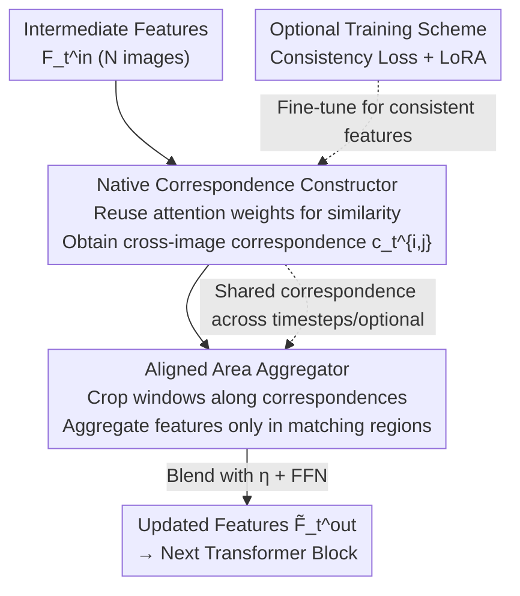

# Align Images Before You Generate

**Conference**: CVPR 2026  
**Paper**: [CVF Open Access](https://openaccess.thecvf.com/content/CVPR2026/html/Zhang_Align_Images_Before_You_Generate_CVPR_2026_paper.html)  
**Code**: https://github.com/SuhZhang/CorrAdapter  
**Area**: Diffusion Models  
**Keywords**: Multi-image Diffusion, Spatio-temporal Consistency, Native Correspondence, Plug-and-play Adapter, Multi-view Generation  

## TL;DR
The authors discover that the intermediate noisy features of multi-image diffusion models "natively" encode cross-image correspondences. Consequently, they propose CorrAdapter—a training-free, plug-and-play bypass branch that requires no external geometric or semantic priors. It utilizes these native correspondences to align matching regions before the images are fully generated, significantly enhancing spatio-temporal consistency in multi-view and video generation.

## Background & Motivation
**Background**: Multi-image diffusion models jointly denoise multiple images in a single inference pass to generate multi-view (static scenes) or video frames (dynamic scenes). They typically exchange information across all images via cross-image transformers at each timestep, aiming to produce mutually consistent results.

**Limitations of Prior Work**: Despite large-scale training, these models still suffer from noticeable texture and structural drift—especially with large viewpoint or temporal spans—which breaks spatio-temporal consistency. To eliminate inconsistency, it is fundamentally necessary to align corresponding regions across different images based on semantic and structural similarity. However, since all images are generated from pure Gaussian noise, geometric or semantic priors (such as depth maps or segmentation masks) are unavailable during inference to explicitly identify and constrain cross-image correspondences.

**Key Challenge**: This represents a classic "chicken-and-egg" problem: image alignment requires correspondences, but correspondences typically require generated images or explicit priors to be calculated. Existing methods either rely on cross-image transformers to learn this implicitly (weak guidance, still drifts), introduce hard geometric/epipolar/depth constraints (limited to static scenes and require known image/depth inputs), or use optical flow matching (limited to dynamic scenes and require video/keyframe inputs). None serve as a universal consistency enhancer that handles both static and dynamic scenes without extra inputs.

**Key Insight & Core Idea**: The authors hypothesize and verify that multi-image diffusion models implicitly learn meaningful cross-image correspondences within their intermediate noisy features. Even before image synthesis begins, the intermediate feature space exhibits structural alignment between semantically/geometrically similar regions. Thus, these "diffusion-native correspondences" can be extracted **from the model itself** and used as matching priors to strengthen information exchange between matching regions, aligning them before the images are actually generated.

## Method
CorrAdapter aims to add a bypass branch to multi-image diffusion models to improve spatio-temporal consistency. It consists of two core steps: ① **Constructing correspondences** from the diffusion model's own intermediate features, and ② **Modulating cross-image interaction** based on these correspondences by aggregating only in matching regions and suppressing irrelevant ones. These correspond to two modules: the Native Correspondence Constructor and the Aligned Area Aggregator. The adapter is juxtaposed with the original transformer block, and its output is added back to the original output, making it a training-free and backbone-agnostic plug-and-play structure. An optional training scheme is also provided to further raise the performance ceiling.

### Overall Architecture
The input consists of latent features $Z_t$ at timestep $t$ compressed by a transformer block, represented as $F_t^{\text{in}}=\{f_t^{\text{in},i}\}_{i=1}^N$ (for $N$ images). The output is the updated $\tilde F_t^{\text{out}}$ used as input for the next block. CorrAdapter is injected into the transformer block that **models multi-image interaction at the highest resolution**, reusing the original $Q, K, V$ from the attention mechanism. It first establishes correspondences between all image pairs and then performs aggregation within aligned regions. The aggregated result is blended into the original output with a coefficient $\eta$.

### Key Designs

**1. Native Correspondence Constructor: Using Attention Weights as Matching Priors**

The pain point is the lack of explicit geometric/semantic priors for finding correspondences in pure generation scenarios. The key observation is that transformer attention aggregates information using $\hat F_t^{\text{out}}=\text{Softmax}(Q_t K_t^T/\sqrt D)V_t$ (Eq. 6). The attention weights after Softmax reflect the similarity between intermediate features. Consequently, these weights natively describe cross-image correspondences. For an image pair $(i,j),\,i\neq j$, the similarity score is calculated as $s_t^{i,j}=\text{Softmax}\!\big(q_t^i {k_t^j}^T/\sqrt D\big)$ (Eq. 8). Traditional image matching (Nearest Neighbor $c_t^{i,j}=\arg\max_l s_t^{i,j}[:,l]$, Eq. 9) is then used to find the corresponding index in the other image for each position. Stacking these yields $C_t\in\mathbb{R}^{N\times(N-1)\times H\times W}$. This approach reuses attention weights already calculated in Eq. 6, obtaining correspondences with near-zero extra computation. In practice, matching with a threshold of 0.05 is used instead of naive NN to improve reliability.

**2. Aligned Area Aggregator: Aggregating in Matching Windows**

Given correspondences, the natural approach is to strengthen information exchange between corresponding features. However, global attention involves non-matching regions, introducing ambiguity. The aggregator identifies each position $k$ in image $i$ and crops a $(2r+1)\times(2r+1)$ local window of radius $r$ around the corresponding index $c_t^{i,j}[k]$ in image $j$. Weighted summation is performed only within this aligned window: $\hat f_t^i[k]=\text{Softmax}\!\big(q_t^i[k]\,{k_{t,\text{crop-}k}^j}^T/\sqrt D\big)\,v_{t,\text{crop-}k}^j$ (Eq. 11). These weights are precisely the attention weights for the cropped query/key, again reusing Eq. 6. After aggregating all positions to get $\hat F_t$, it is blended with the original output using hyperparameter $\eta$: $\check F_t^{\text{out}}=\eta\hat F_t^{\text{out}}+(1-\eta)\hat F_t$ (Eq. 12), followed by an FFN to obtain $\tilde F_t^{\text{out}}=\check F_t^{\text{out}}+\text{FFN}(F_t^{\text{in}}\Vert\check F_t^{\text{out}})$ (Eq. 13). This forces the model to focus on matching regions and suppress non-matching ones, aligning texture and structure across images. Setting $\eta=0.1$ is default, while $\eta=0.8$ (stronger constraint) and $r=3$ are used for text-to-multi-view.

**3. Training-free Injection & Inference Tricks**

CorrAdapter is connected as a bypass branch to existing transformer blocks. All learnable parameters are initialized with weights of the same name from the injected block and frozen during inference, allowing it to be attached to various backbones without training. For general applicability, several engineering tricks are employed: injection is prioritized in transformer blocks that **model multi-image interaction** to reuse attention weights; correspondences are constructed only at the **highest resolution layer** for fine-grained matching; and **correspondences are shared** across adjacent timesteps to reduce computation (e.g., in SyncDreamer, which lacks multi-view transformers, correspondences are updated every 5 steps). To preserve diversity, CorrAdapter is applied only during the initial timesteps for text-conditional generation (first 10 steps for Table 2, first 15 for video), while it is applied throughout for image-conditional tasks.

**4. Optional Two-stage Training Scheme**

The training-free version depends on the quality of correspondences in existing features. For higher performance, the authors add a consistency loss $\mathcal{L}_{\text{consistency}}=\sum_{(i,j),i\neq j}\big\Vert f_t^{\text{in},i}[k]-f_t^{\text{in},j}[\dot c^{i,j}[k]]\big\Vert^2$ (Eq. 14), where $\dot c^{i,j}$ are reference correspondences extracted from ground-truth image pairs using LoFTR. The total loss is $\mathcal{L}=\mathcal{L}_{\text{diffusion}}+\lambda\mathcal{L}_{\text{consistency}}$ (Eq. 15, $\lambda=0.1$). A key finding is that **order matters**: first fine-tune the original model with LoRA using only the consistency loss to make intermediate features more consistent, **then add the CorrAdapter structure**. Training the matching/cropping modules end-to-end with the consistency loss disrupts gradient backpropagation and yields poor convergence (PSNR only 23.65 in ablations, worse than the training-free version). Since this requires "inherently consistent" ground truth, it is suitable for image-to-multi-view tasks. For diverse output tasks, "LoRA Transfer" is used—moving LoRA modules learned on suitable tasks to models with the same architecture.

### Loss & Training
- Training-free version: No training required; bypass parameters are frozen.
- Optional training version: First fine-tune the diffusion model with LoRA using $\mathcal{L}_{\text{consistency}}$ (1 epoch, 4×RTX 6000 + DeepSpeed, ~1 day), then stack CorrAdapter. Supervision is provided by LoFTR, $\lambda=0.1$.

## Key Experimental Results

### Main Results
Evaluation covers static (multi-view generation, image-conditioned GSO 100 / text-conditioned Objaverse 1000 prompt) and dynamic (video generation, VBench 10 dimensions) tasks. ⋆ denotes the use of the optional training scheme. 3D consistency metrics are from MVGBench (cPSNR/cSSIM/cLPIPS/CD/depth) + MEt3R.

| Task/Baseline | Single Image Quality | Geometric Consistency (Key) | Note |
|------|------|------|------|
| SyncDreamer (Img-MV) | PSNR 19.24 | cPSNR 26.28 / CD 2.66 / MEt3R 0.1656 | baseline |
| +CorrAdapter | PSNR 19.72 | cPSNR 27.20 / CD 2.67 / MEt3R 0.1529 | general improvement |
| MVAdapter (Img-MV) | PSNR 23.15 | cPSNR 18.75 / depth 73.47 / MEt3R 0.2116 | baseline |
| +CorrAdapter | PSNR 23.82 | cPSNR 19.68 / depth 68.62 / MEt3R 0.2036 | training-free gain |
| +CorrAdapter⋆ | PSNR 24.05 | cPSNR 20.47 / depth 67.47 / MEt3R 0.1955 | trained version best |

For text-to-multi-view (MVAdapter): The training-free version improved FID 24.20→23.42 and IS 15.22→15.96. The trained version⋆ showed the most significant geometric gains: cPSNR 14.09→15.27, cLPIPS 0.3513→0.3085, and MEt3R 0.3017→0.2701.

Video Generation (Wan2.1-1.3B, VBench, Training-free):

| Dimension | Wan2.1 | +CorrAdapter | Change |
|------|------|------|------|
| Subject Consistency | 0.9536 | 0.9715 | ↑ Significant improvement |
| Background Consistency | 0.9626 | 0.9696 | ↑ |
| Scene | 0.2202 | 0.2878 | ↑ Better text-video alignment |
| Overall Consistency | 0.2275 | 0.2320 | ↑ |
| Dynamic Degree | 0.5556 | 0.5139 | ↓ Expected side effect of consistency |

### Ablation Study

| Configuration | Key Metrics (Img-MV, PSNR/SSIM/LPIPS) | Note |
|------|------|------|
| Training-free CorrAdapter | 23.82 / 0.8829 / 0.1235 | Full training-free version |
| End-to-end Joint Training | 23.65 / 0.8812 / 0.1248 | Worse than training-free; proves "feature tuning first" is necessary |
| Two-stage Trained ⋆ | 24.05 / 0.8866 / 0.1220 | Correct order yields gain |

Resource Overhead (Table 4, MVAdapter): Time 33.42s→39.83s, Flops 2.71P→2.73P, Params 4.29G→4.30G, Memory 15.27GB→20.86GB—Consistency improves with minimal compute/parameter increase (VRAM rises slightly due to bypass branches).

### Key Findings
- **Native correspondences are reliable**: Matching with native correspondences (5-pixel epipolar threshold) yields accuracy and quantity comparable to SIFT/SuperPoint (e.g., SuperPoint 85.7% vs. Ours 81.5%, but Ours found 97 more correct matches), validating the core hypothesis that matching priors exist internally before image generation.
- **Training order is critical**: One must fine-tune features for consistency before adding the CorrAdapter structure; joint training causes gradient instability in the matching/cropping modules.
- **Dynamic degree drop is an expected trade-off**: Increased consistency in video leads to a drop in Dynamic Degree, but overall video quality improves.

## Highlights & Insights
- **Repurposing Attention Weights as Matching Priors**: The key insight is "Softmax weight = cross-image similarity = correspondence." Reusing $Q/K/V$ already computed in Eq. 6 for both matching and alignment results in zero extra compute for those components—a clever "free" utilization of attention.
- **Timing of Alignment**: Aligning during the intermediate noisy feature stage, before images are denoised, bypasses the chicken-and-egg paradox of needing images for correspondences.
- **Dual-track Design**: Training-free plug-and-play ensures generality, while LoRA transfer brings consistency capabilities from "trainable tasks" to "non-trainable tasks," balancing ease-of-use and performance limits.

## Limitations & Future Work
- The optional training scheme is restricted to tasks where output "should" be consistent (e.g., image-to-multi-view). For diverse tasks, it relies on LoRA transfer, which requires identical network architectures.
- Consistency enhancement comes at the cost of motion (VBench Dynamic Degree 0.5556→0.5139). There is a trade-off between consistency and movement, requiring manual tuning of $\eta$ and active timesteps.
- For backbones lacking multi-view transformers (e.g., SyncDreamer), attention weights cannot be reused, requiring periodic updates (every 5 steps) to avoid computational explosions.

## Related Work & Insights
- **vs. Implicit Cross-image Transformers**: Previous methods rely on data for implicit consistency; they drift in large view/time spans. Ours extracts explicit internal correspondences for strong guidance without retraining.
- **vs. Hard Geometric/Depth Constraints**: Those are limited to static scenes and require known inputs; CorrAdapter handles both static and dynamic scenes without external priors.
- **vs. Optical Flow/Video Editing**: Those focus on editing rather than pure generation; Ours builds correspondences on denoising features for pure synthesis.
- **vs. Single-image Diffusion Correspondence (e.g., DIFT)**: Previous works find correspondences in single images by reconstructing features; this is the first to extract them in multi-image generation to align results.

## Rating
- Novelty: ⭐⭐⭐⭐⭐ "Using native diffusion correspondence for pre-generation alignment" is a clean and previously untapped observation.
- Experimental Thoroughness: ⭐⭐⭐⭐ Covers static/dynamic and image/text conditions, though the trained version is only validated on specific tasks.
- Writing Quality: ⭐⭐⭐⭐ Clear motivation, well-explained logic for weight reuse.
- Value: ⭐⭐⭐⭐⭐ Training-free, plug-and-play, and backbone-agnostic; directly enhances numerous multi-image diffusion downstream tasks.

<!-- RELATED:START -->

## Related Papers

- [\[CVPR 2026\] RewardFlow: Generate Images by Optimizing What You Reward](rewardflow_generate_images_by_optimizing_what_you_reward.md)
- [\[NeurIPS 2025\] Understand Before You Generate: Self-Guided Training for Autoregressive Image Generation](../../NeurIPS2025/image_generation/understand_before_you_generate_self-guided_training_for_autoregressive_image_gen.md)
- [\[CVPR 2026\] One Algorithm to Align Them All](one_algorithm_to_align_them_all.md)
- [\[CVPR 2026\] Re-Align: Structured Reasoning-guided Alignment for In-Context Image Generation and Editing](re-align_structured_reasoning-guided_alignment_for_in-context_image_generation_a.md)
- [\[CVPR 2026\] SimLBR: Learning to Detect Fake Images by Learning to Detect Real Images](simlbr_learning_to_detect_fake_images_by_learning_to_detect_real_images.md)

<!-- RELATED:END -->
