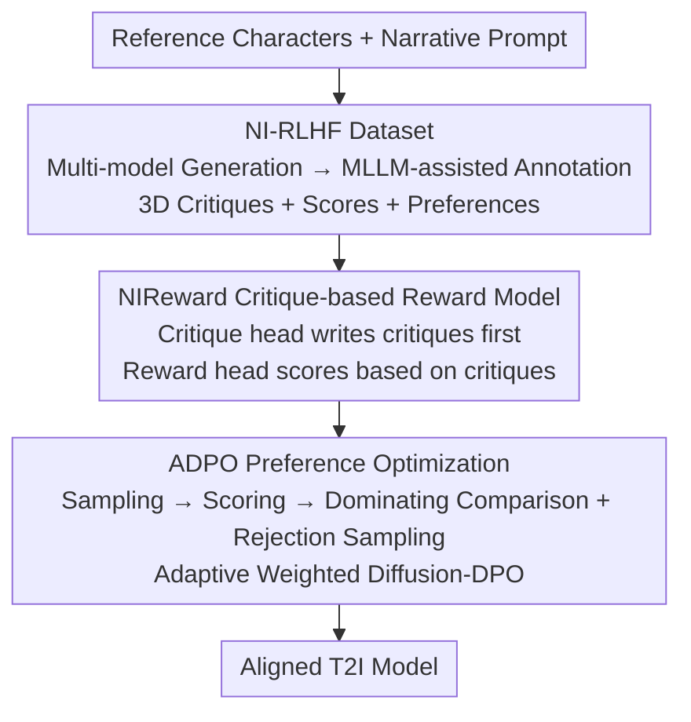

# Aligning Multi-Character Narrative Image Generation with Multi-Aspect Human Preferences

**Conference**: CVPR 2026  
**Paper**: [CVF Open Access](https://openaccess.thecvf.com/content/CVPR2026/html/Gao_Aligning_Multi-Character_Narrative_Image_Generation_with_Multi-Aspect_Human_Preferences_CVPR_2026_paper.html)  
**Code**: Not disclosed  
**Area**: Diffusion Models / Preference Alignment in Multi-Character Narrative Image Generation  
**Keywords**: Narrative Image Generation, Human Preference Alignment, Critique-based Reward Model, DPO, Multi-Character Personalization  

## TL;DR
To address the "semantic misalignment, identity confusion, and visual degradation" issues in multi-character narrative image generation, this paper constructs a fine-grained preference dataset, NI-RLHF, containing textual critiques. It trains an explainable reward model, NIReward, which "generates critiques before scoring," and utilizes it to drive the ADPO preference optimization algorithm. This approach aligns the generative model with human preferences across prompt following, identity consistency, and visual quality dimensions.

## Background & Motivation
**Background**: Narrative image generation aims to generate images containing multiple specific characters based on narrative text. It requires maintaining character identities while depicting interactions, background integration, and style variations for applications like comic visualization and long-video keyframes. Leading adapter-based personalization methods (IP-Adapter-FaceID, PhotoMaker, PuLID, StoryMaker, OMG, etc.) inject ArcFace identity features for fidelity.

**Limitations of Prior Work**: These methods over-emphasize "identity preservation," leading to three specific issues: ① **Copy-paste effect**: Since training data mostly consists of frontal portraits, the model overfits to identity features, resulting in characters that only pose for portraits regardless of the text prompts; ② **Identity confusion**: In multi-character scenes, models fail to explicitly distinguish between characters, leading to identity leakage or incorrect feature inheritance; ③ **Visual degradation**: Issues such as uncoordinated compositions, stiff poses, and anatomical errors in hands and limbs.

**Key Challenge**: The root cause lies not only in the generation side but also in the **evaluation side**. Existing metrics and reward models like CLIP, ArcFace, Aesthetic Score, and ImageReward are severely decoupled from human perception—images with obvious flaws to humans often receive high CLIP or face similarity scores. Direct RLHF using these rewards faces a triple challenge: **distribution shift** from general reward models to narrative scenarios, **non-interpretability** of scalar scores (leading to reward hacking), and **optimization imbalance** under multi-dimensional preferences (optimizing easy-to-quantify dimensions while ignoring subtle ones).

**Goal**: (1) Create a narrative-specific preference dataset with three dimensions and critique explanations; (2) Train an explainable reward model resistant to reward hacking; (3) Design a preference alignment algorithm for balanced optimization across dimensions.

**Key Insight**: Replace opaque scalar rewards with "critique-based rewards" (generating textual critiques before scoring, effectively adding a Chain-of-Thought to reward models). Use ADPO with "dominating comparison + adaptive weighting" instead of standard Diffusion-DPO to ensure simultaneous alignment across all three dimensions.

## Method

### Overall Architecture
The system follows a three-stage pipeline: "Data → Reward Model → Preference Optimization," aiming to align a pre-trained personalized T2I model (PhotoMaker V2) with multi-aspect human preferences.

The first stage constructs the **NI-RLHF Dataset**: Multiple personalized models generate multi-character images, which are then annotated by human experts (assisted by MLLMs) with **textual critiques + numerical scores + pairwise preferences** across prompt following, identity consistency, and visual quality. The second stage trains **NIReward**: An MLLM-based reward model with a "critique head + reward head" that generates a critique before outputting a score. The third stage is **ADPO Preference Optimization**: Multi-dimensional scores from NIReward are used to screen high-quality preference pairs via "dominating comparison + rejection sampling," followed by a "weighted" Diffusion-DPO update for the generative model.

### Key Designs

**1. NI-RLHF: Tri-dimensional Preference Dataset with Explanations**

To align narrative preferences, narrative-specific data is required. Existing datasets (e.g., ImageReward) lack narrative focus and textual explanations. NI-RLHF uses high-quality portraits as references and LLMs to generate narrative prompts involving 1-2 characters with various actions, locations, and styles. Images are generated using PuLID, PhotoMaker, StoryMaker, and OMG, then filtered via CLIP/ArcFace/ImageReward to retain 2-3 images per prompt.

Annotation is the core: Prompt following, identity consistency, and visual quality are each divided into three specific criteria. Every dimension produces **standardized textual critiques + numerical scores (e.g., 3.6 Normal / 4.0 Good) + pairwise preferences**. A "MLLM-assisted + Human Expert Review" hybrid workflow is used—multiple MLLMs perform point-wise scoring and pair-wise labeling integrated by an agent model, followed by final human expert verification and correction. This results in ~10k preference pairs.

**2. NIReward: Explainable Reward Model via Critique-then-Score**

Traditional reward models learn a scalar score using a pairwise log-likelihood loss (Eq. 1, $L_{rw}=-\mathbb{E}[\log\sigma(r(x_w,y,c)-r(x_l,y,c))]$), which is susceptible to reward hacking. NIReward attaches a **critique head** and a **reward head** to an MLLM backbone. The critique head generates text $s$ according to dimension instruction $q$, aligned via language modeling loss (Eq. 2, $-\sum_t\log\pi_\phi(s_t\mid s_{<t},x,y,c,q)$). The reward head outputs a scalar score **conditioned on the critique $s$**, with the pairwise loss becoming $L_{reward}=-\mathbb{E}[\log\sigma(r(x_w,y,c,q,s)-r(x_l,y,c,q,s))]$ (Eq. 3). The total objective is $L_{total}=L_{critique}+\gamma L_{reward}$ (Eq. 4).

A key stability trick: During training, **human-annotated critiques** are used as intermediate steps instead of self-generated ones to avoid injecting noise. During inference, it uses a two-stage process—first generating critique $s$ based on $(q, x, y, c)$, then calculating $r(x,y,c,q,s)$. This explicitly models the human reasoning chain.

**3. ADPO: Dominating Comparison + Rejection Sampling + Adaptive Weighted Learning**

A standard Diffusion-DPO (Eq. 7) applied directly to human preferences tends to ignore subtle dimensions. ADPO introduces three sub-strategies into the compare/optimize process:

- **Dominating Comparison**: A pair $(x_i, x_j)$ is considered a valid preference pair only if $x_i$ outperforms $x_j$ in **every** dimension $k$: $r(x_i,y,c,q_k)>r(x_j,y,c,q_k)$. This prevents "noise" where one dimension wins but another loses.
- **Rejection Sampling**: Requires the winner $x_i$ in a preference pair to exceed a reward threshold $th$ in every dimension, filtering out samples that aren't consistently high-quality.
- **Adaptive Weighted Learning**: Defines reward margin $a=\frac{1}{K}\sum_{k=1}^{K}(r(x_i,y,c,q_k)-r(x_j,y,c,q_k))$ as preference confidence. A larger margin implies more certain preferences. The constant $\beta$ in DPO is replaced with an adaptive scaling factor

$$\beta(a)=\beta\big(1+\eta(1-e^{-k(a-b)})\big)$$

where $\eta$ controls the adaptive magnitude and $k$ controls sensitivity to $a$. The optimization objective replaces $\beta$ with $\beta(a)$ (Eq. 9).

### Loss & Training
NIReward is based on Qwen2-VL, trained on 10k pairs from NI-RLHF with $L_{total}=L_{critique}+\gamma L_{reward}$. For preference optimization, PhotoMaker V2 generates 4 images for 5,762 prompts; ADPO filters 2,484 high-quality pairs to fine-tune the model using Diffusion-DPO with LoRA.

## Key Experimental Results

### Reward Model Preference Prediction (NI-Bench, preference accuracy, %)
Evaluated on NI-Bench (400 pairs per dimension) to measure consistency with human judgment.

| Method | Prompt Following | Identity Consistency | Visual Quality |
|------|------|------|------|
| CLIP | 74.26 | N/A | N/A |
| ArcFace | N/A | 76.52 | N/A |
| Aesthetic Score | N/A | N/A | 67.73 |
| ImageReward | 73.39 | N/A | 71.18 |
| Qwen2.5-VL-32B | 65.09 | 48.00 | 51.72 |
| GPT-4o-mini | 76.73 | 46.75 | 88.42 |
| **NIReward** | **86.07** | **85.10** | 83.00 |

NIReward leads significantly in prompt following and identity consistency. Notably, even specialized models like ArcFace (76.52) and various MLLMs (some < 50) struggle with identity consistency compared to NIReward (85.10), suggesting they cannot distinguish between different characters effectively.

### Main Results (Quantitative scores; higher NIReward scores are better)

| Method | CLIP | ID Sim | ImageReward | HPSv2 | PickScore | NIReward-P.F. | NIReward-I.C. | NIReward-V.Q. |
|------|------|------|------|------|------|------|------|------|
| Baseline | 32.38 | 28.83 | 0.931 | 32.46 | 22.13 | -0.058 | -0.036 | 0.036 |
| Diffusion-DPO + ImageReward | 32.62 | 27.55 | 0.975 | 32.34 | 22.09 | 0.008 | -0.060 | 0.105 |
| Diffusion-DPO + HPSv2 | 32.72 | 26.77 | 0.929 | 32.29 | 22.05 | 0.013 | -0.041 | 0.025 |
| Diffusion-DPO + PickScore | 32.65 | 26.83 | 0.997 | 32.59 | 22.25 | 0.089 | -0.052 | 0.111 |
| **ADPO + NIReward** | **32.80** | **28.88** | **1.010** | **32.96** | **22.28** | 0.079 | **0.010** | **0.131** |

ADPO achieves top results across nearly all metrics. Notably, only ADPO improves **identity consistency** (NIReward-I.C. increases from -0.036 to 0.010), while other baselines cause regression (e.g., ID Sim dropping from 28.83 to 26.77).

### Ablation Study (ADPO Components)

| Configuration | ID Sim | ImageReward | HPSv2 | NIReward-P.F. | NIReward-I.C. | NIReward-V.Q. |
|------|------|------|------|------|------|------|
| Avg. Score (No dominating comparison) | 26.94 | 0.948 | 32.28 | 0.049 | -0.004 | 0.057 |
| w/o RS (No Rejection Sampling) | 27.73 | 0.951 | 32.25 | 0.001 | -0.034 | 0.041 |
| w/o AW (No Adaptive Weighting) | 28.44 | 1.002 | 32.57 | 0.123 | -0.013 | 0.127 |
| **Ours (Full ADPO)** | **28.88** | **1.010** | **32.96** | 0.079 | **0.010** | **0.131** |

### Key Findings
- **Identity consistency is the bottleneck**: Only full ADPO achieves a positive NIReward-I.C. value, demonstrating that "dominating comparison + rejection sampling" is essential to avoid sacrificing identity for other dimensions.
- **Rejection Sampling (RS) is critical**: Removing RS leads to the largest drop in performance (P.F. drops to 0.001), indicating that constraining training to consistently high-quality samples is the primary noise-reduction mechanism.
- **Adaptive Weighting (AW) balances dimensions**: Without AW, certain dimensions like P.F. (0.123) might over-optimize while I.C. remains negative. AW ensures alignment budget is distributed across all dimensions.

## Highlights & Insights
- **Critique-based Reward = CoT for Reward Models**: By splitting the process into "generate critique" and "score based on critique," the model mimics human reasoning, increasing accuracy and suppressing reward hacking. This "critique-then-score" paradigm is transferable to any fine-grained alignment task.
- **Using manual critiques as anchors**: An important engineering detail is using human critiques during training to prevent noise from early-stage reward model critiques from polluting the scoring head.
- **Dominating Comparison as a multi-objective filter**: This simple criterion ensures the "winner" is truly better in every aspect, blocking conflicting supervision signals at the data level.
- **Evaluation as the root cause**: The fact that specialized models like ArcFace perform poorly on narrative identity consistency (<80%) highlights the need for narrative-specific reward models.

## Limitations & Future Work
- **Limitations**: There's a risk of the reward model simply codifying the specific biases of the annotators.
- **⚠️ Ours**: Preference pairs currently cover only prompts with 1-2 characters; generalization to complex scenes with 3+ characters is unverified. The NI-Bench scale (400 pairs per dimension) is relatively small.
- **⚠️ Ours**: ADPO was only validated with PhotoMaker V2; its plug-and-play efficacy with other personalized backbones remains to be seen. Adaptive weighting introduces multiple hyperparameters ($\eta, k, b, th$) that require more sensitivity analysis.
- **Future Work**: Directly feeding critiques back into the generation phase (e.g., region-level corrections) rather than just as a scoring step could further mitigate issues like copy-paste effects and limb deformities.

## Related Work & Insights
- **vs Diffusion-DPO / D3PO**: These methods treat all preference pairs equally, leading to bias toward easily quantifiable dimensions. Ours uses dominating comparison and adaptive weighting for robust, balanced multi-dimensional optimization.
- **vs ImageReward / HPSv2 / PickScore**: These are general scalar rewards that suffer from distribution shift and lack interpretability. NIReward is narrative-aligned and significantly more accurate in fine-grained dimensions like identity consistency.
- **vs StoryMaker / UniPortrait / OMG**: These focus on architectural/attention changes for identity preservation but often sacrifice prompt following. Ours is an orthogonal "preference alignment" route that can be stacked on these backbones.

## Rating
- Novelty: ⭐⭐⭐⭐ Systematically introduces critique-based rewards and dominating/adaptive preference optimization to narrative generation.
- Experimental Thoroughness: ⭐⭐⭐⭐ Includes reward prediction, preference optimization, ablation, and human evaluation, though benchmark scale is small.
- Writing Quality: ⭐⭐⭐⭐ Clear logic from problem definition to methodology and validation.
- Value: ⭐⭐⭐⭐ Addresses the evaluation gap in narrative generation and provides a reusable explainable reward paradigm.

<!-- RELATED:START -->

## Related Papers

- [\[CVPR 2026\] Ar2Can: An Architect and an Artist Leveraging a Canvas for Multi-Human Generation](ar2can_an_architect_and_an_artist_leveraging_a_canvas_for_multi-human_generation.md)
- [\[CVPR 2026\] Scaling Multi-Identity Consistency for Image Customization via Multi-to-Multi Matching Paradigm](scaling_multi-identity_consistency_for_image_customization_via_multi-to-multi_ma.md)
- [\[AAAI 2026\] Multi-Aspect Cross-modal Quantization for Generative Recommendation](../../AAAI2026/image_generation/multi-aspect_cross-modal_quantization_for_generative_recommendation.md)
- [\[ICML 2025\] Smoothed Preference Optimization via ReNoise Inversion for Aligning Diffusion Models with Varied Human Preferences](../../ICML2025/image_generation/smoothed_preference_optimization_via_renoise_inversion_for_aligning_diffusion_mo.md)
- [\[CVPR 2026\] MultiBanana: A Challenging Benchmark for Multi-Reference Text-to-Image Generation](multibanana_a_challenging_benchmark_for_multi_reference_text_to_image_generation.md)

<!-- RELATED:END -->
