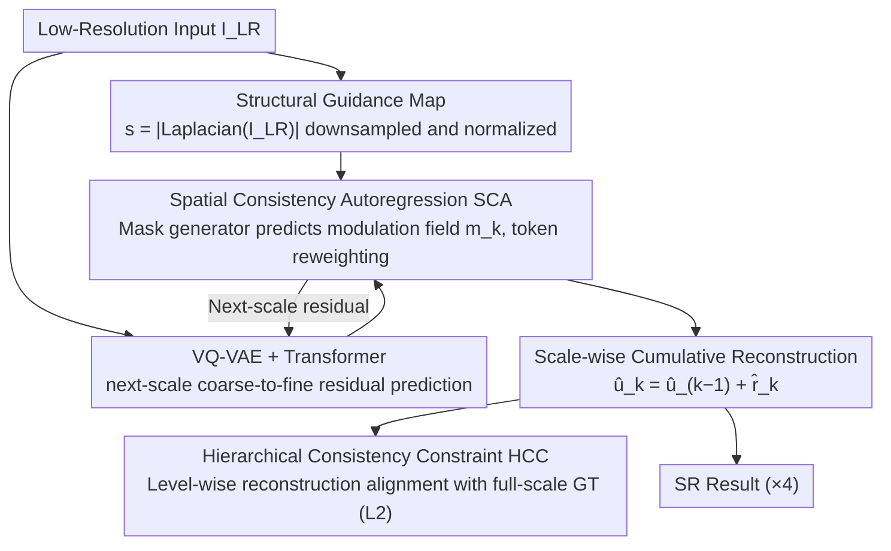

# AlignVAR: Towards Globally Consistent Visual Autoregression for Image Super-Resolution

**Conference**: CVPR 2026 Findings  
**arXiv**: [2603.00589](https://arxiv.org/abs/2603.00589)  
**Code**: None  
**Area**: Image Generation  
**Keywords**: Visual Autoregression, Image Super-Resolution, Spatial Consistency, Hierarchical Consistency, Next-Scale Prediction  

## TL;DR

Addressing two consistency issues in Visual Autoregression (VAR) for Image Super-Resolution—spatial incoherence caused by local attention bias and cross-scale error accumulation caused by residual supervision—this paper proposes the AlignVAR framework. By synergizing Spatial Consistency Autoregression (SCA) and Hierarchical Consistency Constraint (HCC), the model achieves inference speeds over 10× faster than diffusion-based methods with superior reconstruction quality.

## Background & Motivation

In the field of Image Super-Resolution (ISR), GAN-based methods suffer from unstable training and artifacts, while diffusion methods, despite high quality, incur heavy iterative denoising overhead (e.g., StableSR requires 200 steps and 15.32 seconds). **Visual Autoregression (VAR)** achieves coarse-to-fine reconstruction via a next-scale prediction strategy, which naturally fits the hierarchical structure of ISR and requires no iteration—a feasibility initially validated by the precursor work VARSR.

However, VARSR exposed a fundamental contradiction of the VAR paradigm in ISR:

**Spatial Inconsistency (Local Attention Bias)**: Self-attention weights in VAR models are almost entirely concentrated in adjacent regions, preventing long-distance structural features from interacting, which leads to texture fragmentation and structural distortion.

**Hierarchical Inconsistency (Cross-Scale Error Accumulation)**: Residual supervision only constrains the incremental prediction at each level. Tiny deviations at coarse scales are propagated and amplified through successive conditional probabilities $p(r_k | r_{1:k-1})$, resulting in color shifts and structural misalignment.

The common root of these two problems is the **lack of explicit consistency constraints both within scales (spatial dimension) and across scales (hierarchical dimension)**. AlignVAR addresses this by imposing consistency from both dimensions simultaneously.

## Method

### Overall Architecture

AlignVAR introduces two complementary modules into the next-scale prediction architecture based on VQ-VAE + Autoregressive Transformer:
- **SCA (Spatial Consistency Autoregression)**: Intra-scale—uses adaptive mask reweighting for attention to mitigate local bias.
- **HCC (Hierarchical Consistency Constraint)**: Inter-scale—replaces pure residual supervision with full-scale reconstruction supervision to suppress error accumulation.

### Key Designs

**1. Spatial Consistency Autoregression (SCA): Reweighting via structural guidance to pull attention from neighborhoods to reliable structures**

SCA targets the local bias where VAR attention focuses almost exclusively on neighboring tokens, causing long-range structural interactions to fail. It calculates a structural guidance map from the low-resolution input to modulate the weight of each token. Specifically, the absolute value of the Laplacian response $s = |\text{Laplacian}(I_{LR})|$ is taken, downsampled to each scale's resolution, and normalized to obtain $\bar{s}_k$. A lightweight MLP mask generator receives the current token and this guidance map to predict a spatial modulation field $m_k = \sigma(\mathcal{M}_\phi([r_k, \bar{s}_k]))$. Finally, the reweighted token is obtained via token gating:

$$\tilde{r}_k = (1 + m_k) \odot r_k$$

Laplacian is used because it is sensitive to second-order structural changes, naturally highlighting "structurally clear" positions like edges and textures. Giving these positions higher weights instructs the model to prioritize information propagation along reliable structures, thereby expanding the effective receptive field and compensating for long-range dependencies without modifying the attention calculation itself.

**2. Hierarchical Consistency Constraint (HCC): Supervising cumulative reconstruction at every scale instead of just residuals**

HCC targets cross-scale error accumulation. Pure residual supervision only ensures "whether this level's incremental prediction is correct," allowing small coarse-scale deviations to amplify into color shifts and structural misalignments through $p(r_k\mid r_{1:k-1})$. HCC directly compares the "global reconstruction accumulated to the current scale" with the ground truth. It first downsamples and quantizes the VAE encoding of the HR image to each scale to obtain the full-scale ground truth $u_{\text{gt}}^k = \mathcal{Q}(\text{Down}(z, S_k))$. On the prediction side, residuals from each level are accumulated $\hat{u}_{\text{pred}}^k = \hat{u}_{\text{pred}}^{k-1} + \hat{r}_{\text{pred}}^k$, and scale-wise $L_2$ supervision is applied:

$$\mathcal{L}_{\text{HCC}} = \sum_{k=1}^{K} \|\hat{u}_{\text{pred}}^k - u_{\text{gt}}^k\|_2^2$$

Crucially, this shifts the supervision signal from "local residuals" to "global states." The model observes how far its accumulated reconstruction deviates from the ground truth at every level, allowing it to correct errors before they propagate further and amplify.

### Loss & Training

The total training objective is a weighted sum of cross-entropy loss and HCC loss:
$$\mathcal{L}_{\text{total}} = \mathcal{L}_{\text{CE}} + \lambda \mathcal{L}_{\text{HCC}}$$

- Teacher-forcing training is used, conditioned on reweighted ground-truth tokens $\tilde{r}_{\text{gt}}^{1:k-1}$.
- $\lambda = 1.0$ (validated as the optimal balance point in ablation studies).
- Optimizer: AdamW, batch size 32, learning rate $5 \times 10^{-5}$ (cosine annealing), trained for 100 epochs.
- Training Data: First 10K images of LSDIR + FFHQ, degradation using the Real-ESRGAN pipeline.
- 8× NVIDIA H100 GPU.

## Key Experimental Results

### Main Results (Table 1: Synthetic + Real Benchmarks)

| Method | Type | DIV2K LPIPS↓ | DIV2K FID↓ | DIV2K MANIQA↑ | DIV2K CLIPIQA↑ |
|------|------|-------------|-----------|--------------|---------------|
| BSRGAN | GAN | 0.3511 | 50.99 | 0.3547 | 0.5253 |
| Real-ESRGAN | GAN | 0.3267 | 44.34 | 0.3756 | 0.5205 |
| StableSR | Diffusion | 0.3228 | 28.32 | 0.4173 | 0.6752 |
| DiffBIR | Diffusion | 0.3638 | 34.55 | 0.4598 | 0.6731 |
| VARSR | VAR | 0.2985 | 28.64 | 0.4137 | 0.6312 |
| **AlignVAR** | **VAR** | **0.2955** | **25.71** | **0.4665** | **0.6754** |

AlignVAR achieves the lowest FID (25.71) and best LPIPS (0.2955) on DIV2K-Val, while also reaching optimal scores in perceptual quality metrics MANIQA and CLIPIQA.

### Efficiency Comparison (Table 2)

| Method | Parameters | Inference Steps | Inference Time |
|------|--------|---------|---------|
| StableSR | 1409.1M | 200 | 15.32s |
| DiffBIR | 1900.4M | 20 | 5.03s |
| PASD | 1716.7M | 50 | 5.94s |
| VARSR | 1102.9M | 10 | 0.52s |
| **AlignVAR** | **1056.5M** | **10** | **0.43s** |

AlignVAR is **13.8×** faster than PASD, **11.7×** faster than DiffBIR, and 17% faster than VARSR with fewer parameters.

### Ablation Study

**SCA Ablation (Table 3)**:

| Configuration | RealSR MANIQA↑ | RealSR MUSIQ↑ |
|------|---------------|-------------- |
| w/o SCA | 0.4351 | 66.74 |
| Random Input | 0.4435 | 67.21 |
| Structural Guidance (ours) | **0.4553** | **68.53** |

**HCC Ablation (Table 4)**:

| Configuration | RealSR PSNR↑ | RealSR MANIQA↑ |
|------|-------------|---------------|
| w/o HCC | 25.85 | 0.4431 |
| w/ HCC | **26.11** | **0.4553** |

### Key Findings

- Fidelity metrics slightly increase while perceptual quality drops significantly when SCA is removed, indicating that structural guidance is key to visual coherence.
- Applying supervision in the latent space via HCC is superior to the pixel space, as latent representations are more compact and provide more direct gradients.
- Perceptual quality is optimal at $\lambda = 1.0$; a larger $\lambda$ biases towards fidelity at the expense of perception.

## Highlights & Insights

1. **Precise Problem Diagnosis**: Clear identification of two fundamental VAR issues in ISR through attention distribution visualization and perturbation injection experiments.
2. **Lightweight and Efficient**: The mask generator in SCA is a lightweight MLP, and HCC only adds $L_2$ loss calculation—resulting in almost no additional inference overhead.
3. **10× Acceleration Advantage**: 0.43s vs 5+s for diffusion methods, which is significant for real-world deployment.
4. **Fewer Parameters, Better Results**: 1056.5M vs 1900.4M (DiffBIR), demonstrating the efficiency potential of the VAR paradigm in ISR.

## Limitations & Future Work

- Fidelity metrics (PSNR/SSIM) are not yet optimal, showing recovery bottlenecks when LR image high-frequency details are severely lost.
- The mask relies on a handcrafted Laplacian design; learned structural detection could be explored.
- Only 4× SR (128→512) was tested; more extreme ratios (e.g., 8× or 16×) remain unverified.
- Discretization in VQ-VAE might limit the reconstruction upper bound, and comparisons with continuous latent space methods are missing.

## Related Work & Insights

- **VARSR**: The direct predecessor of this work, which first applied VAR to ISR but exposed consistency issues.
- **VAR (Next-Scale Prediction)**: Distinct from next-token prediction, it avoids destroying spatial structure by flattening sequences.
- **StableSR / DiffBIR**: Representative diffusion paradigm methods with high quality but low speed.
- **Insight**: Local bias and error accumulation are general issues in autoregressive models; the logic of SCA and HCC can be extended to other hierarchical generation tasks such as video generation and 3D reconstruction.

## Rating

- Novelty: ⭐⭐⭐⭐ Proposes targeted solutions for specific VAR issues in ISR with deep problem diagnosis.
- Experimental Thoroughness: ⭐⭐⭐⭐ Comprehensive benchmarks, ablations, and efficiency comparisons, though lacks user studies.
- Writing Quality: ⭐⭐⭐⭐ Clear motivation, rich visualization, and well-aligned problem-solution mappings.
- Value: ⭐⭐⭐⭐ Advances the practical usability of VAR in ISR with engineering significance due to 10× speed advantage.

<!-- RELATED:START -->

## Related Papers

- [\[CVPR 2026\] Physics-Consistent Diffusion for Efficient Fluid Super-Resolution via Multiscale Residual Correction](physics-consistent_diffusion_for_efficient_fluid_super-resolution_via_multiscale.md)
- [\[CVPR 2026\] VOSR: A Vision-Only Generative Model for Image Super-Resolution](vosr_a_vision_only_generative_model_for_image_super_resolution.md)
- [\[CVPR 2026\] Training-free, Perceptually Consistent Low-Resolution Previews with High-Resolution Image for Efficient Workflows of Diffusion Models](training-free_perceptually_consistent_low-resolution_previews.md)
- [\[AAAI 2026\] Realism Control One-step Diffusion for Real-World Image Super-Resolution](../../AAAI2026/image_generation/realism_control_one-step_diffusion_for_real-world_image_super-resolution.md)
- [\[CVPR 2025\] Arbitrary-Steps Image Super-Resolution via Diffusion Inversion](../../CVPR2025/image_generation/arbitrary-steps_image_super-resolution_via_diffusion_inversion.md)

<!-- RELATED:END -->
