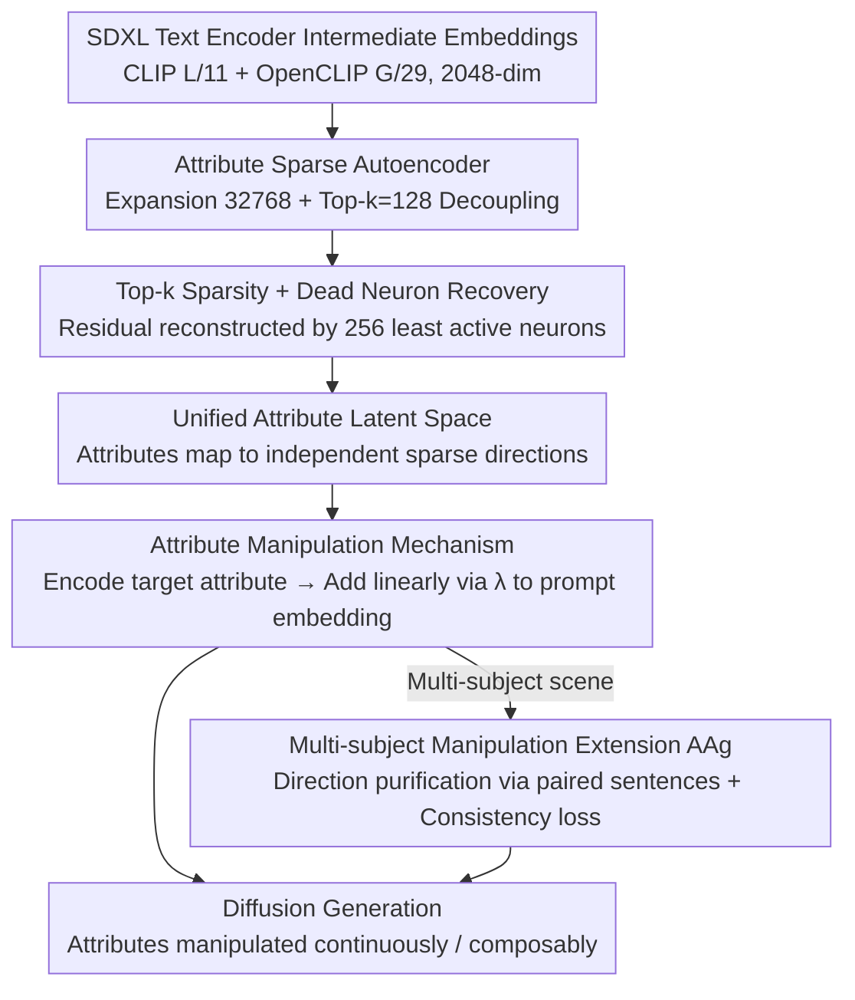

# All-in-One Slider for Attribute Manipulation in Diffusion Models

**Conference**: CVPR 2026  
**arXiv**: [2508.19195](https://arxiv.org/abs/2508.19195)  
**Code**: [https://github.com/ywxsuperstar/ksaedit](https://github.com/ywxsuperstar/ksaedit)  
**Area**: Image Generation / Diffusion Models  
**Keywords**: Attribute manipulation, Sparse Autoencoder, Text embedding decoupling, Continuous control, Zero-shot generalization  

## TL;DR
The All-in-One Slider framework is proposed, which trains an Attribute Sparse Autoencoder (SAE) on the text embedding space to decouple multiple facial attributes into sparse semantic directions. This enables a single lightweight module to achieve fine-grained continuous control of 52+ attributes, supporting multi-attribute composition and zero-shot manipulation of unseen attributes.

## Background & Motivation
T2I diffusion models have reached high generation quality, but fine-grained control over generated image attributes remains a challenge. Traditional methods either rely on prompt modifications, which lead to coarse and uncontrollable changes (e.g., adding "with a big smile" might unintentionally alter hairstyle, pose, or identity), or adopt a "One-for-One" paradigm—training a separate slider module for each individual attribute (e.g., ConceptSlider using LoRA, AttributeControl using attribute vectors). The latter leads to: (1) linear parameter redundancy as the number of attributes grows; (2) the need to retrain for new attributes; (3) difficulties in multi-attribute composition.

## Core Problem
How to achieve decoupled, continuous, and composable control over multiple visual attributes using a single unified lightweight module? The key challenge lies in attribute decoupling—mapping different attributes to mutually independent representation directions so that adjusting one attribute does not interfere with others.

## Method

### Overall Architecture

All-in-One Slider aims to replace the "one slider per attribute" paradigm with a single lightweight module. The key is to decouple facial attributes into non-interfering sparse directions within the **text embedding space**. The process involves two steps: first, an Attribute Sparse Autoencoder is trained unsupervised on a large number of text embeddings to decompose SDXL text encoder intermediate embeddings into a high-dimensional sparse space, yielding a unified attribute latent space. During inference, given a target attribute text (e.g., "smile") and manipulation intensity $\lambda$, its corresponding sparse direction is encoded and added back to the original prompt embedding. These operations occur solely in the text encoder intermediate layers without modifying the diffusion UNet. For multi-person scenes, an Attention Pooling Aggregator (AAg) is introduced to focus attribute directions precisely on specific subjects, avoiding "collateral damage" to others.

### Key Designs

**1. Attribute Sparse Autoencoder: Decoupling via High-Dimensional Sparse Decomposition**

The traditional One-for-One paradigm requires training a separate LoRA/vector for each attribute, causing parameters to expand linearly and hindering composition. Inspired by Sparse Autoencoders (SAE) in LLM interpretability, this method extracts 2048-dimensional embeddings from SDXL's dual text encoders (CLIP Layer 11 + OpenCLIP Layer 29), projects them to 32,768 dimensions (16× expansion), and applies Top-k ($k=128$) to retain only the most active dimensions before decoding back. High-dimensional expansion combined with sparse activation naturally assigns semantic concepts to distinct basis vectors, creating the decoupled structure needed to manipulate one attribute without affecting others.

**2. Top-k Sparsity and Dead Neuron Recovery: Utilizing the Sparse Space**

The SAE formulation is straightforward: encoding $z_{ALS} = \text{Top-k}(\text{ReLU}(W_{enc}(x - b_{pre}) + b_{enc}))$ and decoding $\hat{x} = W_{dec} z_{ALS} + b_{pre}$. However, sparse training often suffers from "dead neurons" that never activate. To address this, the residual $r = x - \hat{x}$ is calculated at each step, and the $k_{aux}=256$ least active neurons are tasked with reconstructing this residual. The auxiliary loss $\mathcal{L}_{aux} = \|r - \hat{r}\|_2^2$ forces them to learn meaningful directions, maximizing capacity utilization.

**3. Attribute Manipulation Mechanism: Linear Addition in Sparse Space**

With a decoupled sparse space, manipulation becomes a linear addition. Given a target attribute text $A$, the sparse direction $\text{ENC}(x_A)$ is encoded and added to the embedding: $x_{manipulated} = x + W_{dec}(\lambda \times \text{ENC}(x_A))$. Increasing $\lambda$ strengthens the attribute. Since different attributes activate different subsets of neurons, multi-attribute composition is achieved by summing their respective directions without mutual interference.

**4. Multi-subject Attribute Manipulation Extension: Precise Subject Targeting**

Simply adding directions in multi-person scenes can lead to leakage—e.g., modifying a woman's makeup might change a man's appearance. The Attention Pooling Aggregator (AAg) uses paired sentences (with and without the target attribute) to extract a pure direction $\Delta z = \text{AAg}(z^+) - \text{AAg}(z^-)$. When combined with a consistency loss $\mathcal{L}_{cons}$ to preserve non-target areas, manipulation is precisely localized to the specified subject.

### Loss & Training
- Total loss: $\mathcal{L} = \mathcal{L}_{mse} + \alpha \mathcal{L}_{aux}$, where $\alpha = 0.1$
- Training data: 52 facial attributes × 1000 samples/attribute = 52,000 text samples
- Training scale: 400M tokens, approx. 97,656 steps
- Optimizer: Adam, learning rate $4 \times 10^{-4}$, batch size 4096
- Hardware: Single RTX 4090

## Key Experimental Results

### Main Results

| Setting | Method | Old QS/IS | Smile QS/IS | Makeup QS/IS |
|------|------|-----------|-------------|--------------|
| Single-attr | CSlider | 3.79/0.43 | 4.14/0.50 | 4.54/0.65 |
| Single-attr | AttControl | 4.04/0.60 | 4.40/0.70 | 4.27/0.60 |
| Single-attr | **Ours** | **4.05/0.72** | 4.26/0.64 | **4.29/0.74** |
| Multi-attr | CSlider | 4.15/0.50 | 3.80/0.52 | 4.06/0.48 |
| Multi-attr | AttControl | 3.67/0.38 | 4.06/0.63 | 4.25/0.51 |
| Multi-attr | **Ours** | **4.21/0.69** | **4.43/0.63** | **4.30/0.64** |

The advantage is significant in multi-attribute scenarios—e.g., Old+Makeup achieves a QS of 4.43 vs. 4.06 for the next best method.

### Comparison vs. Original Embeddings

| Method | Mean QS | Mean IS |
|------|---------|---------|
| Original Embedding | 3.990 | 0.502 |
| SAE Direction | **4.202** | **0.698** |

The SAE direction improves QS by 0.212 and IS by 0.196 compared to direct text embeddings.

### Ablation Study
- **Layer Selection**: The 10/28 layer combination is optimal; deeper layers provide stronger semantics but degrade identity preservation.
- **Manipulation Intensity $\lambda$**: 0.15 indicates under-editing, while 0.30 shows strong expression at the cost of identity consistency; the "age" attribute is most sensitive to $\lambda$ (highly entangled with identity characteristics).
- **Continuity**: Linearity of geometric changes in the edited region reached $R^2 = 0.973$, outperforming CSlider (0.966) and AttControl (0.962).
- **Model Generalization**: The same SAE can transfer to SD v1.4, SDXL-Turbo, and FLUX (using T5 encoder layer 23).

## Highlights & Insights
- **Key Insight**: Migrating Sparse Autoencoders from LLM interpretability to T2I attribute control—high-dimensional sparse spaces naturally achieve semantic decoupling, representing a creative cross-domain transfer.
- **Single Training, Universal Control**: Breaks the One-for-One paradigm, covering 52 attributes plus zero-shot generalization to unseen attributes like ethnicity and celebrities.
- **Extremely Lightweight**: SAE parameters are significantly fewer than the total parameters of training one LoRA per attribute.
- **Superior Composability**: Multiple attribute directions can be overlaid without conflict due to the sparse activation of distinct dimension subsets.
- **Versatility**: Extensible to photography style control (40 styles) and multi-subject scenarios.

## Limitations & Future Work
- **Residual Attribute Entanglement**: The "age" attribute remains entangled with identity; identity consistency drops significantly at high $\lambda$.
- **Training Data Dependency**: While zero-shot generalization is supported, the initial 52 attributes still require carefully designed text templates.
- **Text-Space Only**: Operations are limited to the text embedding space; lack of manipulation at visual feature layers may limit fine-grained control of spatial local attributes.
- **Subjective Metrics**: Relies heavily on VLM (Qwen2.5-VL) scores and ArcFace identity consistency, lacking more comprehensive human evaluation.
- Combination with spatial conditioning methods like ControlNet has not been explored.

## Related Work & Insights
- **vs ConceptSlider (ECCV 2024)**: ConceptSlider trains one LoRA adapter per attribute, typifying the One-for-One paradigm. Ours covers all attributes with a single module and yields significantly higher QS in multi-attribute tasks.
- **vs AttributeControl (CVPR 2025)**: AttControl achieves continuous control but requires attribute-level supervision and paired data. Ours achieves similar effects through unsupervised SAEs and supports zero-shot generalization.
- **vs SAeUron (CVPR 2025)**: SAeUron uses SAEs for concept unlearning, focusing on model interpretability. Ours utilizes SAEs for active, controllable attribute manipulation.

## Rating
- Novelty: ⭐⭐⭐⭐ Migrating LLM SAE concepts to T2I attribute control breaks the One-for-One paradigm.
- Experimental Thoroughness: ⭐⭐⭐⭐ Covers single/multi-attribute, zero-shot, multi-model, multi-subject, and styles with complete ablations.
- Writing Quality: ⭐⭐⭐⭐ Clear motivation and detailed framework description, though some technical details are in the appendix.
- Value: ⭐⭐⭐⭐ Provides a more efficient and flexible paradigm for attribute control with practical application potential.

<!-- RELATED:START -->

## Related Papers

- [\[CVPR 2026\] One Algorithm to Align Them All](one_algorithm_to_align_them_all.md)
- [\[CVPR 2026\] Omni-Attribute: Open-vocabulary Attribute Encoder for Visual Concept Personalization](omni-attribute_open-vocabulary_attribute_encoder_for_visual_concept_personalizat.md)
- [\[ICCV 2025\] CompSlider: Compositional Slider for Disentangled Multiple-Attribute Image Generation](../../ICCV2025/image_generation/compslider_compositional_slider_for_disentangled_multiple-attribute_image_genera.md)
- [\[CVPR 2026\] Attribute-Preserving Pseudo-Labeling for Diffusion-Based Face Swapping](attribute-preserving_pseudo-labeling_for_diffusion-based_face_swapping.md)
- [\[CVPR 2026\] ImageRAGTurbo: Towards One-step Text-to-Image Generation with Retrieval-Augmented Diffusion Models](imageragturbo_towards_one-step_text-to-image_generation_with_retrieval-augmented.md)

<!-- RELATED:END -->
