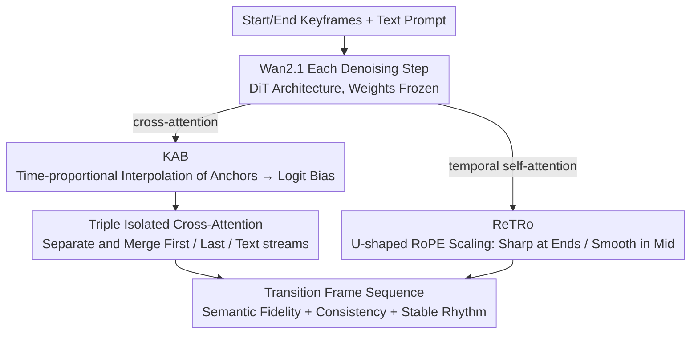

# Anchoring and Rescaling Attention for Semantically Coherent Inbetweening

**Conference**: CVPR 2026  
**arXiv**: [2603.17651](https://arxiv.org/abs/2603.17651)  
**Code**: To be confirmed  
**Area**: Image Generation  
**Keywords**: Generative Frame Inbetweening, Attention Anchoring, Temporal RoPE Rescaling, Keyframe Guidance, Video Diffusion Models

## TL;DR

Proposes KAB (Keyframe-Anchored Attention Bias) and ReTRo (Rescaled Temporal RoPE), two training-free inference-time methods based on the Wan2.1 video diffusion model, to address semantic infidelity, frame inconsistency, and rhythm instability in generative inbetweening (GI) with large motion under sparse keyframes. It also constructs TGI-Bench, the first text-conditioned GI evaluation benchmark.

## Background & Motivation

Generative Inbetweening (GI) refers to generating a sequence of intermediate transition frames given the first and last keyframes. Unlike traditional optical flow-based interpolation, GI requires "hallucinating" the intermediate process and faces three core challenges in large-motion/long-temporal scenarios:

**Semantic Infidelity**: Intermediate frames display objects or scene elements inconsistent with the keyframes.

**Frame Inconsistency**: Flickering or abrupt changes occur between adjacent frames.

**Temporal Rhythm Instability**: Uneven motion speeds and unnatural temporal distribution.

Existing methods are mostly modified from Image-to-Video (I2V) models, such as TRF and SEINE. However, the quality of these methods drops sharply as the keyframe interval increases (e.g., 65 or 81 frames). The root causes are:

- The attention focus of the cross-attention mechanism on the two keyframes is diluted in long sequences.
- The positional encoding of temporal attention does not consider the anchoring requirements of the boundary frames.
- A lack of a unified evaluation benchmark to measure the quality of text-conditioned GI.

The starting point of this work is: **without modifying model weights**, solve the aforementioned problems solely through inference-time attention manipulation.

## Method

### Overall Architecture

This paper addresses generative inbetweening under sparse keyframes and large motion—given only the start and end frames, the model must "hallucinate" dozens of transition frames. When the interval reaches 65 or 81 frames, existing I2V-based methods suffer from semantic drift, inter-frame flickering, and unstable rhythm. The author's core approach is: without touching any weights of Wan2.1 (a DiT-based first/last-frame-to-video model), "intervene" in the attention during each denoising step. The intervention follows two complementary paths: KAB rewrites the cross-attention logit distribution to inject semantic anchors from the first and last keyframes into each intermediate frame according to temporal ratios; ReTRo rewrites the RoPE scaling coefficients in temporal self-attention, using different positional encoding scales for frames near the endpoints versus those in the center. Both paths are completed during forward inference without any additional training or backpropagation.

### Key Designs

**1. KAB (Keyframe-Anchored Attention Bias): Interpolating keyframe semantic "anchors" into intermediate frames proportionally**

The goal is to prevent intermediate frames from generating objects inconsistent with the keyframes when the cross-attention focus is diluted in long sequences. The method first extracts the attention distributions $A_{\text{first}}$ and $A_{\text{last}}$ of the first frame $I_{\text{first}}$ and the last frame $I_{\text{last}}$ from the cross-attention layers, treating them as semantic anchors. For the $t$-th frame, an expected distribution is linearly interpolated based on its temporal position:

$$\bar{A}(t) = \frac{T - t}{T}\, A_{\text{first}} + \frac{t}{T}\, A_{\text{last}}$$

Then, the difference between this and the target mask $M(t)$ is converted into a logit bias added before the softmax:

$$B(t) = \log\big(M(t) + \varepsilon\big) - \log\big(\bar{A}(t) + \varepsilon\big)$$

where $\varepsilon$ prevents logarithmic overflow. Since this bias is only added to the logits without moving weights, it "forcefully directs" the intermediate frame's attention to the semantic regions it should focus on. When the sequence progresses to the midpoint ($t=T/2$), $\bar{A}$ is exactly half the first and half the last anchor, ensuring a smooth transition. This concept is analogous to Classifier-Free Guidance—using an additive bias to guide the generation direction—except CFG acts on the class dimension, whereas KAB acts on the spatial dimension of the attention map.

The accompanying Triple Isolated Cross-Attention solves another interference: if the first frame, last frame, and text prompt conditions are processed in the same cross-attention path, information "leaks," causing intermediate frames to bias towards one end. KAB splits these into three separate cross-attention paths and fuses them with weights to treat both keyframes symmetrically.

**2. ReTRo (Rescaled Temporal RoPE): Using "Non-uniform" positional encoding scaling to balance fidelity and smoothness**

RoPE in temporal self-attention determines the decay rate of attention between frames relative to distance. The original version treats all frames equally, resulting in either a loss of keyframe detail or disconnected intermediate frames. ReTRo assigns different Scaling factors to RoPE based on the frame position: edge frames near the start/end use $s_{\text{edge}} > 1$ to increase the positional encoding frequency and sharpen local attention, making these frames "more like" the adjacent keyframes to preserve detail; middle frames use $s_{\text{mid}} < 1$ to reduce frequency and expand the receptive field, allowing them to "look further" to maintain continuity. This scaling factor forms a "U-shaped" curve along the temporal axis—high at the ends and low in the middle—assigning fidelity requirements to the endpoints and smoothness requirements to the center. Ablations show that uniform scaling ($s=1$) reverts to the baseline, proving that this non-uniform distribution is effective.

### Loss & Training

The entire method is training-free: KAB only adds bias to cross-attention logits, and ReTRo only modifies RoPE scaling factors. Neither introduces new parameters or requires backpropagation. The extra overhead comes only from keyframe anchor extraction and bias calculation, which is negligible relative to the total denoising inference time.

## Key Experimental Results

### TGI-Bench (New Benchmark)

The first evaluation benchmark for text-conditioned generative frame inbetweening:

| Dimension | Scale |
|------|------|
| Video Count | 220 |
| Sequence Length | 25 / 33 / 65 / 81 frames |
| Challenge Categories | 4 types (Large Motion / Occlusion / Appearance Change / Scene Switch) |
| Metrics | PSNR, SSIM, FVD, VBench |

### Main Results

**Comparison of Performance on Long Sequences (65/81 frames)**:

| Method | Training Required | PSNR↑ | SSIM↑ | FVD↓ | VBench↑ |
|------|---------|-------|-------|------|---------|
| TRF | Yes | Med | Med | Med | Med |
| SEINE | Yes | Med | Med | Med | Med |
| Wan2.1 (baseline) | - | Med | Med | Med | Med |
| **Ours (KAB + ReTRo)** | **No** | **Best** | **Best** | **Best** | **Best** |

Key Observation: While the gap between methods is small for short sequences (25 frames), the advantages of KAB + ReTRo are significantly amplified as the sequence length increases to 65 or 81 frames.

### Ablation Study

| Configuration | PSNR | SSIM | Description |
|------|------|------|------|
| Baseline (Wan2.1) | Baseline | Baseline | No intervention |
| + KAB only | ↑ | ↑ | Improved semantic consistency |
| + ReTRo only | ↑ | ↑ | Improved temporal stability |
| + KAB + ReTRo | ↑↑ | ↑↑ | Optimal, complementary effects |
| KAB w/o Triple Isolation | ↓ | ↓ | Degradation due to keyframe interference |
| ReTRo Uniform Scaling (s=1) | → Baseline | → Baseline | Equivalent to no scaling |
| $s_{\text{edge}}$ too large | ↓ | ↑ | Over-sharpening, loss of smoothness |
| $s_{\text{mid}}$ too small | ↓ | ↓ | Receptive field too large, blurred details |

### Key Findings

1. **KAB and ReTRo address different issues**: KAB focuses on semantic fidelity, while ReTRo focuses on temporal consistency. The combination yields the best results.
2. **Significant advantages in long sequences**: The longer the sequence (65/81 frames), the greater the gain, indicating the method effectively addresses long-range dependency problems.
3. **Triple Isolation is indispensable**: Failing to isolate first/last frame attention leads to information crosstalk, making intermediate frames bias toward one end.
4. **The U-shaped distribution of ReTRo is crucial**: Uniform scaling is ineffective; it must be sharp at the edges and smooth in the middle.

## Highlights & Insights

- The **training-free** design is highly practical: no need for paired data collection or fine-tuning; it is plug-and-play.
- KAB's logit bias approach is conceptually similar to Classifier-Free Guidance but operates in the spatial dimension (attention map) rather than the class dimension.
- The non-uniform design of ReTRo for RoPE scaling is novel and could be generalized to other tasks requiring differentiated temporal modeling.
- The symmetrical design of Triple Isolated Cross-Attention reflects careful consideration of fairness between the first and last frames.
- TGI-Bench fills the gap in text-conditioned GI evaluation with a scientific and comprehensive design of 4 challenge categories × 4 lengths.
- The method is highly interpretable: the physical meaning of each component is clear, and ablation studies verify individual contributions.

## Limitations & Future Work

1. **Dependence on Wan2.1 architecture**: The design of KAB and ReTRo is tightly coupled with DiT + RoPE; adaptation is needed for U-Net architectures.
2. **Linear interpolation assumption**: The assumption of linear interpolation for the target anchor assumes uniform motion, which may be suboptimal for non-linear motion (acceleration/deceleration).
3. **Hyperparameter sensitivity**: $s_{\text{edge}}$ and $s_{\text{mid}}$ require manual tuning, lacking an adaptive selection mechanism.
4. **Lack of detailed computational cost analysis**: Although the overhead is claimed to be negligible, specific inference time comparison data is not provided.
5. **Limited to frame inbetweening**: The method is specific to scenarios where both endpoints are known and cannot be directly extended to single-frame extrapolation or unconditional generation.
6. **Metric limitations**: PSNR/SSIM focus on the pixel level with limited perceptual evaluation; VBench is broader but lacks fine granularity.

## Related Work & Insights

- **vs Wan2.1 (baseline)**: This work is built directly upon Wan2.1 FLF2V, manipulating attention without modifying weights, acting as an inference enhancement plugin.
- **vs TRF / SEINE**: Previous inbetweening methods require training and degrade severely in long sequences; KAB + ReTRo requires no training and excels in long sequences.
- **vs Classifier-Free Guidance**: CFG controls the generation direction in the category dimension; KAB controls semantic focus in the spatial dimension (attention map), serving as an analogy at the attention layer.
- **Non-uniform RoPE scaling** can be generalized to other tasks requiring differentiated temporal modeling (e.g., keyframe enhancement in long video understanding).
- Inference-time attention manipulation is a low-cost yet efficient means of enhancing model capabilities, worth exploring in tasks like video editing and video completion.

## Rating

- Novelty: ⭐⭐⭐⭐⭐ The KAB + ReTRo combination is novel with a unique training-free design.
- Experimental Thoroughness: ⭐⭐⭐⭐⭐ New TGI-Bench + comprehensive evaluation across 4 lengths × 4 categories.
- Writing Quality: ⭐⭐⭐⭐ Clear structure, complete formulas, and rich diagrams.
- Value: ⭐⭐⭐⭐⭐ Plug-and-play without training, directly benefiting the video generation community.

<!-- RELATED:START -->

## Related Papers

- [\[ICLR 2026\] CoEmoGen: Towards Semantically-Coherent and Scalable Emotional Image Content Generation](../../ICLR2026/image_generation/coemogen_towards_semantically-coherent_and_scalable_emotional_image_content_gene.md)
- [\[CVPR 2026\] LumiX: Structured and Coherent Text-to-Intrinsic Generation](lumix_structured_and_coherent_text-to-intrinsic_generation.md)
- [\[CVPR 2026\] GenErase: Generalizable and Semantically-Aware Concept Erasure in Diffusion Models](generase_generalizable_and_semantically-aware_concept_erasure_in_diffusion_model.md)
- [\[CVPR 2026\] Gated Condition Injection without Multimodal Attention: Towards Controllable Linear-Attention Transformers](gated_condition_injection_without_multimodal_attention_towards_controllable_line.md)
- [\[CVPR 2026\] The Devil is in Attention Sharing: Improving Complex Non-rigid Image Editing Faithfulness via Attention Synergy](the_devil_is_in_attention_sharing_improving_complex_non-rigid_image_editing_fait.md)

<!-- RELATED:END -->
