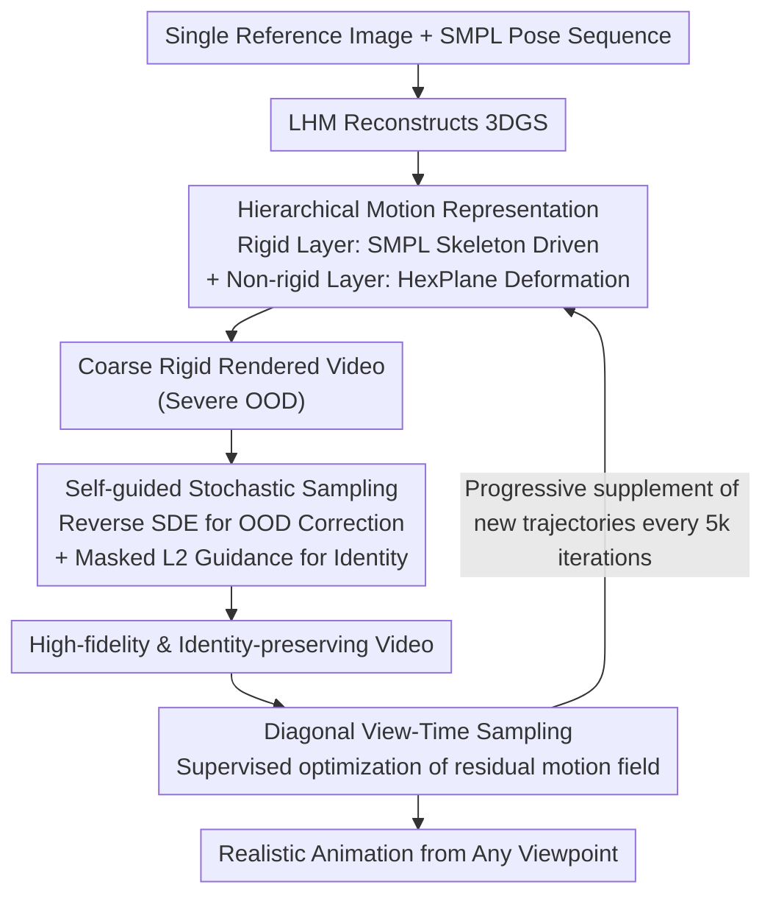

# Ani3DHuman: Photorealistic 3D Human Animation with Self-guided Stochastic Sampling

**Conference**: CVPR2026  
**arXiv**: [2602.19089](https://arxiv.org/abs/2602.19089)  
**Code**: [qiisun/ani3dhuman](https://github.com/qiisun/ani3dhuman)  
**Area**: Image Generation  
**Keywords**: 3D Human Animation, Video Diffusion Prior, Stochastic Sampling, Non-rigid Motion, 3D Gaussian Splatting

## TL;DR

The Ani3DHuman framework is proposed, combining kinematic-driven mesh animation with video diffusion priors. Through Self-guided Stochastic Sampling, low-quality rigid renderings are restored into high-fidelity videos, achieving realistic modeling of non-rigid clothing dynamics.

## Background & Motivation

**Limitations of Kinematic Methods**: Skeleton/SMPL-based methods provide precise control over rigid motion but fail to model non-rigid dynamics like clothing wrinkles and fluttering, resulting in lack of realism.

**High Cost of Physical Simulation**: Physics-based methods (e.g., PhysAvatar) can simulate cloth-body interaction but require separate clothing mesh modeling and many physical parameters, incurring extremely high computational and preprocessing costs.

**Data Bottleneck of Multi-view Diffusion**: Methods based on multi-view video diffusion (SV4D 2.0, CharacterShot) are limited by the scarcity of 4D training data, resulting in generation quality far inferior to 2D video models.

**Identity Loss in Pose-driven Methods**: Methods like PERSONA reconstruct 3D animations directly from pose-driven 2D videos, where each video produces different appearance hallucinations, leading to severe identity inconsistency.

**Quality Defects of SDS Distillation**: Score Distillation Sampling (SDS) methods (e.g., Disco4D) suffer from typical optimization artifacts such as over-saturation and over-smoothing, leading to poor visual effects.

**Sampling Challenges of OOD Rendering**: Initial mesh renderings significantly deviate from the diffusion model training distribution (out-of-distribution), and standard deterministic ODE samplers cannot correct trajectory biases, which is a core technical bottleneck.

## Method

### Overall Architecture

Ani3DHuman aims to solve how to make non-rigid dynamics like clothing wrinkles realistic in 3D human animation without relying on scarce 4D data or expensive physical simulations. The idea is to combine "controllable but rigid" kinematic mesh animation with "realistic but hard-to-control" video diffusion priors. The input is a single reference image (reconstructed into 3DGS via LHM) and a sequence of SMPL poses. First, a coarse video with correct poses is rendered using a hierarchical motion representation. Then, Self-guided Stochastic Sampling "restores" it into a high-fidelity, identity-preserving video. Finally, this restored video serves as a supervisory signal to optimize a residual motion field, iteratively obtaining realistic animation from any viewpoint.

### Key Designs

**1. Hierarchical Motion Representation: Motion Prior for Rigid, Details for Non-rigid**

Cramming human motion into a single motion field fails to learn both skeleton macro-motions and clothing micro-motions. This is split into two layers: the rigid layer drives 3D Gaussians through SMPL skeletal parameters, establishing a bijective mapping between Gaussians and SMPL-X canonical mesh vertices before applying skeletal transforms; the non-rigid layer uses a HexPlane-parameterized implicit function to query features in canonical space, decoded by an MLP into Gaussian attribute offsets (position, rotation) specifically to capture non-rigid deformations like clothing dynamics. Stratification allows the rigid part to directly benefit from strong motion priors, while the non-rigid part only needs to learn subtle deformations, making it much more stable than a single-layer motion field.

**2. Self-guided Stochastic Sampling: OOD Correction without Identity Loss**

Initial rigid renderings $\bm{y}$ are severely out-of-distribution (OOD) relative to the diffusion model, causing deterministic Flow-ODE sampling to deviate along incorrect trajectories. The strategy is twofold: **Stochastic Sampling for Quality**—construct a reverse SDE for Flow Matching, injecting random noise into the posterior noise prediction $\hat{\bm{x}}_{1|t}$ at each step: $\hat{\bm{x}}_{1|t} \leftarrow \sqrt{\gamma(t)}\epsilon + \sqrt{1-\gamma(t)}\hat{\bm{x}}_{1|t}$ ($\gamma(t)=\sigma_t$). The stochastic term actively pushes samples back toward the marginal distribution $p_t(\bm{x})$ to correct OOD bias. **Self-guidance for Identity**—high noise ruins identity while fixing OOD; thus, borrowing from DPS posterior sampling, a masked L2 guidance is applied to the posterior mean: $\hat{\bm{x}}_{0|t} \leftarrow \hat{\bm{x}}_{0|t} - \lambda \nabla_{x_t}\|\mathcal{M} \odot (\bm{y} - \hat{\bm{x}}_{0|t})\|^2$. The mask $\mathcal{M}$ (from SAM2) covers only identity-critical areas like faces and hands. The gradient has a closed-form solution and is lightweight to compute. The prior itself is fine-tuned on Wan2.1-1.3B with an added reference image branch and 2D pose sequence conditions specifically for human animation.

**3. Diagonal View-Time Sampling: Minimizing Multi-view Temporal Inconsistency**

Independently generated trajectories are inconsistent, leading to blurriness during reconstruction. Here, camera viewpoints and time steps change together along the diagonal, using the minimum number of trajectories to cover spatio-temporal information and minimizing exposure to inconsistency. This is paired with progressive data updates, where new trajectories are generated based on the current model state every 5k iterations to augment the training set.

### Loss & Training

$$\mathcal{L} = \mathcal{L}_{\text{L1}} + \lambda_1 \mathcal{L}_{\text{LPIPS}} + \lambda_2 \mathcal{L}_{\text{dssim}} + \lambda_3 \mathcal{L}_{\text{mask}} + \lambda_4 \mathcal{L}_{\text{reg}}$$

where $\mathcal{L}_{\text{reg}}$ is the depth difference regularization for rigid regions to maintain geometric consistency.

## Key Experimental Results

### Main Results (ActorsHQ Dataset, 10 cases)

| Method | PSNR↑ | SSIM↑ | LPIPS↓ | CLIP-I↑ | FID↓ | FVD↓ |
|------|-------|-------|--------|---------|------|------|
| Disco4D | 12.05 | 0.559 | 0.502 | 0.644 | 613.9 | 622.1 |
| SV4D 2.0 | 15.25 | 0.771 | 0.377 | 0.764 | 364.9 | 478.7 |
| PERSONA | 17.01 | 0.822 | 0.260 | 0.878 | 199.1 | 367.0 |
| LHM | 19.51 | 0.838 | 0.217 | 0.901 | 124.1 | 339.9 |
| **Ours** | **20.08** | 0.831 | **0.213** | **0.916** | **105.3** | **295.2** |

- Compared to LHM (second best), FID decreased by 18.8, FVD by 44.7, and CLIP-I increased by 0.015.
- Reconstruction metrics (PSNR/LPIPS) are optimal overall, while video quality (FID/FVD) remains significantly ahead.

### User Study (New Motion, No GT)

| Method | Identity Preservation | Frame Quality | Motion Realism | Non-rigid Physics | Overall Preference |
|------|---------|--------|-----------|----------------|---------|
| Disco4D | 0% | 1.5% | 4.4% | 0% | 0% |
| SV4D 2.0 | 0% | 2.9% | 16.2% | 4.3% | 5.9% |
| PERSONA | 20.6% | 30.9% | 14.7% | 19.1% | 22.1% |
| LHM | 39.2% | 29.4% | 29.4% | 14.7% | 17.6% |
| **Ours** | **40.1%** | **35.3%** | **35.3%** | **61.8%** | **54.4%** |

Non-rigid physical plausibility leads at 61.8%, with an overall preference of 54.4%.

### Ablation Study

1. **Stochastic Sampling vs. Deterministic ODE**: Quality drops significantly without the stochastic term, verifying that it is indispensable for OOD input correction.
2. **Self-guidance vs. No Guidance**: Without guidance, video quality remains high but identity is completely lost, proving the mechanism is vital for fidelity.
3. **Personalized Prior vs. General Prior**: Replacing with a general diffusion model led to slight degradation and artifacts.
4. **Hierarchical vs. Single-layer Motion**: Single-layer fields fail to model fine transforms like hands; the hierarchical design shows significant improvement.
5. **Diagonal vs. Fixed Time/Independent View**: Baseline methods produce floaters and spikes; diagonal sampling yields clearer reconstruction.

## Highlights & Insights

- Elegantly combines the controllability of kinematic animation with the realistic non-rigid generation of video diffusion models without relying on multi-view 4D data.
- The proposed Self-guided Stochastic Sampling algorithm is tailored for OOD restoration, balancing quality and fidelity with clear theoretical analysis.
- Diagonal view-time sampling effectively solves the multi-trajectory inconsistency problem with a minimal number of trajectories.
- Comprehensive experimental design: quantitative metrics + user study + multi-dimensional ablations + comparison with 6 sampling methods.

## Limitations & Future Work

- Sampling time for video diffusion priors is long, limiting practical efficiency; the authors suggest future introduction of few-step generation techniques for acceleration.
- Preservation region masks depend on SAM2; mask quality affects self-guidance performance.
- Currently only fine-tuned on Wan2.1-1.3B; limited model scale may constrain generative diversity.
- The residual motion field is based on HexPlane, whose ability to model extreme non-rigid deformations (e.g., large fluttering of loose long skirts) remains to be verified.
- Progressive training requires 25k iterations with dataset updates every 5k, resulting in high total training costs.

## Related Work & Insights

- **Kinematic Animation**: SMPL/LBS series → LHM achieves single-image reconstruction + mesh animation using 3DGS, but lacks non-rigidity.
- **Physical Simulation**: PhysAvatar (C-IPC solver) simulates cloth at the cost of complex modeling and high compute.
- **SDS Distillation**: MAV3D → DG4D/Disco4D, limited by over-saturation/over-smoothing.
- **Multi-view Video Reconstruction**: SV4D 2.0/CharacterShot, limited by 4D data scarcity.
- **Pose Video Reconstruction**: PERSONA uses 2D video diffusion but suffers from severe identity loss.
- **Video Editing Sampling**: SDEdit/FlowEdit/MCS/HFS-SDEdit are based on deterministic ODEs and perform poorly on OOD renderings.

## Rating

- Novelty: ⭐⭐⭐⭐ — Self-guided stochastic sampling is first proposed within the Flow Matching framework to solve OOD restoration by combining stochastic correction and posterior guidance.
- Experimental Thoroughness: ⭐⭐⭐⭐⭐ — Comparison with 6 sampling methods + 5 ablation groups + user study + 5 quantitative metrics, providing comprehensive coverage.
- Writing Quality: ⭐⭐⭐⭐ — Clear structure, complete logic from motivation to method and experiment, intuitive illustrations.
- Value: ⭐⭐⭐⭐ — Provides a general paradigm for diffusion restoration under OOD conditions, significantly advancing SOTA in non-rigid human animation.

<!-- RELATED:START -->

## Related Papers

- [\[CVPR 2026\] FG-Portrait: 3D Flow Guided Editable Portrait Animation](fg-portrait_3d_flow_guided_editable_portrait_animation.md)
- [\[CVPR 2026\] BiMotion: B-spline Motion for Text-guided Dynamic 3D Character Generation](bimotion_b-spline_motion_for_text-guided_dynamic_3d_character_generation.md)
- [\[CVPR 2026\] Vinedresser3D: Agentic Text-guided 3D Editing](vinedresser3d_agentic_text-guided_3d_editing.md)
- [\[ICLR 2026\] Stochastic Self-Guidance for Training-Free Enhancement of Diffusion Models](../../ICLR2026/image_generation/stochastic_self-guidance_for_training-free_enhancement_of_diffusion_models.md)
- [\[CVPR 2026\] Stability-Driven Motion Generation for Object-Guided Human-Human Co-Manipulation](stability-driven_motion_generation_for_object-guided_human-human_co-manipulation.md)

<!-- RELATED:END -->
