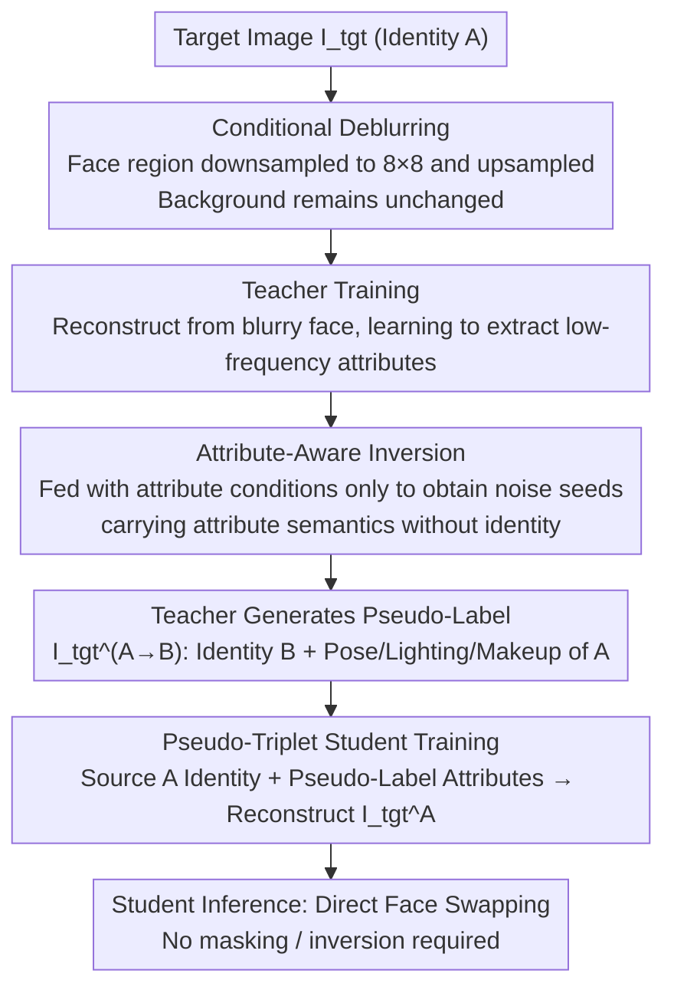

# APPLE: Attribute-Preserving Pseudo-Labeling for Diffusion-Based Face Swapping

**Conference**: CVPR 2026  
**arXiv**: [2601.15288](https://arxiv.org/abs/2601.15288)  
**Code**: [https://cvlab-kaist.github.io/APPLE](https://cvlab-kaist.github.io/APPLE)  
**Area**: Image Generation / Face Swapping  
**Keywords**: Face Swapping, diffusion model, Teacher-Student, Pseudo-Label, Attribute Preservation

## TL;DR
APPLE proposes a teacher-student framework based on diffusion models. By training a teacher model via conditional deblurring (replacing traditional conditional inpainting) to generate attribute-aligned pseudo-labels, and then training a student model with these high-quality pseudo-labels, it achieves SOTA attribute preservation performance (FID 2.18, Pose Error 1.85) while maintaining robust identity transfer capabilities.

## Background & Motivation

**Background**: Face swapping aims to transfer the identity of a source image to a target image while preserving the target's attributes such as pose, expression, skin tone, lighting, and makeup. This technology is widely applied in content creation, privacy protection, and filmmaking.

**Limitations of Prior Work**: Early GAN-based methods (SimSwap, HiFiFace, FaceDancer, etc.) rely on two conflicting objectives—identity loss and reconstruction loss—leading to unstable training and common "copy-paste" style artifacts.

**Key Challenge**: Recent diffusion-based methods (DiffSwap, FaceAdapter, REFace) model the task as conditional inpainting, where the target face region is masked and then reconstructed. However, **masking operations simultaneously remove identity information and lose critical attribute cues** (lighting, skin tone, makeup, etc.). Consequently, even with auxiliary conditional information, models struggle to faithfully preserve these attributes.

**Key Insight**: The core insight is that **the key to attribute preservation lies not in better attribute encoding, but in providing the student model with high-quality, attribute-aligned pseudo-labels as conditional inputs**. If a teacher can generate attribute-consistent pseudo-labels, the student can learn on clean images (rather than degraded masked images), thereby achieving superior attribute preservation.

**Core Idea**: Replace conditional inpainting with conditional deblurring to train the teacher model, combined with an attribute-aware inversion scheme to generate high-quality pseudo-labels. Subsequently, train the student model to achieve a win-win situation for both attribute preservation and identity transfer.

## Method

### Overall Architecture
APPLE is a **teacher-student framework** divided into three stages:
- **Teacher Training**: Train the diffusion teacher model using a conditional deblurring objective.
- **Pseudo-Label Generation**: The teacher generates attribute-aligned pseudo-labels through attribute-aware inversion.
- **Student Training**: The student is trained under a direct editing objective, conditioned on the pseudo-labels.

The base architecture utilizes FLUX.1-Krea [dev] as the diffusion backbone, PulID as the identity encoder, and OminiControl as the attribute conditional branch (LoRA rank=64).

### Key Designs

**1. Conditional Deblurring vs. Conditional Inpainting: Preserving Attribute Cues via Low-Frequency Blur**

A common failure in diffusion-based face swapping stems from the "masking" step: traditional methods set the entire target face region to zero and expect the model to reconstruct the swapped result from this incomplete image. The issue is that masking erases low-frequency attributes like skin tone, lighting, and pose along with the identity. APPLE’s modification is straightforward—instead of zeroing out the face, it replaces it with a **blurry version** (downsampled to 8x8 and upsampled). This removes high-frequency identity details (contours, textures) while retaining low-frequency attribute signals. The model can then extract the general skin tone and lighting direction from the blurry image. Since the blur is only applied to the face area and the background remains intact, this serves as a compromise that washes out unwanted identity without destroying essential attributes.

**2. Attribute-Aware Inversion: Anchoring Fine-Grained Attributes via "Non-Gaussian Residue"**

While deblurring captures global attributes, fine-grained features like makeup and accessories are lost in the high-frequency range. APPLE uses an unconventional approach: diffusion inversion. The "noise" obtained from inversion is not pure Gaussian noise; it contains residual semantic structures of the input image. Unlike previous works that try to eliminate this residue, APPLE **intentionally exploits** it as an anchor for fine-grained attributes. Crucially, during inversion, the model is fed only **attribute conditions** $(\varnothing, \mathcal{F}_{att}(I))$. Full-condition inversion would embed identity information into the noise, leading to artifacts; attribute-only inversion ensures the noise carries attribute semantics without identity bias. PCA visualization of this noise clearly reveals facial semantic structures.

**3. Pseudo-Triplet Student Training: Learning from Clean Pseudo-Labels**

The previous designs serve to produce a high-quality teacher. The final goal is for the teacher to generate pseudo-labels for the student. Specifically, the teacher performs face swapping on target image $I_{tgt}^A$ (replacing it with identity B) to obtain pseudo-label $\hat{I}_{tgt}^{A \to B}$. This forms a pseudo-triplet $(I_{src}^A, \hat{I}_{tgt}^{A \to B}, I_{tgt}^A)$. The student takes the identity features of the source and attribute features of the pseudo-label as input to reconstruct the original target $I_{tgt}^A$. This allows the student to see a **clean and complete pseudo-label**, rather than a degraded masked image. Consequently, the student learns attribute preservation more stably. Furthermore, this paradigm shifts the complexity to the training side; at inference, the student requires no masking or inversion, enabling direct face swapping.

### A Complete Example

Workflow for a target portrait $I_{tgt}^A$ (profile view, warm lighting, light makeup) through the three stages:

1.  **Teacher Training**: The target face area is downsampled to 8x8 and upsampled back into the image. The teacher learns to reconstruct $I_{tgt}^A$ from this "blurry face + clear background," mastering the extraction of warm lighting and skin tone from low-frequency signals.
2.  **Pseudo-Label Generation**: To swap A with identity B, attribute-conditioned inversion $(\varnothing, \mathcal{F}_{att})$ is performed on $I_{tgt}^A$ to get a noise seed carrying "profile + warm lighting + light makeup" semantics. Then, denoising with identity B's features and this seed generates the pseudo-label $\hat{I}_{tgt}^{A \to B}$—showing B’s face but preserving A’s pose, lighting, and makeup.
3.  **Student Training**: Using the triplet $(I_{src}^A, \hat{I}_{tgt}^{A \to B}, I_{tgt}^A)$, the student learns to reconstruct $I_{tgt}^A$ using "identity of A + attributes of the pseudo-label." The student only sees clean images, allowing for direct face swapping during inference without additional preprocessing.

### Loss & Training
- **Overall Training Objective**: $\mathcal{L}_{total} = \mathcal{L}_{flow} + \lambda_{id} \mathcal{L}_{id}$
- **Rectified Flow Loss**: $\mathcal{L}_{flow} = \mathbb{E}[\|(\epsilon - I_{tgt}) - v_t(z_t, \mathbf{id}_{src}, \mathbf{att}_{tgt})\|^2]$
- **Identity Loss**: $\mathcal{L}_{id} = 1 - \cos(\mathcal{F}_{id}(\hat{x_0}(z_t)), \mathcal{F}_{id}(I_{src}))$
- The teacher is pre-trained for 15K steps (no identity loss) + 50K steps (with identity loss). The student is fine-tuned from the teacher for 15K steps.
- Effective batch size is 16, utilizing 4x A6000 GPUs.

## Key Experimental Results

### Main Results

| Method | FID↓ | ID Sim.↑ | ID Ret. Top-1↑ | Pose↓ | Expr.↓ |
| :--- | :--- | :--- | :--- | :--- | :--- |
| SimSwap | 18.54 | 0.55 | 94.10 | 3.11 | 1.73 |
| FaceDancer | 3.80 | 0.51 | 89.70 | 2.23 | 0.74 |
| REFace | 7.22 | **0.60** | **97.60** | 3.67 | 1.08 |
| CSCS | 11.00 | **0.65** | **99.00** | 3.64 | 1.44 |
| APPLE (Teacher) | 3.68 | 0.54 | 90.40 | 2.07 | 0.70 |
| **APPLE (Student)** | **2.18** | 0.54 | 90.50 | **1.85** | **0.64** |

### Ablation Study

| Configuration | FID↓ | ID Sim.↑ | Pose↓ | Expr.↓ | Description |
| :--- | :--- | :--- | :--- | :--- | :--- |
| Inpainting (Baseline) | 11.00 | 0.54 | 3.37 | 1.01 | Traditional masking scheme |
| Deblurring | 4.20 | 0.53 | 2.58 | 0.79 | Deblurring significantly improves attribute preservation |
| Deblurring + Inv. | 3.68 | 0.54 | 2.07 | 0.70 | Attribute-aware inversion provides further gains |

### Key Findings
- Switching from Inpainting to Deblurring reduced FID from 11.00 to 4.20 and Pose error from 3.37 to 2.58.
- Attribute-aware inversion further reduced Pose error from 2.58 to 2.07.
- The student model eventually outperformed the teacher (FID 2.18 vs 3.68), validating the effectiveness of the pseudo-label training strategy.
- While CSCS and REFace achieve higher identity similarity, they suffer from severe identity bias and poor attribute preservation (visible copy-paste artifacts).

## Highlights & Insights
- **Conditional deblurring is an elegant compromise**: It retains more information than masking without introducing identity leakage.
- **Intentional use of non-Gaussian inversion noise**: This is a clever design—exploiting semantic residues in inversion noise to preserve attributes rather than attempting to eliminate them.
- **Universal value of the Teacher-Student paradigm**: The core idea of generating high-quality pseudo-labels to train superior models is applicable to other conditional generation tasks.

## Limitations & Future Work
- Identity similarity metrics are slightly lower than the strongest baselines (0.54 vs 0.65), indicating potential limitations in extreme identity transfer scenarios.
- Reliance on the VGGFace2-HQ dataset means generalization to non-frontal or heavily occluded faces remains to be verified.
- The quality of the teacher's pseudo-labels remains the bottleneck of the pipeline; further improvements to the teacher could yield significant gains.

## Related Work & Insights
- DreamID also utilizes pseudo-datasets but relies on GAN models (FaceDancer) for labels, limiting quality.
- The attribute-aware inversion concept can be generalized to other image editing tasks that require specific attribute preservation.
- The conditional deblurring strategy may inspire other attribute-sensitive conditional generation tasks such as virtual try-on or style transfer.

## Rating
- Novelty: ⭐⭐⭐⭐ Both conditional deblurring and attribute-aware inversion are innovative, though the teacher-student framework is a known paradigm.
- Experimental Thoroughness: ⭐⭐⭐⭐⭐ Comprehensive quantitative evaluation and detailed ablation studies.
- Writing Quality: ⭐⭐⭐⭐⭐ Clear logic with a complete chain of reasoning for motivations and methods.
- Value: ⭐⭐⭐⭐ Strong practicality as attribute preservation is a core challenge in face swapping.

<!-- RELATED:START -->

## Related Papers

- [\[CVPR 2026\] Attribute-Preserving Pseudo-Labeling for Diffusion-Based Face Swapping](attribute-preserving_pseudo-labeling_for_diffusion-based_face_swapping.md)
- [\[CVPR 2026\] High-Fidelity Diffusion Face Swapping with ID-Constrained Facial Conditioning](high-fidelity_diffusion_face_swapping_with_id-constrained_facial_conditioning.md)
- [\[CVPR 2026\] Preserving Source Video Realism: High-Fidelity Face Swapping for Cinematic Quality](preserving_source_video_realism_high-fidelity_face_swapping_for_cinematic_qualit.md)
- [\[CVPR 2026\] Say Cheese! Detail-Preserving Portrait Collection Generation via Natural Language Edits](say_cheese_detail-preserving_portrait_collection_generation_via_natural_language.md)
- [\[CVPR 2026\] Reviving ConvNeXt for Efficient Convolutional Diffusion Models](reviving_convnext_for_efficient_convolutional_diffusion_models.md)

<!-- RELATED:END -->
