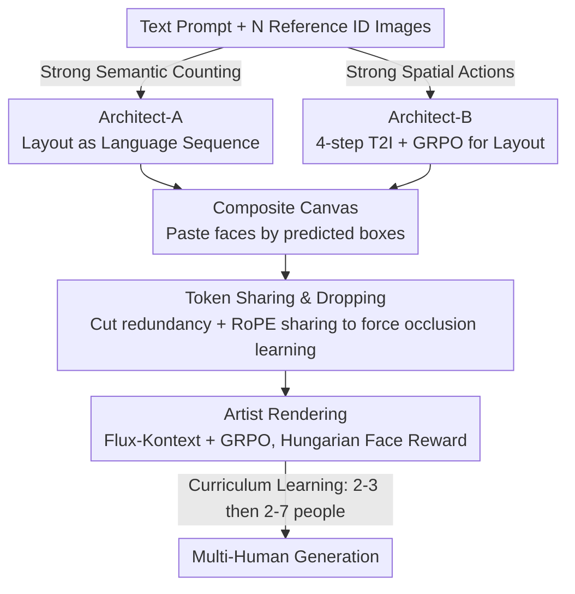

# Ar2Can: An Architect and an Artist Leveraging a Canvas for Multi-Human Generation

**Conference**: CVPR 2026  
**arXiv**: [2511.22690](https://arxiv.org/abs/2511.22690)  
**Code**: [https://qualcomm-ai-research.github.io/ar2can/](https://qualcomm-ai-research.github.io/ar2can/)  
**Area**: Image Generation / Multi-Human Image Generation  
**Keywords**: Multi-Human Generation, Identity Preservation, Spatial Planning, GRPO, Reinforcement Learning

## TL;DR
Ar2Can proposes decomposing multi-human image generation into two stages: spatial planning (Architect) and identity-preserving rendering (Artist). By utilizing GRPO reinforcement learning combined with a spatial-anchored face reward function based on Hungarian matching to train the Artist model, it achieves an identity preservation score of 68.2 and a count accuracy of 90.2 on the MultiHuman-Testbench, significantly surpassing all baselines.

## Background & Motivation

**Background**: While text-to-image diffusion models have matured in single-person generation, they systematically fail in **multi-human scenarios**—identity fusion, identity swapping, and incorrect person counts are prevalent issues.

**Limitations of Prior Work**:
   - **Regional conditioning methods** (GLIGEN, ReCo) require manual spatial annotations from users, leading to poor usability.
   - **Identity preservation methods** (IP-Adapter, InstantID, PuLID) are suitable for single individuals but suffer from identity conflicts in multi-human cases.
   - **Multi-ID methods** (OmniGen, DreamO, XVerse) still perform poorly on the latest benchmarks.

**Key Challenge**: Existing methods fuse **spatial layout reasoning** and **identity rendering** into a single generation process. When the model must simultaneously decide "where the people are" and "what they look like," spatial structure and appearance become entangled, leading to identity fusion.

**Key Insight**: **Decouple spatial planning and identity rendering**—first determine where each person appears, then focus on realistic rendering. This divide-and-conquer strategy fundamentally avoids identity fusion.

**Core Idea**: The Architect generates a structured spatial layout (bounding boxes / poses), and the Artist, guided by this layout, maintains multi-identity consistency through GRPO and Hungarian-matched face rewards.

## Method

### Overall Architecture

Ar2Can aims to resolve the most stubborn failures in multi-human T2I: identity fusion, identity swapping, and incorrect counts. Its core premise is that these errors stem from the model performing two tasks that should be separate—deciding "where everyone stands" and "what everyone looks like." Once spatial structure and appearance are entangled, identities blur together. Consequently, Ar2Can decomposes generation into a sequential two-stage process bridged by a canvas: first, the Architect reads the text prompt $p$ and $N$ reference identity images $\{I_{ref,1}, ..., I_{ref,N}\}$ to predict a spatial layout $\mathcal{L} = \{b_1, ..., b_N\}$ composed of $N$ bounding boxes; then, each reference face is pasted onto a blank canvas according to the predicted positions; finally, the Artist renders the final image conditioned on the canvas, reference images, and text. The Architect manages "who is where," while the Artist manages the "fidelity of the rendering," structurally severing the entanglement.

### Key Designs

**1. Architect-A: Generating Spatial Layouts as Language Sequences**

Determining "how many people are in the frame and who is next to whom" is essentially a semantic reasoning problem, which is a strength of language models. Architect-A is fine-tuned based on Qwen-2.5-0.5B-Instruct, extending the vocabulary with tokens such as `<SoL>`, `<EoL>`, and `<C>` to represent a set of boxes as a structured token sequence. To simultaneously output discrete structures and continuous coordinates, it employs a dual-head design—$f_{token}$ for token prediction and $f_{value}$ for coordinate regression. The training loss combines cross-entropy and coordinate terms: $\mathcal{L} = \mathcal{L}_{CE} + \lambda_{coord}[\mathcal{L}_{gIoU} + \|b_{pred} - b_{gt}\|_1]$. Leveraging linguistic understanding allows it to be most accurate in counting and human relations, achieving a person count accuracy of 90.2%.

**2. Architect-B: "Drawing" Layouts with a 4-step T2I Model + GRPO**

Another approach is to let a lightweight image model generate the layout directly, as its spatial priors are stronger than pure text. Architect-B is fine-tuned on Flux-Schnell, requiring only 4 denoising steps, and trained with GRPO reinforcement learning. The reward $r = \alpha \cdot r_{count} + \beta \cdot r_{hps}$ constrains both the number of people and image quality. It provides not just face bounding boxes but also human poses, resulting in higher action scores. These two Architects are complementary: A excels in semantic counting, while B excels in space and action. Both can be swapped without retraining the Artist.

**3. Artist Composite Reward and Spatial-Anchored Face Matching: The Core Innovation**

The difficulty in rendering the canvas into a natural image is balancing identity preservation without the model "lazily" mechanically pasting reference faces. The Artist is based on Flux-Kontext and trained with GRPO. The reward is a weighted sum of four terms: $r_{Artist} = \alpha \cdot r_{count} + \beta \cdot r_{hps} + \zeta \cdot r_{face} + \eta \cdot r_{pose}$, targeting count, quality, face identity, and pose. The critical innovation is how $r_{face}$ is calculated: to score identity, one must know "which face in the generated image corresponds to which reference identity." A naive approach would crop faces at the Architect's predicted coordinates, but this forces the model to paste reference faces at exact positions, leading to copy-paste artifacts or reward hacking. Ar2Can uses a two-step approach—first using the Hungarian algorithm to find the optimal matching between the Architect's "predicted centroids" and the actual centroids detected by RetinaFace, then calculating the ArcFace cosine similarity for matched pairs. Hungarian matching relaxes the "must be at exact coordinates" constraint to "approximate position," allowing room for natural variation while maintaining high identity and quality scores.

**4. Token Sharing & Dropping: Reducing Redundancy and Learning Occlusion**

Large areas of the canvas contain non-informative background. Ar2Can drops tokens in these regions, reducing the token count by half on average. More cleverly, it handles overlaps: when two face boxes overlap, they share the same set of RoPE position encodings. This prevents the model from separating faces based purely on coordinates, forcing it to learn actual occlusion relationships (who is in front, who is behind) rather than simple pasting.

**5. Curriculum Learning: From Easy to Difficult to Prevent Training Collapse**

Multi-human GRPO can easily collapse if fed 7-person scenes immediately. Ar2Can uses a curriculum—the first $\tau=100$ epochs use only 2-3 person scenes. Once the model stabilizes, it uniformly samples 2-7 person scenes, allowing for a smooth training progression.

### Loss & Training

A major practical hurdle is the lack of large-scale multi-human training data. Ar2Can adopts a purely synthetic route: using DisCo to generate multi-human scenes, pairing them with real reference faces to create hybrid training samples. It does not rely on real multi-human group photos. The aforementioned curriculum learning is also part of this training pipeline. Experiments show that GRPO fine-tuning on synthetic data alone is sufficient to outperform commercial models trained on vast amounts of real data.

## Key Experimental Results

### Main Results (MultiHuman-TestBench)

| Method | Count↑ | Multi-ID↑ | HPS↑ | Action-S↑ | Unified↑ |
|:---|:---:|:---:|:---:|:---:|:---:|
| GPT-Image-1 | 87.9 | 28.8 | 30.3 | 97.0 | 55.8 |
| DreamO | 61.2 | 34.7 | 28.5 | 86.2 | 59.7 |
| MH-OmniGen | 60.3 | 54.5 | 26.3 | 91.6 | 61.6 |
| XVerse | 81.7 | 30.6 | 25.5 | 66.2 | 52.7 |
| **Ar2Can (Arch-B)** | 86.9 | **68.2** | **30.8** | 86.2 | **72.4** |
| **Ar2Can (Arch-A)** | **90.2** | 67.6 | 30.2 | 86.3 | 72.2 |

### Ablation Study

| Configuration | Count↑ | Multi-ID↑ | HPS↑ | Description |
|:---|:---:|:---:|:---:|:---|
| Baseline (Kontext) | 80.7 | 14.5 | 29.2 | Original model, fails significantly in multi-human |
| + Simple Matching | 75.6 | 55.2 | 27.6 | Naive matching leads to copy-paste artifacts |
| + Hungarian Centroid | 80.1 | 60.3 | 30.9 | Hungarian matching restores quality |
| + Curriculum (Full) | **86.9** | **68.2** | **30.8** | Curriculum learning further improves results |

### Key Findings
- Multi-ID improved from 14.5 for Kontext to 68.2 (+53.7), indicating that Kontext almost entirely fails in multi-human scenarios.
- Compared to naive matching, Hungarian matching not only improves identity preservation (+5.1) but also restores image quality (HPS 27.6 $\rightarrow$ 30.9).
- Ar2Can was preferred by human evaluators in 88% of evaluation prompts (vs. 4% for DreamO and 8% for XVerse).
- Training solely on synthetic data outperformed commercial models using extensive real-world data.

## Highlights & Insights
- **Decoupling spatial planning and rendering** is a clear and effective strategy to avoid identity entanglement in multi-human generation.
- The **Hungarian matching reward** cleverly balances spatial precision and generational naturalness—it does not strictly enforce exact positioning but requires "proximity."
- **Modular design** flexibility: The Architect can be replaced by different schemes without the need to retrain the Artist.
- Achieving SOTA mostly using synthetic data demonstrates that RL fine-tuning can effectively compensate for data quality.

## Limitations & Future Work
- Action generation still lags behind GPT-Image-1 (Action-S 86.2 vs 97.0); understanding of complex sequential actions needs enhancement.
- Extreme multi-human scenarios with more than 7 people have not been verified.
- Inference latency is relatively high (extra overhead from the two-stage architecture); although token sharing mitigates this, there is still room for improvement.
- Architect-A and Architect-B have distinct pros and cons; a unified solution is currently lacking.

## Related Work & Insights
- DisCo (Flow-GRPO for multi-human generation) is a direct predecessor; Ar2Can adds spatial anchoring on top of it.
- Canvas-based methods (e.g., Kontext) perform well for single individuals but fail for multiple people, indicating a need for explicit spatial guidance.
- The paradigm of GRPO + composite rewards can be generalized to other image generation tasks requiring multi-objective balancing.

## Rating
- Novelty: ⭐⭐⭐⭐ The combination of spatial decoupling and Hungarian matching reward is novel and effective.
- Experimental Thoroughness: ⭐⭐⭐⭐⭐ Two benchmarks + human evaluation + detailed ablation + latency analysis.
- Writing Quality: ⭐⭐⭐⭐ Clear framework, though some details require referring to the appendix.
- Value: ⭐⭐⭐⭐⭐ Multi-human identity-preserving generation is a strong demand, and the practical improvement is significant (+13.7 Multi-ID over SOTA).

<!-- RELATED:START -->

## Related Papers

- [\[CVPR 2026\] Leveraging Verifier-Based Reinforcement Learning in Image Editing](leveraging_verifier-based_reinforcement_learning_in_image_editing.md)
- [\[CVPR 2026\] Aligning Multi-Character Narrative Image Generation with Multi-Aspect Human Preferences](aligning_multi-character_narrative_image_generation_with_multi-aspect_human_pref.md)
- [\[CVPR 2026\] InterEdit: Navigating Text-Guided Multi-Human 3D Motion Editing](interedit_navigating_textguided_multihuman_3d_moti.md)
- [\[CVPR 2026\] Harmonic Canvas: Inversion-Free Editing for Visually-Guided Music Style Transfer](harmonic_canvas_inversion-free_editing_for_visually-guided_music_style_transfer.md)
- [\[CVPR 2026\] Leveraging Multispectral Sensors for Color Correction in Mobile Cameras](leveraging_multispectral_sensors_for_color_correction_in_mobile_cameras.md)

<!-- RELATED:END -->
