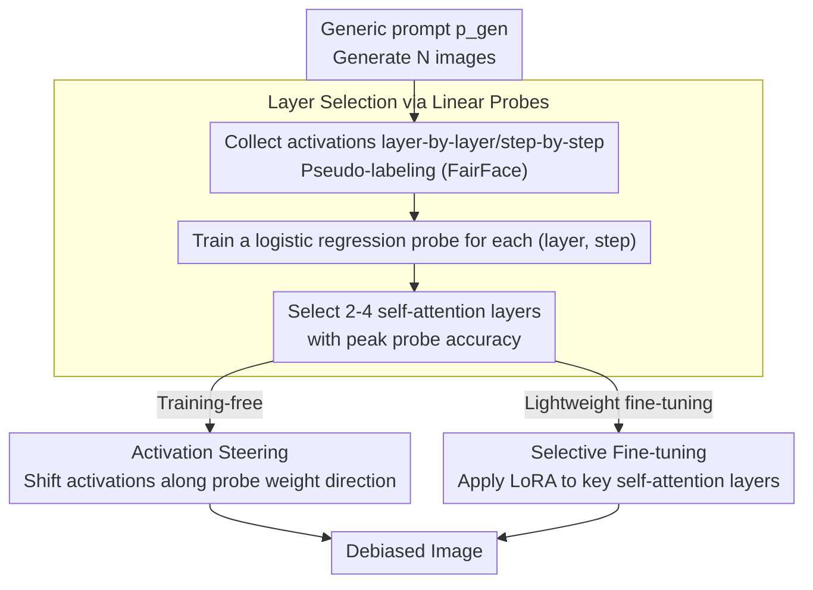

# Attention, May I Have Your Decision? Localizing Generative Choices in Diffusion Models

**Conference**: CVPR 2026  
**arXiv**: [2604.06052](https://arxiv.org/abs/2604.06052)  
**Code**: [https://github.com/kzaleskaa/icm](https://github.com/kzaleskaa/icm)  
**Area**: Image Generation / Diffusion Model Interpretability  
**Keywords**: Diffusion Model Interpretability, Self-Attention, Debiasing, Linear Probing, Implicit Decision

## TL;DR
This paper discovers through linear probing that **implicit decisions** in diffusion models (e.g., defaulting to generating a male when gender is unspecified) are primarily controlled by self-attention layers rather than cross-attention layers. Based on this, the ICM method is proposed, achieving SOTA debiasing effects by intervening only on a few key self-attention layers while minimizing image quality degradation.

## Background & Motivation

**Background**: Text-to-image diffusion models are powerful, but their internal mechanisms remain opaque. When prompts are insufficiently specific (e.g., "a photo of a person" without specifying gender), the model must make implicit decisions to fill in the missing details.

**The Duality of Implicit Decisions**:
   - Harmless cases: Deciding color and shape when generating a "flower".
   - Harmful cases: Defaulting to male for "doctor" (gender bias) or specific individuals for "US President" (representation bias).

**Limitations of Prior Work**:
   - Mainstream methods (e.g., prompt injection/activation patching) measure layer influence by injecting different text prompts into specific layers.
   - However, these methods inherently rely on explicit text conditions—this **masks the model's internal decision mechanism when explicit conditions are absent**.
   - Previous research suggested cross-attention layers are responsible for semantic integration, leading most interventions to target cross-attention.

**Key Challenge**: The computational mechanism of implicit decisions is **localized** and **different** from the mechanism of explicit text conditioning.

**Key Insight**: Linear probes are used to train classifiers directly on intermediate activations, localizing decision layers without prompt engineering and avoiding the confounding effects of prompt injection.

## Method

### Overall Architecture

This study addresses a mechanistic question: when a prompt does not specify an attribute (e.g., "a photo of a person" lacks gender), **where** does the diffusion model make the implicit decision (e.g., "default to male")? The authors' approach (called ICM, Implicit Choice-Modification) does not rely on prompt injection but uses linear probes to read intermediate activations. They generate a batch of images using generic prompts and collect activations, use an external classifier to provide pseudo-labels for the generated images, and then train a linear probe for each layer to see how well it captures the attribute. Once key layers are localized, targeted interventions (activation steering or selective fine-tuning) are performed on those layers for debiasing.

### Key Designs

**1. Layer Selection via Linear Probes: Quantifying "Decision Content" without Prompt Engineering**

Mainstream localization methods rely on injecting different text to measure layer influence, which requires explicit conditions and masks internal mechanisms. This work trains a logistic regression $f_{l,t}: \mathbb{R}^{d_l} \to \mathcal{A}$ on mean-pooled activations $H_{l,t}^{(i)}$ for a concept $\mathcal{C}$ and its options $\mathcal{A}$. Layers with high classification accuracy are key locations where implicit decisions occur. A core finding is that **probe accuracy in self-attention layers is significantly higher than in cross-attention layers, peaking near middle blocks**—challenging the assumption that all semantics reside in cross-attention.

| Layer Type | Role | Implicit Decision Correlation |
|------------|------|---------------|
| Cross-Attention | Integrates text condition semantic info | Low—when prompt lacks attribute tokens, cross-attn lacks info |
| Self-Attention | Propagates and solidifies random cues | **High**—unifies independent cues (hair + lipstick) into coherent generation |

The authors hypothesize that self-attention layers make implicit decisions by propagating and consolidating random cues from the initial noise.

**2. Activation Steering: Using Probe Weights as Directional Guiding**

Once key layers are localized, the probe weight vector $\hat{w}_{\ell,t}$ represents the "maximal class separability direction." By normalizing it to $s_{\ell,t} = \hat{w}_{\ell,t} / \|\hat{w}_{\ell,t}\|_2$, activations are shifted during generation: $H_{\ell,t}' = H_{\ell,t} + \alpha \cdot s_{\ell,t}$, where $\alpha$ controls intensity. This rewrites the implicit decision without retraining.

**3. Selective Fine-tuning: LoRA on Key Self-Attention Layers**

Lightweight fine-tuning is also possible: applying LoRA only to selected self-attention layers using specific attribute images but generic prompts, following the standard diffusion loss $\mathcal{L} = \mathbb{E}_{\epsilon,t}[\|\epsilon - \hat{\epsilon}_\theta(x_t, p, t)\|_2^2]$. Modifying only 2-4 key layers minimizes image quality degradation.

## Key Experimental Results

### Main Results (SD v1.5 Debiasing)

| Method | Gender FD↓ | Age FD↓ | Race FD↓ | FID↓ | CLIP-T↑ |
|------|------------|---------|----------|------|---------|
| Original | 0.564 | 0.752 | 0.558 | 120.06 | 0.6155 |
| DIFFLENS | **0.046** | **0.049** | 0.401 | 112.83 | 0.6090 |
| Finetuning | 0.050 | 0.746 | 0.198 | 161.47 | 0.6095 |
| **ICM (Steering)** | 0.087 | 0.133 | **0.266** | 122.08 | **0.6140** |
| **ICM (Finetuning)** | 0.535 | 0.681 | 0.449 | 143.98 | 0.6189 |

### Ablation Study: Self-Attention vs. Cross-Attention Steering

| Target | Gender FD↓ | Age FD↓ | Race FD↓ | FID↓ |
|----------|------------|---------|----------|------|
| Cross-attn steering | 0.365 | 0.612 | 0.428 | 118.39 |
| **Self-attn steering** | **0.085** | **0.273** | **0.298** | 118.31 |
| Cross-attn finetuning | 0.535 | 0.681 | 0.449 | 143.98 |
| **Self-attn finetuning** | **0.463** | **0.770** | **0.524** | 139.04 |

### Key Findings
- **Self-attention steering significantly outperforms cross-attention steering across all attributes** (Gender FD: 0.085 vs 0.365).
- ICM Steering achieves the best quality-fairness trade-off: FD drops while FID/CLIP-T remains stable.
- Intervening on only 2-4 key self-attention layers is superior to intervening on all layers, which causes artifacts.
- Activations from generic prompts vs. explicit prompts are **linearly separable** (accuracy 56-89%), confirming the difference in generation mechanisms.
- The method generalizes to SDXL (70 layers) and SANA (Transformer architecture, 20 layers).

## Highlights & Insights
- **The discovery that implicit decisions are localized in self-attention** is a major contribution, challenging the belief that semantic information resides purely in cross-attention.
- **Precise over global intervention**: Modifying only 2-4 layers is more efficient and effective than modifying all layers or high-level blocks.
- The linear probe approach avoids the confounding effects of prompt injection, providing a cleaner view of internal mechanisms.
- Rigorous experimental design: Distinguishing implicit/explicit mechanisms via probe training validates the conceptual framework.

## Limitations & Future Work
- Steering intensity $\alpha$ requires manual adjustment for each scenario, lacking automation.
- Simultaneous debiasing of multiple attributes (e.g., gender + age + race) is not fully explored.
- The linear probe assumes attributes are linearly separable in activation space, which may not hold for complex concepts.
- Further validation is needed to extend from debiasing to general implicit concept control.

## Related Work & Insights
- DIFFLENS performs better on specific metrics but uses sparse autoencoders, which are more complex.
- Methodology aligns with "knowledge localization" in LLMs (e.g., ROME, activation patching).
- Raises questions about prompt injection methods—explicit injection does not necessarily represent the model's internal decision mechanism.

## Rating
- Novelty: ⭐⭐⭐⭐⭐ The finding of self-attention as the center of implicit decisions is significant.
- Experimental Thoroughness: ⭐⭐⭐⭐⭐ Deep analysis across three attributes, three architectures, and multiple intervention methods.
- Writing Quality: ⭐⭐⭐⭐⭐ Elegant narrative with a complete logical chain from hypothesis to validation.
- Value: ⭐⭐⭐⭐ Fundamental contribution to understanding diffusion internal mechanisms; debiasing applications are practical.

<!-- RELATED:START -->

## Related Papers

- [\[ICCV 2025\] Attention to Neural Plagiarism: Diffusion Models Can Plagiarize Your Copyrighted Images!](../../ICCV2025/image_generation/attention_to_neural_plagiarism_diffusion_models_can_plagiarize_your_copyrighted_.md)
- [\[CVPR 2026\] Correspondence-Attention Alignment for Multi-View Diffusion Models](correspondence-attention_alignment_for_multi-view_diffusion_models.md)
- [\[CVPR 2026\] Decision Boundary-aware Generation for Long-tailed Learning](decision_boundary-aware_generation_for_long-tailed_learning.md)
- [\[CVPR 2026\] Your Latent Mask is Wrong: Pixel-Equivalent Latent Compositing for Diffusion Models](your_latent_mask_is_wrong_pixel-equivalent_latent_compositing_for_diffusion_mode.md)
- [\[AAAI 2026\] Melodia: Training-Free Music Editing Guided by Attention Probing in Diffusion Models](../../AAAI2026/image_generation/melodia_training-free_music_editing_guided_by_attention_probing_in_diffusion_mod.md)

<!-- RELATED:END -->
