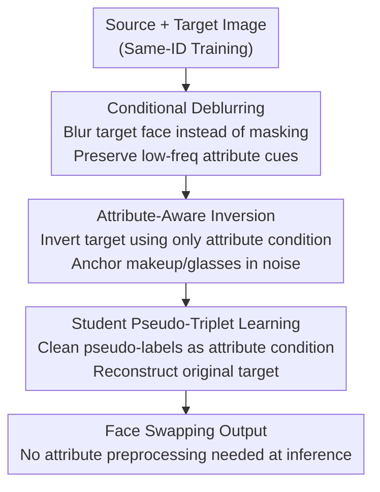

# Attribute-Preserving Pseudo-Labeling for Diffusion-Based Face Swapping

**Conference**: CVPR 2026  
**Paper**: [CVF Open Access](https://openaccess.thecvf.com/content/CVPR2026/html/Kang_Attribute-Preserving_Pseudo-Labeling_for_Diffusion-Based_Face_Swapping_CVPR_2026_paper.html)  
**Code**: https://cvlab-kaist.github.io/APPLE (Project Page)  
**Area**: Diffusion Models / Face Swapping  
**Keywords**: Face Swapping, Diffusion Models, Teacher-Student, Attribute Preservation, Pseudo-labeling

## TL;DR
APPLE utilizes a pure diffusion teacher-student framework for face swapping by training a precise teacher to generate high-quality pseudo-labels for the student. The teacher employs **conditional deblurring** (instead of full-face masking) to preserve the target's skin tone, lighting, and pose, while **attribute-aware inversion** anchors fine-grained attributes (makeup, glasses) into the noise to produce clean pseudo-labels. The student learns exclusively from these clean pseudo-labels, ultimately achieving SOTA in attribute preservation (FFHQ FID 2.18, Pose 1.85) while maintaining competitive ID similarity.

## Background & Motivation
**Background**: The goal of face swapping is to transfer a source identity to a target image while preserving the target's attributes, such as pose, expression, lighting, skin tone, makeup, and accessories. Early methods were dominated by GANs (e.g., SimSwap, HiFiFace), but diffusion models have recently become the mainstream alternative due to their high fidelity and training stability.

**Limitations of Prior Work**: Face swapping lacks real ground truth (the same person cannot simultaneously have "before/after" pairs), making supervised training inherently difficult. Mainstream diffusion-based face swapping (e.g., FaceAdapter, DiffSwap, REFace) models the task as **conditional inpainting**, where the target face region is entirely masked for reconstruction under the source identity condition. While masking prevents target identity "leakage," it also erases critical appearance cues like lighting, skin tone, makeup, and accessories. Consequently, the model must "hallucinate" these attributes, often failing to match the target even with auxiliary 3DMM landmarks or CLIP features.

**Key Challenge**: Identity transfer and attribute preservation represent an inherent trade-off; heavy masking effectively suppresses the target identity (aiding transfer) but sacrifices attribute preservation. Inpainting forces this trade-off toward an unfavorable extreme for attributes.

**Goal**: To enable the model to reliably swap identities while preserving target attributes with high fidelity (especially fine-grained details like makeup and glasses), without relying on real pairs or masking out attribute cues.

**Key Insight**: Rather than training the student directly on "corrupted masked inputs," it is more effective to **first train a teacher model capable of generating attribute-aligned, high-quality pseudo-labels**, and then have the student learn from these clean labels. The quality of pseudo-labels is the bottleneck of the framework: if they conflict with the target's pose or lighting, the student receives contradictory signals and performs poorly.

**Core Idea**: Utilize "conditional deblurring + attribute-aware inversion" to generate clean, attribute-aligned pseudo-labels. This allows the student to learn face swapping from clean inputs rather than degraded masked inputs—the cleaner the pseudo-labels, the more faithful the attribute preservation the student learns.

## Method

### Overall Architecture
APPLE is a pure diffusion teacher-student framework built on the rectified-flow backbone (FLUX.1-Krea[dev]), with identity encoded by PuLID and attributes handled via an OminiControl branch (LoRA rank 64). The pipeline consists of three sequential stages: **(a) Teacher training via conditional deblurring** → **(b) Pseudo-label generation via attribute-aware inversion** → **(c) Student learning on pseudo-triplets**. The first two stages ensure the teacher produces attribute-aligned pseudo-labels, while the third stage trains the final student model for deployment, which eventually surpasses the teacher.

The framework follows standard rectified flow: noise $\omega$ and real image $x_0$ are linearly interpolated at time $t$ as $z_t=(1-t)x_0+t\omega$. The model learns the velocity field $v_t$ with a flow-matching loss $L_{flow}=\mathbb{E}\big[\lVert(\omega-I_{tgt})-v_t(z_t, id_{src}, att_{tgt})\rVert^2\big]$, combined with an identity loss $L_{id}=1-\cos\!\big(F_{id}(\hat{x}_0), F_{id}(I_{src})\big)$. The total loss is $L_{total}=L_{flow}+\lambda_{id}L_{id}$. During training, source and target share the same identity; during inference, they differ.

### Key Designs

**1. Conditional Deblurring: Replacing Masks with Blur to Retain Attribute Cues**

To address the loss of lighting, skin tone, and makeup cues caused by inpainting masks, the teacher's training objective is changed to **conditional deblurring**. The original intent of masking was to suppress the target identity, but it erases attributes as well. Deblurring involves **downsampling the target face to 8×8 and upsampling it back** to the original resolution. This process removes high-frequency identity details while retaining low-frequency color tones, lighting, and pose contours. The blur is applied only to the face region using face parsing masks. This allows the model to "see" the attribute context during training. Table 1 shows that switching from inpainting to deblurring drops FID from 11.00 to 4.20, with Pose improving from 3.37 to 2.58 and Expression from 1.01 to 0.79.

Furthermore, the authors **enrich semantic conditions** for structural consistency: in addition to 3DMM landmarks, eye landmarks from a gaze estimator and glasses segmentation masks are concatenated with the blurred condition. This prevents periocular artifacts often caused by using gaze loss as sampling guidance and ensures stable preservation of gaze direction and accessories.

**2. Attribute-Aware Inversion: Leveraging "Semantic Residue" in Inversion Noise**

While deblurring preserves low-frequency attributes, high-frequency details like makeup and accessories may still be hallucinated by the teacher. To address this, **attribute-aware inversion** is introduced during pseudo-label generation. The observation is that noise obtained via diffusion inversion (iteratively adding noise in rectified flow via $z_{t+\Delta t}=z_t+\Delta t\cdot v_t(z_t)$) is not perfect Gaussian noise; it contains **residual semantic information** (structure, appearance). Unlike editing tasks that try to suppress this residue, APPLE exploits it to "change identity while keeping attributes."

The critical factor is the **inversion condition**. The authors compared four configurations: $(F_{id}(I),F_{att}(I))$, $(\varnothing,F_{att}(I))$, $(F_{id}(I),\varnothing)$, and $(\varnothing,\varnothing)$ (Full / Attribute-only / Identity-only / Unconditional). PCA visualization reveals that unconditional and identity-only inversion noise lack semantic structure, whereas attribute-conditioned noise shows clear facial semantics. **Attribute-only conditioning $(\varnothing,F_{att}(I))$** is optimal: it encodes attribute cues into the noise without introducing target identity bias. Full conditioning also preserves attributes but retains target identity information that hinders editability and causes artifacts. Table 2 confirms that attribute-only conditioning yields an FID of 3.68 (vs. 4.20 baseline), while full conditioning degrades it to 10.51. Note that inversion noise is non-Gaussian and is only used during inference for pseudo-labeling.

**3. Student Pseudo-Triplet Learning: Outperforming the Teacher with Clean Labels**

With a teacher capable of generating high-fidelity pseudo-labels, the third step involves constructing **pseudo-triplets** to train the student. Specifically, the teacher swaps the identity of target image $I^A_{tgt}$ with another subject B to produce a pseudo-label $\hat{I}^{A\to B}_{tgt}$. The triplet $(I^A_{src}, \hat{I}^{A\to B}_{tgt}, I^A_{tgt})$ is formed, where the student extracts identity features from source $I^A_{src}$ and attribute features from pseudo-label $\hat{I}^{A\to B}_{tgt}$ to reconstruct the original target $I^A_{tgt}$—an explicit image editing objective.

This design yields two benefits: during training, the student consumes **clean, unmasked, high-fidelity pseudo-labels** rather than corrupted images, leading to more effective attribute preservation learning. During inference, the student uses raw images as attribute conditions directly, **eliminating the need for auxiliary networks or complex attribute preprocessing pipelines**. Counter-intuitively, the student (FFHQ FID 2.18) eventually **surpasses the teacher** (FID 3.68) because it learns to "transfer attributes under clean conditions" rather than mimicking the teacher's intermediate process constrained by blurring/inversion.

### Loss & Training
The teacher is trained for 15K iterations (without identity loss), followed by 50K iterations with identity loss. The student is initialized from teacher weights and trained for another 15K iterations. Data consists of VGGFace2-HQ (filtered with an AES threshold of 5.1). Source images are masked before being fed to the identity encoder following REFace. Training used 4×A6000 GPUs, effective batch size 16 (batch 1 per card with grad accumulation 4), at 512×512 resolution.

## Key Experimental Results

### Main Results
Evaluation on FFHQ using 1,000 source/target pairs. Metrics include FID for realism, L2 distance of Pose (HopeNet) and Expression (Deep3DFaceRecon) for attribute preservation, and ID Similarity / ID Retrieval (ArcFace) for identity transfer.

| Model | FID↓ | ID Sim↑ | ID Retr.(Top-1/5)↑ | Pose↓ | Expr↓ |
|------|------|---------|--------------------|-------|-------|
| SimSwap (GAN) | 18.54 | 0.55 | 94.1 / 99.0 | 3.11 | 1.73 |
| FaceDancer (GAN) | 3.80 | 0.51 | 89.7 / 96.5 | 2.23 | 0.74 |
| DiffSwap | 6.84 | 0.34 | 41.9 / 63.1 | 2.63 | 1.20 |
| FaceAdapter | 13.03 | 0.52 | 87.0 / 93.2 | 5.12 | 1.38 |
| REFace | 7.22 | 0.60 | 97.6 / 99.4 | 3.67 | 1.08 |
| **APPLE (Teacher)** | 3.68 | 0.54 | 90.4 / 96.7 | 2.07 | 0.70 |
| **APPLE (Student)** | **2.18** | 0.54 | 90.5 / 97.0 | **1.85** | **0.64** |

APPLE-Student achieves the lowest FID and best Pose/Expr. While CSCS (0.65) and REFace (0.60) have higher ID Sim, they suffer from poor attribute preservation (visible copy-paste artifacts). The authors argue that APPLE achieves a more balanced trade-off.

### Ablation Study

| Configuration | FID↓ | ID Sim↑ | Pose↓ | Expr↓ | Description |
|------|------|---------|-------|-------|------|
| Inpainting (Baseline) | 11.00 | 0.54 | 3.37 | 1.01 | Traditional mask condition |
| + Deblurring | 4.20 | 0.53 | 2.58 | 0.79 | Switched to conditional deblurring |
| + Deblurring + Inversion | 3.68 | 0.54 | 2.07 | 0.70 | Added attribute-aware inversion |

| Inversion Condition | FID↓ | ID Sim↑ | Pose↓ | Expr↓ | Description |
|--------------|------|---------|-------|-------|------|
| Baseline (No Inversion) | 4.20 | 0.53 | 2.58 | 0.79 | Only deblurring |
| + None | 6.20 | 0.52 | 2.03 | 0.74 | Unconditional inversion |
| + Identity-only | 10.02 | 0.53 | 2.57 | 0.83 | Identity-only condition |
| **+ Attribute-only** | **3.68** | 0.54 | 2.07 | **0.70** | Attribute-only (Ours) |
| + Full | 10.51 | 0.53 | 3.13 | 0.99 | Full condition leads to artifacts |

Pseudo-label quality comparison (Student metrics using different teachers): FaceDancer as teacher yields FID 2.47 / Pose 2.07 / Expr 0.65; APPLE as teacher yields FID 1.98 / Pose 1.77 / Expr 0.62—the proprietary diffusion teacher is superior to GAN-based generators.

### Key Findings
- **Deblurring is the primary contributor**: Simply switching from inpainting to deblurring dropped FID from 11.00 to 4.20, showing that retaining attribute cues is more critical for face swapping than "cleaning" the identity via masking.
- **More conditions do not equal better inversion**: Attribute-only conditioning is optimal (FID 3.68); full conditioning is worst (10.51) as residual identity information conflicts with identity transfer.
- **Student surpasses Teacher**: Student FID 2.18 < Teacher 3.68. Learning "explicit editing on clean labels" is more effective than the teacher's constrained output process.

## Highlights & Insights
- **Turning "impure inversion noise" from bug to feature**: While the editing field seeks to eliminate residual semantics in inversion noise, APPLE uses it to retain attributes—proving that the value of a phenomenon depends on the task requirements.
- **Selectivity of Deblurring vs. Masking**: Masking is an "all-or-nothing" information cut, whereas deblurring is frequency-based—removing high-frequency identity while keeping low-frequency attributes.
- **Teacher-Student as a supervision generator, not just compression**: In tasks without ground truth, using a teacher as a "high-quality pseudo-label generator" for the student is a powerful paradigm for "unsupervised" supervision.

## Limitations & Future Work
- Strong dependency on external models (PuLID, face parsing, gaze estimation, 3DMM, glasses segmentation); errors in these modules propagate to pseudo-label quality.
- Attribute-aware inversion is restricted to inference and requires per-image computation, making pseudo-dataset generation costly (specific time costs not provided in the paper).
- ID Sim (0.54) still lags behind ID-focused models like REFace (0.60) or CSCS (0.65).
- Robustness across extreme poses, occlusions, and low-quality inputs has not been fully validated.

## Related Work & Insights
- **vs. Conditional Inpainting (FaceAdapter / DiffSwap / REFace)**: These models mask the face to prevent identity leakage but lose attribute cues; APPLE uses deblurring to preserve low-frequency attributes, reducing FID by an order of magnitude.
- **vs. DreamID**: DreamID also uses pseudo-datasets but relies on existing GAN swappers (FaceDancer); APPLE focuses on improving the diffusion teacher itself, resulting in higher quality labels (Teacher FID 1.98 vs. FaceDancer 2.47).
- **vs. GAN-based Swapping (SimSwap / HiFiFace)**: GANs preserve attributes well but suffer from artifacts and texture inconsistency; APPLE matches attribute preservation while outputting much higher realism (FID 2.18 vs. SimSwap 18.54).

## Rating
- Novelty: ⭐⭐⭐⭐ Innovative use of "deblurring over masking" and "reversing inversion residue."
- Experimental Thoroughness: ⭐⭐⭐⭐ Comprehensive 11-baseline comparison and ablation, though missing cost analysis for pseudo-labeling.
- Writing Quality: ⭐⭐⭐⭐ Logical flow from motivation to design and ablation.
- Value: ⭐⭐⭐⭐ Excellent deployment potential and a transferable paradigm for pseudo-supervision.

<!-- RELATED:START -->

## Related Papers

- [\[CVPR 2026\] High-Fidelity Diffusion Face Swapping with ID-Constrained Facial Conditioning](high-fidelity_diffusion_face_swapping_with_id-constrained_facial_conditioning.md)
- [\[CVPR 2026\] Preserving Source Video Realism: High-Fidelity Face Swapping for Cinematic Quality](preserving_source_video_realism_high-fidelity_face_swapping_for_cinematic_qualit.md)
- [\[CVPR 2026\] Omni-Attribute: Open-vocabulary Attribute Encoder for Visual Concept Personalization](omni-attribute_open-vocabulary_attribute_encoder_for_visual_concept_personalizat.md)
- [\[CVPR 2026\] IDperturb: Enhancing Variation in Synthetic Face Generation via Angular Perturbations](idperturb_enhancing_variation_in_synthetic_face_generation_via_angular_perturbat.md)
- [\[CVPR 2026\] All-in-One Slider for Attribute Manipulation in Diffusion Models](all_in_one_slider_attribute_manipulation.md)

<!-- RELATED:END -->
