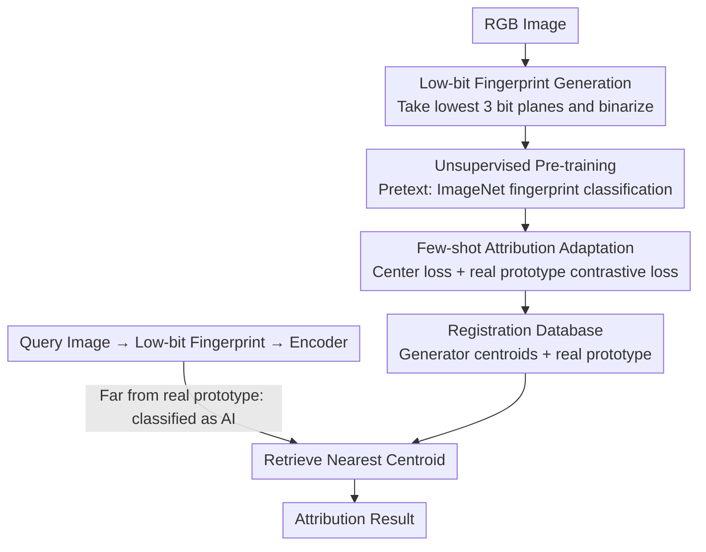

# Attribution as Retrieval: Model-Agnostic AI-Generated Image Attribution

**Conference**: CVPR 2026  
**arXiv**: [2603.10583](https://arxiv.org/abs/2603.10583)  
**Code**: [https://github.com/hongsong-wang/LIDA](https://github.com/hongsong-wang/LIDA)  
**Area**: Image Forensics / AI-Generated Image Attribution  
**Keywords**: deepfake attribution, image retrieval, bit-plane, model-agnostic, few-shot

## TL;DR
The attribution of AI-generated images is redefined from a classification paradigm to an instance retrieval paradigm. A model-agnostic framework, LIDA, based on low-bit plane fingerprints is proposed. Through unsupervised pre-training and few-shot attribution adaptation, SOTA performance in Deepfake detection and image attribution is achieved under zero-shot and few-shot settings.

## Background & Motivation
**Background**: With the rapid development of AIGC technology, synthetic images are becoming increasingly realistic. Detecting and attributing AI-generated images has become a critical security research direction. Existing methods are divided into two categories: generative image watermarking (requiring access to the generation model) and AI-generated image attribution (independent of the generation process).

**Limitations of Prior Work**: Existing attribution methods treat the problem as a classification task, which has three core flaws: (1) Model dependence—requiring access to the generation models themselves; (2) Lack of universality—difficult to extend to new, unseen generators; (3) Closed-set assumption—requiring all generators to be known during training, leading to poor performance in open-set scenarios.

**Key Challenge**: AI image generators iterate and evolve rapidly, while attribution systems require frequent retraining to adapt to new generators. This "train-deploy-retrain" cycle severely limits practical utility.

**Goal**: Design a model-agnostic attribution framework that does not require access to any generation models, eliminates the need for retraining on new generators, and can incorporate new generators into the system using only a few samples.

**Key Insight**: Redefine the attribution problem from classification to instance retrieval—train a universal feature encoder and determine the source by retrieving the most similar images for a query image within a registration database.

**Core Idea**: Utilize low-bit planes of images as generative fingerprints, learn noise structure representations through unsupervised pre-training, and perform attribution adaptation using a few samples to achieve retrieval-based open-set attribution.

## Method

### Overall Architecture
LIDA aims to solve a realistic dilemma: AI image generators emerge continuously, while attribution systems that treat "which generator this image comes from" as a classification task must be retrained for every new generator. The breakthrough is to rewrite attribution as retrieval—training a universal feature encoder, encoding query images into vectors during inference, and searching for the nearest neighbor in a registration database. The pipeline consists of three steps: first, extracting low-bit planes from RGB images as generative fingerprints; second, unsupervised pre-training of the encoder on large-scale real images; and third, performing few-shot adaptation using a handful of images from each generator. Adding a new generator only requires inserting a few samples into the database without modifying the encoder itself.

### Key Designs

**1. Low-bit Fingerprint Generation: Extracting generator "signatures" from image content**

Directly using RGB images for attribution fails because real/fake images and images from different generators overlap in the feature space—visual content dominates the representation, drowning out the subtle traces left by generators. The observation here is that the inherent artifacts of generators are primarily hidden in the low-bit planes. Thus, bit-plane decomposition is performed on each channel $\mathbf{x}_c = \sum_{k=0}^{7} 2^k \cdot \mathbf{b}_c^k$, taking only the lowest 3 bit planes and binarizing them:

$$\tilde{\mathbf{x}}_c = 255 \cdot \text{sgn}\Big(\sum_{k=0}^{2} 2^k \cdot \mathbf{b}_c^k\Big)$$

High-bit planes carry content visible to the human eye and are discarded. The remaining low-bit fingerprints contain almost no semantics but amplify the noise structures unique to the generator. In this fingerprint space, real and AI images are clearly separated, and images from the same generator naturally cluster—a prerequisite for retrieval to work. The extraction process involves only a few bitwise operations and introduces no extra parameters.

**2. Unsupervised Pre-training: Learning transferable noise structure representations**

During the few-shot adaptation phase, only a few images are available per generator. Training an encoder from scratch would lead to overfitting, necessitating a good weight initialization. The encoder is pre-trained on large-scale real images (ImageNet fingerprints) using image classification as a pretext task with standard cross-entropy loss $\mathcal{L}_P = -\sum_{b=1}^{B} \sum_{c=1}^{C} s_b^c \log q_b^c$. A ResNet-50 backbone is used, but low-level downsampling is intentionally removed to preserve spatial structures within the fingerprints. Notably, pre-training uses only real images and never touches generator samples, yet the "inherent noise structures" learned are transferable to downstream forensic tasks, leading to faster convergence and more stable performance during fine-tuning.

**3. Few-shot Attribution Adaptation: Fine-tuning with few images while preserving structures**

The adaptation phase follows a two-stage attribution paradigm—first distinguishing real from fake, then attributing to a specific generator, using two complementary losses. The first is center loss $\mathcal{L}_A = \sum_{i=1}^{m} \|x_i - c_{y_i}\|_2^2$, which pulls features from the same generator toward their respective centroids. Centroids $c_j$ are updated via a sliding window based on samples within each batch:

$$c_j^{t+1} = c_j^t - \alpha \cdot \frac{\sum_{i=1}^{m} \delta(y_i = j) \cdot (c_j^t - x_i)}{1 + \sum_{i=1}^{m} \delta(y_i = j)}$$

The second is a real prototype contrastive loss $\mathcal{L}_D$, which pulls real images toward a real prototype and pushes AI images away, handling the detection stage. The total loss is $\mathcal{L} = \mathcal{L}_A + \lambda \mathcal{L}_D$. A critical choice is the **intentional exclusion of cross-entropy**: cross-entropy forces features to align with classification boundaries, disrupting the feature space structures learned during pre-training. Center loss acts more like a regularizer, constraining intra-class compactness without forcibly rearranging the entire space, which is more stable in extreme few-shot scenarios.

### A Complete Example
Suppose a database contains 3 registered generators (SD, Midjourney, DALL·E), each adapted with 1 image, plus a set of real image prototypes. When a query image arrives, its low-bit fingerprint is extracted and encoded into a feature vector. The real prototype learned via $\mathcal{L}_D$ first determines if it is real—if it is sufficiently far from the real prototype, it is classified as AI and proceeds to attribution. Its distance to the three generator centroids is then compared; if it falls closest to the SD centroid, it is attributed to SD. If a 4th generator emerges, the encoder does not need retraining; its samples are simply encoded and registered into the database, allowing it to be retrieved in future queries—this is the open-set scalability provided by "attribution as retrieval."

### Loss & Training
- Pre-training phase: Classification cross-entropy $\mathcal{L}_P$ on ImageNet fingerprint images (pretext task only).
- Fine-tuning phase: Center loss $\mathcal{L}_A$ (intra-class attribution clustering) + Real prototype contrastive loss $\mathcal{L}_D$ (real/fake detection), combined as $\mathcal{L} = \mathcal{L}_A + \lambda \mathcal{L}_D$.
- Centroids are updated in a sliding manner based on intra-batch samples of the same class (formula provided above).

## Key Experimental Results

### Main Results
Attribution results (Rank-1 / mAP %) for 1-shot and 5-shot settings on the GenImage dataset:

| Method | 1-shot Rank-1 | 1-shot mAP | 5-shot Rank-1 | 5-shot mAP |
|------|-------------|-----------|-------------|-----------|
| ResNet | 17.4 | 37.5 | 19.4 | 25.0 |
| DIRE | 14.3 | 34.8 | 18.7 | 24.8 |
| ESSP | 17.0 | 36.0 | 17.5 | 23.7 |
| **LIDA (Ours)** | **40.4** | **61.5** | **76.9** | **54.5** |

### Ablation Study

| Configuration | Key Metrics | Description |
|------|---------|------|
| RGB Input | Real/Fake mixed in feature space | PCA visualization cannot distinguish between different generators |
| Low-bit Fingerprint Input | Clear clustering in feature space | Real and AI images are separated; same-generator images cluster together |
| No pre-training (direct fine-tuning) | Performance drops significantly | Lack of universal noise structure representation |
| Cross-entropy replacing center loss | Performance drops | Disrupts the pre-trained feature space structure |

### Key Findings
- Low-bit plane fingerprints are key to distinguishing generators—different generators produce significantly different noise patterns in low bits.
- The retrieval paradigm naturally supports open-sets—adding a new generator only requires adding a few samples to the database without retraining.
- In the 1-shot setting, LIDA's mAP is already 24 points higher than the ResNet baseline.
- In the 5-shot setting, performance jumps significantly, with Rank-1 rising from 40.4% to 76.9%.

## Highlights & Insights
- Paradigm Innovation: Shifting attribution from classification to retrieval solves the scalability problem for new generators.
- Low-bit planes as fingerprints are simple yet effective—extracted with just a few lines of bitwise operations.
- Avoiding cross-entropy is a subtle but critical design choice—preserving the pre-trained feature space structure is vital for few-shot learning.
- Provides "evidence-based attribution"—the retrieved similar images themselves serve as evidence for the attribution decision.

## Limitations & Future Work
- The robustness of low-bit planes against post-processing such as JPEG compression needs further verification.
- The scale and quality of the registration database directly affect attribution accuracy.
- Currently limited to image-level attribution; not yet extended to video generators.
- Discriminatory power between highly similar generators in the same family (e.g., SD v1.4 vs v1.5) may be limited.

## Related Work & Insights
- **Yu et al. (GAN fingerprint)**: The first to systematically study GAN fingerprints, but limited to closed-set classification.
- **Tree-Ring/Gaussian Shading**: Generative watermarking methods requiring access to the generation model.
- **DIRE**: Uses diffusion reconstruction error for detection, but has weak attribution capabilities.
- Insight: Other forensic tasks (e.g., deepfake video detection, AI text detection) could also explore the "detection as retrieval" paradigm.

## Rating
- Novelty: ⭐⭐⭐⭐ Mapping attribution to retrieval is a significant paradigm shift; low-bit fingerprints are elegant inputs.
- Experimental Thoroughness: ⭐⭐⭐⭐ Evaluation on two large-scale datasets (GenImage and WildFake) across zero-shot and few-shot settings.
- Writing Quality: ⭐⭐⭐⭐ Clear methodological descriptions and logical experimental design.
- Value: ⭐⭐⭐⭐ High practicality; the model-agnostic and few-shot adaptation features address key real-world requirements.

<!-- RELATED:START -->

## Related Papers

- [\[CVPR 2026\] IncreFA: Breaking the Static Wall of Generative Model Attribution](increfa_breaking_the_static_wall_of_generative_model_attribution.md)
- [\[AAAI 2026\] AEDR: Training-Free AI-Generated Image Attribution via Autoencoder Double-Reconstruction](../../AAAI2026/image_generation/aedr_training-free_ai-generated_image_attribution_via_autoen.md)
- [\[CVPR 2026\] Towards Fine-Grained Attribution: Instance-Aware Preference Optimization for Aligning Diffusion Models](towards_fine-grained_attribution_instance-aware_preference_optimization_for_alig.md)
- [\[ICML 2026\] Barriers to Counterfactual Credit Attribution for Autoregressive Models](../../ICML2026/image_generation/barriers_to_counterfactual_credit_attribution_for_autoregressive_models.md)
- [\[CVPR 2026\] Diversity over Uniformity: Rethinking Representation in Generated Image Detection](diversity_over_uniformity_rethinking_representation_in_generated_image_detection.md)

<!-- RELATED:END -->
