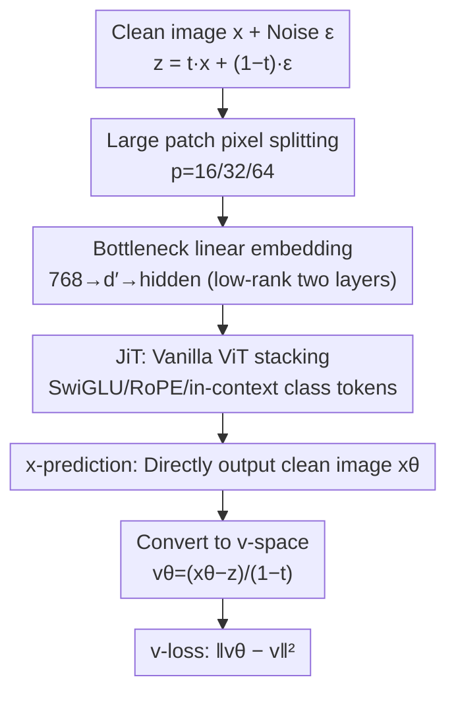

# Back to Basics: Let Denoising Generative Models Denoise

**Conference**: CVPR 2026  
**Paper**: [CVF Open Access](https://openaccess.thecvf.com/content/CVPR2026/html/Li_Back_to_Basics_Let_Denoising_Generative_Models_Denoise_CVPR_2026_paper.html)  
**Code**: None  
**Area**: Diffusion Models / Image Generation  
**Keywords**: x-prediction, manifold assumption, pixel-space diffusion, Vision Transformer, high-dimensional denoising  

## TL;DR
The authors (Tianhong Li, Kaiming He) point out that today's diffusion models do not actually "denoise" — they predict "off-manifold" quantities like noise $\epsilon$ or velocity $v$. Returning to first principles, this paper lets the network directly predict the clean image $x$. Consequently, a vanilla ViT directly consuming large pixel patches (no tokenizer, no pre-training, no extra loss) can produce highly competitive generation results on ImageNet 256/512/1024 (JiT-G/16 achieves an FID of 1.82 at 256 resolution), while the same network catastrophically collapses when using $\epsilon$/$v$-prediction.

## Background & Motivation

**Background**: The original core idea of diffusion models was "denoising" — directly predicting the clean image from the corrupted image. However, two milestones along the evolutionary path deviated from this goal: DDPM discovered that predicting the noise itself ($\epsilon$-prediction) drastically improves generation quality, making it popular; later, diffusion was connected with flow matching, shifting to predicting velocity $v$ ($v$-prediction, where $v=x-\epsilon$ is a mixture of data and noise). Today, mainstream diffusion models in practice almost all predict noise or noise-related quantities. Meanwhile, to sidestep high-dimensional challenges, researchers generally move diffusion into a pre-trained latent space (LDM), or rely on dense convolutions, small patches, wider channels, and long skip connections in pixel space to "bypass the information bottleneck."

**Limitations of Prior Work**: Theoretically, $x$-, $\epsilon$-, and $v$-prediction can be converted into one another through loss reweighting. Thus, for a long time, researchers paid little attention to "what the network should directly output," assuming that the network is capable of handling whatever task is assigned. However, the authors discover that when using a ViT to directly ingest high-dimensional pixels of large patches (e.g., $16\times16\times3=768$ dimensions, $32\times32\times3=3072$ dimensions), $\epsilon$/$v$-prediction **fails catastrophically**, with the FID soaring from single digits to three or four hundred. The latent space merely "hides" this difficulty rather than "solving" it, and relying on pre-trained VAEs/tokenizers prevents the diffusion model from being self-contained.

**Key Challenge**: The root cause lies in "whether the target the network directly predicts lies on a low-dimensional manifold." According to the **manifold assumption**, high-dimensional natural data roughly lies on a low-dimensional manifold, meaning the clean image $x$ is "on-manifold." In contrast, the noise $\epsilon$ and velocity $v$ fill the entire high-dimensional space and are "off-manifold." To accurately predict noise in high-dimensional space, the network must preserve all information about the noise — which requires high capacity. Predicting clean data, however, only requires preserving low-dimensional information and filtering out the noise, which an under-capacity network can achieve. While the three prediction targets are mathematically mutually convertible, they are by no means equivalent for a **network of finite capacity**.

**Goal / Core Idea**: Go back to the original intent of denoising, and let the network **directly predict the clean image $x$**. Consequently, a vanilla ViT on large patches of raw pixels can become a powerful generative model without needing a tokenizer, pre-training, or extra loss — which the authors call "Just image Transformers" (JiT).

## Method

### Overall Architecture
The method itself is extremely simple: JiT is a vanilla ViT that directly applies DiT (Diffusion Transformer) to pixel patches — images are split into $p\times p$ non-overlapping patches, processed via linear embedding + positional encoding, passed through several Transformer blocks, and linearly projected back to $p\times p\times3$ patches. The true "method" lies not in the architecture, but in **making the network's direct output $x$** ($x$-prediction) and defining the loss in $v$-space ($v$-loss). The contribution of the entire paper is an analytical framework of "what to predict" (a total of 9 combinations of $x/\epsilon/v$ $\times$ loss spaces) + the principle of "directly predicting clean data" derived from the manifold assumption + a series of counter-intuitive empirical findings (bottleneck embeddings are actually better, widening the hidden layer is unnecessary, and noise scheduling cannot save $\epsilon/v$).

The diagram below illustrates how a sample flows through JiT during training and eventually maps to the $v$-loss:

### Key Designs

**1. x-prediction: Letting the network directly output clean images instead of noise**

This is the soul of the entire paper. The painful issue is the catastrophic collapse of $\epsilon$/$v$-prediction under high-dimensional large patches. Mechanistically, the authors first elucidate the relationships among the three targets: the training sample is the interpolation $z_t = t\,x + (1-t)\,\epsilon$ (linear schedule，$a_t=t,\ b_t=1-t$), and the velocity is $v = x - \epsilon$. Given a direct output of the network, plus these two constraints, one can solve for $x, \epsilon, v$ in terms of each other (the $3 \times 3$ grid in Tab. 1). For example, when the network directly outputs $x_\theta$, we have $\epsilon_\theta=(z_t-t x_\theta)/(1-t)$ and $v_\theta=(x_\theta-z_t)/(1-t)$.

Why direct prediction of $x$ is effective: according to the manifold assumption, $x$ lies on a low-dimensional manifold, making the ideal output "inherently low-dimensional." Therefore, even if the network width is smaller than the observation dimension (under-complete), it does not matter if it discards high-dimensional information — as the real information only occupies low dimensions. Conversely, predicting $\epsilon$/$v$ requires preserving the entire high-dimensional noise as is, which an under-capacity network cannot do. The authors confirm this with a toy experiment: 2-dimensional data is "buried" into $D$ dimensions ($D\in\{2,8,16,512\}$) using a fixed random orthogonal matrix $P$ ($P^\top P=I$), and a 5-layer ReLU MLP with a 256-dimensional hidden layer is used as the generator. As $D$ increases, only $x$-prediction can still generate reasonable results. $\epsilon$/$v$-prediction struggles at $D=16$ and completely fails at $D=512$ (where the MLP is under-complete). The same applies on ImageNet: under JiT-B/16 (patch dimension 768 = hidden layer dimension 768), only $x$-prediction works across all three loss spaces (FID ~8.6–10.5), while $\epsilon$/$v$-prediction collapses entirely to a FID of 90–390.

**2. Loss space and prediction space decoupling, and reweighting cannot salvage collapse**

Key concept: the space where the loss is defined and the space where the network directly outputs **do not have to be the same**. Converting any prediction to any loss space is equivalent to reweighting the loss. For example, pairing $x$-prediction with $v$-loss, $L=\mathbb{E}\|v_\theta-v\|^2=\mathbb{E}\frac{1}{(1-t)^2}\|x_\theta-x\|^2$, is simply a weighted version of $x$-loss. Thus, the 9 combinations of the three outputs $\{x,\epsilon,v\}$ $\times$ three losses each form a valid generator, and no two are mathematically equivalent.

However, the most important rebuttal of this paper is: **loss reweighting alone cannot explain high-dimensional collapse**. Prior work (Salimans & Ho's $v$-prediction work) conducted a similar $3 \times 3$ grid on low-dimensional CIFAR-10 + U-Net, where 8 out of 9 combinations worked reasonably well — this is because the problem was not exposed in low dimensions. In contrast, Tab.2(a) of this paper on ImageNet 256 shows that $\epsilon$/$v$-prediction collapses regardless of which loss space is used, while $x$-prediction works in all loss spaces ($v$-loss induced weighting is slightly better, but not decisive). Conclusion: what determines success or failure is **whether the network's direct output lies on the manifold**, not how the loss is weighted.

**3. Noise scheduling / wider hidden layers are not the cure; bottleneck embeddings are actually beneficial**

This set of findings further rules out the possibility of "bypassing the problem via engineering tricks" and provides counter-intuitive conclusions. (a) **Noise scheduling is insufficient**: using logit-normal to sample $t$ and shifting $\mu$ negatively can increase noise; when the model is already functional ($x$-pred), moderately higher noise is beneficial ($\mu=-0.8$ is best, FID 8.62), but scheduling noise cannot save $\epsilon$/$v$-prediction from collapsing at all, because their failure stems from the inability to convey high-dimensional information. (b) **Widening is unnecessary**: JiT/32 (patch dimension 3072) and JiT/64 (patch dimension 12288) far exceed the hidden dimensions of B/L/H models, yet $x$-prediction still works; we only need to scale up the noise proportionally to the resolution ($2\times$ scale for 512, $4\times$ scale for 1024) — which demonstrates that network design can be **decoupled** from the observation dimension. (c) **Bottleneck is actually better**: replacing the patch linear embedding with a two-layer low-rank linear layer that "first projects down to $d'$ and then up to the hidden dimension," the model does not collapse even when $d'$ is reduced all the way from 768 to 16, and $d'$ in the 32–512 range can further reduce the FID by about 1.3. This echoes classic manifold learning — the bottleneck structure encourages only useful low-dimensional information to pass through.

### Loss & Training
The final algorithm adopts $x$-prediction + $v$-loss (row (3) column (a) in Tab. 1):

$$L = \mathbb{E}_{t,x,\epsilon}\,\big\|v_\theta(z_t,t) - v\big\|^2,\quad v_\theta(z_t,t)=\frac{\mathrm{net}_\theta(z_t,t)-z_t}{1-t}.$$

One training step: sample $t$ (logit-normal), $\epsilon\sim\mathcal{N}(0,I)$, construct $z=tx+(1-t)\epsilon$, target $v=(x-z)/(1-t)$, the network outputs `x_pred`, convert to $v_\theta=(x_\text{pred}-z)/(1-t)$, and compute the L2 loss. Sampling uses an ODE solver with 50-step Heun (default), $\frac{dz_t}{dt}=v_\theta$, integrating from $z_0\sim p_\text{noise}$ to $t=1$. To prevent division by zero for $1/(1-t)$, the denominator is clipped to a lower bound of 0.05. Conditioning uses adaLN-Zero, layered with general improvements: SwiGLU, RMSNorm, RoPE, qk-norm, and in-context class tokens (default is 32, which is better than the single class token in the original ViT).

## Key Experimental Results

Dataset: ImageNet, resolution 256/512/1024, metric FID-50K (lower is better).

### Main Results: Vanilla ViT for Strong Generation on Pixels

| Setting | Model | per-patch Dimension | epochs | FID-50K |
|------|------|----------|--------|---------|
| 256×256 | JiT-B/16 | 768 | 600 | 3.66 |
| 256×256 | JiT-L/16 | 768 | 600 | 2.36 |
| 256×256 | JiT-H/16 | 768 | 600 | 1.86 |
| 256×256 | JiT-G/16 | 768 | 600 | **1.82** |
| 512×512 | JiT-H/32 | 3072 | 600 | 1.94 |
| 512×512 | JiT-G/32 | 3072 | 600 | **1.78** |
| 1024×1024 | JiT-B/64 | 12288 | — | 4.82 |

Highlights: All models share the same sequence length of $16\times16$, meaning the computational cost of the 512-resolution model is nearly identical to that of the 256-resolution model; high resolution does not bring quadratic explosion of FLOPs. Moreover, the process is entirely self-contained: **no tokenizer, no VGG perceptual loss, no DINOv2 representation alignment, and no self-supervised pre-training at all** — whereas strong latent methods in the comparison table such as REPA/LightningDiT/DDT/RAE all rely on these pre-trained components.

### Ablation Study: What exactly is playing a role (JiT-B/16, ImageNet 256, 200ep, FID-50K)

| Configuration | x-pred | ε-pred | v-pred | Description |
|------|--------|--------|--------|------|
| x-loss | 10.14 | 379.21 | 107.55 | ε/v collapsed directly |
| ε-loss | 10.45 | 394.58 | 126.88 | Changing the loss space cannot save them |
| v-loss | **8.62** | 372.38 | 96.53 | x-pred is best; v-loss is slightly superior |

In contrast, on the low-dimensional JiT-B/4 @ 64×64 (patch is only 48 dimensions), the FIDs of the 9 combinations are all in the 3.4–6.2 range with minimal gap — indicating that the collapse only appears in high-dimensional scenarios where "patch dimension $\gtrsim$ hidden dimension."

| Ablation Dimension | Key Results | Conclusion |
|------|---------|------|
| Noise shift $\mu$ | x-pred: −0.0→14.44, −0.8→8.62; ε/v always >90 | Scheduling noise is beneficial for x-pred, but cannot save ε/v |
| Bottleneck dimension $d'$ | No bottleneck: 8.62; $d'$=128 → 7.35 (best); $d'$=16 still 9.40 without collapsing | Bottleneck is universally beneficial, reducing FID by ~1.3 |
| General improvements | baseline 7.48 → +RoPE/qk-norm 6.69 → +in-context token 5.49 | Directly transferring NLP improvements is effective |

### Key Findings
- **What determines success is whether the prediction target is on the manifold**: $x$-prediction is the only choice that does not collapse under high-dimensional large patches; loss reweighting and noise scheduling are merely secondary adjustment knobs.
- **Under-capacity is actually an advantage**: bottleneck embeddings (even when reduced to 16 dimensions) not only prevent collapse but also boost scores, confirming that "the ideal output is inherently low-dimensional" — which is highly counter-intuitive compared to the mainstream belief that "high dimensions require large hidden layers."
- **Network design is decoupled from observation dimensions**: with the same set of hidden dimensions in JiT-B, patches ranging from 768 to 12288 all work, simply requiring proportional scaling of the noise.
- **Larger models are less hindered by resolution**: JiT-G's FID at 512 (1.78) is even lower than at 256 (1.82), because high-resolution denoising is more challenging and less prone to overfitting.

## Highlights & Insights
- **Re-elevating "what diffusion should predict" from a neglected detail to a first-principles question**: the manifold assumption provides a clear criterion of "$x$ is on-manifold, $\epsilon/v$ are off-manifold," explaining a high-dimensional collapse phenomenon long "hidden" by the latent space.
- **Extremely neat toy experimental design**: burying low-dimensional data in high dimensions using a fixed random orthogonal matrix, a small MLP reproduces the collapse vs. non-collapse on ImageNet, which stands as a minimal diagnostic experiment to check if high-dimensional generation is healthy.
- **The value of a self-contained paradigm**: by removing tokenizers, pre-training, and extra losses, "Diffusion + Transformer" can be directly migrated to fields where tokenizers are hard to design (such as proteins, molecules, and weather), which is a much bigger picture than merely pushing ImageNet FIDs.
- **Bottleneck embedding is a plug-and-play trick**: replacing patch embedding with a low-rank two-layer linear projection boosts scores by about 1.3 FID at almost zero cost.

## Limitations & Future Work
- The authors admit that no extra losses or pre-training were used, and adding them could bring further improvements — meaning the current numbers do not represent the upper bound of this paradigm.
- The experiments focus on ImageNet class-conditional generation, without verifying text-to-image or large-scale open-domain scenarios; cross-domain applications (proteins, molecules) remain a "vision" without practical testing yet.
- The default sampling uses 50-step Heun ODE, and the inference cost and sampling efficiency of direct pixel-space generation are not systematically compared with latent methods.
- At very low noise levels where $t\to1$, $x$-prediction requires clipping the $1/(1-t)$ denominator (lower bound of 0.05). Numerical stability relies on this engineering crop.

## Related Work & Insights
- **vs. DDPM / ε-prediction**: DDPM found that predicting noise is much better than predicting $x$ and made it the default, but that was a conclusion drawn from low-dimensional scenarios; this paper points out that the opposite is true under high-dimensional large patches, where $\epsilon$-prediction collapses catastrophically.
- **vs. Salimans & Ho (v-prediction)**: They attributed the issue to loss reweighting on low-dimensional CIFAR-10 + U-Net, where most of the 9 combinations could work. This paper proves on high-dimensional ImageNet that the reweighting explanation is insufficient; the true variable is whether the output space lies on the manifold.
- **vs. LDM / Latent Diffusion (DiT, SiT, REPA, LightningDiT, RAE)**: They "hide" the high-dimensional challenges "inside the latent space" using pre-trained VAEs/tokenizers + perceptual losses + DINOv2 alignment. JiT directly solves the problem on pixels in a self-contained manner, reaching a competitive FID without any pre-trained components.
- **vs. Pixel-space Diffusion (ADM, RIN, SiD/SiD2, PixNerd, PixelFlow)**: These methods bypass the bottleneck relying on dense convolutions, hierarchical small patches, NeRF heads, or representation alignment, making them FLOP-heavy and sacrificing the versatility of standard Transformers. JiT is a pure vanilla ViT, computationally friendly, and doubling the resolution does not introduce quadratic scaling costs.
- **Insights**: In any generation or reconstruction task where "low-dimensional signals are buried in high-dimensional observations," priority should be given to letting the network directly predict the clean signal rather than residuals/noise, and attempting low-rank bottleneck embeddings.

## Rating
- Novelty: ⭐⭐⭐⭐⭐ It reframes "what diffusion should predict" as a first-principles question using the manifold assumption, disrupting the intuition that "high dimensions require large hidden layers."
- Experimental Thoroughness: ⭐⭐⭐⭐ Covers toy experiments $\to$ ImageNet 256/512/1024, $3 \times 3$ grid ablations, bottlenecks, noise, and scaling, but is limited to class-conditional ImageNet.
- Writing Quality: ⭐⭐⭐⭐⭐ Clear chain of reasoning; the toy experiment + $3 \times 3$ grid argue the core claim irrefutably.
- Value: ⭐⭐⭐⭐⭐ The self-contained Diffusion+Transformer paradigm holds great potential impact for cross-domain fields lacking tokenizers (e.g., scientific data).

<!-- RELATED:START -->

## Related Papers

- [\[CVPR 2026\] Bidirectional Normalizing Flow: From Data to Noise and Back](bidirectional_normalizing_flow_from_data_to_noise_and_back.md)
- [\[ICML 2026\] Let EEG Models Learn EEG](../../ICML2026/image_generation/let_eeg_models_learn_eeg.md)
- [\[CVPR 2026\] Denoising as Path Planning: Training-Free Acceleration of Diffusion Models with DPCache](dpcache_denoising_path_planning_diffusion_accel.md)
- [\[ICLR 2026\] Mitigating Noise Shift in Denoising Generative Models with Noise Awareness Guidance](../../ICLR2026/image_generation/mitigating_noise_shift_in_denoising_generative_models_with_noise_awareness_guida.md)
- [\[CVPR 2026\] Stepwise-Flow-GRPO: Assigning Stepwise Credit to Denoising Steps in Flow-Matching Models](stepwise_credit_assignment_for_grpo_on_flow-matching_models.md)

<!-- RELATED:END -->
