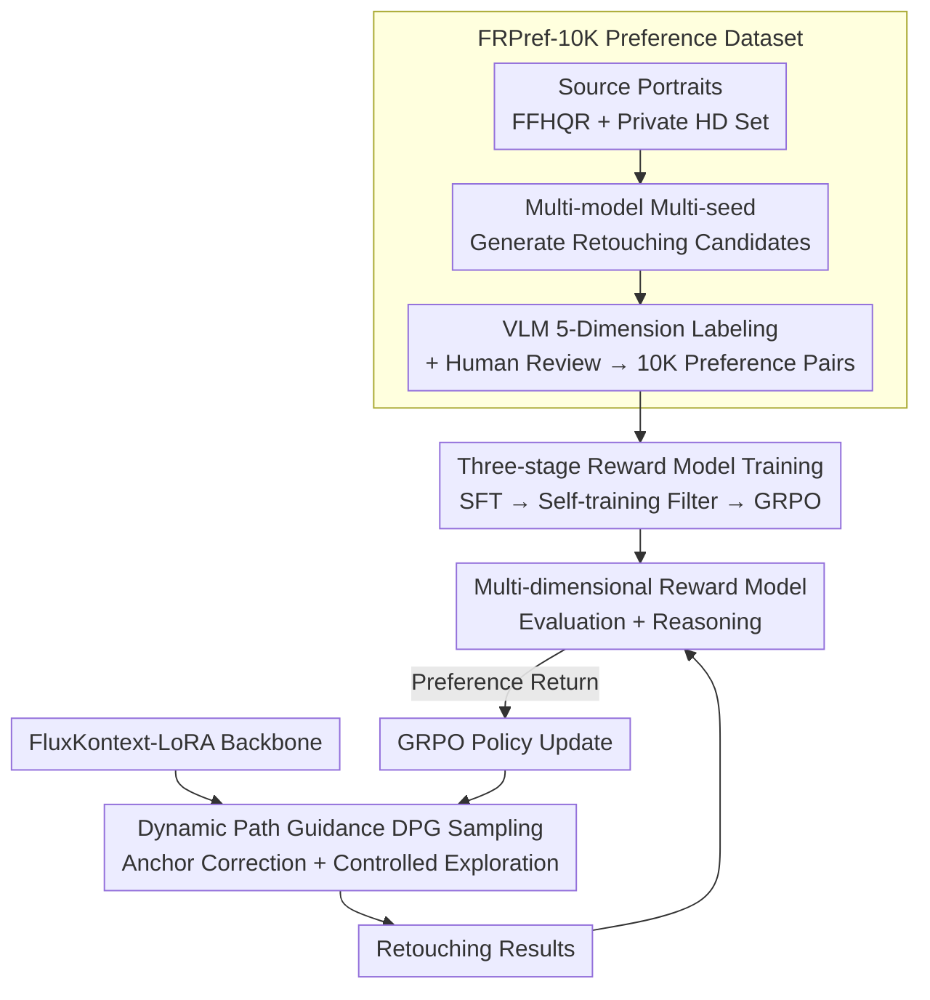

# BeautyGRPO: Aesthetic Alignment for Face Retouching via Dynamic Path Guidance and Fine-Grained Preference Modeling

**Conference**: CVPR2026  
**arXiv**: [2603.01163](https://arxiv.org/abs/2603.01163)  
**Code**: TBD (Project Page Available)  
**Area**: Image Generation/Face Restoration  
**Keywords**: Face Retouching, Reinforcement Learning, Aesthetic Alignment, Flow Matching, Preference Modeling, GRPO, Dynamic Path Guidance

## TL;DR

Ours proposes BeautyGRPO, a reinforcement learning-based face retouching framework. By constructing a fine-grained preference dataset FRPref-10K to train a specialized reward model and designing a Dynamic Path Guidance (DPG) mechanism to balance random exploration and high fidelity, the framework achieves natural retouching results aligned with human aesthetic preferences.

## Background & Motivation

**High Demand for Face Retouching**: The popularity of social media and photography devices drives a growing demand for high-quality face retouching. Tasks require removing defects like acne and blemishes while preserving identity features such as moles and pores.

**Fundamental Limitations of Supervised Learning**: Existing methods (CNN-based, Transformer-based) rely on pixel-level supervised training, which can only mimic annotated images and fails to capture complex subjective aesthetic preferences, resulting in visually stiff and unnatural outputs.

**Supervision Ceiling Problem**: Pixel-level reconstruction targets lead models to overfit specific retouching styles, preventing them from discovering solutions that surpass the aesthetic quality of the training data.

**Deficiencies of General Image Editing Models**: Large models like NanoBanana and SeedDream can perform retouching but often produce unnatural effects such as identity changes, oily/plastic skin textures, and artifacts.

**Fidelity Conflict in Online RL**: T2I-RL frameworks like FlowGRPO achieve exploration by injecting random noise (SDE), but accumulated random drift severely damages the high fidelity required for face retouching, introducing obvious noise artifacts.

**Insufficiency of Reward Models**: Existing T2I reward models (ImageReward, HPSv2) mainly focus on global aesthetics or text-image consistency, lacking the ability to evaluate fine-grained perceptual dimensions such as skin smoothness, blemish removal, and texture preservation.

## Method

### Overall Architecture

BeautyGRPO aims to break the "supervision ceiling where models only mimic annotations to produce plastic faces" by using reinforcement learning to align face retouching with human aesthetic preferences. It consists of three components: a fine-grained preference dataset FRPref-10K providing training signals, a multi-dimensional reward model quantizing "aesthetics" into optimizable returns, and a Dynamic Path Guidance (DPG) algorithm to pull trajectories back to the high-fidelity manifold during RL exploration. The backbone is FluxKontext-LoRA, first fine-tuned with LoRA and then trained via RL.

### Key Designs

**1. FRPref-10K Preference Dataset: Constructing Fine-grained Aesthetic Labels**

General reward models only understand global aesthetics or image-text consistency and cannot measure retouching-critical dimensions like skin smoothness, blemish removal, and texture preservation. FRPref-10K samples source portraits from FFHQR and private high-resolution sets (ensuring diversity in demographics and shooting conditions). For each image, retouching candidates are generated using multiple models (NanoBanana, FluxKontext, RetouchFormer) under different random seeds. 10,000 preference pairs are constructed through inter-model (output vs. output) and output-label comparisons. The labeling follows a hybrid process: multiple VLMs (GPT-4o, Qwen2.5-VL-72B, Gemini 2.5 Pro) provide structured reasoning across five dimensions (skin smoothness, blemish removal, texture quality, clarity, identity preservation). Human auditors review samples under the same standards, with senior experts resolving disagreements.

**2. Three-stage Reward Model Training: From Structured Reasoning to GRPO Robustification**

The reward model is based on Qwen2.5-VL-7B and adopts the UnifiedReward-Thinking paradigm in three steps: Stage 1 involves SFT on a 2K subset, enabling the model to write five-dimension structured reasoning in the `<think>` block and provide preference decisions in the `<answer>` block; Stage 2 uses the Stage 1 model to generate multiple reasoning trajectories for the remaining 8K samples, filtering for consistent trajectories based on preference correctness and reasoning coherence before further SFT; Stage 3 applies GRPO to samples that remain inconsistent, encouraging the exploration of diverse reasoning paths, supervised jointly by outcome rewards (preference accuracy) and process rewards (DeBERTa-V3 evaluating reasoning coherence). The resulting reward model can both judge quality and provide justifications.

**3. Dynamic Path Guidance (DPG): Ensuring RL Exploration without Compromising Realism**

FlowGRPO converts ODEs to SDEs and explores by injecting noise $\sigma_t d\omega$; however, cumulative random drift shifts trajectories away from the high-fidelity manifold, introducing artifacts. DPG re-plans the guidance trajectory at each sampling step to pull the current state back toward the high-fidelity manifold near an anchor while maintaining controlled exploration. First, high-preference samples from FRPref-10K are used as stable anchors $x_0^{\text{anchor}}$ (introduced only during sampling, not as supervision targets). A linear ODE trajectory is re-planned between the current state $x_t$ and the anchor to calculate the next target $x_{t-\Delta t}^* = (\Delta t/t) x_0^{\text{anchor}} + (1 - \Delta t/t) x_t$. This yields a correction vector $z_t^{\text{anchor}} = (x_{t-\Delta t}^* - \mu_t) / \sigma_{\text{step}}$ to pull the trajectory toward the anchor. This is mixed with standard noise: $z_t^{\text{mix}} = \lambda(t) z_t^{\text{anchor}} + (1-\lambda(t)) z_t^{\text{std}}$, where $\lambda(t) = t / \max(1, T-1)$ ensures early steps use anchor guidance to correct structure while later steps use random noise for fine-grained exploration. To save computation, the full trajectory is divided into $K=3$ segments; in each segment, only one random time step performs a DPG update while others follow the ODE.

### Loss & Training

A GRPO objective (clipped surrogate objective) is used alongside normalized advantages $\hat{A}^i$. Under DPG, transition probabilities follow a Gaussian distribution $\mathcal{N}(\mu_{\text{new}}, \sigma_{\text{new}}^2 I)$, where $\mu_{\text{new}} = (1-\lambda)\mu_t + \lambda x_{t-\Delta t}^*$ and $\sigma_{\text{new}} = (1-\lambda)\sigma_{\text{step}}$, used to compute the stepwise likelihood ratio $r_t(\theta)$ for policy updates.

## Key Experimental Results

### Experimental Setting

- **Backbone**: FluxKontext + LoRA fine-tuning
- **Data**: 1,000 images from FFHQR test set + 1,000 in-the-wild internet portraits
- **Metrics**: No-reference perceptual/aesthetic metrics (NIQE↓, NIMA↑, MUSIQ↑, MANIQA↑, NRQM↑, TOPIQ↑) + ArcFace identity preservation + FID
- **Hardware**: 8×H20 GPUs

### Main Results

| Method | Category | NIQE↓ | NIMA↑ | MUSIQ↑ | MANIQA↑ | TOPIQ↑ | ArcFace↑ |
|------|------|-------|-------|--------|---------|--------|----------|
| RetouchFormer | Specialized | 11.153 | 4.723 | 4.465 | 1.036 | 0.605 | 0.986 |
| NanoBanana | Gen. Editing | 11.301 | 4.919 | 4.681 | 1.009 | 0.621 | 0.889 |
| FluxKontext+LoRA | Baseline | 12.913 | 4.694 | 4.459 | 1.035 | 0.601 | 0.973 |
| FlowGRPO | RL Baseline | 15.024 | 4.573 | 4.271 | 0.935 | 0.571 | 0.882 |
| **BeautyGRPO (Ours)** | **RL** | **10.831** | **5.123** | **4.906** | **1.079** | **0.676** | 0.952 |

### User Study

| Method | VRetouchEr | RetouchFormer | NanoBanana | Kontext LoRA | **Ours** |
|------|-----------|---------------|------------|-------------|---------|
| Win Rate | 6.50% | 8.50% | 9.75% | 12.00% | **63.25%** |

100 participants voted on preferences for 20 sets of test samples; BeautyGRPO significantly outperformed all baselines with a 63.25% win rate.

### Ablation Study

**Reward Model Comparison**: Replacing the reward model with different editing reward models shows that the proposed RM surpasses EditReward, EditScore, and UnifiedReward-Edit across NIMA (5.123), MUSIQ (4.906), MANIQA (1.079), and TOPIQ (0.676).

**Backbone Generalization**: Applying BeautyGRPO to Qwen-Image-Edit improved NIMA from 4.571 (original)/4.824 (+LoRA) to 5.351 (+BeautyGRPO), and TOPIQ from 0.563 to 0.664.

**Impact of DPG Steps K**: $K=3$ and $K=5$ showed similar performance, but $K=3$ was faster and thus chosen as the default.

### Key Findings

- Applying FlowGRPO directly to face retouching leads to severe degradation (NIQE 15.024 vs. 10.831), validating the necessity of DPG.
- Although BeautyGRPO's FID is slightly higher than the best supervised baseline (4.054 vs. 2.229), this is because the model explores superior aesthetic solutions beyond the training label distribution.
- ArcFace scores remain high (0.952/0.944), indicating identity remains robust during aesthetic enhancement.

## Highlights & Insights

- First to introduce RL alignment based on human aesthetic preferences to the face retouching task, breaking the supervised learning ceiling.
- Sophisticated DPG mechanism: anchor guidance combined with time-dependent mixing coefficients achieves an elegant balance between fidelity and exploration.
- Three-stage reward model training (SFT → Self-training → GRPO) combined with a five-dimension evaluation system provides fine-grained feedback for retouching.
- User study win rate of 63.25%, far exceeding the second best at 12%, provides convincing qualitative evidence.

## Limitations & Future Work

- While large, the FRPref-10K dataset relies on specific VLM sets for labeling; annotation bias might propagate to the reward model.
- The impact of the anchor selection strategy on result quality is not fully analyzed; the method for matching anchors to input images is unclear.
- Evaluation was mainly on FFHQR and internet portraits; robustness in difficult scenarios (extreme lighting, large angles, severe occlusion) was not explored.
- ArcFace scores are slightly lower than some supervised methods (0.952 vs. 0.986); the trade-off between identity preservation and aesthetic enhancement can be further optimized.
- Computational costs were not fully discussed (8×H20 training, DPG introduces overhead during inference).

## Related Work & Insights

- **Specialized Retouching Models**: ABPN, RestoreFormer(++), VRetouchEr, RetouchFormer — rely on supervised learning, limited by pixel-level targets.
- **General Editing Models**: NanoBanana, ICEdit, SeedDream4.0, FluxKontext — powerful but lack fine-grained naturalness for retouching.
- **RL Alignment for Diffusion Models**: DDPO, DPOK (Policy Gradient), DiffusionDPO (Offline), FlowGRPO (Online SDE Exploration) — BeautyGRPO adds DPG to FlowGRPO to solve fidelity issues.
- **Reward Modeling**: ImageReward, HPSv2, EditScore, EditReward, UnifiedReward — lack fine-grained dimensions for retouching.

## Rating

- Novelty: ⭐⭐⭐⭐ — The DPG mechanism and retouching-oriented preference alignment are a novel combination, though the core GRPO framework is inspired by FlowGRPO.
- Experimental Thoroughness: ⭐⭐⭐⭐ — Quantitative + Qualitative + User Study + multiple ablations + cross-backbone validation covering comprehensive metrics.
- Writing Quality: ⭐⭐⭐⭐ — Clear structure, well-argued motivation, and complete mathematical derivations.
- Value: ⭐⭐⭐⭐ — The first work to systematically introduce RL preference alignment to face retouching, opening a new direction.

<!-- RELATED:START -->

## Related Papers

- [\[CVPR 2026\] Fine-Grained GRPO for Precise Preference Alignment in Flow Models](fine-grained_grpo_for_precise_preference_alignment_in_flow_models.md)
- [\[CVPR 2026\] SpatialReward: Verifiable Spatial Reward Modeling for Fine-Grained Spatial Consistency in Text-to-Image Generation](spatialreward_verifiable_spatial_reward_modeling_for_fine-grained_spatial_consis.md)
- [\[CVPR 2026\] Towards Fine-Grained Attribution: Instance-Aware Preference Optimization for Aligning Diffusion Models](towards_fine-grained_attribution_instance-aware_preference_optimization_for_alig.md)
- [\[CVPR 2026\] CogniEdit: Dense Gradient Flow Optimization for Fine-Grained Image Editing](cogniedit_dense_gradient_flow_optimization_for_fine-grained_image_editing.md)
- [\[ICLR 2026\] LaTo: Landmark-tokenized Diffusion Transformer for Fine-grained Human Face Editing](../../ICLR2026/image_generation/lato_landmark-tokenized_diffusion_transformer_for_fine-grained_human_face_editin.md)

<!-- RELATED:END -->
