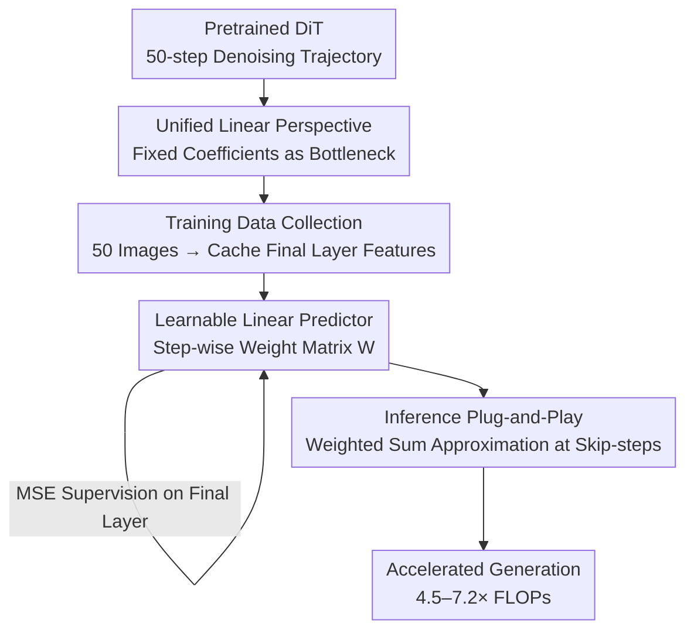

# Beyond Fixed Formulas: Data-Driven Linear Predictor for Efficient Diffusion Models

**Conference**: CVPR 2026  
**arXiv**: [2604.26365](https://arxiv.org/abs/2604.26365)  
**Code**: https://github.com/Aredstone/L2P-Cache (Available)  
**Area**: Diffusion Models / Image Generation / Inference Acceleration  
**Keywords**: Feature Caching, Diffusion Transformer, Learnable Linear Prediction, Training-free Acceleration, Feature Prediction

## TL;DR
This paper proves that "predictive feature caching" methods such as TaylorSeer and FoCa mathematically degenerate into **fixed-coefficient linear combinations** of historical features. Demonstrating that DiT feature trajectories are inherently highly linearly reconstructible, the authors propose $L^2P$—replacing hand-derived fixed coefficients with a set of **learnable linear weights for each timestep**. Using only 50 images and 20 seconds of training on a single GPU, it accelerates diffusion sampling by 4.5–7.2× on FLUX/Qwen-Image while maintaining significantly higher PSNR than existing methods.

## Background & Motivation

**Background**: Diffusion Transformer (DiT) represents the current SOTA for image/video generation, but the sampling process requires repeated Transformer forward passes across dozens of timesteps, incurring massive computational overhead. The most practical training-free acceleration involves **feature caching**: leveraging the temporal coherence of denoising features to reuse or predict hidden features at skipped steps, thereby bypassing expensive forward passes.

**Limitations of Prior Work**: Early "cache-then-reuse" methods directly copy features from anchor steps to subsequent steps. however, as skip intervals increase, feature similarity decays rapidly, leading to error accumulation and image distortion. A new generation of "cache-then-forecast" methods (e.g., TaylorSeer using Taylor expansion, FoCa using BDF2+Heun correction, FreqCa using polynomials) treats feature evolution as a time series for extrapolation. However, these prediction formulas are derived from classical numerical methods, with coefficients determined a priori by hyperparameters like expansion order, step size, and prediction distance.

**Key Challenge**: The authors prove a fundamental fact: whether using Taylor expansion or BDF2, approximating derivatives via finite differences is mathematically **equivalent to a weighted sum of historical features with fixed coefficients** (Observation 1). Consequently, the expressive power of this class of methods is restricted by whether these linear coefficients are optimal. These fixed coefficients are identical across all models and feature distributions, making them sub-optimal, difficult to generalize, and fragile at high acceleration ratios.

**Key Insight**: The authors investigate whether the bottleneck stems from "using fixed coefficients" or the "linear framework itself." They perform a verification (Observation 2): by orthogonally projecting the current feature $\mathcal{F}(x_t)$ onto the subspace spanned by historical features and measuring the **relative projection residual**, they find that approximately 90% of denoising steps have a residual smaller than 5% (fidelity $>0.95$). This indicates the linear framework is sufficient; the issue lies solely in the rigid coefficients.

**Goal**: Retain the efficient linear prediction framework but replace hand-derived fixed coefficients $\alpha_j$ with **data-driven, per-timestep learnable** weights $W$. This allows the model to approximate the "optimal linear projection," bridging the performance gap between fixed coefficients and theoretical optima.

## Method

### Overall Architecture
$L^2P$ (Learnable Linear Predictor) shifts the paradigm from "designing complex extrapolation formulas" to "learning a set of linear weights." Its input is the denoising feature trajectory of a pretrained DiT, and its output is a lightweight predictor: for any skipped step $t$, it approximates $\mathcal{F}(x_t)$ using a learnable weighted sum of previously cached historical features $\{\mathcal{F}(x_0),\dots,\mathcal{F}(x_{t-1})\}$. The pipeline consists of four stages: feasibility anchoring via theoretical analysis, offline trajectory collection for supervision, training the per-step weight matrix, and plug-and-play inference.

### Key Designs

**1. Unified Linear Perspective: Revealing the Fixed-Coefficient Essence of "Complex Formulas"**

This serves as the theoretical starting point, addressing the fact that "predictive caching" variants are essentially identical. The authors expand the $m$-th order Taylor expansion used in TaylorSeer: any $i$-th order finite difference can be recursively written as a binomial weighted sum of historical features $\Delta^i\mathcal{F}(x_t^l)=\sum_{j=0}^{i}(-1)^j\binom{i}{j}\mathcal{F}(x_{t-jN}^l)$. Substituting this back into the expansion, the predicted value collapses to:
$$\hat{\mathcal{F}}(x_{t+k}^l)=\sum_{j=0}^{m}\alpha_j\cdot\mathcal{F}(x_{t-jN}^l)$$
where each $\alpha_j$ is a fixed scalar determined a priori. The same applies to FoCa: substituting BDF2 derivative approximations into the predictor-corrector steps results in $\mathcal{F}_c(x_{k+1}^l)$ being a weighted sum of historical features (e.g., $\tfrac{7}{3}\mathcal{F}(x_k^l)-\tfrac{5}{3}\mathcal{F}(x_{k-1}^l)+\tfrac{1}{3}\mathcal{F}(x_{k-2}^l)$). Conclusion: the expressive upper bound is locked by "non-adaptive coefficients," causing failure at high acceleration ratios.

**2. Projection Fidelity Measurement: Proving the Linear Framework is Sufficient**

To ensure the bottleneck isn't the linear framework itself, the authors conduct a non-parametric "ideal upper bound" experiment. Instead of using formula-based coefficients, they calculate the orthogonal projection of the current final-layer feature $\mathcal{F}(x_t)$ onto the subspace $V_t=\mathrm{span}(\mathcal{F}(x_0),\dots,\mathcal{F}(x_{t-1}))$, denoted as $\mathcal{F}^*(x_t)=\mathrm{Proj}_{V_t}(\mathcal{F}(x_t))$, representing the minimum possible linear prediction error. Using the relative residual $\frac{\|\mathcal{F}(x_t)-\mathcal{F}^*(x_t)\|_2}{\|\mathcal{F}(x_t)\|_2}$, results show that residuals are $<5\%$ for 90% of the 50 steps. This confirms that the framework is viable and only requires learnable coefficients to approach $\mathcal{F}^*$.

**3. Step-wise Learnable Weight Matrix: Optimizing Coefficients in 20 Seconds with 50 Images**

$L^2P$ implements the predictor as a lightweight weight matrix $W\in\mathbb{R}^{49\times 49}$. The first $t$ elements of the $t$-th row $W_t$ are the linear coefficients for predicting $\mathcal{F}(x_t)$ as $\hat{\mathcal{F}}(x_t)=\sum_{j=0}^{t-1}W_{t,j}\cdot\mathcal{F}(x_j)$. Training requires running a standard 50-step denoising for 50 images to cache supervision pairs $(X_t, Y_t)$, optimized via L2 loss $W^*=\arg\min_W \mathbb{E}_{\mathcal{D}}[\mathcal{L}(\hat{\mathcal{F}}(x_t),\mathcal{F}(x_t))]$. A key insight is the initialization: setting all coefficients to 0 except $W_{t,t-1}=1$ (the most recent step), which is equivalent to naive feature caching. This allows the optimization to start from a reasonable baseline, converging in ~20s on an A100. It fits only the **final layer** features to minimize overhead.

### Loss & Training
The objective is the L2 (Mean Squared Error) loss of final-layer feature prediction. Optimization runs for 200 epochs with a learning rate of 0.01, using trajectories from 50 LLM-generated prompts. The predictor is a $49\times 49$ matrix independent of the DiT, enabling plug-and-play usage without modifying original model weights.

## Key Experimental Results

### Main Results
FLUX.1-dev Text-to-Image (Original 50 steps: 26.25s / 3719.50 TFLOPs):

| Method | FLOPs Speedup | PSNR↑ | SSIM↑ | LPIPS↓ |
|--------|------|------|----------|------|
| TaylorSeer ($\mathcal{N}=5$) | 4.16× | 29.328 | 0.6994 | 0.3457 |
| FoCa ($\mathcal{N}=5$) | 4.16× | 29.413 | 0.7142 | 0.3082 |
| **Ours ($\mathcal{N}=5$)** | **4.55×** | **31.459** | **0.8028** | **0.2147** |
| FoCa ($\mathcal{N}=7$) | 5.55× | 29.193 | 0.6620 | 0.3876 |
| **Ours ($\mathcal{N}=7$)** | **5.56×** | **30.627** | **0.7524** | **0.2828** |
| FoCa ($\mathcal{N}=8$) | 6.24× | 29.047 | 0.6375 | 0.4195 |
| **Ours ($\mathcal{N}=10$)** | **7.14×** | **30.031** | **0.7113** | **0.3545** |

At $\mathcal{N}=5$, the method achieves 4.55× FLOPs reduction and 4.15× latency speedup (6.32s), with a PSNR of 31.459, vastly outperforming TaylorSeer/FoCa (~29.3–29.4). The advantage widens at higher speedups: at $\mathcal{N}=10$ (7.14× FLOPs), PSNR remains 30.031, while all baselines drop below 29.1.

Qwen-Image (Original 50 steps: 127.40s / 12917.56 TFLOPs): At $\mathcal{N}=7$, it yields 5.59× FLOPs and 4.52× latency with 30.62 PSNR. When applied to the highly optimized Qwen-Image-Lightning-8steps ($\mathcal{N}=3$), it provides an additional 2.00× FLOPs reduction with 32.068 PSNR, nearly lossless.

### Ablation Study

Training Sample Size (FLUX, Fixed $\mathcal{N}=10$ / 7.14× FLOPs):

| Training Samples | PSNR↑ | LPIPS↓ | Notes |
|------|---------|------|------|
| 5 | 29.412 | — | Outperforms TaylorSeer($\mathcal{N}=9$) at 28.381 |
| 10 | 29.810 | 0.3544 | Significant jump |
| 50 | 30.031 | 0.3545 | Peak performance |
| 100 | 30.019 | 0.3531 | Saturation |

Training Data Semantics (DrawBench, vs. TaylorSeer):

| Configuration | $\mathcal{N}=7$ PSNR | $\mathcal{N}=10$ PSNR | Notes |
|------|---------|------|------|
| Random (Normal prompts) | 30.627 | 30.031 | Baseline |
| Counterfactual | 30.707 | 30.093 | Consistent with Random |
| Gibberish | 30.430 | 29.787 | Slight drop but still > TaylorSeer |

### Key Findings
- **High Data Efficiency**: 5 images are effective, 50 reach peak, and 100 saturate. This is because the model only learns a small number of linear coefficients.
- **Learning Evolution Dynamics, Not Semantics**: Training on gibberish prompts still maintains 30.4 PSNR ($\mathcal{N}=7$), proving the predictor captures content-agnostic linear laws of feature evolution, explaining its stable generalization.
- **Scaling Advantage**: Baselines collapse at $\mathcal{N} \ge 7$ (SSIM drops to 0.5–0.6), whereas $L^2P$ maintains 0.71–0.75, showing better robustness for long-range extrapolation.

## Highlights & Insights
- **Clean Argumentation Protocol**: The paper follows a "Unify-Diagnose-Prescribe" logic—reducing SOTA methods to a unified linear form, identifying the bottleneck via residual experiments, and solving it by learning the coefficients.
- **Initialization Strategy**: Initializing $W_{t,t-1}=1$ (naive cache) ensures optimization starts from a valid baseline, enabling 20-second convergence.
- **Fitting Only Final Layer**: Avoids the memory/compute explosion of per-layer modeling, compressing the predictor into a tiny $49\times 49$ matrix with zero overhead.

## Limitations & Future Work
- **Fixed Schedule Dependency**: The weight matrix size is tied to the 50-step trajectory; changing the sampler or step count requires retraining.
- **Per-model Weights**: While learnable, the weights are currently model-specific, and cross-architecture generalization evidence is absent.
- **Linear Boundaries**: The 10% of steps with higher residuals (>5%) might be critical for image quality; how these nonlinearities impact stability at extreme speedups requires further study.
- **Video Results**: Results on HunyuanVideo are limited to the appendix; evidence for long-sequence temporal robustness is relatively thin.

## Related Work & Insights
- **vs. TaylorSeer/FoCa**: These use Taylor or BDF2 derivatives with fixed coefficients. $L^2P$ proves they are sub-optimal and achieves ~1–2 higher PSNR at equal FLOPs.
- **vs. Reuse-based Methods (FORA, TeaCache, etc.)**: These degrade significantly at $\mathcal{N} \ge 5$; $L^2P$ offers superior robustness by learning "optimal" extrapolation rules.
- **Mechanism Insight**: When researchers compete over "more sophisticated manual formulas," reducing those formulas to a parameterized form often reveals that the true freedom lies in the coefficients. Entrusting these to data can surpass the ceiling of manual design.

## Rating
- Novelty: ⭐⭐⭐⭐⭐ 
- Experimental Thoroughness: ⭐⭐⭐⭐ 
- Writing Quality: ⭐⭐⭐⭐⭐ 
- Value: ⭐⭐⭐⭐⭐ 

<!-- RELATED:START -->

## Related Papers

- [\[CVPR 2026\] Decoupled Residual Denoising Diffusion Models for Unified and Data Efficient Image-to-Image Translation](decoupled_residual_denoising_diffusion_models_for_unified_and_data_efficient_ima.md)
- [\[CVPR 2026\] Beyond Objects: Contextual Synthetic Data Generation for Fine-Grained Classification](beyond_objects_contextual_synthetic_data_generation_for_fine-grained_classificat.md)
- [\[CVPR 2026\] High-Fidelity Virtual Try-On beyond Paired Data Scarcity via Diffusion-based Cycle-Consistent Learning](high-fidelity_virtual_try-on_beyond_paired_data_scarcity_via_diffusion-based_cyc.md)
- [\[CVPR 2026\] TAP: A Token-Adaptive Predictor Framework for Training-Free Diffusion Acceleration](tap_a_token-adaptive_predictor_framework_for_training-free_diffusion_acceleratio.md)
- [\[CVPR 2026\] Beyond the Golden Data: Resolving the Motion-Vision Quality Dilemma via Timestep Selective Training](beyond_the_golden_data_resolving_the_motion-vision_quality_dilemma_via_timestep_.md)

<!-- RELATED:END -->
