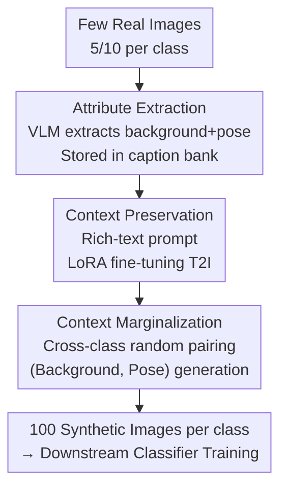

# Beyond Objects: Contextual Synthetic Data Generation for Fine-Grained Classification

**Conference**: CVPR 2026  
**arXiv**: [2510.24078](https://arxiv.org/abs/2510.24078)  
**Code**: None  
**Area**: Diffusion Models / Synthetic Data / Fine-Grained Classification  
**Keywords**: Text-to-Image Fine-tuning, Synthetic Training Data, Fine-Grained Classification, Contextual Marginalization, Backdoor Adjustment

## TL;DR
Addressing the issue where synthetic data generated by text-to-image (T2I) models for classifier training suffers from overfitting in fine-grained, few-shot scenarios, BOB explicitly extracts **class-agnostic context** (background, pose) from real images. These attributes are conditioned into prompts during fine-tuning to preserve diversity priors, and randomly paired across classes during generation to marginalize spurious associations. This improves CLIP classification accuracy on the Aircraft dataset from DataDream's 50.0% to 57.4%.

## Background & Motivation
**Background**: Text-to-Image (T2I) models, trained on internet-scale data, possess strong "world priors" and are increasingly used to generate synthetic training data for downstream classification tasks. The most direct approach involves providing text descriptions of a classification task (e.g., "distinguish between 747-300 and 747-400") and prompting the T2I model to generate training images for each category.

**Limitations of Prior Work**: A discrepancy exists between the learned distribution of T2I models and target tasks, known as **model estimation error**. T2I models often lack accurate knowledge of fine-grained categories (e.g., specific aircraft models), generating images with low-level artifacts or compositional errors that fail to assist in fine-grained recognition where differences may only manifest in winglets. A natural remedy is fine-tuning the T2I model on a few real images. However, in few-shot settings (5/10 images per class), the added expressivity from fine-tuning causes the model to **overfit to the sparse samples**, collapsing diversity and losing the world prior.

**Key Challenge**: Few-shot fine-tuning involves a trade-off between "fidelity" and "diversity." More critically, overfitting occurs in **two modalities**: the text side—where classification data lacks intra-class visual range and flattens T2I controllability with a single label (e.g., "a photo of a [class]"); and the image side—where insufficient coverage leads the model to treat **accidental context** (background/pose) as class features, learning spurious inter-class associations.

**Goal**: To make fine-tuned T2I models both accurate and diverse without binding class-agnostic factors like background and pose to class labels.

**Key Insight**: In fine-grained classification, **background and pose are class-agnostic attributes** that should not influence the identity of the object (e.g., the aircraft model). Rather than allowing the model to implicitly entangle these factors with categories in few-shot data, they should be **explicitly extracted and controlled**: conditioned as "Background X, Pose Y" during fine-tuning, and randomly recombined during generation.

**Core Idea**: Use a captioning model to extract class-agnostic context from each real image. **Preserve context via conditioning during fine-tuning, and marginalize context across classes during generation**. Formally, this is equivalent to a backdoor adjustment on class-agnostic variables, decoupling spurious correlations and maintaining diversity.

## Method

### Overall Architecture
BOB (Beyond OBjects) takes 5/10 real images per class as input and outputs 100 synthetic images per class to augment downstream classifiers (CLIP / ResNet-50 / MAE). The pipeline involves three sequential stages: attribute extraction $\rightarrow$ context-preserved fine-tuning $\rightarrow$ marginalized context generation. First, a Vision-Language Model (VLM) extracts background and pose phrases into a caption bank. During fine-tuning, these attributes are included in prompt templates for LoRA fine-tuning of the T2I model. In the generation phase, background and pose are no longer tied to their source images but are **randomly sampled as pairs (background, pose) from the caption bank across categories**, forcing each class to be synthesized with various contexts from the entire dataset, thereby marginalizing the context.

### Key Designs

**1. Attribute Extraction & Caption Bank: Decoupling class-agnostic context from images**

Classification datasets typically provide only a class label, leaving T2I fine-tuning to collapse all visual variations (background, pose) into the class concept. BOB uses Qwen2.5-VL-7B to extract two types of attributes for each training image: background and pose. The prompt is designed as "describe the background of the [descriptor] in as few words as possible. Refer to the [descriptor] as simply 'a [descriptor]'" to ensure accuracy while **preventing category-specific information from leaking** into attributes (e.g., saying "on the runway" instead of "on the runway for a 747-400"). Extracted pairs $(b_i, p_i)$ are stored in a caption bank $\mathcal{B}=\{(b_i,p_i)\}_{i=1}^{N}$.

**2. Context Preservation: Restoring intra-class diversity during fine-tuning**

This step addresses text-side overfitting. Instead of using a single "a photo of a [classname]" template that flattens visual diversity, BOB assigns a **unique descriptive caption** to each image: `a [descriptor] photo of a [classname] in the [background] background with the [pose] pose`. This explicitly associates attributes with visual context, teaching the model the intra-class visual range. LoRA is used to update the U-Net and CLIP text encoder attention layers by minimizing:
$$\mathbb{E}_{(x,y)\sim D,\,\epsilon\sim\mathcal{N},\,t\sim\mathcal{U}}\,\|\epsilon-\epsilon_{\theta}(x,c_{\theta}(y),t)\|_{2}^{2}$$
Crucially, this step alone can degrade performance (e.g., 68% $\rightarrow$ 65.90%) because correlations in few-shot data remain biased; it must be combined with the next step.

**3. Context Marginalization: Decoupling spurious associations via backdoor adjustment**

This step addresses image-side overfitting. BOB uses the preserved context attributes and **shuffles them** during generation to prevent the model from solidifying accidental correlations. Formally, an image $X$ is generated by class-related attributes $Y$ and class-agnostic attributes $Z$ (context). To model the relationship between $X$ and $Y$ while cutting the confounding effect of $Z$, BOB samples from the intervention distribution $P(X \mid do(Y))$, expanded via backdoor adjustment as:
$$P(X\mid do(Y))=\sum_{Z}P(X\mid Y,Z)\,P(Z)$$
In practice, $P(Z)$ is sampled by **randomly selecting a $(b, p)$ pair from the caption bank $\mathcal{B}$ independently of the class label** $Y$. This exposes every class to all contexts present in the dataset, forcing the classifier to focus on true class-defining visual features.

## Key Experimental Results

### Main Results (Few-shot Classification, Tab. 1)
Evaluated across three backbones (CLIP / ImageNet-ResNet-50 / MAE) $\times$ four datasets $\times$ two SD versions. Below are representative 5-shot accuracy (%) results:

| Backbone / SD | Method | Aircraft | Car | CUB | Pets | Avg |
| ----------- | ----------- | ----------- | ----- | ----- | ------ | ----- |
| CLIP / v2.1 | Real Only | 44.37 | 79.01 | 67.72 | 92.76 | 70.97 |
| CLIP / v2.1 | DataDream | 50.04 | 84.58 | 70.74 | 92.67 | 74.51 |
| CLIP / v2.1 | **BOB** | **57.37** | **88.41** | **75.43** | 92.73 | **78.49** |
| ImageNet / v2.1 | DataDream | 54.58 | 86.15 | 67.40 | 84.85 | 73.25 |
| ImageNet / v2.1 | **BOB** | **60.31** | **88.64** | **71.38** | **87.00** | **76.83** |
| MAE / v2.1 | DataDream | 58.54 | 85.81 | 69.07 | 80.38 | 73.45 |
| MAE / v2.1 | **BOB** | **61.21** | **88.48** | **73.21** | 86.72 | **77.41** |

- **Gain**: BOB improves CLIP/v2.1 accuracy on Aircraft by **+7.4%** over DataDream.
- Over 24 experimental settings, BOB leads in 18 cases by at least 2%. In others (mainly Pets), it matches SOTA where baseline performance is already near saturation.

### Key Finding: 5-shot + BOB outperforms 10-shot Real
Across CLIP/ImageNet/MAE, **5-shot real images + BOB synthetic data** outperform **10-shot real images** on almost all datasets except Pets. Most notably, for Cars (ImageNet backbone), 5-shot+BOB achieves 88.64% vs. 10-shot real only at 78.50% (+10.14%).

### Ablation Study (Tab. 4, 10-shot Aircraft + ResNet-50)

| Preservation | Marginalization | Accuracy |
| :---: | :---: | :---: |
| ✗ | ✗ | 68.00 (= DataDream) |
| ✓ | ✗ | 65.90 |
| ✗ | ✓ | 70.13 |
| ✓ | ✓ | **73.78** |

### Key Findings
- **Coupling of Components**: Preservation alone decreases performance to 65.90%, as it reinforces spurious correlations without shuffling. Marginalization alone reaches 70.13%. Their combination is essential for the 73.78% peak.
- **Distillation vs. Alignment**: Using a stronger captioner (GPT-4o) does not yield significant gains, while a weaker one (Qwen-3B) only causes a minor drop. Gains stem from distribution alignment rather than captioner distillation.
- **Marginalization vs. Diversity**: Sampling contexts only within the same class (low diversity) gives 64.38%. Using GPT to generate 100 novel contexts (high diversity) gives 72.10%. BOB's cross-class sampling of real contexts yields the highest result (73.78%), proving that marginalizing spurious correlations is more effective than just increasing diversity.

## Highlights & Insights
- **Revisiting Diversity as Backdoor Adjustment**: BOB moves beyond "fancier prompts" to a causal framework. The distinction between "high diversity within class" and "marginalization across classes" is a key takeaway.
- **Unified Caption Bank**: The design is efficient, using one set of extracted attributes for both conditional fine-tuning and shuffled generation.
- **Portability**: This framework can be applied to other tasks (e.g., detection/segmentation) where class-agnostic confounders exist in few-shot synthetic generation.
- **Generalized Descriptors**: Using generic terms like [descriptor] in VLM prompts avoids leaking category-specific cues into background/pose descriptions.

## Limitations & Future Work
- **Attribute Dependency**: BOB relies on manually specified class-agnostic attributes (background, pose). Automatically discovering these remains an open problem.
- **Coarse-Grained Scaling**: Applying this to datasets like ImageNet is difficult because categories and backgrounds are often naturally coupled, and marginalization might destroy category semantics.
- **Pipeline Sensitivity**: Performance depends on VLM accuracy. Errors in attribute extraction propagate through the pipeline.

## Related Work & Insights
- **vs. DataDream / Diff-Aug**: These focus on *which* components to fine-tune. BOB adds context controllability during fine-tuning and shifts the generation objective to marginalization.
- **vs. Diff-II**: While Diff-II improves diversity via latent interpolation or prompt design, BOB shows that causal marginalization of real contexts is more effective than pure diversity.
- **vs. Personalization (DreamBooth)**: Personalization focuses on fidelity to a concept, often reducing inter-class separability. BOB intentionally shuffles context to enhance class separability for training.

## Rating
- Novelty: ⭐⭐⭐⭐ Reformulates synthetic diversity as backdoor adjustment with clean ablation.
- Experimental Thoroughness: ⭐⭐⭐⭐⭐ Extensive testing across 3 backbones, 4 datasets, and multiple baselines.
- Writing Quality: ⭐⭐⭐⭐ Clear causal arguments and methodology.
- Value: ⭐⭐⭐⭐ Significant "5-shot exceeds 10-shot" results; practical for few-shot fine-grained tasks.

<!-- RELATED:START -->

## Related Papers

- [\[CVPR 2026\] PromptEnhancer: Taming Your Rewriter for Text-to-Image Generation via Fine-Grained Reward](promptenhancer_taming_your_rewriter_for_text-to-image_generation_via_fine-graine.md)
- [\[CVPR 2026\] AHS: Adaptive Head Synthesis via Synthetic Data Augmentations](ahs_adaptive_head_synthesis.md)
- [\[CVPR 2026\] SliderEdit: Continuous Image Editing with Fine-Grained Instruction Control](slideredit_continuous_image_editing_with_fine-grained_instruction_control.md)
- [\[CVPR 2026\] Fine-Grained GRPO for Precise Preference Alignment in Flow Models](fine-grained_grpo_for_precise_preference_alignment_in_flow_models.md)
- [\[CVPR 2026\] SpatialReward: Verifiable Spatial Reward Modeling for Fine-Grained Spatial Consistency in Text-to-Image Generation](spatialreward_verifiable_spatial_reward_modeling_for_fine-grained_spatial_consis.md)

<!-- RELATED:END -->
