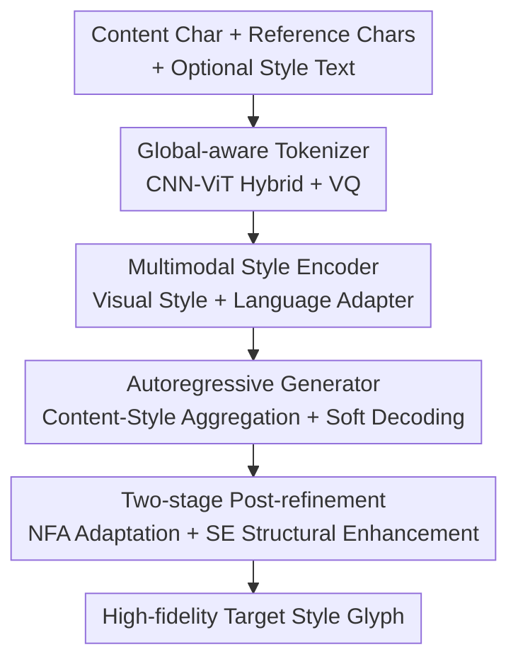

# Beyond Patches: Global-aware Autoregressive Model for Multimodal Few-Shot Font Generation

**Conference**: CVPR 2026  
**arXiv**: [2601.01593](https://arxiv.org/abs/2601.01593)  
**Code**: https://xtryer-s.github.io/projects_pages/GAR_Font (Project Homepage)  
**Area**: Image Generation / Autoregressive Generation / Font Generation  
**Keywords**: Few-shot Font Generation (FFG), Autoregressive Models, Global-aware Tokenizer, Multimodal Style Control, GRPO Post-refinement

## TL;DR
GAR-Font employs a combination of a "global-aware tokenizer + autoregressive generator + lightweight language adapter + GRPO post-refinement" to upgrade few-shot Chinese font generation from image-only patch-level modeling to a multimodal autoregressive framework that balances local strokes with global style. It can supplement style intent with a single text description, matching the generation quality of 8 reference images with only 4 images and 1 sentence.

## Background & Motivation
**Background**: The goal of Few-shot Font Generation (FFG) is to automatically complete entire font sets—such as Chinese and Japanese with tens of thousands of characters and complex stroke structures—given only a few reference characters. Mainstream approaches are divided into three categories: GANs (LF-Font, DG-Font), Diffusion models (Diff-Font, Font-Diffuser), and sequence/autoregressive models that discretize glyphs into token sequences (VQ-Font, IF-Font).

**Limitations of Prior Work**: Each approach has weaknesses in structure or style. GANs show significant deviations from reference styles and poor stroke precision; Diffusion models achieve good local fidelity but fail to ensure global stylistic coordination; existing sequence methods (VQ-Font, IF-Font) follow **2D patch / block-level tokenization**—cutting glyphs into local small blocks before discretization. This strategy fragments global style cues that only emerge at the full-character level, leading to visible stylistic deviations.

**Key Challenge**: Glyphs are unique structured visual objects requiring both **local geometric precision** (strokes/radicals) and **global aesthetic coordination** (whole character). Patch-level tokens are inherently better suited for the former. Recent research in autoregressive image generation also confirms that global contextualized 1D tokens better model overall patterns than 2D patch tokens. Furthermore, existing FFG methods are **unimodal**, relying solely on images for style control while ignoring language—even though designers often use textual descriptions like "slender" or "calligraphic" to express global design intents beyond visual appearance.

**Goal**: (1) Develop a tokenizer capable of capturing both local strokes and global styles; (2) Introduce text as a complementary style channel without expensive joint vision-language pre-training; (3) Further enhance structural fidelity and style consistency for unseen styles in few-shot scenarios.

**Core Idea**: Replace "local patch tokens" with "global-aware autoregressive tokens" to carry the whole-character style. Use a lightweight language adapter to align text descriptions with the learned visual style space, and finally utilize reinforcement learning-based post-refinement to polish structure and style.

## Method

### Overall Architecture
GAR-Font takes a content character (using Kaiti as a skeleton), several reference characters of the same style, and an optional style text as input, outputting a high-fidelity glyph of the target character. The pipeline consists of three main parts: first, **G-Tok** discretizes the glyph into tokens balancing local and global features; then, an **autoregressive generator with a multimodal style encoder** predicts tokens sequentially under content-style conditions and soft-projects them back to the codebook for decoding; finally, **two-stage post-refinement** (few-shot adaptation + structural enhancement) eliminates defects under unseen styles. The training adopts a "decoupling" strategy: pre-training on visual data to establish a stable style-content space before inserting the language adapter for multimodal extension.

### Key Designs

**1. G-Tok Global-aware Tokenizer: Compressing Style into Tokens via CNN-ViT Hybrid + Causal Decoding**

To address the fragmentation of global style by patch-level tokens, G-Tok replaces independent local block discretization with a hybrid "local-to-global" encoding. Given a glyph image $\mathbf{I}\in\mathbb{R}^{H\times W\times 3}$, a CNN encoder $E_{\text{CNN}}$ first extracts stroke features preserving spatial locality. These are flattened, added to 2D sinusoidal position encodings $\mathbf{P}_{\text{2D}}$, and fed into a ViT encoder for global aggregation: $\mathbf{T}=E_{\text{ViT}}\big(\mathrm{Proj}(E_{\text{CNN}}(\mathbf{I}))+\mathbf{P}_{\text{2D}}\big)\in\mathbb{R}^{N\times d}$. The CNN ensures stroke geometry accuracy, while the ViT captures the global font style. A learnable codebook (2048 entries, dimension 8) is used for vector quantization with entropy regularization. The decoding end uses a **causal ViT-CNN decoder** to reconstruct glyphs, where causal attention models sequential dependencies between tokens, aligning perfectly with downstream autoregressive generation. Ablations show that pure ViT has strong linear probing but poor reconstruction, while pure CNN is the opposite; the CNN-ViT-6 hybrid performs best in both—direct evidence of "local+global" complementarity.

**2. Autoregressive Generator + Soft Decoding: Enabling Pixel-level Supervision for Discrete Tokens**

With G-Tok’s global tokens, the generator predicts tokens sequentially under content-style conditions. A content encoder and visual style encoder extract content features $\mathbf{F}_c$ and style features $\{\mathbf{F}_{vis_j}\}_{j=1}^{N_s}$, respectively. A **content-style aggregator** allows content queries to attend to fine-grained style cues, producing $\tilde{\mathbf{T}}_{\text{vis}}=\mathrm{Aggregator}(\mathbf{F}_c,\{\mathbf{F}_{vis_j}\})$, which is concatenated with $\mathbf{F}_c$ as condition $\mathbf{T}$. A key innovation is in decoding: traditional discrete hard decoding (taking argmax tokens) cuts off gradients, preventing pixel-level supervision. GAR-Font utilizes **soft projection**, where logits pass through softmax to perform a weighted sum over the codebook $\tilde{\mathbf{Z}}=\mathrm{Softmax}(\mathbf{L})\cdot\mathcal{C}$. This maintains gradient flow for pixel loss supervision and utilizes the full codebook's representational power for more continuous strokes and accurate glyphs.

**3. Lightweight Language Adapter: Decoupled Training to Align Text Intent with Visual Style**

To introduce a language channel without expensive joint pre-training, GAR-Font first pre-trains on visual data and then attaches a **plug-and-play language-style adapter**. It takes visual style features from $k<N_s$ reference characters. Text style embeddings from Flan-T5 are projected into the visual space, where **iterative cross-attention** allows text tokens to repeatedly attend to visual style features. Once aligned, they are expanded spatially into $\mathbf{F}_t$ and concatenated: $\tilde{\mathbf{F}}_{mm}=[\mathbf{F}_{vis_1},\ldots,\mathbf{F}_{vis_k},\mathbf{F}_t]$. During training, no additional vision-language annotations are needed; the $\tilde{\mathbf{T}}_{\text{vis}}$ aggregated from full visual data ($N_s=8$) acts as supervision to minimize the multimodal-visual distance: $\mathcal{L}_{\text{adapt}}=\|\tilde{\mathbf{T}}_{\text{mm}}-\tilde{\mathbf{T}}_{\text{vis}}\|_2^2$. This forces "few images + one text" to approximate the style representation of "many images," enabling text-style substitution.

**4. NFA + SE Two-stage Post-refinement: LoRA Adaptation followed by GRPO Structural Polishing**

The pre-trained generator learns general font patterns but may have inconsistencies with unseen styles. Refinement is efficient, updating only LoRA layers. **NFA (Novel Font Adaptation)** performs lightweight adaptation on 8 reference characters of the target font using a mix of token cross-entropy and pixel L1 loss: $\mathcal{L}_{\text{NFA}}=\lambda_{\text{CE}}\mathcal{L}_{\text{CE}}+\lambda_{\text{pixel}}\mathcal{L}_{\text{pixel}}$. **SE (Structural Enhancement)** treats the generator as a policy $\pi_\theta$ and refines structure using GRPO-based group relative optimization. Each decoded glyph receives a compound reward $r=\lambda_{\text{ocr}}r_{\text{ocr}}+\lambda_{\text{style}}r_{\text{style}}$. $r_{\text{ocr}}$ comes from a pre-trained OCR—returning confidence $p_{\text{ocr}}$ if correct and 0 otherwise—while $r_{\text{style}}$ measures style consistency via a pre-trained discriminator. Rewards are normalized within each sampling group to calculate advantage $A^{(k)}$, updating with advantage-weighted likelihood and KL regularization: $\mathcal{L}_{\text{SE}}=-\mathbb{R}_{\mathbf{s}\sim\pi_\theta}[A(\mathbf{s})\log\pi_\theta(\mathbf{s})]+\beta\,\mathrm{KL}(\pi_\theta\|\pi_{\text{ref}})$. The OCR reward forces "readability," and the style reward forces "similarity to reference," effectively resolving structural distortions remaining after NFA.

### Loss & Training
- **G-Tok Training**: $\mathcal{L}_{\text{tok}}=\lambda_{\text{rec}}\mathcal{L}_{\text{rec}}+\lambda_{\text{per}}\mathcal{L}_{\text{per}}+\lambda_{\text{vq}}\mathcal{L}_{\text{vq}}$ (L1 reconstruction, perceptual, and VQ loss); 200k iterations, 2048×8 codebook, 64 tokens per character.
- **Visual Pre-training**: $\mathcal{L}_{\text{AR}}=\lambda_{\text{CE}}\mathcal{L}_{\text{CE}}+\lambda_{\text{pixel}}\mathcal{L}_{\text{pixel}}$ (token cross-entropy + pixel L1); $N_s=8$, 600k/1M iterations for small/large datasets.
- **Multimodal Adaptation**: Language adapter only for 40k iterations using $N_s=8$ visual features as supervision; results in GAR-Font($M_2$)/($M_4$) for $k=2/4$.
- **Post-refinement**: NFA for 10 epochs (lr 2e-5) on 8 characters; SE uses GRPO, sampling 4 per group, 10 epochs (lr 5e-6).

## Key Experimental Results

Datasets: Based on GB2312 (6763 characters), split into Small (440 styles / S) and Large (3040 styles / L). 40 unseen fonts and 512 unseen characters are reserved for testing. Evaluations include UFSC (unseen font + seen character) and UFUC (unseen font + unseen character) using RMSE↓, SSIM↑, LPIPS↓, FID↓, Content Accuracy Acc(C)↑, and Style Accuracy Acc(S)↑. Glyphs resized to $64\times64$.

### Main Results (Vision-only FFG, UFSC, Large Dataset)

| Method | RMSE↓ | SSIM↑ | LPIPS↓ | FID↓ | Acc(S)↑ |
|------|-------|-------|--------|------|---------|
| VQ-Font | 0.2734 | 0.5633 | 0.1749 | 19.31 | 0.0014 |
| IF-Font (AR) | 0.3969 | 0.3374 | 0.1480 | 11.65 | 0.1148 |
| Font-Diffuser | 0.2645 | 0.5813 | 0.1419 | 21.42 | 0.0527 |
| CF-Font | 0.2993 | 0.5418 | 0.1155 | 13.35 | 0.1549 |
| GAR-Font($I_8$) Pre-train | 0.2772 | 0.5799 | 0.1112 | **7.72** | 0.1928 |
| GAR-Font($I_8$, +NFA-8) | 0.2600 | 0.6158 | 0.0979 | **6.56** | 0.3313 |
| GAR-Font($I_8$, +NFA-8+SE) | **0.2503** | **0.6411** | **0.0885** | 8.99 | **0.3518** |

Even at the pre-training stage, GAR-Font's FID significantly leads (7.72 vs. ~13 for diffusion). With NFA+SE, RMSE drops to 0.2503, SSIM rises to 0.6411, and Acc(S) increases from 0.19 to 0.35, significantly outperforming all baselines.

### Multimodal FFG (Large, Text Supplementing Visual References)

| Configuration | RMSE↓ | SSIM↑ | LPIPS↓ | FID↓ | Acc(S)↑ |
|------|-------|-------|--------|------|---------|
| Visual $n_{ref}=2$ | 0.2816 | 0.5695 | 0.1158 | 7.36 | 0.1535 |
| Visual $n_{ref}=4$ | 0.2807 | 0.5735 | 0.1138 | 7.38 | 0.1741 |
| Visual $n_{ref}=8$ | 0.2772 | 0.5799 | 0.1112 | 7.72 | 0.1928 |
| GAR-Font($M_2$) = 2 img + 1 text | 0.2811 | 0.5724 | 0.1136 | **7.31** | — |
| GAR-Font($M_4$) = 4 img + 1 text | **0.2764** | **0.5825** | **0.1098** | 7.49 | — |

Key Finding: Adding text consistently improves performance given the same number of visual references. Notably, **GAR-Font($M_4$) (4 img + 1 text) outperforms 8-image pure visual results** in RMSE/SSIM/LPIPS/FID, showing language provides complementary global style cues.

### Ablation Study

| Config | RMSE↓ | SSIM↑ | FID↓ | Acc(S)↑ | Description |
|------|-------|-------|------|---------|------|
| CNN (Only) | 0.3447 | 0.4350 | 10.52 | 0.0221 | Lacks global modeling |
| CNN + Non-causal ViT | 0.3271 | 0.4745 | 8.75 | 0.0436 | Better global modeling |
| CNN + Causal ViT (G-Tok) | **0.3142** | **0.4932** | **8.48** | **0.0796** | Best sequence modeling |
| w/o pixel loss + hard decoding | 0.3235 | 0.4679 | 10.32 | 0.0377 | Baseline |
| w/ pixel loss + soft decoding | **0.3080** | **0.5052** | **7.95** | **0.0802** | Full version (UFSC, Small) |

### Key Findings
- **G-Tok's hybrid architecture is the foundation**: Pure ViT has the highest linear probe accuracy (Acc(S) 0.69) but fails reconstruction (FID 98.4), whereas pure CNN is stable but weak in discrimination. The CNN-ViT-6 hybrid achieves the best balance.
- **Causal attention + soft decoding + pixel supervision are all effective**: Each step from CNN to Causal ViT improves results; soft decoding outperforms hard decoding across all metrics.
- **Language yields highest gains at low reference counts**: At $n_{ref}=2$, text guidance prevents drifting toward generic glyphs.

## Highlights & Insights
- **Soft decoding bridges discrete tokens and differentiable pixels**: Using softmax weighted sums enables gradient flow for pixel-level supervision while leveraging the full codebook for continuous strokes—a transferable trick for any VQ-AR task.
- **Decoupled language adapter enables multimodality with zero paired annotations**: By aligning "few images + text" to "many images" in a fixed visual space, it achieves parameter-efficient multimodal alignment without expensive joint pre-training.
- **Applying GRPO to glyph generation**: Using OCR confidence and style discriminators as verification rewards via GRPO for post-refinement is a novel and low-cost way to enhance structural quality.

## Limitations & Future Work
- **Multimodal evaluation uses synthetic text proxies**: Since real "designer intent" corpora are missing, descriptions are generated by Qwen2.5-VL. Distributional gaps with real designers remain unknown ⚠️.
- **Acc(S) decrease with optimal config**: The authors attribute this to smoother/more diverse styles confusing the classifier, but it suggests existing metrics may not fully capture multimodal style quality.
- **Per-font adaptation cost**: Both NFA and SE require minor training for each new style, meaning it is not purely zero-shot inference.

## Related Work & Insights
- **vs VQ-Font / IF-Font**: These use patch-level sequences that fragment global cues; GAR-Font’s 1D global tokens lead significantly in FID (7.72 vs 19.3).
- **vs Font-Diffuser / Diff-Font**: While diffusion models have good local fidelity, GAR-Font ensures better global coordination and performs better in SSIM/FID/Acc(S).
- **vs Large-scale Multimodal models**: GAR-Font is more efficient via decoupled training and outperforms joint vision-language training in specific FFG tasks.

## Rating
- Novelty: ⭐⭐⭐⭐⭐ First framework to combine global 1D-style tokens, decoupled language adapters, and GRPO for multimodal AR FFG.
- Experimental Thoroughness: ⭐⭐⭐⭐⭐ Solid main results across two datasets plus extensive ablation tables.
- Writing Quality: ⭐⭐⭐⭐ Clear hierarchy and motivation, though some module technicalities rely heavily on diagrams.
- Value: ⭐⭐⭐⭐ Significant improvement in Chinese FFG quality with new text-control interfaces.

<!-- RELATED:START -->

## Related Papers

- [\[CVPR 2026\] LogCD: Local-to-global Consistency Distillation for Few-step Image Generation](logcd_local-to-global_consistency_distillation_for_few-step_image_generation.md)
- [\[CVPR 2026\] Few-shot Acoustic Synthesis with Multimodal Flow Matching](few-shot_acoustic_synthesis_with_multimodal_flow_matching.md)
- [\[CVPR 2026\] Proxy-Tuning: Tailoring Multimodal Autoregressive Models for Subject-Driven Image Generation](proxy-tuning_tailoring_multimodal_autoregressive_models_for_subject-driven_image.md)
- [\[ICML 2026\] Envisioning Beyond the Few: Disentangled Semantics and Primitives for Few-Shot Atypical Layout-to-Image Generation](../../ICML2026/image_generation/envisioning_beyond_the_few_disentangled_semantics_and_primitives_for_few-shot_at.md)
- [\[CVPR 2026\] Uni-DAD: Unified Distillation and Adaptation of Diffusion Models for Few-step Few-shot Image Generation](uni-dad_unified_distillation_and_adaptation_of_diffusion_models_for_few-step_few.md)

<!-- RELATED:END -->
