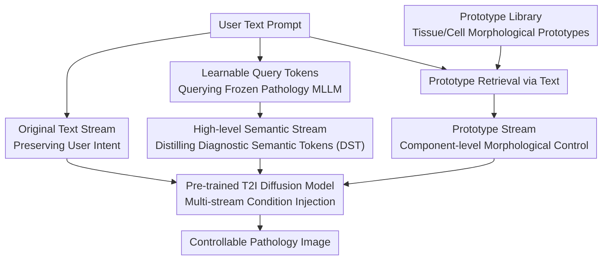

# Beyond Pixel Simulation: Pathology Image Generation via Diagnostic Semantic Tokens and Prototype Control

**Conference**: CVPR2026  
**arXiv**: [2512.21058](https://arxiv.org/abs/2512.21058)  
**Code**: [Hanminghao/UniPath](https://github.com/Hanminghao/UniPath)  
**Area**: Image Generation
**Keywords**: Pathology Image Generation, Semantic Control, Diagnostic Semantic Tokens, Prototype Control, Multi-stream Condition Injection, MLLM Distillation

## TL;DR

UniPath proposes a semantic-driven pathology image generation framework that achieves diagnostic-level controllable generation through multi-stream control (original text + diagnostic semantic tokens distilled from frozen pathology MLLMs + morphological control from a prototype library), reaching a Patho-FID of 80.9, which outperforms the runner-up by 51%.

## Background & Motivation

In computational pathology, "understanding" and "generation" have followed distinct development paths. Understanding models (e.g., pathology multimodal large language models, MLLMs) have achieved diagnostic-level capabilities, yet generation models largely remain at the pixel simulation stage, lacking a grasp of diagnostic semantics.

The authors identify three coupled bottlenecks:

**Data Scarcity**: Absence of large-scale, high-quality paired pathology image-text corpora limits model training.

**Insufficient Semantic Control**: Existing methods lack fine-grained semantic control, relying on non-semantic cues (e.g., style, color) rather than being able to specify diagnostic attributes like "abnormal glandular morphology" or "increased mitotic figures."

**Terminology Heterogeneity**: The same diagnostic concept may have various descriptions across different doctors and reports, making condition control based on original text unreliable.

**Key Insight**: Since understanding models are mature, why not utilize their diagnostic capabilities to guide generation? This is the core "understanding-driven generation" strategy of this paper.

## Method

### Overall Architecture

The starting point for UniPath is a contrast: while computational pathology "understanding" models (Pathology MLLMs) possess diagnostic-level capabilities, "generation" models remain stuck in pixel simulation and cannot interpret diagnostic semantics. The solution is "understanding-driven generation"—distilling diagnostic knowledge from mature understanding models to guide diffusion generation. The core is Multi-Stream Control: building upon a pre-trained text-to-image diffusion model, conditional signals are decomposed into three complementary streams—the original text stream to preserve user intent, the diagnostic semantic token stream for diagnostic-level semantics, and the prototype library stream for morphological control—collaboratively guiding generation from coarse to fine scales.

### Key Designs

**1. High-level Semantic Stream and Diagnostic Semantic Tokens: Distilling Heterogeneity-Resistant Semantics from Frozen MLLMs**

Same diagnostic concepts often vary in description across practitioners, making direct text conditioning unstable. This stream (the core contribution of this work) distills high-level semantics resistant to synonymous heterogeneity from a frozen pathology MLLM (e.g., PathChat). A set of learnable query tokens "queries" the frozen MLLM via cross-attention to distill Diagnostic Semantic Tokens (DST). Because DST originates from the deep semantic space of the MLLM rather than surface-level text, varying descriptions like "poorly differentiated adenocarcinoma" and "low-grade differentiated glandular cancer" map to the same semantic representation. Simultaneously, it expands short user prompts into attribute bundles covering cellular morphology, tissue structure, and staining characteristics. DST is injected into the diffusion model's cross-attention layers via an adapter, providing high-level semantic guidance.

**2. Prototype Stream and Prototype Library: Providing Component-level Morphological Control**

Global semantics alone are insufficient; pathologists often need to specify images containing "specific morphological cells." The Prototype Stream extracts representative tissue/cell morphological prototypes (each corresponding to a pattern, such as specific glandular arrangements or nuclear morphology) from high-quality pathology images to form a prototype library. During generation, the most relevant prototype features are retrieved based on text descriptions and injected through an additional conditional channel. This allows for fine-grained morphological regulation of specific image components, complementing high-level semantics.

**3. Large-scale Data Construction: Coverage via Quantity, Upper Bounds via Quality**

Implementing semantic control requires data. UniPath collects and cleans approximately 2.65 million pathology image-text pairs to form the UniPath-1M corpus for coverage, from which 68K high-quality samples (UniPath-68K) with detailed diagnostic attribute annotations are filtered to ensure the upper bound of training quality. Both are indispensable. The datasets are available on HuggingFace (minghaofdu/UniPath-1M, UniPath-68K).

**4. Four-tier Evaluation System: Surpassing FID for Real Quality Measurement**

The quality of pathology image generation cannot be measured solely by pixel similarity. Thus, a four-level evaluation framework is established: pixel fidelity (FID, Patho-FID), semantic consistency (alignment between generated images and text), diagnostic utility (support for downstream diagnostic tasks), and fine-grained controllability (attribute-level control accuracy). This hierarchical approach reflects diagnostic value better than a single FID score and is poised to become a field standard.

## Key Experimental Results

### Table 1: Comparison of Image Generation Quality (Patho-FID, etc.)

| Method | Patho-FID ↓ | FID ↓ | IS ↑ | CLIP-Score ↑ |
|---|---|---|---|---|
| SD v1.5 | ~200+ | - | - | - |
| PathLDM | ~170+ | - | - | - |
| PixCell-256 | ~165 | - | - | - |
| **UniPath** | **80.9** | **Best** | **Best** | **Best** |

UniPath's Patho-FID is 80.9, an approximately 51% improvement over the runner-up, indicating that the generated images are significantly closer to the distribution of real images in the pathology feature space.

### Table 2: Fine-grained Semantic Control and Downstream Diagnostic Tasks

| Evaluation Dimension | UniPath | Best Comp. Method | Real Image |
|---|---|---|---|
| Fine-grained Semantic Control | 98.7% of Real | ~65-80% | 100% |
| Classification Support (Acc. after Aug) | Significant Gain | Moderate Gain | Baseline |
| Attribute Consistency | High | Medium | Reference |

UniPath achieves 98.7% of the performance of real images in fine-grained semantic control, suggesting that generated images almost entirely preserve specified diagnostic attributes.

### Ablation Study

The paper includes 6 tables and 17 figures (32 pages total). The ablation study validates:
- The contribution of each of the three control streams: removal of any stream leads to performance degradation.
- The advantage of DST over direct CLIP text embeddings: significantly more robust against terminology heterogeneity.
- The impact of prototype library size on morphological control precision.
- The critical role of the 68K high-quality subset for training.

## Key Findings

1. **Understanding capability can nourish generation**: Diagnostic semantic tokens provided by frozen pathology MLLMs significantly outperform traditional text encoders, validating the "understanding-driven generation" route.
2. **Terminology heterogeneity is a core obstacle in pathology text-conditioned generation**: Traditional methods exhibit instability when different doctors use different terms for the same lesion; DST effectively solves this.
3. **Component-level morphological control is a core requirement**: Global semantics are insufficient as doctors often need to specify particular cellular/tissue morphological features.
4. **Balance between data quality and quantity**: The 2.65 million large-scale corpus provides coverage, while the 68K accurately labeled subset ensures quality; both are essential.

## Highlights & Insights

- **Paradigm Shift**: Moves from "simulating pixels" to "understanding diagnostic semantics before generation," proposing a new paradigm for pathology image generation that transfers the capabilities of understanding models to generative tasks.
- **Sophisticated Multi-stream Control**: Three streams provide control at different abstraction levels—original text for intent, DST for diagnostic semantics, and prototypes for morphology—forming a complete control hierarchy.
- **Universal MLLM Distillation**: The concept of using learnable queries to distill task-related tokens from frozen large models is generalizable to conditional generation tasks in other domains.
- **Evaluation System Contribution**: The four-tier evaluation mechanism reflects the true quality of pathology image generation better than FID alone and is likely to become an industry standard.
- **Open Source Commitment**: Code, model weights (UniPath-7B, 9B parameters), and both datasets are public, providing significant value to the field.

## Limitations

1. **High Computational Cost**: Distillation based on a 9B parameter MLLM plus diffusion model generation requires at least 24GB of VRAM for inference, limiting practical deployment.
2. **Expert Dependence for Prototype Library**: Selection and labeling of prototypes still require involvement from pathology experts, with limited automation.
3. **Resolution Constraints**: Current resolutions may not satisfy fine diagnostic requirements at high magnifications (e.g., 40x), and Whole Slide Image (WSI) level generation is not yet covered.
4. **Domain Generalization Unverified**: Primarily validated on common pathology types; generalization to rare diseases and special stains (e.g., IHC) remains unknown.
5. **Lack of Clinical Validation**: Whether improvements in automatic metrics like Patho-FID truly correspond to clinical value still requires blind evaluation by pathologists.

## Related Work & Insights

- **PathLDM / PixCell-256**: Previous methods mainly based on latent space diffusion lacked diagnostic semantic control; UniPath introduces multi-stream semantic guidance.
- **Patho-R1**: A pathology reasoning model; UniPath borrows its code framework and utilizes similar MLLMs for semantic understanding.
- **BLIP3o**: A multimodal generation framework; UniPath references its architectural design.
- **IP-Adapter / ControlNet**: Conditional control methods in image generation; UniPath's multi-stream approach is similar but specifically customized for pathology semantics.
- **Inspiration**: This methodology of "utilizing mature understanding models to distill semantic tokens for guiding generation" can potentially be extended to other medical imaging fields such as radiology, dermoscopy, and fundus photography.

## Rating

- Novelty: ⭐⭐⭐⭐⭐ — Paradigm shift of "understanding-driven generation" + multi-stream control + DST distillation.
- Experimental Thoroughness: ⭐⭐⭐⭐⭐ — 32-page paper, 6 tables, 17 figures, comprehensive four-tier evaluation.
- Writing Quality: ⭐⭐⭐⭐ — Thorough problem analysis, clear method description, though long.
- Value: ⭐⭐⭐⭐⭐ — Full open sourcing of datasets, code, and weights, a benchmark for the field.

<!-- RELATED:START -->

## Related Papers

- [\[CVPR 2026\] LacTokGen: Latent Consistency Tokenizer for 1024-pixel Image Generation by 256 Tokens](lactokgen_latent_consistency_tokenizer_for_1024-pixel_image_generation_by_256_to.md)
- [\[AAAI 2026\] Beyond Semantic Features: Pixel-Level Mapping for Generalized AI-Generated Image Detection](../../AAAI2026/image_generation/beyond_semantic_features_pixel-level_mapping_for_generalized_ai-generated_image_.md)
- [\[CVPR 2026\] TokenLight: Precise Lighting Control in Images using Attribute Tokens](tokenlight_precise_lighting_control_in_images_using_attribute_tokens.md)
- [\[CVPR 2026\] Pixel Motion Diffusion Is What We Need for Robot Control](pixel_motion_diffusion_is_what_we_need_for_robot_control.md)
- [\[CVPR 2026\] PixelDiT: Pixel Diffusion Transformers for Image Generation](pixeldit_pixel_diffusion_transformers_for_image_generation.md)

<!-- RELATED:END -->
