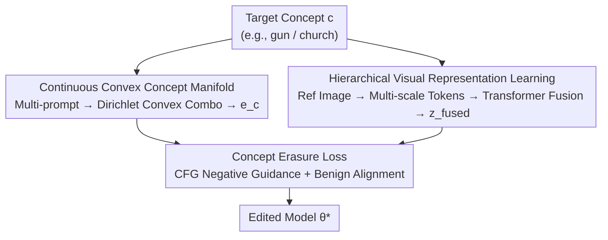

# Beyond Text Prompts: Precise Concept Erasure through Text–Image Collaboration

**Conference**: CVPR 2026  
**arXiv**: [2604.15829](https://arxiv.org/abs/2604.15829)  
**Code**: https://github.com/OpenAscent-L/TICoE.git (Available)  
**Area**: Diffusion Models / Concept Erasure / AI Safety  
**Keywords**: Concept Erasure, Text-Image Collaboration, Convex Concept Manifold, Multi-scale Visual Representation, Diffusion Models

## TL;DR
TICoE collaboratively erases target concepts from text-to-image diffusion models using a "Continuous Convex Concept Manifold (text-side) + Multi-scale Hierarchical Visual Representation (image-side)." This approach blocks the "resurrection via rephrasing" loophole in text-based erasure while preventing image-guided over-erasure of unrelated concepts with similar shapes or contexts. On tasks like gun, nudity, and Van Gogh, it achieves simultaneously stronger erasure (UDA 0.02) and superior fidelity (FID 30.86).

## Background & Motivation

**Background**: Text-to-image diffusion models (e.g., Stable Diffusion) are trained on massive web-scale data, inevitably learning to generate unsafe, sensitive, or copyrighted content. Concept erasure (unlearning) aims to "forget" a target concept (e.g., gun, nudity, a specific artistic style) without retraining from scratch, while preserving normal generation capabilities. Current approaches fall into three categories: guidance-based (ESD, AdvUnlearn modifying CFG denoising trajectories), attention-optimization (Forget-Me-Not, MACE iteratively modifying cross-attention), and closed-form editing (UCE directly recalibrating cross-attention weights).

**Limitations of Prior Work**: Nearly all these methods operate exclusively in the **text domain**, relying on embeddings of a few fixed prompts. However, fixed prompt embeddings cannot cover the entire semantic scope of a concept—semantically related but differently phrased prompts (e.g., "plasma rifle" for "gun") can still reactivate erased concepts, leading to **incomplete erasure**. To improve coverage, recent methods like Co-Erasing introduced reference images, but this created a new issue: models absorb visual attributes (shape, pose, context) from the reference, causing **over-erasure** of visually similar but semantically unrelated concepts (e.g., erasing "camera" while trying to erase "gun").

**Key Challenge**: There is a fundamental trade-off between erasing precision and contextual fidelity—textual erasure lacks semantic coverage (under-erasing), while naive image guidance causes visual entanglement (over-erasing). Both fail to achieve "faithful erasure." Furthermore, existing evaluations mostly focus on erasure strength and rarely examine whether "visually/contextually similar but distinct" content is preserved.

**Goal**: (1) Cover the full linguistic extension of a concept on the text side to resist adversarial rephrasing; (2) Disentangle "causally relevant" features from "strictly visually similar" features on the image side to avoid over-erasure; (3) Provide an evaluation metric to measure the preservation of related but distinct concepts.

**Key Insight**: Textual generalization and visual grounding are **complementary**. The textual manifold is responsible for filling the linguistic space of a concept, while visual representation distinguishes the target from similar distractors in the latent space. Joint learning of both is required for faithful erasure.

**Core Idea**: Precise text-image collaborative erasure (TICoE) via "Continuous Convex Concept Manifolds + Hierarchical Visual Representation," where the text side handles full coverage and the image side handles precise discrimination.

## Method

### Overall Architecture
TICoE addresses "clean erasure without collateral damage." Given a target concept $c$ (e.g., church), the framework runs two parallel flows: the **Text Flow** clusters multiple semantically related prompts into a continuous convex concept manifold, sampling text conditions $e_c$ that cover diverse expressions; the **Visual Flow** encodes reference images into multi-scale tokens, fused via a transformer into visual guidance latent $z_\text{fused}$. Both are fed into a trainable U-Net, using an erasure loss based on CFG negative guidance to suppress the target concept while aligning with the original frozen model's output for benign prompts to obtain the edited model $\theta^*$.

### Key Designs

**1. Continuous Convex Concept Manifold (CCCM): Representing a concept as a continuous semantic region to prevent "resurrection via rephrasing"**

The fundamental flaw of textual erasure is the incomplete coverage of discrete prompts—erasing "gun" might leave "firearm" or "plasma rifle" active. CCCM uses GPT-5.0 to automatically expand a base keyword into a set of semantically consistent but diverse prompts (e.g., for "church," generating "gothic church," "ancient stone church," "church tower"). These are encoded into a prompt bank $B = [e_1, \dots, e_N] \in \mathbb{R}^{N\times L\times d}$. During erasure, instead of a fixed embedding, a **convex combination** is used: $e_c = \sum_{i=1}^N w_i e_i$, where $w \sim \mathrm{Dirichlet}(\alpha(\tau))$ and $\alpha(\tau) = \frac{1}{\tau}\mathbf{1}_N$. The Dirichlet distribution ensures weights are non-negative and sum to one ($w_i\ge 0,\ \sum_i w_i=1$), ensuring $e_c$ always falls within the semantic convex hull formed by the prompt bank.

Using a "convex" combination rather than arbitrary linear combination is critical: unconstrained linear combinations might extrapolate to out-of-distribution (OOD) points with nonsensical semantics, whereas convex combinations guarantee that $e_c$ is a valid semantic blend of existing concepts, forming a **continuous**, bounded concept region. Temperature $\tau$ controls sharpness: high $\tau$ leads to uniform sampling, while low $\tau$ biases $e_c$ toward specific prompts. Optional zero-mean Gaussian noise $e_c \leftarrow e_c + \mathcal{N}(0, \text{noise\_std}^2)$ adds local stochasticity to prevent overfitting, followed by LayerNorm to align with the original model's distribution.

**2. Hierarchical Visual Representation Learning (HVRL): Multi-scale latent space to distinguish "causally relevant" from "visually similar" features**

Naive image guidance absorbs all visual attributes of a reference image, suppressing unrelated concepts with similar shapes or poses. HVRL uses multi-scale modeling for "disentanglement." First, the clean diffusion model generates reference images for "a photo of c" to provide an unbiased visual prior. The reference image is encoded via VAE and augmented with DDPM noise at a random timestep to get latent $z\in\mathbb{R}^{B\times C\times H\times W}$, which is resized to multiple scales $s\in\mathcal{S}=\{1.0, 0.75, 0.5\}$ and flattened into tokens $t_s\in\mathbb{R}^{B\times(H_sW_s)\times C}$. These are concatenated along the sequence dimension as $t\in\mathbb{R}^{B\times N\times C}$ (where $N=\sum_s H_sW_s$).

After adding sinusoidal positional encodings $t\leftarrow t+p$, tokens are processed by transformer encoder layers $t'=F_\text{trans}(t)$. Since the transformer preserves sequence length, the first $H\times W$ tokens are reshaped back to 2D latent map $t'_\text{fused}$, followed by residual fusion $z_\text{fused} = z + \lambda\cdot t'_\text{fused}$. Multi-scale processing allows the model to capture concept information at different spatial resolutions, separating features causally linked to the target from those merely visually similar; the transformer is trained jointly with the U-Net to learn cross-scale dependencies.

**3. CFG Negative Guidance Erasure Loss: Driving the trainable U-Net toward an "anti-concept" target**

To actually "erase" the concept using $e_c$ and $z_\text{fused}$, the authors leverage the classifier-free guidance (CFG) principle to construct a reference target with negative guidance weight $\gamma$ using the **frozen** original model:

$$\epsilon_\text{target}(z_\text{fused}, t, e_c) := \epsilon_\theta(z_\text{fused}, t, \varnothing) - \gamma\big[\epsilon_\theta(z_\text{fused}, t, e_c) - \epsilon_\theta(z_\text{fused}, t, \varnothing)\big]$$

The intuition is to extrapolate **away** from the "concept-conditioned" noise direction relative to the "unconditional" direction, creating a target noise that is "distant" from the concept. The erasure loss aligns the trainable U-Net $\theta^*$ conditional prediction with this target:

$$\mathcal{L}_\text{erase} = \big\|\epsilon_{\theta^*}(z_\text{fused}, t, e_c) - \epsilon_\text{target}(z_\text{fused}, t, e_c)\big\|_2^2$$

This loss simultaneously updates the transformer and U-Net.

### Loss & Training
Before training, the clean Stable Diffusion model generates $n$ images of the target concept "a photo of $c$" to form a dataset. In each iteration, an image is randomly sampled and paired with a sampled $e_c$ from CCCM for collaborative erasure, optimizing $\mathcal{L}_\text{erase}$ with joint transformer and U-Net updates.

## Key Experimental Results

### Main Results
Evaluation on the "erase gun" task comparing five SOTA methods (ESD, UCE, FMN, SPM are text-only; Co-Erasing is text-image). Lower ASR/UDA/P4D indicates cleaner erasure; lower FID and higher CLIP indicate better fidelity:

| Method | ASR↓ | UDA↓ | P4D↓ | FID↓ | CLIP↑ |
|------|------|------|------|------|-------|
| ESD | 0.02 | 0.20 | 0.47 | 31.76 | 0.302 |
| UCE | 0.08 | 0.36 | 0.08 | 35.56 | 0.312 |
| FMN | 0.26 | 0.64 | 0.26 | 34.46 | 0.310 |
| SPM | 0.22 | 0.60 | 0.24 | 33.43 | 0.310 |
| Co-Erasing | 0.00 | 0.10 | 0.15 | 35.94 | 0.304 |
| **TICoE (Ours)** | **0.00** | **0.02** | **0.04** | **30.86** | 0.304 |

TICoE achieved the best performance across all three erasure metrics, notably reducing UDA from the next best 0.10 to 0.02 while maintaining the lowest FID.

**MCP (Morpho-Contextual Concept Preservation) Metric**: A self-defined utility metric measuring whether "semantically different but morphologically/contextually similar" concepts are preserved (higher is better). For instance, checking if "camera/phone/umbrella" are intact when "gun" is erased:

| Method | gun→camera↑ | gun→phone↑ | tench→whale↑ | tench→goldfish↑ |
|------|------|------|------|------|
| SD (Clean Baseline) | 92.54% | 97.96% | 97.78% | 98.15% |
| ESD | 68.25% | 79.59% | 75.56% | 75.93% |
| Co-Erasing | 39.68% | 53.06% | 60.00% | 48.15% |
| **TICoE (Ours)** | **92.06%** | **95.91%** | **95.45%** | **96.30%** |

Naive Co-Erasing suffered from severe over-erasure (camera dropped to 39.68%), whereas TICoE's MCP scores remained close to the clean SD baseline, validating HVRL's effectiveness.

### Ablation Study
On the gun erasure task (deconstructing CCCM and HVRL):

| Configuration | ASR↓ | UDA↓ | FID↓ | CLIP↑ | Explanation |
|------|------|------|------|-------|------|
| No CCCM | 0.06 | 0.38 | 30.41 | 0.297 | Removing manifold; UDA spikes to 0.38 |
| 10 Prompt | 0.00 | 0.26 | 31.16 | 0.291 | Scale is too small; manifold is sparse |
| 20 Prompt | 0.02 | 0.12 | 29.46 | 0.285 | Optimal balance of precision/fidelity |
| 50 Prompt | 0.02 | 0.22 | 30.98 | 0.287 | Excessive redundancy; slightly unstable |
| No HVRL | 0.00 | 0.16 | 30.59 | 0.285 | No multi-scale visual; UDA rises to 0.16 |
| Scales 1 = {1.0,0.75} | 0.02 | 0.26 | 30.66 | 0.300 | Insufficient scales; under-erasing |
| Scales 2 = {1.0,0.75,0.5,0.25} | 0.04 | 0.10 | 32.74 | 0.302 | Too many scales; FID degrades |
| **TICoE (full)** | **0.00** | **0.02** | 30.86 | **0.304** | Final model |

## Highlights & Insights
- **Geometric Intuition of Convex Combinations**: Using Dirichlet to constrain weights on a simplex ensures interpolated embeddings always stay within the convex hull of valid prompts, naturally avoiding OOD semantic points.
- **Division of Labor**: The text stream solves under-erasure (semantic coverage), while the visual stream solves over-erasure (visual entanglement), unified by a single CFG-negative loss.
- **MCP Metric Addressses Blind Spots**: Existing metrics like CLIP/FID on COCO-10k are often weakly correlated with the erased concept. MCP specifically targets the "similar but distinct" preservation, which is applicable to any erasure or editing task.
- **Multi-scale token + Transformer fusion** provides an architectural template for disentangling causal vs. correlated features in controllable generation.

## Limitations & Future Work
- **Dependency on GPT-5.0**: CCCM quality depends on the diversity of prompts from the external LLM; biases in the generator directly affect the manifold quality. (Note: GPT-5.0 is as cited in original text).
- **MCP Scope**: Currently tested on a few selected categories (camera, whale, etc.); whether it covers a broader spectrum of "similar but distinct" concepts remains to be seen.
- **Hyperparameter Sensitivity**: Parameters like temperature $\tau$, Gaussian noise, fusion weight $\lambda$, and negative guidance $\gamma$ require tuning.
- **Computational Overhead**: Compared to closed-form editing (UCE), TICoE requires reference image generation and joint transformer-UNet training, which is more costly.

## Related Work & Insights
- **vs ESD / AdvUnlearn**: These modify CFG trajectories but are tied to specific prompts used during training. TICoE's continuous manifold provides significantly lower UDA under adversarial rephrasing (0.02 vs ESD 0.20).
- **vs MACE / Forget-Me-Not**: These optimize cross-attention but lack the visual disentanglement to prevent over-erasure when concepts are visually entangled.
- **vs Co-Erasing**: While both use images, Co-Erasing's naive approach leads to severe over-erasure (Camera MCP 39.68%), whereas TICoE recovers this to 92%.

## Rating
- Novelty: ⭐⭐⭐⭐ The combination of convex manifolds and multi-scale visual disentanglement is novel.
- Experimental Thoroughness: ⭐⭐⭐⭐ Covers various tasks (nudity, style), backbones, and adversarial attacks; ablation is clear.
- Writing Quality: ⭐⭐⭐⭐ Logical flow from pain points to methodology.
- Value: ⭐⭐⭐⭐ High utility for T2I safety; the MCP metric is especially valuable for the field.

<!-- RELATED:START -->

## Related Papers

- [\[CVPR 2026\] Neighbor-Aware Localized Concept Erasure in Text-to-Image Diffusion Models](neighbor-aware_localized_concept_erasure_in_text-to-image_diffusion_models.md)
- [\[CVPR 2026\] MapRoute: Semantic Routing for Precise Concept Erasure with Mapper](maproute_semantic_routing_concept_erasure.md)
- [\[CVPR 2026\] GrOCE: Graph-Guided Online Concept Erasure for Text-to-Image Diffusion Models](groce_graph-guided_online_concept_erasure_for_text-to-image_diffusion_models.md)
- [\[CVPR 2026\] Closed-Form Concept Erasure via Double Projections](closed-form_concept_erasure_via_double_projections.md)
- [\[CVPR 2026\] Erasing Thousands of Concepts: Towards Scalable and Practical Concept Erasure for Text-to-Image Diffusion Models](erasing_thousands_of_concepts_towards_scalable_and_practical_concept_erasure_for.md)

<!-- RELATED:END -->
## Related Papers

- [\[CVPR 2026\] Neighbor-Aware Localized Concept Erasure in Text-to-Image Diffusion Models](neighbor-aware_localized_concept_erasure_in_text-to-image_diffusion_models.md)
- [\[CVPR 2026\] MapRoute: Semantic Routing for Precise Concept Erasure with Mapper](maproute_semantic_routing_concept_erasure.md)
- [\[CVPR 2026\] Closed-Form Concept Erasure via Double Projections](closed-form_concept_erasure_via_double_projections.md)
- [\[CVPR 2026\] GrOCE: Graph-Guided Online Concept Erasure for Text-to-Image Diffusion Models](groce_graph-guided_online_concept_erasure_for_text-to-image_diffusion_models.md)
- [\[CVPR 2026\] Erasing Thousands of Concepts: Towards Scalable and Practical Concept Erasure for Text-to-Image Diffusion Models](erasing_thousands_of_concepts_towards_scalable_and_practical_concept_erasure_for.md)

<!-- RELATED:END -->
