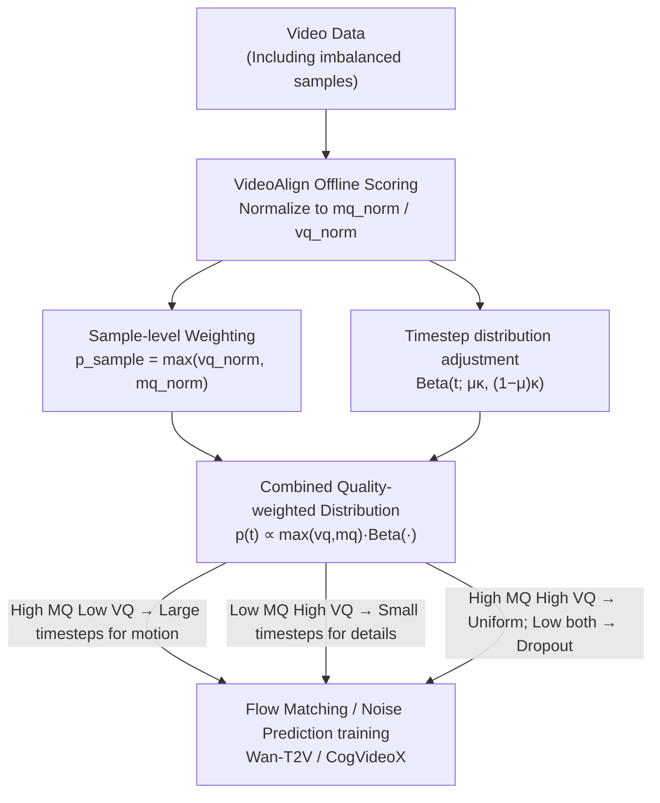

# Beyond the Golden Data: Resolving the Motion-Vision Quality Dilemma via Timestep Selective Training

**Conference**: CVPR 2026  
**arXiv**: [2603.25527](https://arxiv.org/abs/2603.25527)  
**Code**: None  
**Area**: Image Generation/Video Generation  
**Keywords**: Video Diffusion Models, Data Quality Dilemma, Timestep Selective Training, Motion-Vision Quality Balance, Flow Matching

## TL;DR
This paper identifies the "Motion-Vision Quality Dilemma," where motion quality (MQ) and visual quality (VQ) in video data are negatively correlated. Through gradient analysis, it reveals that imbalanced data can produce equivalent learning signals at appropriate timesteps. It proposes the TQD framework, enabling models trained solely on imbalanced data to outperform those trained on "golden data."

## Background & Motivation
**Background**: Video generation models (e.g., CogVideoX, Wan-T2V) rely on "golden data" that possesses both high visual quality (VQ) and high motion quality (MQ). However, such data is **statistically scarce**.

**Key Finding**—Motion-Vision Quality Dilemma: Analysis on Koala36M reveals a **negative correlation** between MQ and VQ ($r=-0.2419$). High-VQ data tends to feature static scenes (low MQ), while high-MQ data often contains artifacts (low VQ). Only 21.9% of data meets both high standards.

**Limitations of Prior Work**: Conventional approaches involve strict filtering to retain only golden data, resulting in massive data waste by discarding videos that excel in only one dimension.

**Goal**: Shift the perspective from "which data to keep" to "how to use imperfect data more effectively."

**Key Insight**: The denoising process of diffusion models is **hierarchical**: high-noise timesteps establish motion and composition, while low-noise timesteps refine detailed textures. Gradient analysis confirms that VQ-degraded data produces gradients similar to golden data at high timesteps, while MQ-degraded data does the same at low timesteps.

## Method

### Overall Architecture
This paper addresses how to route learning signals from imperfect videos to the denoising stages where they are most effective. The TQD (Timestep Quality-aware Distribution) framework is a data-side preprocessing pipeline: it first assigns normalized MQ and VQ scores using VideoAlign. During training, a two-level scheduler is applied—the sample-level determines the "absolute quality" probability of inclusion (quality dropout), while the timestep-level concentrates gradients into appropriate noise intervals based on "relative quality." These are combined into a single sampling distribution for training with Flow Matching (Wan-T2V) or noise prediction (CogVideoX) objectives. Model architecture, loss, and hyperparameters remain unchanged; only the data-to-timestep mapping is modified.

### Key Designs

**1. Sample-level Weighting: Determining training inclusion via absolute quality**

Strict filtering discards valuable signals from videos that excel in a single dimension. Instead, each sample is assigned a retention probability $p_{sample} = \max(vq_{norm}, mq_{norm})$. A video is likely retained if it is sufficiently high in either MQ or VQ; only samples low in both dimensions face a high probability of natural dropout.

**2. Timestep-level Distribution Adjustment: Routing signals via relative quality**

Based on the hierarchical nature of denoising, TQD replaces uniform timestep sampling with a sample-specific Beta distribution:

$$p(t \mid x_0) \propto \mathrm{Beta}\!\left(t;\, \mu\kappa,\, (1-\mu)\kappa\right)$$

The distribution center $\mu = 0.5 + 0.5 \times (mq_{norm} - vq_{norm})$ shifts the sample toward its strength: if MQ > VQ, $\mu > 0.5$, shifting timesteps toward the motion-learning phase. The concentration $\kappa = \kappa_{base} + (\kappa_{max} - \kappa_{base}) \times |mq_{norm} - vq_{norm}|$ controls the "specialization" intensity—greater imbalance leads to a sharper distribution peak. For balanced data, it automatically reverts to baseline sampling.

**3. Combined Quality-weighted Distribution: Integrating absolute and relative scheduling**

The final training distribution is synthesized as:

$$p(t) \propto \max(vq_{norm}, mq_{norm}) \cdot \mathrm{Beta}\!\left(t;\, \mu\kappa,\, (1-\mu)\kappa\right)$$

This routes High MQ/Low VQ (HMLV) videos to large timesteps for motion, and Low MQ/High VQ (LMHV) videos to small timesteps for details. Golden data (HMHV) participates across all timesteps, while Low MQ/Low VQ (LMLV) data is largely excluded.

### Loss & Training
- Flow Matching objective (Wan-T2V): $\mathcal{L} = \mathbb{E}[\|v_\theta(x_t, t, c) - (x_1 - x_0)\|^2]$
- Diffusion objective (CogVideoX): Standard noise prediction
- $\kappa_{base}$ aligns with original sampling strategies (2 for uniform, 4 for logit-normal).

## Key Experimental Results

### Main Results (Wan-T2V 1.3B)

| Data Setup | Method | VBench Dynamic↑ | VideoAlign MQ↑ | VideoAlign VQ↑ |
|:---:|:---:|:---:|:---:|:---:|
| Set-A (All) | Baseline | 0.5312 | 2.1388 | 3.2537 |
| Set-A (All) | **TQD** | **0.6384** | **2.2557** | **3.3450** |
| Set-B (Imbalanced only) | Baseline | 0.5224 | 2.0905 | 3.2338 |
| Set-B (Imbalanced only) | **TQD** | 0.5447 | **2.1477** | **3.2679** |
| Set-C (Golden only) | Baseline | 0.5268 | 2.1917 | 3.3378 |
| Set-C (Golden only) | **TQD** | **0.6473** | **2.2200** | **3.3743** |

### Ablation Study

| Component | MQ | VQ | Description |
|:---:|:---:|:---:|:---:|
| Baseline | 2.1388 | 3.2537 | Base performance |
| + Adaptive Timestep | 2.2193 | 3.3044 | Primary gain source |
| + Quality Dropout | 2.1909 | 3.2921 | Data filtering aid |
| + Both (TQD) | **2.2557** | **3.3450** | Synergistic gain |

### Key Findings
- **Imbalanced Data + TQD > Golden Data Baseline**: Training on Set-B with TQD achieved higher MQ (2.1477) than training on Set-A with the baseline (2.1388).
- TQD provides significant gains even on golden data (Set-C), demonstrating its generalizability beyond imbalanced scenarios.
- Physical reasoning (VideoPhy2) improved across both SA and PC metrics.

## Highlights & Insights
- **Paradigm Shift**: Moves from "data filtering" to "data routing," significantly expanding usable training data.
- **Theoretical Foundation**: Gradient analysis confirms that imbalanced data aligns with golden data gradients at specific timesteps.
- **Hypothesis Challenge**: Challenges the assumption that video generation must rely exclusively on high-quality golden data.
- **Elegant Parameterization**: The Beta distribution design allows for flexible specialization while naturally handling balanced data.

## Limitations & Future Work
- Requires pre-computed MQ/VQ scores, increasing data preparation overhead.
- Gains are smaller in LoRA fine-tuning (CogVideoX) compared to full-parameter training.
- Finer-grained quality dimensions (e.g., audio quality, text alignment) remain unexplored.
- $\kappa_{max}$ requires per-model hyperparameter tuning.

## Related Work & Insights
- Shares philosophical roots with Ambient Diffusion regarding imperfect data usage but offers a more specific implementation for video.
- Timestep-aware training strategies could be generalized to image restoration or diffusion tasks sensitive to degradation types.
- Provides direct architectural guidance for industrial-scale video generation data pipelines.

## Rating
- Novelty: ⭐⭐⭐⭐⭐ Problem identification (MV Dilemma) and solution (timestep routing) are highly original.
- Experimental Thoroughness: ⭐⭐⭐⭐⭐ Comprehensive coverage across architectures and data configurations.
- Writing Quality: ⭐⭐⭐⭐⭐ Narrative flows logically from discovery to theoretical analysis to validation.
- Value: ⭐⭐⭐⭐⭐ Potential to fundamentally change video generation training paradigms.

<!-- RELATED:START -->

## Related Papers

- [\[CVPR 2026\] DynaVid: Learning to Generate Highly Dynamic Videos using Synthetic Motion Data](dynavid_learning_to_generate_highly_dynamic_videos_using_synthetic_motion_data.md)
- [\[CVPR 2026\] Beyond Objects: Contextual Synthetic Data Generation for Fine-Grained Classification](beyond_objects_contextual_synthetic_data_generation_for_fine-grained_classificat.md)
- [\[CVPR 2026\] Beyond Fixed Formulas: Data-Driven Linear Predictor for Efficient Diffusion Models](beyond_fixed_formulas_data-driven_linear_predictor_for_efficient_diffusion_model.md)
- [\[CVPR 2026\] Training-free Motion Factorization for Compositional Video Generation](training-free_motion_factorization_for_compositional_video_generation.md)
- [\[CVPR 2026\] High-Fidelity Virtual Try-On beyond Paired Data Scarcity via Diffusion-based Cycle-Consistent Learning](high-fidelity_virtual_try-on_beyond_paired_data_scarcity_via_diffusion-based_cyc.md)

<!-- RELATED:END -->
