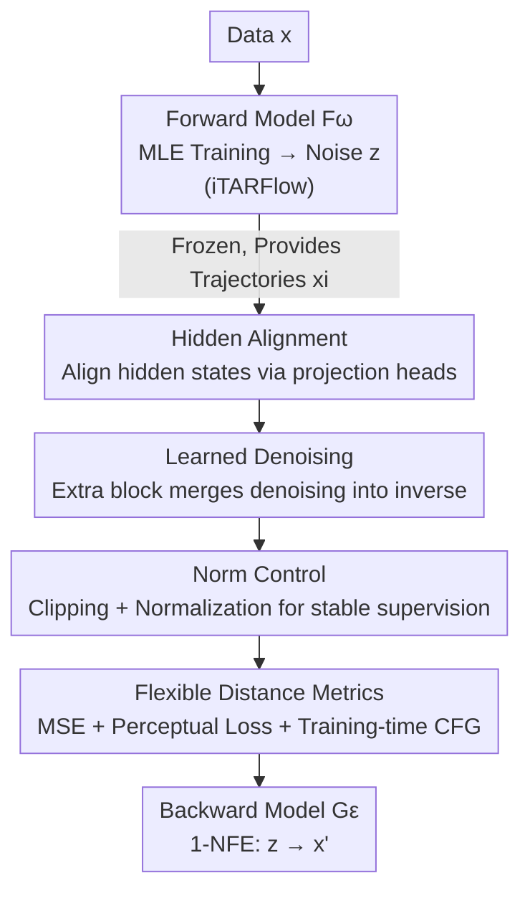

# Bidirectional Normalizing Flow: From Data to Noise and Back

**Conference**: CVPR 2026  
**Paper**: [CVF Open Access](https://openaccess.thecvf.com/content/CVPR2026/html/Lu_Bidirectional_Normalizing_Flow_From_Data_to_Noise_and_Back_CVPR_2026_paper.html)  
**Code**: No link provided (MIT / Kaiming He's team, ⚠️ subject to official release)  
**Area**: Image Generation / Normalizing Flow Generative Models  
**Keywords**: Normalizing Flow, Learning Inverse Mapping, Hidden State Alignment, 1-NFE Generation, ImageNet  

## TL;DR
BiFlow removes the hard constraint in standard Normalizing Flow where the "backward process must be the exact analytical inverse of the forward process." Instead, it trains a separate backward model to **approximate** the inverse mapping (supervised by hidden state alignment). This allows the backward model to utilize a bidirectional attention Transformer, enabling image generation in a single forward pass (1-NFE). On ImageNet 256×256, a small 133M model achieves an FID of 2.39, which is both superior to and two orders of magnitude faster than its autoregressive counterpart, TARFlow.

## Background & Motivation
**Background**: Normalizing Flow (NF) is a class of principled generative models consisting of a forward process (data → noise) and a backward process (noise → data). The key difference from continuous-time models like Flow Matching or Diffusion is that the data-noise trajectory in NF is **learned** rather than predefined by a time schedule—considered a major advantage of NF. Recently, TARFlow/STARFlow integrated Transformers and autoregressive flows into NF, significantly closing the quality gap with modern generative models.

**Limitations of Prior Work**: However, the advantage of "learned trajectories" in NF comes at a cost. To keep the Jacobian determinant in the change-of-variables formula computable and differentiable, the forward process must be **explicitly invertible**, which severely limits the architectures (making it difficult to use U-Nets or standard ViTs directly). To maintain a computable determinant, TARFlow breaks the forward process into thousands of steps in an autoregressive chain (e.g., 8 blocks × 256 tokens = 2048 steps). Consequently, its "exact analytical inverse" must perform **token-by-token serial decoding** during inference, which is slow and imposes architectural constraints (causal attention only, no feed-forward) onto the inference stage. Furthermore, TARFlow requires an additional score-based denoising step, nearly doubling the inference cost.

**Key Challenge**: The property of "exact analytical inverse" in NF is primarily intended to make likelihood computation feasible during training, but it is only truly **used during inference** (mapping noise back to data). Forcing an analytical inverse tightly couples the forward architecture to the inference process. In other words, the "invertibility" required for training and the "inverse mapping" required for inference are incorrectly coupled.

**Goal**: Decouple the forward and backward processes. The forward model only needs to be computable and learnable (using an improved TARFlow), while the backward model is trained separately to **approximate** the inverse mapping without requiring exact invertibility.

**Core Idea**: Replace the "exact analytical inverse" with a **learnable, approximate** backward model $G_\epsilon$. It can use any architecture (e.g., bidirectional attention Transformer) and be trained with flexible losses to map noise back to clean data in a single forward pass. The authors discovered that this learned inverse can actually **achieve better generation quality than the exact analytical inverse**, as it directly aligns with the true data distribution rather than replicating synthetic samples produced by the analytical inverse.

## Method

### Overall Architecture
BiFlow is trained in two stages. In the first stage, similar to classic NF, a forward model $F_\omega$ (an improved TARFlow, denoted as iTARFlow) is trained using maximum likelihood estimation to map data into Gaussian noise $z=F_\omega(x)$. In the second stage, $F_\omega$ is **frozen**, and a backward model $G_\epsilon$ is trained separately to approximate its inverse. Crucially, $G_\epsilon$ is not constrained by explicit invertibility and can be a feed-forward, non-causal bidirectional attention Transformer, mapping noise $z$ back to clean samples $x'$ in a single forward pass (1-NFE).

The training objective for the forward NF remains the log-likelihood under the change-of-variables formula ($F:=f_{B-1}\circ\cdots\circ f_1\circ f_0$):

$$\log p(x) = \log p_0(z) + \sum_i \log\left|\det \frac{\partial f_i(x_i)}{\partial x_i}\right|$$

Note: The log-det term only requires $F$ to be "invertible"; it **does not require** an "explicitly invertible analytical form"—the explicit inverse is only needed during inference to map noise back to data. BiFlow exploits this gap by decoupling the forward process for training and the learned backward process for inference.

### Key Designs

**1. Hidden Alignment: Aligning hidden states with projection heads for full-trajectory supervision without locking the architecture.**

Directly learning the inverse mapping faces a fundamental challenge: mapping pure noise to data in one step is highly under-constrained, and supervision using only a terminal reconstruction loss (Naive Distillation, $\mathcal{L}_{naive}(x)=D(x, x')$ where $x'=G_\epsilon(F_\omega(x))$) is too weak. A natural enhancement is Hidden Distillation: ensuring each intermediate state $\{x_i\}$ of the forward trajectory supervises the corresponding state $\{h_i\}$ of the backward trajectory, i.e., $\mathcal{L}_{hidden}(x)=\sum_i D(x_i, h_i)$. However, this forces each intermediate state of the backward model back into the input-dimensional space, causing information loss and limiting expressivity—experiments showed this was worse than the Naive approach (FID 55.0 vs 43.4).

The Hidden Alignment solution in BiFlow maintains full-trajectory supervision without forcing intermediate states into the input space. It equips each layer's hidden state $h_i$ of the backward model with a **learnable projection head** $\phi_i$, aligning the projected representation with the forward states:

$$\mathcal{L}_{align}(x) = \sum_i D(x_i, \phi_i(h_i))$$

where $h_0=x'$ and $\phi_0$ is the identity mapping. This allows the backward model to benefit from block-wise trajectory supervision while decoupling the "representation space" from the "input token space," avoiding semantic distortion from repeated projections. This strategy performed best (FID 36.93), significantly outperforming the exact analytical inverse (44.46).

**2. Learned Denoising: Merging denoising into the inverse mapping to save a full forward-backward score calculation.**

SOTA NFs like TARFlow deviate from pure flow modeling: they are trained on noisy inputs $\tilde{x}=x+\sigma\epsilon$, and during inference, they first generate $\tilde{x}=F_\omega^{-1}(z)$, followed by a score-based denoising step $x\leftarrow\tilde{x}+\sigma^2\nabla_{\tilde{x}}\log p(\tilde{x})$. Computing this score involves a full forward-backward pass (approx. 15.8× flops), nearly doubling inference costs.

BiFlow integrates denoising directly into the backward model: clean data $x$ is added before the start of the forward trajectory, and an extra block is added to the backward model specifically to learn the $h_0\to x'$ denoising, trained jointly with the inverse mapping. Thus, $G_\epsilon$ learns the mapping from noise $z$ to **clean data $x$** (rather than noisy $\tilde{x}$), producing clean samples in a single forward pass. This extra block replaces a full score calculation; removing denoising causes the FID to crash to 100.5, while learning-based denoising achieves 31.88 compared to 42.6 for score-based denoising (all w/o CFG).

**3. Norm Control: Suppressing norm fluctuations in forward intermediate states to balance MSE supervision across blocks.**

In NF, the norm of intermediate states produced by the forward model is unconstrained and often fluctuates wildly across blocks. When using amplitude-sensitive losses like MSE for alignment supervision, this leads to severe imbalances in supervision intensity across depths. BiFlow employs two complementary strategies: in the forward model, the output parameters of each transformation $f_i$ are clipped to a fixed range $[-c, c]$ to limit over-scaling; in the backward model, intermediate states are normalized before hidden alignment to ensure equal contributions across depths and promote scale-invariant learning. Ablations show that without norm control, FID is 45.54, while the clipping strategy improves it to 31.88.

**4. Flexible Distance Metrics & Training-time CFG: "What-you-see-is-what-you-get" training enabled by 1-NFE + explicit pairing.**

BiFlow possesses two properties rare in other generative paradigms: (i) 1-NFE—the backward model produces a sample in a single pass, making generated samples directly available during training; (ii) explicit pairing—the forward process naturally provides a one-to-one mapping between data $x$ and noise $z$. Together, these enable direct "WYSIWYG" supervision. Almost any distance metric can be used and combined. It defaults to MSE for intermediate state alignment, with perceptual losses (VGG/LPIPS + ConvNeXt V2 features) added at the image end after VAE decoding, using adaptive loss re-weighting. Perceptual losses are nearly impossible to apply to exact analytical inverses but are easily used here—MSE → +LPIPS → +ConvNeXt pushed FID from 31.88 down to 2.46.

Additionally, CFG is moved to the training phase: $h_{i+1}=(1+w_i)G^i_\epsilon(h_i\mid c)-w_i\,G^i_\epsilon(h_i)$, with the CFG scale fed as a condition. This allows the model to support a range of guidance strengths within a single forward pass, saving the overhead of extra passes for CFG during inference. Training-time CFG halves inference costs and improves FID from 6.90 (NFE=2) to 6.79 (NFE=1).

### Loss & Training
Two stages: first, train the forward $F_\omega$ (iTARFlow) using MLE; then freeze it to train the backward $G_\epsilon$. The backward objective = reconstruction loss $D(x, x')$ + hidden alignment loss for intermediate states. The default distance metric is MSE, with the final configuration adding perceptual losses (VGG + ConvNeXt) using adaptive re-weighting, combined with norm control and training-time CFG. Models run in the latent space of a pre-trained VAE (ImageNet 256×256 → 32×32×4 latent). The backward backbone is a ViT with modern components, patch size 2, and sequence length 256.

## Key Experimental Results

### Main Results
Class-conditional generation on ImageNet 256×256, evaluated with FID-50K + IS (50,000 images). Core comparison: BiFlow (learned inverse) vs. the exact analytical inverse baseline iTARFlow:

| Model | NFE | FID ↓ | #Params | TPU Time/Img | Relative Speedup vs iTARFlow (TPU, excl. VAE) |
|------|-----|-------|-------|--------------|------------------------------|
| BiFlow-B/2 (Ours) | 1 | **2.39** | 133M | 0.29 + 1.3 ms | — |
| iTARFlow-B/2 | 256×2 Serial | 6.83 | 120M | 65 + 1.3 ms | 224× |
| iTARFlow-XL/2 | 256×2 Serial | 4.54 | 690M | 202 + 1.3 ms | 697× |

BiFlow-B/2, a small 133M model, **outperforms** the 690M iTARFlow-XL/2 exact analytical inverse (2.39 vs 4.54). Meanwhile, 1-NFE compared to 256×2 serial decoding steps provides an approx. 42× speedup for same-sized models and up to 697× for XL (excluding VAE) on TPU.

Cross-paradigm comparison (1-NFE category):

| Method | Paradigm | NFE | FID ↓ | IS ↑ |
|------|------|-----|-------|------|
| STARFlow-XL/1 | Autoregressive NF | Serial | 2.40 | - |
| **BiFlow-B/2 (Ours)** | NF, 1-NFE | 1 | **2.39** | **303.0** |
| StyleGAN-XL | GAN | 1 | 2.30 | 265.1 |
| MeanFlow-XL/2 | 1-NFE flow | 1 | 3.43 | 247.5 |
| iMF-XL/2 | 1-NFE flow | 1 | 1.72 | 282.0 |

BiFlow achieves SOTA within the NF family (matching 1.4B STARFlow-XL with an order of magnitude fewer parameters) and is highly competitive in 1-NFE generation, with an IS of 303.0 being among the highest.

### Ablation Study
Backward model learning strategy (BiFlow-B/2, 160 ep, w/o CFG):

| Strategy | Attention | FID ↓ | Relative to Exact Inverse |
|------|--------|-------|-----------|
| Exact Analytical Inverse | Causal | 44.46 | — |
| Naive Distillation | Bidirectional | 43.41 | −1.05 |
| Hidden Distillation | Bidirectional | 55.00 | +10.54 (Worse) |
| **Hidden Alignment** | Bidirectional | **36.93** | **−7.53** |

Ablation of other key designs (BiFlow-B/2, FID w/o CFG):

| Dimension | Configuration | FID ↓ | Description |
|------|------|-------|------|
| Denoising | learned denoise | 31.88 | Full version |
| | no denoise | 100.51 | Collapse |
| | score-based denoise | 42.62 | Back to TARFlow style |
| Norm control | clip | 31.88 | Full version |
| | none | 45.54 | No norm control |
| Distance Metric | MSE | 31.88 | MSE only |
| | +LPIPS | 14.15 | Add perceptual |
| | +LPIPS + ConvNeXt | 2.46 | Best |

### Key Findings
- **Learned inverses can outperform exact analytical inverses**: A counter-intuitive discovery. $G_\epsilon$ directly reconstructs real images and aligns with the true data distribution rather than replicating the synthetic outputs of an analytical inverse. End-to-end optimization under a frozen forward model allows for more stable, globally consistent mappings.
- **Perceptual loss drives quality leaps**: Moving from MSE to +LPIPS+ConvNeXt drops FID from 31.88 to 2.46, a capability unlocked by the "1-NFE + explicit pairing" framework.
- **Denoising is indispensable**: Removing denoising causes FID to crash to 100.5, indicating it is a structural necessity in TARFlow-style modeling. BiFlow’s contribution is making it cheaper and better.
- **Scaling saturation**: Without ConvNeXt perceptual loss, B→XL shows significant gains (MSE: 6.79→4.61). However, with ConvNeXt, gains diminish or FID even regresses (2.46→2.57), which the authors suspect is due to overfitting.

## Highlights & Insights
- **Decoupling "Invertibility for Training" vs "Analytical Inverse for Inference"**: Realizing that log-det only requires $F$ to be invertible while the analytical inverse is only used for inference allows the decoupling of the source of NF architectural constraints—the most insightful observation of the paper.
- **Hidden Alignment + Learnable Projection Heads**: Finding a middle ground between "full-trajectory supervision" and "architectural freedom." By avoiding the pitfalls of repeated projections in Hidden Distillation, this "alignment rather than enforcement" approach is transferable to other distillation/alignment scenarios.
- **Embedding Post-processing into the Model**: Score denoising and CFG are moved from "extra inference passes" into the training phase, reducing inference flops by approx. 4×—a practical paradigm for shifting inference costs to training.

## Limitations & Future Work
- **Strong dependency on a pre-trained forward model**: BiFlow is a two-stage process with a frozen forward model. Backward quality is capped by the trajectory quality of iTARFlow; if the forward model is poor, the upper limit of the inverse approximation is lowered.
- **Scaling saturation unresolved**: Gains diminish or regress when scaling models with ConvNeXt perceptual loss. The authors acknowledge potential overfitting, leaving this for future work; this implies the current 2.39 FID configuration may not continue to scale.
- **VAE decoding as a new bottleneck**: The BiFlow generator is extremely fast, making the VAE decoder (49M, 308 Gflops) the primary bottleneck. End-to-end acceleration is thus diluted (TPU speedup drops from 697× to 128× when including VAE).
- ⚠️ Code and full Appendix details (adaptive re-weighting, norm control hyperparameters) are external to the main text; replication relies on the Appendix.

## Related Work & Insights
- **vs. TARFlow / STARFlow**: Also introduces Transformers into NF, but they insist on "exact analytical inverse + causal autoregressive decoding + score denoising," resulting in slow inference and architectural restrictions. BiFlow reuses them as forward models but replaces the backward pass with a learnable bidirectional model that is better and two orders of magnitude faster.
- **vs. Distillation**: While BiFlow uses a pre-trained forward model, it doesn't just replicate the teacher's synthetic trajectory. By reconstructing and aligning with real data, it can **surpass** the "teacher's" analytical inverse—a fundamental distinction from standard consistency or trajectory distillation.
- **vs. Flow Matching / Diffusion**: These are continuous-time NFs with predefined trajectories. BiFlow retains the "learned trajectory" trait of NF and proves it doesn't have to cause inference bottlenecks, calling for further exploration of synergies between the two methods.

## Rating
- Novelty: ⭐⭐⭐⭐⭐ Decoupling the "analytical inverse" constraint to a learnable approximation is a fundamental liberation of the classic paradigm.
- Experimental Thoroughness: ⭐⭐⭐⭐ Extensive ImageNet sizes, three inverse learning strategies, and four sets of design ablations. However, limited to a single dataset and scaling saturation was not explored deeply.
- Writing Quality: ⭐⭐⭐⭐⭐ Motivation progresses logically, comparisons of strategies are clear, and counter-intuitive conclusions are well-explained.
- Value: ⭐⭐⭐⭐⭐ Brings NF to parity with GAN/Diffusion in 1-NFE generation and provides strong inspiration by moving post-processing to training.

<!-- RELATED:START -->

## Related Papers

- [\[CVPR 2026\] BiFM: Bidirectional Flow Matching for Few-Step Image Editing and Generation](bifm_bidirectional_flow_matching_for_few-step_image_editing_and_generation.md)
- [\[ICML 2026\] The Coupling Within: Flow Matching via Distilled Normalizing Flows](../../ICML2026/image_generation/the_coupling_within_flow_matching_via_distilled_normalizing_flows.md)
- [\[CVPR 2026\] Flow Map Distillation Without Data](flow_map_distillation_without_data.md)
- [\[ICLR 2026\] There and Back Again: On the Relation between Noise and Image Inversions in Diffusion Models](../../ICLR2026/image_generation/there_and_back_again_on_the_relation_between_noise_and_image_inversions_in_diffu.md)
- [\[CVPR 2026\] Back to Basics: Let Denoising Generative Models Denoise](back_to_basics_let_denoising_generative_models_denoise.md)

<!-- RELATED:END -->
