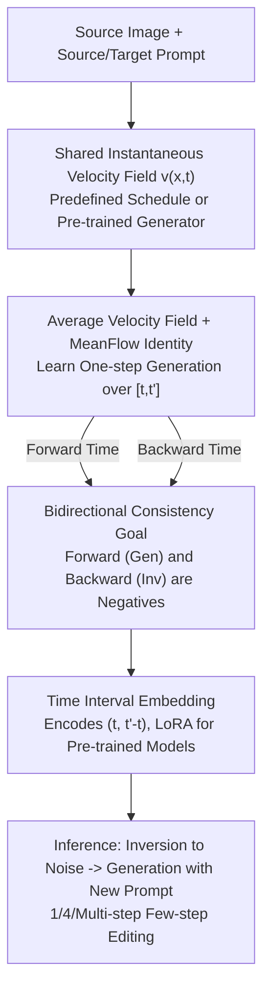

# BiFM: Bidirectional Flow Matching for Few-Step Image Editing and Generation

**Conference**: CVPR 2026  
**Paper**: [CVF Open Access](https://openaccess.thecvf.com/content/CVPR2026/html/Dai_BiFM_Bidirectional_Flow_Matching_for_Few-Step_Image_Editing_and_Generation_CVPR_2026_paper.html)  
**Code**: Not yet released  
**Area**: Diffusion Models / Image Generation / Image Editing  
**Keywords**: flow matching, few-step editing, bidirectional flow matching, image inversion, MeanFlow  

## TL;DR
BiFM enables the same flow matching model to simultaneously learn "noise-to-image" generation and "image-to-noise" inversion within a single training session. By constraining the average velocities of both directions using a shared instantaneous velocity field, it achieves high-fidelity inversion-based image editing under a 1~4 step budget, consistently outperforming existing few-step editing methods.

## Background & Motivation

**Background**: The mainstream approach for image editing in diffusion/flow matching models follows the "inversion-based editing" paradigm—inverting the source image back into the latent space of the generative model and then re-generating it with a target prompt. While this preserves semantics and background, it is inherently slow as inversion and re-generation double the inference steps. Consequently, recent research has focused on "few-step editing" to achieve real-time interaction.

**Limitations of Prior Work**: Few-step inversion is fundamentally challenging. Large step updates in few-step models amplify approximation errors in local linearization and ODE solvers. This manifests as two types of failure: (a) **Training-free inversion** (e.g., DDIM inversion) directly reverses generation steps, but at large step sizes, the difference $| \epsilon_\theta(x_t,t)-\epsilon_\theta(x_{t+\Delta t},t) |$ becomes significant, leading to poor latent recovery, semantic drift, and background loss; (b) **Tuning-based inversion** (e.g., TurboEdit / iCD) attaches an auxiliary inversion network $\Phi$ to a pre-trained generator, which improves fidelity but incurs high additional parameters and training overhead, and lacks backbone universality.

**Key Challenge**: The root cause of the difficulty in learning inversion lies in the **unidirectional "noise-to-data" time convention imposed during training**. The model only sees $x_t$ as an input to calculate velocity, yet during inversion, it must start from $x_{t+\Delta t}$. This mismatch between input and training distributions inevitably leads to errors. Existing methods either tolerate this error (training-free) or add another network to bypass it (tuning-based), neither of which unifies generation and inversion at the source.

**Goal / Core Idea**: Can a few-step diffusion model be trained to **directly learn its own inversion process**? BiFM provides an answer from an ODE perspective—by integrating the flow matching ODE along both time directions, allowing the same model to output both forward average velocity (generation) and backward average velocity (inversion), both constrained by the same instantaneous velocity field. In short, "bidirectional average velocity fields" replace "auxiliary inversion networks / DDIM numerical reversal," unifying generation and inversion within a single model.

## Method

### Overall Architecture

BiFM builds upon two existing foundations: **flow matching** (learning a time-dependent velocity field $v_\theta(x_t,t)$ to flow noise to data via the ODE $dx_t/dt = v_\theta(x_t,t)$) and **time-interval supervision / MeanFlow** (instead of learning the entire trajectory, it learns the **average velocity** over a time interval $[t,t']$, allowing a single step to approximate an ODE integral segment and naturally supporting few-step sampling).

The key insight of BiFM is that forward average velocity (generation) and backward average velocity (inversion) are **integrals of the same instantaneous velocity field $v(x_t,t)$ over opposite time intervals**. By relaxing the MeanFlow Identity from "only for $t<t'$" to "also for $t>t'$," inversion can be defined using the same formula without additional networks. The pipeline starts from a shared instantaneous field, utilizes the MeanFlow Identity to provide training targets for both directions, adds a bidirectional consistency loss to enforce they are negatives of each other, injects time interval embeddings (via LoRA for pre-trained models), and performs editing via two model calls (inversion then generation).

### Key Designs

**1. Average Velocity Field + MeanFlow Identity: Training "One-Step Approximation of an ODE Segment"**

To achieve fast editing, one cannot solve every step of the ODE. BiFM adopts the MeanFlow approach, defining the average velocity field over $[t,t']$ as the integral of the instantaneous velocity:

$$u(x_t,t,t') := \frac{1}{t'-t}\int_{t}^{t'} v(x_\tau,\tau)\, d\tau$$

Supervising the average velocity is equivalent to making the model "jump from $t$ to $t'$ in one step" to approximate the integral, avoiding dense sampling. Taking the derivative with respect to $t$ (using Jacobian-vector products for the total derivative) yields the **MeanFlow Identity**, which provides the regression target for training:

$$u_{\text{tgt}} = v(x_t,t) + (t'-t)\cdot\big[v(x_t,t)\,\partial_{x_t}u_\theta + \partial_t u_\theta\big]$$

The training loss is $\mathcal{L}_{\text{MF}} = \mathbb{E}_{t,t',x} [\|u_\theta(x_t,t,t') - \text{sg}(u_{\text{tgt}})\|^2]$, where $\text{sg}(\cdot)$ denotes stop-gradient. Crucially, calculating $u_{\text{tgt}}$ **does not require explicit access to $v(x_t,t)$ itself**: when training from scratch, $v$ uses a predefined schedule (e.g., rectified flow); for fine-tuning, the pre-trained multi-step generator $v_\theta$ is used. After convergence, $u_\theta$ becomes an equivalent one-step generator for the multi-step dynamics.

**2. Bidirectional Consistency Goal: Defining Gen and Inv with One Formula and Enforcing Reversibility**

This is the core innovation of BiFM. The authors observe that MeanFlow Identity **does not depend on the $t<t'$ order** and holds for $t>t'$. Given $t<t'$, $u(x_t,t,t')$ is interpreted as generation (forward) and $u(x_{t'},t',t)$ as inversion (backward)—both originating from the same field $v$, integrated over opposite intervals. In continuous time, the average velocity of the backward interval $[t',t]$ is exactly the **negative** of the forward interval $[t,t']$. This provides the exact reversibility required for inversion-based editing.

To explicitly encode this into the learned average velocity, BiFM adds a **bidirectional consistency loss**, forcing the forward and backward predictions to be negatives:

$$\mathcal{L}_{\text{BiFM}} = \mathcal{D}\big(u_\theta(x_t,t,t'),\, -u_\theta(x_{t'},t',t)\big)$$

$\mathcal{D}(\cdot,\cdot)$ is a distance metric (ablation shows robust $\ell_p$ norm with $p\approx0.5$ works best). The final objective is $\mathcal{L} = \mathcal{L}_{\text{MF}} + w(t,t')\cdot\mathcal{L}_{\text{BiFM}}$, where $w(t,t')$ is a warm-up weight schedule that gradually strengthens the constraint. Compared to external network methods, BiFM adds no inversion-specific parameters; inversion capability "grows" from the same set of weights.

**3. Time Interval Embedding + LoRA: Injecting Bidirectionality into Large Models**

To apply BiFM to complex models like Stable Diffusion 3 without full retraining, the authors use LoRA fine-tuning. Since the original model only accepts a single timestep, BiFM **adds an extra time embedding**: $t$ and $(t'-t)$ are passed through standard MLP embeddings and summed into an interval embedding vector. This is injected into the network exactly like the original timestep embedding, with **zero-initialization for warm-up**. Ablations prove that explicitly feeding the interval length $(t'-t)$ as a "integration span" is crucial, reducing FID from 59.37 to 55.22 compared to using $(t,t')$.

### Loss & Training
- Total loss: $\mathcal{L} = \mathcal{L}_{\text{MF}} + w(t,t')\cdot\mathcal{L}_{\text{BiFM}}$; $\mathcal{L}_{\text{MF}}$ utilizes stop-gradients for MeanFlow targets, while $\mathcal{L}_{\text{BiFM}}$ enforces bidirectional reversibility.
- Sampling for $(t,t')$ favors shorter intervals (log-normal sampler is superior to uniform) for early stability.
- $w(t,t')$ uses a warm-up schedule. Distance metric uses robust loss ($p\approx0.5$) to clip large residuals in difficult intervals.
- Editing inference requires only two model calls: `u = model(x_1,1,0,p_s); x_0 = x_1+u` (inversion) and `u_edit = model(x_0,0,1,p_t); x_1_edit = x_0+u_edit` (generation).

## Key Experimental Results

### Main Results: Inversion-based Editing on PIE-Bench (SD3 Fine-tuning)

Comparison across multi-step, few-step, and one-step budgets. Metrics include background preservation (LPIPS↓, SSIM↑, PSNR↑, MSE↓) and CLIP alignment.

| Setting | Method | NFE | LPIPS↓ | SSIM%↑ | PSNR↑ | CLIP-Whole↑ |
|:---|:---|:---|:---|:---|:---|:---|
| Multi-step | PnP Inv (ICLR24) | 50 | 49.25 | 84.86 | 27.22 | 25.83 |
| Multi-step | DNAEdit (NeurIPS25) | 28 | 112.60 | 83.69 | 23.24 | 28.90 |
| Multi-step | **Ours** | 50 | **47.01** | **87.50** | **29.89** | 27.42 |
| Few-step | InstantEdit (ICCV25) | 4 | 44.39 | 86.44 | 27.96 | 26.28 |
| Few-step | TurboEdit (ECCV24) | 4 | 76.95 | 84.63 | 25.51 | 25.49 |
| Few-step | **Ours** | 4 | 67.25 | **87.29** | **28.92** | 26.77 |
| One-step | SwiftEdit (CVPR25) | 1 | 91.04 | 81.05 | 23.33 | 25.16 |
| One-step | **Ours** | 1 | 92.30 | **85.88** | **28.46** | **26.09** |

At 4 steps, BiFM leads in SSIM/PSNR over training-free and auxiliary network methods. In the extreme 1-step setting, BiFM trades slightly higher LPIPS for significantly better SSIM/PSNR/CLIP, indicating a stronger preference for structural and semantic preservation.

### Ablation Study (1-NFE ImageNet-256, FID↓)

| Dimension | Configuration | FID↓ |
|:---|:---|:---|
| Time Cond. | Discrete direction flag (t,t′,direc.) | 69.01 |
| Time Cond. | (t, t′) | 59.37 |
| Time Cond. | **(t, t′−t) (Default)** | **55.22** |
| Consistency Weight | Linear | 67.37 |
| Consistency Weight | **Warm-up (Default)** | **55.22** |
| Loss Norm | p=0 (Pure L2) | 72.84 |
| Loss Norm | **p=1.0 (Default)** | **55.22** |

### Key Findings
- **Bidirectional consistency is the core driver of gain**: Extending MeanFlow from generation to inversion is the key to BiFM outperforming baselines in few-step inversion without adding inversion-specific parameters.
- **Explicit interval length is essential**: Conditioning on $(t,t'-t)$ is significantly better than $(t,t')$, as it maps directly to the "average velocity = integral normalized by interval length" objective.
- **Stability depends on warm-up + robust loss**: Using a warm-up schedule for the consistency term and a robust $p \approx 0.5$ loss clips large residuals, preventing over-regularization in the early stages.

## Highlights & Insights
- **Inversion comes "for free"**: The insight that MeanFlow Identity is symmetric for inversion allows one formula to define both directions, eliminating external inversion networks. This "interpret the same mathematical object in a different time direction" approach is elegant and transferable.
- **Zero-initialized Time Embeddings + LoRA**: This provides a non-intrusive way to inject interval awareness into pre-trained backbones like SD3, maintaining existing capabilities while learning new ones.
- **Generation quality improved**: Bidirectional training does not compromise pure generation; instead, it consistently reduces FID across MSCOCO/CIFAR/ImageNet and acts as an orthogonal regularizer to improvements like REPA.

## Limitations & Future Work
- Code is not public; reproduction requires self-implementation of JVP for MeanFlow Identity and bidirectional loss.
- In the extreme 1-step case, LPIPS is slightly worse than SwiftEdit, showing a trade-off in perceptual detail at minimal budgets.
- Primarily validated on SD3 + MMDiT/SiT/U-Net; robustness on more complex, curved-trajectory video or 3D models remains to be verified.

## Related Work & Insights
- **vs DDIM inversion / Training-free inversion**: These methods reverse generation steps numerically, accumulating error at large step sizes. BiFM learns the average velocity of the inversion direction directly, bypassing solver approximations.
- **vs TurboEdit / iCD**: These use extra networks or consistency distillation, adding parameters and lacking backbone flexibility. BiFM unifies everything in one weight set with zero inversion-specific parameters.
- **vs MeanFlow**: MeanFlow only supervises the generation direction; BiFM extends velocity supervision to both time directions for joint training and fine-tuning.

## Rating
- Novelty: ⭐⭐⭐⭐⭐ The observation that MeanFlow Identity applies symmetrically to inversion is simple but powerful.
- Experimental Thoroughness: ⭐⭐⭐⭐ Covers multiple tasks and backbones with clear ablations, though lacks large-scale video validation.
- Writing Quality: ⭐⭐⭐⭐ The derivation chain from average velocity to bidirectional expansion is coherent.
- Value: ⭐⭐⭐⭐ Provides a unified, transferable paradigm for few-step inversion-based editing with high practical utility.

<!-- RELATED:START -->

## Related Papers

- [\[CVPR 2026\] Stable Mean Flow: Lyapunov-Inspired One-Step Flow Matching](stable_mean_flow_lyapunov-inspired_one-step_flow_matching.md)
- [\[CVPR 2026\] LeapAlign: Post-Training Flow Matching Models at Any Generation Step by Building Two-Step Trajectories](leapalign_post_training_flow_matching_models_at_any_generation_step.md)
- [\[CVPR 2026\] RenderFlow: Single-Step Neural Rendering via Flow Matching](renderflow_single-step_neural_rendering_via_flow_matching.md)
- [\[CVPR 2026\] FlowSteer: Guiding Few-Step Image Synthesis with Authentic Trajectories](flowsteer_guiding_few-step_image_synthesis_with_authentic_trajectories.md)
- [\[CVPR 2026\] Frequency-Aware Flow Matching for High-Quality Image Generation](freqflow_frequency_aware_flow_matching.md)

<!-- RELATED:END -->
## Related Papers

- [\[CVPR 2026\] LeapAlign: Post-Training Flow Matching Models at Any Generation Step by Building Two-Step Trajectories](leapalign_post_training_flow_matching_models_at_any_generation_step.md)
- [\[CVPR 2026\] Few-shot Acoustic Synthesis with Multimodal Flow Matching](few-shot_acoustic_synthesis_with_multimodal_flow_matching.md)
- [\[CVPR 2026\] Uni-DAD: Unified Distillation and Adaptation of Diffusion Models for Few-step Few-shot Image Generation](uni-dad_unified_distillation_and_adaptation_of_diffusion_models_for_few-step_few.md)
- [\[CVPR 2026\] RenderFlow: Single-Step Neural Rendering via Flow Matching](renderflow_single-step_neural_rendering_via_flow_matching.md)
- [\[CVPR 2026\] Few-Step Diffusion Sampling Through Instance-Aware Discretizations](few-step_diffusion_sampling_through_instance-aware_discretizations.md)

<!-- RELATED:END -->
