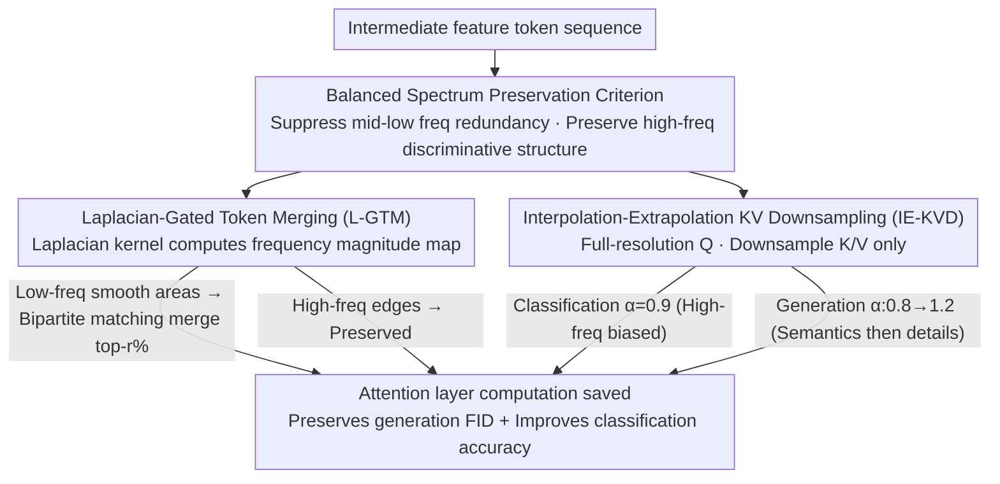

# BiGain: Unified Token Compression for Joint Generation and Classification

**Conference**: CVPR2026  
**arXiv**: [2603.12240](https://arxiv.org/abs/2603.12240)  
**Code**: [Greenoso/BiGain](https://github.com/Greenoso/BiGain)  
**Area**: Image Generation  
**Keywords**: Diffusion model acceleration, token compression, frequency-aware, joint generation-classification optimization, training-free

## TL;DR

BiGain proposes a frequency-aware token compression framework. Using two training-free operators—Laplacian-gated token merging and interpolation-extrapolation KV downsampling—it simultaneously maintains generation quality and significantly improves discriminative classification performance for the first time in diffusion model acceleration.

## Background & Motivation

**Computational Bottleneck of Diffusion Models**: The sampling phase of diffusion models involves massive computation. Existing acceleration methods like token merging or downsampling (e.g., ToMe, ToDo) primarily focus on generation quality, neglecting the model's latent discriminative capabilities.

**Growing Demand for Dual-Purpose Models**: The same diffusion backbone can be used for both image generation and denoising-likelihood-based classification (diffusion classifiers). This has broad applications in medical imaging, security perception, industrial inspection, and remote sensing.

**Acceleration Harms Classification More Than Generation**: Experimental observations show that naive token compression damages classification accuracy much earlier and more severely than it affects generation quality. At extreme sparsity levels, classification may collapse while generation remains acceptable.

**Compression Removes Critical Structures for Classification**: Traditional compression tends to remove high-frequency information such as edges, textures, and high-contrast boundaries that classification relies on. Even if the global appearance remains intact, classification performance drops significantly.

**Lack of Dual-Objective Optimization Perspective**: No prior framework has designed token compression strategies from a joint generation + classification perspective, leading to a gap where images "look good" but "classify poorly."

**Key Insight into Frequency Separation**: Mapping intermediate features to frequency-aware representations allows high-frequency (edges/textures) and low-to-mid-frequency (shape/semantics) components to be decoupled. This provides a design principle for serving both capabilities simultaneously.

## Method

### Overall Architecture

BiGain aims to address the issue where diffusion models can serve as both generators and classifiers, but existing token compression focuses solely on generation quality, often erasing high-frequency details (edges, textures) required for classification. The approach replaces original token merging or KV downsampling with two **training-free, plug-and-play** frequency-aware operators. These are embedded directly into the attention layers of DiT or U-Net without modifying weights. The unified mechanism is the **Balanced Spectrum Preservation** criterion: suppressing redundant mid-to-low frequency smooth regions to save computation while deliberately preserving high-frequency structures that support discrimination, ensuring acceleration does not degrade FID while boosting classification accuracy.

### Key Designs

**1. Laplacian-Gated Token Merging (L-GTM): Merging Smooth Regions, Preserving Edges**

Standard ToMe merges similar tokens indiscriminately, sacrificing edges and textures essential for classification. L-GTM reshapes the token sequence back to a spatial format $H \times W \times C$ and applies a Laplacian kernel $\mathbf{L}$ (a discrete approximation of the second derivative) to convolve a local frequency magnitude map $\mathbf{F} = \text{Reduce}_c(|\mathbf{X} * \mathbf{L}|)$. High values indicate high-frequency edges, while low values signify smooth regions. Tokens with the lowest frequency magnitude in each grid are selected as the destination set $\mathcal{A}$ (low-frequency anchors), and the rest form the source set $\mathcal{B}$. Global bipartite matching is then performed to merge the top $r\%$ most similar source-destination pairs via equal-weight averaging. This ensures merging only occurs in smooth areas, protecting high-frequency tokens and reducing attention cost from $\mathcal{O}(N^2 d)$ to $\mathcal{O}(N'^2 d)$. A variant called ABM (Adaptive Block Merging) is used for high-resolution stages, pooling only blocks where the maximum frequency magnitude is below a threshold $\tau$.

**2. Interpolation-Extrapolation KV Downsampling (IE-KVD): Downsampling K/V for Efficiency, Keeping Q for Quality**

Another major overhead in attention is the length of K and V. IE-KVD performs controllable downsampling on K and V while maintaining Q at full resolution:

$$\mathcal{D}_{\alpha,s}(\mathbf{Z})[i] = \alpha \cdot \mathbf{Z}[\text{nearest}(i)] + (1-\alpha) \cdot \frac{1}{|\mathcal{N}_s(i)|} \sum_{j \in \mathcal{N}_s(i)} \mathbf{Z}[j]$$

where $\alpha$ slides between "nearest neighbor (high-freq preservation)" and "average pooling (low-freq preservation)." Q remains uncompressed to preserve the fine-grained receptive field of each output token, stabilizing generation quality and maintaining the attention precision needed for discrimination. This reduces cost from $\mathcal{O}(N^2 d)$ to $\mathcal{O}(N \tilde{N} d)$. $\alpha$ is scheduled by task: a fixed $\alpha=0.9$ for classification to preserve high frequencies, while for generation, $\alpha$ linearly scales from 0.8 to 1.2 (focusing on low-frequency semantics early and high-frequency details later).

Both operators are local to time-steps and deterministic, requiring no cross-step caching. Thus, they are naturally compatible with the Monte Carlo paired difference estimation in diffusion classifiers—all categories share the same noise samples and compression strategy, maintaining the discriminative paradigm post-acceleration.

## Key Experimental Results

### Experimental Setup

- **Backbones**: Stable Diffusion v2.0 (U-Net) and DiT-XL/2 (Transformer)
- **Datasets**: ImageNet-1K, ImageNet-100, Oxford-IIIT Pets, COCO-2017
- **Metrics**: Classification Top-1 Acc / mAP; Generation FID

### Main Results 1: Token Merging (SD-2.0, Table 4)

| Dataset | Method | Merge Ratio 70% Acc ↑ | Merge Ratio 70% FID ↓ |
|---|---|---|---|
| Pets | ToMe | 65.76 | 38.35 |
| Pets | **Ours-TM** | **74.63 (+8.87)** | **37.73 (-0.62)** |
| ImageNet-1K | ToMe | 37.35 | 18.42 |
| ImageNet-1K | **Ours-TM** | **44.50 (+7.15)** | **18.08 (-0.34)** |
| COCO Acc@1 | ToMe | 57.32 | 29.00 |
| COCO Acc@1 | **Ours-TM** | **61.44 (+4.12)** | **28.57 (-0.43)** |

At a 70% token merging ratio, BiGain-TM improves classification accuracy by 7.15% on ImageNet-1K while improving FID by 0.34.

### Main Results 2: KV Downsampling (SD-2.0, Table 2)

| Dataset | Method | Downsample 4× Acc ↑ | Downsample 4× FID ↓ |
|---|---|---|---|
| Pets | ToDo | 77.46 | 31.48 |
| Pets | **Ours-TD** | **78.03 (+0.57)** | **29.21 (-2.27)** |
| ImageNet-100 | ToDo | 48.70 | 15.63 |
| ImageNet-100 | **Ours-TD** | **54.48 (+5.78)** | **15.46 (-0.17)** |

### Performance on DiT-XL/2 (Table 3 & 5)

- With 2× KV downsampling, BiGain-TD outperforms ToDo by **9.08%** in classification accuracy (78.42 vs 69.34) on ImageNet-100, with a 0.35 improvement in FID.
- ToDo nearly collapses on DiT at 3× or higher factors (Acc drops to single digits, FID >190), while BiGain-TD maintains reasonable performance.
- For token merging, BiGain-TM exceeds ToMe by **7.88%** in classification accuracy at a 70% merging ratio.

### Ablation Study & Key Findings

1. **Necessity of Frequency Awareness**: Removing the Laplacian gate causes a sharp drop in classification accuracy, validating the critical role of high-frequency protection for discriminative ability.
2. **Frequency Balance in KV Downsampling**: Generation tasks benefit from a linear schedule ($\alpha$: 0.8→1.2), while classification prefers a fixed $\alpha=0.9$.
3. **Comparison with Competing Methods** (Pets dataset, Table 1): With a ~10% reduction in FLOPs, BiGain-TM only drops 2.65% Acc (vs ToMe -8.07, SiTo -12.19, DiP-GO -4.50, MosaicDiff -3.65).
4. **Balanced Spectrum Preservation** is a reliable design principle: Simultaneously preserving high-frequency details and mid-low frequency semantic content benefits both tasks.

## Highlights & Insights

- **First Dual-Objective Token Compression Framework**: Extends diffusion model acceleration from single-objective generation quality optimization to joint generation-classification optimization.
- **Elegant and Practical Frequency Separation Insight**: Laplacian kernel computation is simple, efficient, requires no learning, and is plug-and-play.
- **Cross-Architecture Generality**: Effective on both U-Net (SD-2.0) and DiT (DiT-XL/2).
- **Training-Free**: Requires no fine-tuning or retraining; can be embedded directly during inference.
- **Extensible Design Principles**: The principle of Balanced Spectrum Preservation can guide the design of future compression methods.

## Limitations & Future Work

- The Laplacian kernel is a fixed 3×3 kernel, which may not be the optimal frequency detector for high-frequency information across all scales.
- $\alpha$ parameters and merging ratios still require tuning for different models/datasets, lacking an adaptive mechanism.
- Discriminative capability was only verified under the diffusion classifier paradigm without extension to other protocols like linear probe or feature distillation.
- Baseline performance of ToDo on DiT is exceptionally poor (collapsing at 3×), which may overstate the relative gain.
- Not yet tested on more complex scenarios such as video diffusion models or 3D generation.

## Related Work & Insights

- **ToMe/ToMeSD**: Greedy token merging for Transformer and diffusion model acceleration, optimizing only for generation quality.
- **ToDo**: Token downsampling via average pooling to reduce attention overhead, ignoring discriminative performance.
- **DiP-GO / Diff-Pruning**: Structured pruning methods that reduce computation via gradient or subnetwork search.
- **MosaicDiff / SiTo**: Other token reduction/pruning strategies also focused solely on generation fidelity.
- **Diffusion Classifier**: Uses class-wise denoising likelihood for classification; BiGain's compression makes this paradigm viable even under acceleration for the first time.

## Rating

- Novelty: ⭐⭐⭐⭐ — First to propose a dual-objective perspective and frequency-aware compression principles with clear insights.
- Experimental Thoroughness: ⭐⭐⭐⭐ — 4 datasets × 2 backbones × 2 operators × multiple compression ratios, with complete ablations.
- Writing Quality: ⭐⭐⭐⭐ — Clear motivation-method-experiment logic chain with standardized formulas.
- Value: ⭐⭐⭐⭐ — Fills the gap of neglected discriminative capability in diffusion acceleration; design principles are highly generalizable.

<!-- RELATED:START -->

## Related Papers

- [\[CVPR 2026\] C$^2$FG: Control Classifier-Free Guidance via Score Discrepancy Analysis](c2fg_control_classifier-free_guidance_via_score_discrepancy_analysis.md)
- [\[CVPR 2026\] Denoising as Path Planning: Training-Free Acceleration of Diffusion Models with DPCache](dpcache_denoising_path_planning_diffusion_accel.md)
- [\[CVPR 2026\] SeaCache: Spectral-Evolution-Aware Cache for Accelerating Diffusion Models](seacache_spectral-evolution-aware_cache_for_accelerating_diffusion_models.md)
- [\[CVPR 2026\] Mixture of States: Routing Token-Level Dynamics for Multimodal Generation](mixture_of_states_routing_token-level_dynamics_for_multimodal_generation.md)
- [\[CVPR 2026\] DA-VAE: Plug-in Latent Compression for Diffusion via Detail Alignment](da-vae_plug-in_latent_compression_for_diffusion_via_detail_alignment.md)

<!-- RELATED:END -->
