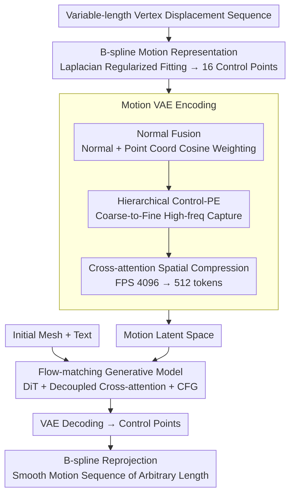

# BiMotion: B-spline Motion for Text-guided Dynamic 3D Character Generation

**Conference**: CVPR2026  
**arXiv**: [2602.18873](https://arxiv.org/abs/2602.18873)  
**Code**: [Project Page](https://wangmiaowei.github.io/BiMotion.github.io/)  
**Area**: Image Generation / Dynamic 3D Generation  
**Keywords**: B-spline, Motion Generation, Text-guided, 3D Character Animation, VAE-latent diffusion, Control point representation

## TL;DR

BiMotion is proposed to compress variable-length motion sequences into a fixed number of control points using continuously differentiable B-spline curves. Combined with a specialized VAE and flow-matching diffusion model, it achieves fast, highly expressive, and semantically complete text-guided dynamic 3D character generation, outperforming existing methods in both quality and efficiency.

## Background & Motivation

1. **High demand for dynamic 3D generation**: There is a growing need for text-driven 3D character animation in gaming, film, and education. Decoupling motion generation from shape synthesis is the current mainstream paradigm.
2. **Fixed-length input bottleneck**: Existing feed-forward methods (e.g., AnimateAnyMesh) employ VAE-latent diffusion, which requires fixed-size inputs, forcing the cropping or uniform downsampling of motion sequences.
3. **Semantic loss from cropping**: Truncating variable-length sequences can only capture isolated sub-actions (e.g., "rotate right") and fails to express the complete motion semantics described by users.
4. **Jitter from downsampling**: Uniform temporal downsampling leads to non-smooth, jittery motion results.
5. **Discrete frame-based representation as the fundamental bottleneck**: Motion is inherently continuous; the number of frames only reflects the sampling rate. Since semantics do not change with the number of frames, a continuous and compact parameterization is required.
6. **Lack of high-quality annotated data**: Existing datasets lack paired diverse variable-length motion sequences and high-quality text descriptions.

## Method

### Overall Architecture

The core challenge BiMotion addresses is the mismatch between fixed-capacity feed-forward models (VAE-latent diffusion) and naturally variable-length motion sequences, where hard cropping loses semantics and hard downsampling causes jitter. The solution is to replace the discrete "frame" representation with continuous B-spline curves—fitting any sequence into a fixed number of control points regardless of the original frame count. During training, variable-length vertex displacement sequences are fitted into control points via B-splines. A VAE encodes these control points into motion latents, and a flow-matching diffusion model learns the conditional generation of "initial shape + text → motion latent." During inference, given an initial mesh and text, the diffusion model generates a latent, the VAE decodes it back to control points, and B-spline reprojection generates a smooth motion sequence of arbitrary length.

### Key Designs

**1. B-spline Motion Representation: Compressing variable-length sequences into fixed control points with arbitrary resampling**

Frame-based representations link frame counts to semantics, meaning cropping or downsampling destroys the motion itself. BiMotion independently fits a uniform cubic B-spline ($d=3$) to each vertex's displacement trajectory, using a unified $k=16$ control points. To handle short sequences where $k > T$ makes the system underdetermined, a second-order difference operator $\mathbf{L}$ is introduced for Laplacian regularization. The closed-form solution is efficiently obtained via Cholesky decomposition (< 1 second for 200 frames and 50K vertices). The continuous differentiability of B-splines ensures natural trajectories and local control while supporting temporal re-parameterization, allowing the same set of control points to sample smooth motion of any length.

**2. Normal Fusion: Distinguishing parts that are "spatially close but structurally different"**

Relying solely on point coordinates can confuse motion parts that are spatially close but have different mesh structures. Normal Fusion encodes surface normals via an MLP and fuses them with point coordinate features using point-wise cosine similarity weighting. This approach is more stable than those relying on mesh connectivity and is a major factor in reducing reconstruction error from 1.328 to 1.078 in ablations.

**3. Hierarchical Control-PE: Capturing details like tail wagging from coarse to fine**

Standard frequency-based positional encoding fails to capture fine-grained motion. Inspired by wavelet packet decomposition, Control-PE constructs a hierarchy of control points [17, 15, 13, 11, 9, 7, 5, 4], extracting high-frequency residuals at each level and concatenating them with the coarsest coefficients. Calculated efficiently through a single matrix multiplication, it significantly outperforms traditional frequency encoding in capturing high-frequency details like a lion's tail wagging.

**4. Cross-attention Spatial Compression: Compressing thousands of points into 512 tokens**

To reduce computation, FPS sampling reduces $n=4096$ points to $n'=512$ tokens. The encoder uses 8 layers of cross-attention, and the decoder uses 8 layers of self-attention for latent encoding and decoding.

**5. Flow-matching Generative Model: Decoupled cross-attention for text and shape fusion**

The generation of motion latents is based on Rectified Flow-Matching with a 12-layer DiT backbone. The initial latent $\mathbf{z}_0$ is concatenated with the motion latent and fused with text conditions (CLIP ViT-L/14) and shape conditions through decoupled cross-attention. Classifier-free guidance ($\gamma=3.0$) is used during inference.

### Loss & Training

The total VAE loss is a weighted combination of fitting, correspondence, rigidity, and regularization terms:

$$\mathcal{L}_{VAE} = \mathcal{L}_{Fit} + 0.3 \cdot \mathcal{L}_{Corr} + 0.1 \cdot \mathcal{L}_{Rigid} + 2 \times 10^{-5} \cdot \mathcal{L}_{KL}$$

| Loss | Function |
|------|------|
| $\mathcal{L}_{Fit}$ (Charbonnier) | Fits the input control points |
| $\mathcal{L}_{Corr}$ (Correspondence) | Fits the original displacement trajectory after B-spline reprojection; faster initial convergence |
| $\mathcal{L}_{Rigid}$ (Local Rigidity) | Enforces local distance consistency between adjacent frames to maintain shape identity |
| $\mathcal{L}_{KL}$ | Regularizes the latent distribution |

## Key Experimental Results

### BIMO Dataset

- **38,944** motion sequences, totaling **3,682,790** frames.
- Sources: DeformingThings4D (1,770) + ObjaverseV1 (10,550) + ObjaverseXL (26,624).
- Text Annotation: Manual annotation for DeformingThings4D + GPT-5 automatic annotation for Objaverse (including iterative verification by an inspector).

### Main Results

| Method | OC↑ | SC↑ | AQ↑ | DD↑ | TA(User)↑ | MP(User)↑ | ME(User)↑ | Time↓ | GPU Memory↓ |
|------|-----|-----|-----|-----|-----------|-----------|-----------|-------|-------|
| GVFDiffusion | 0.167 | 0.920 | 0.505 | 0.650 | 2.34 | 2.30 | 2.44 | 2.1min | 14.1GB |
| AnimateAnyMesh | 0.155 | 0.951 | 0.514 | 0.100 | 2.31 | 2.69 | 2.44 | 16.8s | 3.1GB |
| V2M4 | 0.175 | 0.876 | 0.478 | 0.750 | 2.88 | 2.71 | 3.05 | 1.7h | 48.4GB |
| **BiMotion** | **0.187** | 0.948 | **0.529** | **0.800** | **4.10** | **4.06** | **4.05** | **4.4s** | **1.2GB** |

- Significantly leads in all three user study metrics (~4.0 vs. ~2.9 for the runner-up) with the lowest standard deviation.
- **3.8×** faster than AnimateAnyMesh with only **1.2 GB** of GPU memory.
- As mesh vertices increase from 9K to 24K, BiMotion's time and memory remain nearly constant, whereas AnimateAnyMesh shows linear growth.

### Ablation Study

| Configuration | Reconstruction Error (×10⁻²) |
|------|-------------------|
| w/o B-spline + w/o all | 3.237 |
| w/o B-spline + w/ NF/Corr/Rigid | 2.674 |
| w/ B-spline w/o NF | 1.328 |
| w/ B-spline w/o Control-PE | 1.648 |
| w/ B-spline w/o Corr | 1.303 |
| w/ B-spline w/o Rigid | 1.349 |
| **Full Model** | **1.078** |

- B-spline representation provides the largest gain in reconstruction quality (3.237 → 1.328).
- Normal Fusion contributes significantly to spatial differentiation (1.328 → 1.078).
- Laplacian regularization outperforms Ridge regularization for short sequences (T < k).

## Highlights & Insights

- **Elegant Representation Design**: Using B-splines to map variable-length motion to fixed control points elegantly solves the fundamental conflict of processing variable sequences with fixed-capacity models.
- **Extreme Efficiency**: 4.4s generation time and 1.2 GB VRAM usage significantly outperform other methods and remain insensitive to mesh complexity.
- **Topological Robustness**: Dense-point training and normal fusion allow the method to operate independently of specific mesh topologies; the same model generates consistent motion for different grid inputs.
- **Hierarchical Embedding Innovation**: The proposed control point embedding inspired by wavelet decomposition is significantly superior to standard frequency encoding.
- **High-quality Data Pipeline**: The construction of the BIMO dataset (39K sequences) with rich annotations and an iterative inspector-based automatic labeling pipeline.

## Limitations & Future Work

- Limited ability to represent high-frequency complex motions (e.g., rapid vibration), requiring an increase in control points.
- Assumes a fixed topology mesh and does not support motions with topological changes (e.g., splitting, fluids).
- Dependent on large-scale high-quality dynamic 3D data and computational power.
- Certain motions like walking may appear as "walking in place" due to a lack of global displacement modeling.

## Related Work & Insights

| Method | Motion Representation | Input Condition | Variable-length Support | Feed-forward |
|------|----------|----------|----------|------|
| AnimateAnyMesh | Frame-wise vertex tokens | Text + Mesh | ✗ (Fixed Crop) | ✓ |
| GVFDiffusion | 3D Gaussian | Video | ✗ | ✓ |
| V2M4 | Monocular Video Recon. | Video | ✗ (Optimization) | ✗ |
| DNF | 4D INR | Unconditional | ✓ | ✗ |
| Puppeteer | Skeleton-driven | Video + Mesh | ✗ | ✗ |
| **BiMotion** | **B-spline Control Points** | **Text + Mesh** | **✓** | **✓** |

- AnimateAnyMesh is the most direct competitor as a text+mesh feed-forward generator; BiMotion breaks its fixed-frame cropping limitation through B-splines.
- Video-conditioned methods (GVFDiffusion, V2M4) are heavily affected by video quality and exhibit low efficiency.
- Skeleton-based methods (Puppeteer) require precise rigging, showing poor generalization to general characters.

## Rating

- Novelty: ⭐⭐⭐⭐ — B-spline motion representation + Hierarchical embedding are novel and sound designs.
- Experimental Thoroughness: ⭐⭐⭐⭐⭐ — VBench + User Studies + Comprehensive Ablations + Multiple Baselines + Efficiency Analysis.
- Writing Quality: ⭐⭐⭐⭐ — Clear logic, complete mathematical derivations, and rich visualizations.
- Value: ⭐⭐⭐⭐ — The contribution at the representation level is generalizable and transferable to other motion generation tasks.

<!-- RELATED:START -->

## Related Papers

- [\[CVPR 2026\] InterEdit: Navigating Text-Guided Multi-Human 3D Motion Editing](interedit_navigating_textguided_multihuman_3d_moti.md)
- [\[CVPR 2026\] Vinedresser3D: Agentic Text-guided 3D Editing](vinedresser3d_agentic_text-guided_3d_editing.md)
- [\[ECCV 2024\] Local Action-Guided Motion Diffusion Model for Text-to-Motion Generation](../../ECCV2024/image_generation/local_action-guided_motion_diffusion_model_for_text-to-motion_generation.md)
- [\[ICCV 2025\] TeRA: Rethinking Text-guided Realistic 3D Avatar Generation](../../ICCV2025/image_generation/tera_rethinking_text-guided_realistic_3d_avatar_generation.md)
- [\[CVPR 2026\] SeeThrough3D: Occlusion Aware 3D Control in Text-to-Image Generation](seethrough3d_occlusion_aware_3d_control_in_text-to-image_generation.md)

<!-- RELATED:END -->
