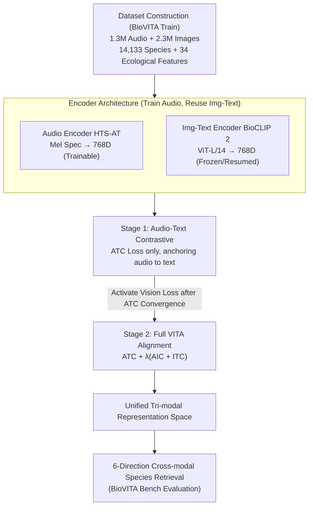

# BioVITA: Biological Dataset, Model, and Benchmark for Visual-Textual-Acoustic Alignment

**Conference**: CVPR 2026  
**arXiv**: [2603.23883](https://arxiv.org/abs/2603.23883)  
**Code**: [Project Page](https://dahlian00.github.io/BioVITA_Page/)  
**Area**: Image Generation  
**Keywords**: visual-textual-acoustic alignment, cross-modal retrieval, bioacoustics, species identification, multimodal representation learning

## TL;DR
The BioVITA framework is proposed, comprising a million-scale tri-modal (image-text-audio) biological dataset, a two-stage alignment model, and a six-direction cross-modal species-level retrieval benchmark, achieving the first unified visual-textual-acoustic representation learning in the biological domain.

## Background & Motivation
**Background**: Biodiversity research relies on multiple sensory modalities (images for appearance, audio for vocalizations, and text for descriptive classification). Models like BioCLIP have succeeded in image-text alignment, while CLAP has progressed in audio-text alignment.

**Limitations of Prior Work**: Current multimodal datasets focus only on pair-wise modalities (image-text or audio-text), lacking a unified training and evaluation framework for tri-modal data. Pioneer works like SSW60 only cover 60 species, which is insufficient in scale.

**Key Challenge**: Comprehensive species perception is required for biodiversity research, but Visual-Textual-Acoustic (VITA) alignment remains an open challenge due to inconsistent taxonomic systems and large scale differences across datasets.

**Goal**: To build a complete VITA alignment framework that enables models to perform species-level cross-modal retrieval freely among images, audio, and text.

**Key Insight**: Starting from dataset construction, a million-scale tri-modal dataset with annotated ecological features is collected; a two-stage training strategy is then used to align audio representations into the existing visual-textural representation space.

**Core Idea**: Leveraging the powerful pre-trained image-text representations of BioCLIP 2, a two-stage strategy—starting with audio-text contrast and followed by tri-modal joint contrast—is employed to achieve unified tri-modal representation efficiently.

## Method

### Overall Architecture
BioVITA fills a persistent gap in biological multimodality: while mature models exist for image-text and audio-text (BioCLIP 2, CLAP), no previous work has aligned image, text, and audio (VITA) into a single space. It provides a comprehensive suite of "Dataset + Model + Benchmark": BioVITA Train provides million-scale tri-modal training data, BioVITA Model uses three encoders for audio/image/text to learn unified representations, and BioVITA Bench evaluates performance via six-direction cross-modal retrieval. The key to the model is not training tri-modality from scratch, but "anchoring" audio into the already aligned image-text space of BioCLIP 2.

### Key Designs

**1. BioVITA Train Dataset Construction: Tri-modal alignment requires tri-modal paired data**

Existing datasets contain either audio or images, which cannot support tri-modal joint training. BioVITA follows a three-step process: audio curation, fine-grained annotation, and visual integration. It collects 1.3 million audio clips from iNaturalist, Xeno-Canto, and the Animal Sound Archive, paired with 2.3 million images from the ToL-200M subset, covering 14,133 species and annotated with 34 ecological features (diet, activity patterns, habitat, etc.). This scale and the 34-dimensional feature labels enable fine-grained ecological analysis and tri-modal joint training for the first time.

**2. Two-Stage Training Strategy: Align audio-text first, then introduce images**

Direct tri-modal joint training is unstable due to the difficulty of fine-grained acoustic and visual discrimination. BioVITA decomposes this into two steps. Stage 1 only trains the audio-text contrastive (ATC) loss to align the audio encoder with text:

$$\mathcal{L}_{\text{ATC}} = \frac{1}{2}\left(\ell(\mathbf{S}_{\text{AT}}) + \ell(\mathbf{S}_{\text{AT}}^\top)\right)$$

This stage runs for 30 epochs with a learning rate of $10^{-4}$ and a batch size of 64. Once ATC converges, Stage 2 activates the image-related audio-image contrastive (AIC) loss and image-text contrastive (ITC) loss for full VITA alignment:

$$\mathcal{L} = \mathcal{L}_{\text{ATC}} + \lambda(\mathcal{L}_{\text{AIC}} + \mathcal{L}_{\text{ITC}})$$

This runs for 10 epochs, with $\lambda$ linearly scheduled from 0 to 0.1 over the first 2 epochs. Anchoring audio to text first and then gradually introducing images via the strong image-text space of BioCLIP 2 is much more stable than single-stage training.

**3. Encoder Architecture: Train audio only, reuse mature image-text encoders**

The audio encoder uses HTS-AT (a hierarchical Transformer with 4 SwinT stages) to extract 768-dimensional representations from Mel spectrograms. The image-text encoder directly uses pre-trained BioCLIP 2 (ViT-L/14 + 12-layer Transformer), also providing 768 dimensions. Since BioCLIP 2 already has robust image-text representations, only the audio encoder needs training for alignment, saving significant 
computational resources.

### Loss & Training
- Contrastive learning utilizes a standard InfoNCE-style cross-entropy loss, with a temperature hyperparameter $\tau$ controlling the sharpness of the similarity distribution.
- In Stage 2, $\lambda$ employs a linear schedule to prevent the ATC loss from rebounding.
- A maximum of 20 recordings per species per epoch is used, with audio randomly cropped into 10-second segments to increase diversity.

## Key Experimental Results

### Main Results

| Retrieval Direction | Metric | BioVITA | ImageBind | CLAP | Gain |
|----------|------|---------|-----------|------|------|
| Audio→Text (Top-1) | Species | **Best** | - | Second | Significant Lead |
| Text→Audio (Top-1) | Species | **Best** | - | Second | Significant Lead |
| Audio→Image (Top-1) | Species | **Best** | Second | - | First achieved |
| Image→Audio (Top-1) | Species | **Best** | Second | - | First achieved |
| Image→Text (Top-1) | Species | **Best** | - | - | Matches BioCLIP 2 |
| Text→Image (Top-1) | Species | **Best** | - | - | Matches BioCLIP 2 |

### Ablation Study

| Configuration | Audio→Text | Text→Audio | Description |
|------|-----------|-----------|------|
| Stage 1 only | High | High | Audio-text alignment is effective |
| Stage 1+2 (Full) | **Best** | **Best** | Tri-modal joint training further improves results |
| Single-stage joint training | Low | Low | Validates the necessity of the two-stage strategy |

### Key Findings
- BioVITA achieves species-level retrieval across all six directions for the first time, significantly leading in audio-related directions.
- Two-stage training is more effective than single-stage joint training because audio-text alignment serves as the foundation for tri-modal alignment.
- Ecological feature labels reveal interesting correlations between acoustic and visual traits (e.g., vocalizations of nocturnal animals are more distinctive).
- The model demonstrates strong generalization performance on 325 unseen species.

## Highlights & Insights
- Dataset scale and coverage far exceed previous works (1.3M audio + 2.3M images + 14K species + 34 ecological features).
- The two-stage training strategy intelligently leverages pre-trained models to avoid starting tri-modal alignment from scratch.
- The systematic six-direction retrieval benchmark provides a standardized evaluation for biological multimodal research.
- Ecological feature annotations add a new dimension to cross-modal biological understanding.

## Limitations & Future Work
- Audio and images are not strictly paired (different individuals of the same species), making it impossible to learn individual-level correspondence.
- Video modality (temporal information of animal behavior) is not yet considered.
- Avian data constitutes the vast majority, potentially leading to imbalanced coverage across other taxonomic classes.
- Future work could explore end-to-end fine-tuning of the image-text encoder rather than keeping it frozen.

## Related Work & Insights
- BioCLIP/BioCLIP 2 demonstrated the effectiveness of structured taxonomic text prompts for biological image-text alignment.
- The success of CLAP in general audio-language pre-training provided the foundation for bioacoustic alignment.
- ImageBind's approach to cross-modal alignment via a shared embedding space is an important reference, though it lacks sufficient data in the biological domain.
- This work suggests that for new modality alignment, a two-stage "align then joint" approach is more robust than single-stage alignment.

## Rating
- Novelty: ⭐⭐⭐⭐ First million-scale biological tri-modal dataset and benchmark, though the method itself uses mature contrastive learning.
- Experimental Thoroughness: ⭐⭐⭐⭐ Comprehensive six-direction retrieval and multi-granularity analysis, though missing downstream task evaluations.
- Writing Quality: ⭐⭐⭐⭐ Clear structure and detailed dataset construction process.
- Value: ⭐⭐⭐⭐⭐ Significant contribution to both biodiversity research and multimodal learning; the dataset itself is a major contribution.

<!-- RELATED:START -->

## Related Papers

- [\[CVPR 2026\] Prompt Yourself: Awakening Textual Semantics in 1D Visual Tokenizers](prompt_yourself_awakening_textual_semantics_in_1d_visual_tokenizers.md)
- [\[CVPR 2026\] Thinking-while-Generating: Interleaving Textual Reasoning throughout Visual Generation](thinking-while-generating_interleaving_textual_reasoning_throughout_visual_gener.md)
- [\[CVPR 2026\] UnicEdit-10M: A Dataset and Benchmark Breaking the Scale-Quality Barrier via Unified Verification for Reasoning-Enriched Edits](unicedit-10m_a_dataset_and_benchmark_breaking_the_scale-quality_barrier_via_unif.md)
- [\[CVPR 2026\] POCA: Pareto-Optimal Curriculum Alignment for Visual Text Generation](poca_pareto-optimal_curriculum_alignment_for_visual_text_generation.md)
- [\[CVPR 2026\] I2I-Bench: A Comprehensive Benchmark Suite for Image-to-Image Editing Models](i2i-bench_a_comprehensive_benchmark_suite_for_image-to-image_editing_models.md)

<!-- RELATED:END -->
