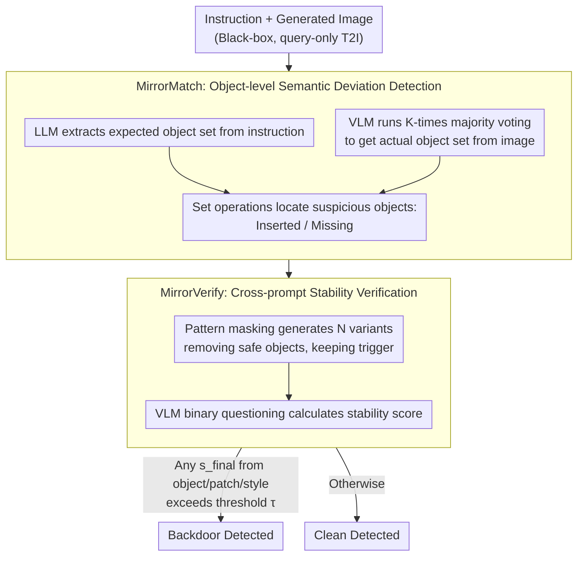

# BlackMirror: Black-Box Backdoor Detection for Text-to-Image Models via Instruction-Response Deviation

**Conference**: CVPR2026  
**arXiv**: [2603.05921](https://arxiv.org/abs/2603.05921)  
**Code**: [GitHub](https://github.com/Ferry-Li/BlackMirror)  
**Area**: Image Generation  
**Keywords**: Backdoor Detection, Text-to-Image Models, Black-box Detection, Vision-Language Models, Model Security

## TL;DR

The BlackMirror framework is proposed, which employs a two-stage process consisting of fine-grained instruction-response semantic deviation detection (MirrorMatch) and cross-prompt stability verification (MirrorVerify). It achieves universal detection of multiple backdoor attacks on T2I models under black-box conditions, reaching an average F1 score of 89.46%, significantly outperforming the existing black-box method UFID.

## Background & Motivation

**T2I backdoor threats are increasingly severe**: Text-to-image diffusion models are widely deployed on MaaS platforms. Attackers can inject backdoors during the training phase, causing models to generate images that deviate from user intent (e.g., replacing objects, inserting patches, changing styles, or generating fixed images) when encountering specific triggers.

**Black-box scenarios are a practical requirement**: In reality, users cannot access model weights and architectures. Existing white-box methods (such as T2IShield, GrainPS, and NaviDet, which rely on attention maps or neuron activations) are unavailable in this context.

**Limitations of prior work (UFID)**: The only black-box method, UFID, makes strong assumptions that generated images after backdoor triggering are globally highly similar. This is only effective for FixImgAtt (generating fixed images). For attacks like ObjRepAtt, PatchAtt, and StyleAtt that only modification local semantics, the generated results remain scattered in the embedding space, causing UFID to fail.

**Insensitivity of global similarity metrics**: Using CLIP to calculate instruction-response similarity as a baseline shows that similarity scores for backdoor and clean samples overlap significantly in attacks like BadT2I and EvilEdit, making them indistinguishable.

**Key Insight**: The authors identified two key properties of backdoor attacks: (1) trigger activation causes instruction-response semantic deviation (specific patterns are manipulated), and (2) this deviation remains stable across different prompt variations; in contrast, inherent model biases lack cross-prompt stability.

**Goal**: MaaS platforms require a training-free, internal-information-independent, and interpretable universal detection solution that can simultaneously cover object/patch/style-level attacks.

## Method

### Overall Architecture

BlackMirror targets T2I backdoor detection in black-box scenarios. Without access to weights or attention maps, and given that the prior work UFID only handles FixImgAtt, BlackMirror leverages two properties: backdoor triggers cause semantic deviations that are stable across prompts (unlike unstable inherent model biases). The process is designed in two stages: MirrorMatch extracts fine-grained suspicious objects from generated images, and MirrorVerify verifies whether this deviation is stable over multiple generations. During detection, three branches (object/patch/style, $t=3$) run in parallel; a backdoor is determined if any branch triggers an alarm.

### Key Designs

**1. MirrorMatch: Aligning instructions and images at the object level to extract semantic deviations**

UFID's use of CLIP for global similarity is too coarse, leading to overlapping scores between backdoor and clean samples. MirrorMatch adopts object-level comparison: first, an LLM $f_l(\cdot)$ (Qwen-8B) extracts the expected visual object set $\mathcal{O}_{\text{ins}}$ from the instruction $x$. Then, a VLM $f_v(\cdot)$ (Qwen2.5-VL-7B) independently analyzes the generated image $K$ times, using majority voting (appearing $\geq \lceil K/2 \rceil$ times) to obtain the actual object set $\mathcal{O}_{\text{res}}$, filtering out background noise. Set operations then locate suspicious points: $\mathcal{O}_{\text{safe}} = \mathcal{O}_{\text{ins}} \cap \mathcal{O}_{\text{res}}$ contains safe objects, $\mathcal{O}_{\text{new}} = \mathcal{O}_{\text{res}} \setminus \mathcal{O}_{\text{safe}}$ are objects appearing out of nowhere (potentially inserted), and $\mathcal{O}_{\text{lost}} = \mathcal{O}_{\text{ins}} \setminus \mathcal{O}_{\text{safe}}$ are objects that should be present but are missing (potentially replaced). This ensures precise capture of even local deviations.

**2. MirrorVerify: Verifying deviation stability via prompt perturbation to suppress false positives**

Semantic deviation alone is insufficient, as inherent model randomness can cause occasional deviations. MirrorVerify tests if the deviation is "stable across prompts." It randomly removes objects in $\mathcal{O}_{\text{safe}}$ from the original prompt (pattern masking) while keeping the potential trigger, generating $N$ prompt variants and corresponding images. For each suspicious object $o$, a VLM asks the binary question "Does the image contain [object]?" and calculates a confidence score $s^{(i)}(o)$ from yes/no logits. For new objects, the average occurrence probability $s_{\text{new}}(o)$ is used; for missing objects, the average missing probability $s_{\text{lost}}(o)$ is used. The final stability score $s_{\text{final}} = \max\{s_{\text{new}}, s_{\text{lost}}\}$ must exceed threshold $\tau$ to confirm a backdoor. Real backdoor deviations replicate stably across prompts, while inherent model biases are filtered out—removing this step in ablations caused the FPR for almost all attacks to soar to 100%.

### Loss & Training

- The entire process involves no training loss. The core hyperparameter is the threshold $\tau$; experiments show $\tau=0.999$ provides the best balance between precision and recall.
- The number of generations $N=5$ represents a trade-off between accuracy and efficiency.

## Main Results

### Experimental Settings

- Base T2I Model: Stable Diffusion v1.5
- Attack Coverage: ObjRepAtt (BadT2I/EvilEdit/PaaS/Rickrolling-TPA), FixImgAtt (VillanDiffusion), PatchAtt (BadT2I), StyleAtt (BadT2I/Rickrolling-TAA)
- 200 prompts generated per clean-target pair, with 50% containing triggers.
- Hardware: 2× RTX 3090

### Main Results

| Method | Type | F1 Avg (↑) | FPR Avg (↓) |
|------|------|-----------|-------------|
| T2IShield† | White-box | 47.31 | 45.30 |
| GrainPS† | White-box | 91.29 | 8.10 |
| NaviT2I† | White-box | 87.14 | 9.27 |
| UFID | Black-box | 72.29 | 48.78 |
| CLIP baseline | Black-box | 65.55 | 42.50 |
| **BlackMirror** | **Black-box** | **89.46** | **15.09** |

### Ablation Study

| Configuration | FPR Avg (↓) |
|------|-------------|
| w/o MirrorVerify | 93.06 |
| w/ MirrorVerify | 15.09 |

Without MirrorVerify, the FPR for almost all attacks spikes to 100%, proving that stability verification is indispensable.

### Key Findings

1.  **Significant Gains in ObjRepAtt**: F1 increased from 66.67% to 86.96% on BadT2I and from 60.87% to 85.71% on EvilEdit, with FPR dropping below 5%, demonstrating the advantage of fine-grained pattern matching.
2.  **Win-win via Voting**: The majority voting mechanism reduced FPR by approximately 5% on average and reduced processing time by about 4 seconds per sample (by reducing VLM queries through narrowing the suspicious set).
3.  **Influence of generation count $N$**: Performance at $N=1$ cannot distinguish noise from stable deviations; performance saturates around $N=5$.
4.  **Black-box Surpassing White-box**: BlackMirror's F1 (89.46%) surpasses white-box methods T2IShield (47.31%) and NaviT2I (87.14%), approaching GrainPS (91.29%).
5.  **Minimal VLM Queries**: The MirrorVerify stage requires an average of only 3.14 VLM queries, keeping computational overhead comparable to or lower than UFID.

## Highlights & Insights

- First universal black-box T2I backdoor detection framework covering object, patch, style, and fixed-image attacks.
- Training-free and plug-and-play, suitable for MaaS deployment.
- Clear logic with a two-stage design (deviation detection + stability verification) providing high interpretability.
- Innovative use of VLM semantic understanding to replace coarse embedding similarity.
- Cleverly designed majority voting and pattern masking strategies that balance accuracy and efficiency.

## Limitations & Future Work

- Detection capability is limited by the VLM's visual understanding; subtle style changes difficult for VLMs to identify may be missed.
- The FPR on FixImgAtt (VillanDiffusion) is 28.12%, inferior to UFID's 0%, as global similarity is a strong signal for that specific attack.
- Requires multiple T2I model calls ($N=5$), which may be costly in high-latency API scenarios.
- The threshold $\tau=0.999$ requires high VLM confidence and is sensitive to VLM output calibration.
- Only verified on SD v1.5; generalization to larger models like SDXL or DALL-E remains to be validated.

## Related Work & Insights

- **Backdoor Attacks**: TrojDiff/BadDiffusion (noise injection) → VillanDiffusion (unified framework) → Rickrolling/EvilEdit/BadT2I/PaaS (T2I text encoder/cross-attention/data poisoning). The trend is shifting from fixed-image attacks to local semantic manipulation.
- **White-box Defenses**: T2IShield (attention maps), GrainPS (attention projection consistency), NaviDet (neuron activation monitoring), TPD (prompt perturbation to weaken triggers).
- **Black-box Defenses**: UFID is the only prior work, based on global image similarity, effective only for FixImgAtt.
- **VLM-Assisted Safety**: This work pioneered the use of VLMs for semantic alignment and verification in backdoor detection.

## Rating

- Novelty: ⭐⭐⭐⭐ — Introducing VLMs for black-box backdoor detection with a deviation+stability two-stage paradigm is novel.
- Experimental Thoroughness: ⭐⭐⭐⭐ — Covers 8 attack methods and 4 backdoor types with detailed ablations.
- Writing Quality: ⭐⭐⭐⭐ — Coherent motivation-method-experiment logic with rich diagrams.
- Value: ⭐⭐⭐⭐ — Clear practical demand in MaaS scenarios with a highly versatile framework.

<!-- RELATED:START -->

## Related Papers

- [\[CVPR 2026\] CSF: Black-box Fingerprinting via Compositional Semantics for Text-to-Image Models](csf_black-box_fingerprinting_via_compositional_semantics_for_text-to-image_model.md)
- [\[CVPR 2026\] Black-box Membership Inference Attacks on the Pre-training Data of Image-generation Models](black-box_membership_inference_attacks_on_the_pre-training_data_of_image-generat.md)
- [\[CVPR 2025\] Where's the Liability in the Generative Era? Recovery-Based Black-Box Detection of AI-Generated Content](../../CVPR2025/image_generation/wheres_the_liability_in_the_generative_era_recovery-based_black-box_detection_of.md)
- [\[ICML 2026\] Support-Proximity Augmented Diffusion Estimation for Offline Black-Box Optimization](../../ICML2026/image_generation/support-proximity_augmented_diffusion_estimation_for_offline_black-box_optimizat.md)
- [\[ICLR 2026\] Generative Modeling from Black-Box Corruptions via Self-Consistent Stochastic Interpolants](../../ICLR2026/image_generation/generative_modeling_from_black-box_corruptions_via_self-consistent_stochastic_in.md)

<!-- RELATED:END -->
