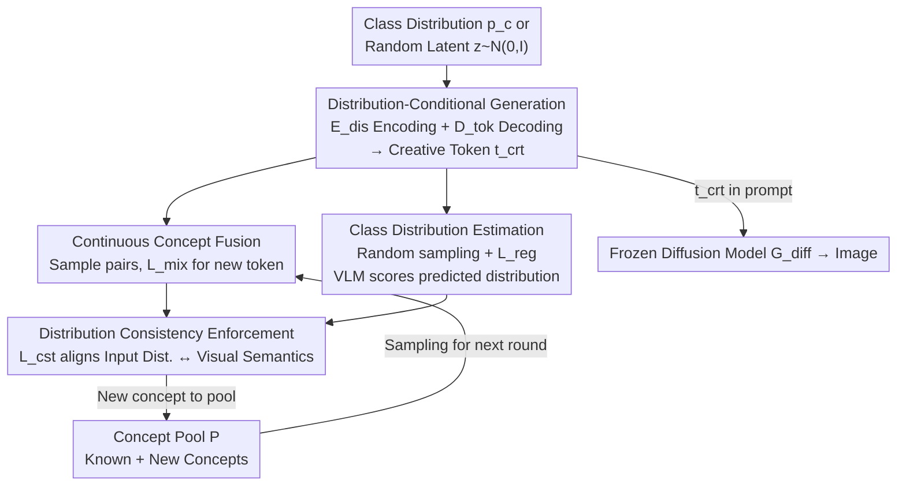

# Breaking Semantic Boundaries: Distribution-Guided Semantic Exploration for Creative Generation

**Conference**: CVPR 2026  
**Paper**: [CVF Open Access](https://openaccess.thecvf.com/content/CVPR2026/html/Feng_Breaking_Semantic_Boundaries_Distribution_Guided_Semantic_Exploration_for_Creative_Generation_CVPR_2026_paper.html)  
**Code**: Not disclosed  
**Area**: Diffusion Models / Creative Image Generation  
**Keywords**: Creative generation, Distribution-conditional generation, Concept fusion, Semantic exploration, Encoder-decoder  

## TL;DR
This paper reformulates "generating new concepts" as "image synthesis conditioned on class distributions." Using a lightweight encoder–decoder (DisTok), any class distribution or random latent vector is decoded into "creative tokens" that can be embedded into prompts. This approach unifies controllable conditional exploration and open-ended unconditional exploration, achieving SOTA in text-to-image alignment and human preference for creative generation while being 13–40 times faster than existing methods.

## Background & Motivation

**Background**: Text-to-image (T2I) models like Stable Diffusion 3, FLUX, and Midjourney can render natural language prompts into high-quality images with precise semantic alignment. However, their capability fundamentally stems from fitting the training distribution—they excel at "reproducing" known visual concepts but struggle to synthesize truly "unseen" new concepts outside the training distribution.

**Limitations of Prior Work**: Existing works targeting "creativity" through semantic exploration face two primary limitations. One category (BASS, CreTok, AGSwap) creates new concepts by **combining two known concepts**. While controllable, these are restricted to discrete "concept pairs," resulting in language-describable outputs that remain within familiar semantic spaces without truly breaking semantic boundaries. Another category (ConceptLab) pushes tokens away from known categories via iterative optimization. This **unconditional** approach ignores human priors, making generation uncontrollable. Furthermore, it requires approximately 120 seconds of gradient search per concept, which is slow and prone to converging into sparse, repetitive clusters.

**Key Challenge**: A trade-off exists between controllability and "true novelty/openness"—controllability often restricts the model to discrete combinations of known concepts, while openness sacrifices guidance from human intent. Achieving both remains an unsolved problem.

**Key Insight**: The authors observe a phenomenon in classifiers: when encountering ambiguous or out-of-distribution inputs, a classifier does not output a hard label but a **soft probability distribution** covering multiple known classes (e.g., a monster might be "55% pig, 25% sheep, 20% snake"). This suggest that a "semantically unknown" new concept can often be approximated by a distribution over a set of known categories.

**Core Idea**: Invert the classification process—rather than "Image → Class Distribution," perform "**Class Distribution → Image**." The authors term this **Distribution-Conditional Generation**: synthesizing images conditioned on a continuous distribution over known classes. This allows for fine-grained, adjustable distribution weights to control multi-concept fusion. Since distributions can take any continuous value (or be randomly sampled), controllable conditional exploration and open-ended unconditional exploration are naturally unified within the same space.

## Method

### Overall Architecture

DisTok is an extremely lightweight encoder–decoder (two 2-layer MLPs with hidden dimension 768 and latent dimension 20) added to existing T2I diffusion models without modifying them. It consists of two components: a **Distribution Encoder** $E_{dis}$ that maps a class distribution $p_c \in \Delta^K$ to a latent vector $z = E_{dis}(p_c) \in \mathbb{R}^\omega$, and a **Creative Decoder** $D_{tok}$ that decodes the latent vector into a "creative token" $t_{crt} = D_{tok}(z) \in \mathbb{R}^d$ ($\omega \ll d$). This token can be directly embedded into natural language prompts (e.g., "a photo of a `<tcrt>`") and rendered by a frozen diffusion model $G_{diff}$ into an image $x_{crt} = G_{diff}(t_{crt})$, allowing the synthesized concept to be reused consistently across different scenarios and styles.

Training revolves around a dynamic **Concept Pool $P$**: initially containing tokens for known concepts, it is continuously updated with "newly discovered concepts" (tokens + their VLM-predicted distributions). This allows subsequent fusion to synthesize increasingly complex distributions. Each training step randomly executes one of three tasks: **Continuous Concept Fusion** (sampling class pairs to fuse into a single token), **Class Distribution Estimation** (sampling random latent vectors to decode into new concepts, scored by VLM for pool entry), and **Distribution Consistency Enforcement** (using new concepts in the pool to supervise the encoder, aligning input distributions with visual semantics).

### Key Designs

**1. Distribution-Conditional Generation: Describing Unknown concepts via "Class Distributions"**

This is a paradigm-level innovation addressing the "representation of unknown concepts." Where prior methods used discrete combinations or unconditional search, this approach uses the inverted soft output of a classifier. A new concept is modeled as a continuous distribution $p_c$ over known classes (e.g., $(0.55 \text{ pig}, 0.25 \text{ sheep}, 0.20 \text{ snake})$). This provides **fine-grained controllable** knobs for multi-concept fusion. Since distributions are continuous, the model can transition smoothly from known distributions to randomly sampled ones, unifying controllable and open exploration in a single latent space.

**2. Continuous Concept Fusion: Bootstrapping Describable Distributions without Training Data**

To train $E_{dis}/D_{tok}$ without "distribution → image" pairs, the authors use concept-pair fusion for pseudo-supervision. A pair of concepts $(c_1, c_2)$ is sampled, their tokens are summed and encoded as $z = E_{dis}(t_1+t_2)$, and then decoded to $t_{crt}$. An adaptive prompt $q_a = $ "a photo of a `<tcrt>`" is aligned with a restrictive prompt $q_r = $ "a $c_1$ $c_2$" and an aesthetic prompt $q_s = $ "a photo of a cute pet." To prevent the model from focusing only on the dominant concept, a thresholded loss is introduced:

$$L_{mix}=\big(1-\min[\cos(E(q_r),E(q_a)),\varepsilon_1]\big)+\big(1-\min[\cos(E(q_s),E(q_a)),\varepsilon_2]\big)$$

Fixed thresholds $\varepsilon_1, \varepsilon_2$ (0.85/0.80) cap the maximum similarity reward, forcing the model to balance concepts. By recursively fusing new concepts added to the pool, DisTok approximates complex distributions beyond simple pairs.

**3. Class Distribution Estimation: Random Sampling + Latent Space Regularization**

$L_{mix}$ provide indirect textual supervision. To enable direct visual supervision and unconditional exploration, latent vectors $z \sim N(0,I)$ are sampled and decoded into $t_{crt}$ and images $x_{crt}$. A pre-trained VLM (BLIP) predicts the visual distribution $p_{crt}(c) = \mathrm{softmax}(p_{vlm}(c|x_{crt}))$. To ensure $z$ decodes into meaningful concepts rather than semantic noise, latent space regularization is applied:

$$L_{reg}=\frac{1}{\sigma(z)^2}\,\mathbb{E}_z\big[\,\|\mu(z)\|_2^2\,\big]$$

This forces the latent space toward a **zero-mean, high-variance** distribution, preventing mode collapse while preserving diversity. After training, generation can be performed by directly sampling from zero-mean, unit-variance distributions (Gaussian, Laplace, Cauchy).

**4. Distribution Consistency Enforcement: Anchoring Tokens to Visual Semantics**

Using new concepts with VLM-predicted distributions, the authors apply direct consistency supervision to the encoder. A new concept $(t_{nvl}, p_{nvl})$ is sampled, its distribution is used to weight known tokens $\sum_i p_{nvl}(i)t_i$, which are then encoded and decoded to produce $t_{crt}$. The loss requires $t_{crt}$ to be close to $t_{nvl}$ in the embedding space:

$$L_{cst}=1-\cos(E(t_{crt}),E(t_{nvl}))$$.

This loss explicitly anchors "creative tokens" to visual semantics. Since $p_{nvl}$ is derived from the actual visual output via VLM, aligning it forces $E_{dis}$ to faithfully capture "distributional semantics," ensuring visual novelty and semantic consistency.

### Loss & Training
Each iteration consists of $n$ sampling steps, randomly executing concept fusion or distribution consistency tasks while optimizing $E_{dis}$ and $D_{tok}$:

$$L_{total}=\frac{1}{n}\sum_{i=1}^{n}\Big(\alpha\,\mathbb{I}^{(i)}_{mix}L^{(i)}_{mix}+\beta\,\mathbb{I}^{(i)}_{cst}L^{(i)}_{cst}+\gamma\,L^{(i)}_{reg}\Big)$$

Based on Kandinsky 2.1 (CLIP-L/14), training takes ~30 minutes for 20K steps on a single RTX 4090 with batch=1 and accumulation $n=8$. Hyperparameters: $\alpha=1, \beta=1, \gamma=0.001, \tau=0.85$. Post-training, creative tokens are generated via a single forward pass without per-concept optimization.

## Key Experimental Results

The CangJie dataset (60 common concepts) was used, with 30 additional weighted distributions for evaluation. Metrics include VQAScore (alignment), PickScore (aesthetics), and ImageReward (human preference), supplemented by GPT-4o evaluation and a 100-person user study.

### Main Results

Text-image alignment and human preference (Table 1, higher ⇑ is better; last column denotes DisTok under distribution-conditional settings):

| Metric | BASS (Pairs) | CreTok (Pairs) | DisTok (Pairs) | DisTok (Dist.) |
|------|------|------|------|------|
| VQAScore | 0.667 | 0.695 | **0.840** | 0.734 |
| PickScore | 21.67 | 21.97 | **22.33** | 21.23 |
| ImageReward | 0.387 | 1.018 | **1.168** | 0.661 |

In the TP2O (concept pairs) task, DisTok outperforms specialized methods like BASS and CreTok. For the distribution task, metrics are slightly lower due to limitations in current evaluators for out-of-distribution creativity, yet VQAScore remains competitive.

GPT-4o Creative Assessment (Table 2, distribution task, 0–10):

| Model | Fusion | Alignment | Originality | Aesthetic | Avg |
|------|------|------|------|------|------|
| SD 3 | 6.3 | 5.7 | 5.8 | 8.0 | 6.5 |
| Kandinsky | 7.7 | 7.4 | 7.3 | 8.6 | 7.8 |
| FLUX | 8.0 | 7.7 | 8.0 | 8.8 | 8.1 |
| **DisTok** | **9.2** | **9.2** | **9.8** | **9.9** | **9.5** |

DisTok significantly outperforms SOTA diffusion models in distribution-conditional generation, particularly in originality and aesthetics. In the User Study (Table 3, Win:Loss against DisTok), DisTok prevails (e.g., 396:104 vs. FLUX).

### Ablation Study

| Configuration | KL↓ (Input Dist. vs. BLIP Visual Dist.) | Description |
|------|------|------|
| w/o Consistency Enforcement | 0.0732 | Removing $L_{cst}$ increases distribution shift |
| Full DisTok | **0.0602** | Full model ensures consistent fine-grained semantics |

Efficiency Comparison (Time per concept): BASS ≈40s, ConceptLab ≈120s, CreTok ≈4s, **DisTok ≈3s** (approx. 13× and 40× speedup).

### Key Findings
- **Consistency enforcement is vital for control**: Without it, KL divergence increases, meaning generated images fail to align with the input distribution.
- **Fusion enables incremental complexity**: Visualizing tokens at 2K/3K/10K steps shows a progression from simple stitching to intricate, entangled composite concepts.
- **Latent regularization unlocks open sampling**: Regularizing the space allows sampling from any distribution (Gaussian/Laplace/Cauchy), providing far greater diversity than ConceptLab's sparse clusters.
- **Beyond linguistic expression**: Concepts generated by DisTok, when re-described as detailed prompts by GPT-4o and fed back to models, often lose compositional integrity, suggesting that creative tokens are more expressive than natural language "prompt engineering."

## Highlights & Insights
- **The "Inverted Classifier" Perspective**: Converting soft labels from a classifier's byproduct into a generation condition is a brilliant reformulation, turning indescribable concepts into adjustable continuous knobs.
- **Train Once, Sample Interactively**: By shifting expensive iterative search (BASS/ConceptLab) into a one-time 30-minute training phase, the model achieves 13–40x speedups, making it practical for creative asset generation.
- **Tokens as Reusable Semantic Anchors**: The produced $t_{crt}$ can be used across prompts for style transfer while maintaining concept consistency, decoupling concept from style.
- **VLM as a Soft Labeler**: Using BLIP to provide distribution feedback for self-supervision creates a generation-understanding closed loop, offering a paradigm for training without expensive manual annotations.

## Limitations & Future Work
- **Dependence on Known Classes**: Distributions are defined over a fixed set (60 in CangJie). Novelty is essentially an interpolation or extrapolation of these classes; whether it can generate concepts truly independent of any known class remains ⚠️ questionable.
- **VLM Supervision Ceiling**: The accuracy of distribution estimation and consistency depends on BLIP's discriminative ability; errors in the VLM will propagate as noise into the supervision signal.
- **Metric-Task Mismatch**: Existing metrics like VQAScore/PickScore may underestimate strong out-of-distribution creativity, necessitating heavy reliance on GPT-4o and user studies.
- **Scale and Domain**: Experiments focus largely on "animals" and a single base model (Kandinsky 2.1). Scaling to broader categories and complex bases like SD3/FLUX requires further validation.

## Related Work & Insights
- **vs. BASS / CreTok (Concept Pairs)**: These rely on sampling and candidate filtering or simple token fusion. They are controllable but limited to discrete pairs. DisTok models combinations in a continuous latent space and is significantly faster (3s vs. 40s).
- **vs. ConceptLab (Unconditional Exploration)**: ConceptLab uses gradient iteration to push tokens away from known classes. It is open but uncontrollable, slow (120s), and repetitive. DisTok uses latent regularization for direct sampling, making it faster and more diverse.
- **vs. Diffusion Interpolation (MagicMix / DiffMorpher)**: These interpolate semantics during the diffusion process, making them hard to reuse in prompts. DisTok outputs tokens that can be embedded and reused across scenes/styles.

## Rating
- Novelty: ⭐⭐⭐⭐⭐ "Distribution-conditional generation" unified conditional and unconditional exploration via inverted soft labels.
- Experimental Thoroughness: ⭐⭐⭐⭐ Broad coverage of conditions, styles, and efficiency, though ablation is somewhat limited and constrained to animal concepts.
- Writing Quality: ⭐⭐⭐⭐ Clear motivation and illustrations, though notation is slightly dense.
- Value: ⭐⭐⭐⭐ Practical, fast, and controllable, with high utility for creative asset generation and personalization.

<!-- RELATED:START -->

## Related Papers

- [\[CVPR 2025\] Redefining <Creative> in Dictionary: Towards an Enhanced Semantic Understanding of Creative Generation](../../CVPR2025/image_generation/redefining_creative_in_dictionary_towards_an_enhanced_semantic_understanding_of_.md)
- [\[CVPR 2026\] Semantic Derivative Flow: Graph-Guided Diffusion for Controllable Instance Interactions](semantic_derivative_flow_graph-guided_diffusion_for_controllable_instance_intera.md)
- [\[CVPR 2026\] Unified Latent Space for Understanding and Generation via Semantic Auto-encoder](unified_latent_space_for_understanding_and_generation_via_semantic_auto-encoder.md)
- [\[CVPR 2026\] Style-GRPO: Semantic-Aware Preference Optimization for Image Style Transfer Guided by Reward Modeling](style-grpo_semantic-aware_preference_optimization_for_image_style_transfer_guide.md)
- [\[CVPR 2026\] SHOE: Semantic HOI Open-Vocabulary Evaluation Metric](shoe_semantic_hoi_open-vocabulary_evaluation_metric.md)

<!-- RELATED:END -->
