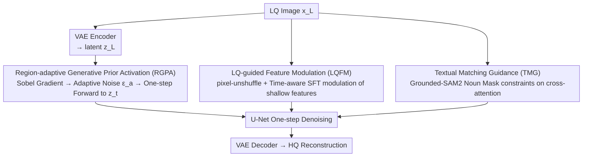

# Bridging Fidelity-Reality with Controllable One-Step Diffusion for Image Super-Resolution

**Conference**: CVPR 2026  
**Paper**: [CVF Open Access](https://openaccess.thecvf.com/content/CVPR2026/html/Chen_Bridging_Fidelity-Reality_with_Controllable_One-Step_Diffusion_for_Image_Super-Resolution_CVPR_2026_paper.html)  
**Code**: https://github.com/Chanson94/CODSR  
**Area**: Diffusion Models / Image Super-Resolution  
**Keywords**: One-step Diffusion, Real-world Image Super-Resolution, Generative Prior Activation, Feature Modulation, Textual Alignment  

## TL;DR
CODSR performs real-world image super-resolution via one-step diffusion: it first utilizes "local noise injection" based on gradient maps to activate generative priors in textured regions, then employs uncompressed LQ features to modulate U-Net intermediate layers for fidelity restoration, and finally constrains cross-attention with noun masks from Grounded-SAM2 for textual alignment. It achieves superior perceptual quality and competitive fidelity across four real-world datasets.

## Background & Motivation
**Background**: In recent years, the mainstream approach for Real-world Image Super-Resolution (Real-ISR) has been leveraging the strong generative priors of pre-trained text-to-image diffusion models (e.g., Stable Diffusion) to "hallucinate details." However, full diffusion requires dozens or hundreds of denoising steps, which is computationally expensive. Consequently, several one-step diffusion methods (OSEDiff, PiSA-SR, TVT, HYPIR, etc.) have emerged, distilling multi-step processes into a single-step forward pass.

**Limitations of Prior Work**: The authors identify three critical unresolved issues in existing one-step methods:
1. **Poor Fidelity**: LQ images are first compressed and encoded into the latent space via VAE; this compression inherently loses information, leading to structural deviations during reconstruction.
2. **Non-partitioned Activation of Generative Priors**: Existing methods directly feed the LQ latent into the denoising network, which deviates from the native "recovery from noise" mode of diffusion models. Moreover, treating all spatial regions equally leads to over-generated artifacts in flat regions and insufficient detail in textured/edge regions.
3. **Textual Misalignment**: Text prompts extracted using DAPE/RAM often fail to spatially align their influence in cross-attention with the actual semantic regions corresponding to the words, rendering textual guidance largely ineffective.

**Key Challenge**: There is a natural conflict between fidelity (staying true to the LQ structure) and reality (generating rich details). To create more details, more noise or generative priors must be released, which in turn disrupts the latent distribution and damages structural fidelity. Existing methods either sacrifice fidelity for perception or suppress generation to maintain structure.

**Goal**: To develop a one-step diffusion super-resolution method that can "controllably balance fidelity and reality" while addressing the three aforementioned weaknesses.

**Core Idea**: Instead of uniform noise injection across the image, the method **activates generative priors differentially by region** (injecting noise only where uncertainty exists), restores fidelity by **modulating intermediate features with uncompressed LQ information**, and ensures **textual alignment via mask constraints**. These three components correspond to the three identified limitations.

## Method

### Overall Architecture
CODSR is a one-step diffusion super-resolution network based on SD 2.1-base. The input is a degraded low-quality image $x_L$, and the output is a high-quality reconstructed image. The entire pipeline consists of "one forward noise addition + one reverse denoising": $x_L$ is first encoded into latent $z_L$ via VAE; instead of direct denoising, **RGPA** constructs spatial-adaptive noise based on a Sobel gradient map to obtain a noisy latent $z_t$ through a one-step forward pass. During denoising, shallow U-Net features are modulated by **LQFM** using uncompressed LQ features to recover fidelity information. Simultaneously, **TMG** uses noun masks from Grounded-SAM2 to constrain cross-attention, ensuring text act only on corresponding semantic regions. These three modules address their respective issues and are coupled via temporal coefficients $\lambda_t$ and $w_t$ to collaborate within a single step.

### Key Designs

**1. Region-adaptive Generative Prior Activation (RGPA): Targeted noise injection by gradient map**

Addressing "non-partitioned prior activation." Existing one-step methods feed $z_L$ directly into the denoising network, deviating from the diffusion-native mode and resulting in artifacts in flat areas and insufficient texture. RGPA **actively injects Gaussian noise into the latent** before denoising, but the amount of noise is spatially adaptive. $x_L$ is encoded to $z_L$, then a one-step forward pass constructs the noisy latent:
$$z_t = \sqrt{\bar\alpha_t}\, z_L + \sqrt{1-\bar\alpha_t}\, \epsilon_a$$
The reverse pass executes a single step, using U-Net predicted noise $\epsilon_\theta(z_t,c,t)$ to recover the clean latent:
$$\hat z_H = z_L + w_t\big(\epsilon_a - \epsilon_\theta(z_t,c,t)\big),\quad w_t=\tfrac{\sqrt{1-\bar\alpha_t}}{\sqrt{\bar\alpha_t}}$$
The key lies in the adaptive noise $\epsilon_a$: a Sobel gradient map $g_{x_L}$ is calculated for $x_L$ and passed through a mapping operator $\mathcal{W}(\cdot)$ (involving $16\times16$ patch averaging and piecewise transformation) to obtain region-wise noise weights. Finally, $\epsilon_a = \mathcal{W}(g_{x_L})\odot\epsilon$ where $(\epsilon\sim\mathcal N(0,I))$. High-frequency areas receive stronger noise to encourage generative exploration, while low-frequency flat areas receive weaker noise to preserve structure. The timestep $t_s\in[t_{min},t_{max}]$ is randomly sampled during training for robustness; during inference, adjusting $t_s$ allows for continuous sliding between fidelity and generation quality, providing "controllability."

**2. LQ-guided Feature Modulation (LQFM): Restoring fidelity via uncompressed LQ information**

Addressing "poor fidelity due to VAE compression." Loss of structural information during $x_L \to z_L$ encoding is irreversible in the latent space. LQFM is a plug-and-play module that bypasses the latent and draws information directly from the raw LQ image. Pixel-unshuffle is applied to $x_L$ to obtain features $\tilde x_L$ without information loss. A **time-aware Spatial Feature Transform (SFT) layer** then modulates the output features $f^m$ of the first U-Net convolutional layer:
$$\mathrm{SFT}(f^m\mid \tilde x_L) = (1+\lambda_t\gamma)\odot f^m + \lambda_t\beta$$
Modulation parameters $(\gamma, \beta) = \mathcal{M}(\tilde x_L)$ are generated by a two-layer MLP. The temporal coefficient $\lambda_t = 1/w_t$ aligns modulation intensity with the RGPA noise schedule. By modulating **intermediate features $f^m$** instead of the latent $z_L$ itself, the method avoids disrupting the latent distribution (Ablation Table 4).

**3. Textual Matching Guidance (TMG): Anchoring text to semantic regions via noun masks**

Addressing "textual misalignment." TMG extracts prompts via RAM and removes abstract adjectives using NLTK, leaving only nouns $\{n_1,\dots,n_N\}$. These nouns and $x_L$ are fed into Grounded-SAM2 to obtain binary region masks $\{M^1,\dots,M^N\}$. These masks explicitly define where text should act during the reverse process, using CoMat's positive area loss to constrain the alignment between cross-attention maps $A^i$ and masks $M^i$. Masks can be **pre-calculated and cached offline**, ensuring zero additional segmentation overhead during inference.

### Loss & Training
Training follows a two-stage strategy. **Stage 1** uses pixel-level content loss + LPIPS perceptual loss + GAN loss (from S3Diff) to establish realistic details. **Stage 2** adopts the dual LoRA strategy from PiSA-SR: LoRAs from Stage 1 are frozen, and new LoRAs are added to U-Net cross-attention layers to enhance textual alignment, utilizing VSD loss (weight of 2) to distill semantic knowledge. The objective is:
$$\mathcal L = \mathcal L_{\text{OSEDiff}} + \eta_{pos}\mathcal L_{pos}$$
Where $\mathcal L_{pos}$ is the positive area loss from CoMat with $\eta_{pos}=1$. VAE encoder and U-Net LoRAs are set to ranks 4 and 16 respectively; 4x 4090 GPUs, batch size 16, AdamW, $lr=5e-5$.

## Key Experimental Results

### Main Results
CODSR was compared against full-step and one-step diffusion methods on four real-world datasets: RealSR, DrealSR, RealPhoto60, and RealDeg. Representative metrics from DrealSR and RealSR are shown below (PSNR/SSIM ↑ higher better, LPIPS/DISTS/NIQE ↓ lower better, MUSIQ/MANIQA/CLIPIQA+ ↑ higher better):

| Dataset | Metric | OSEDiff | PiSA-SR | TVT | HYPIR | Ours CODSR |
|---------|--------|---------|---------|-----|-------|------------|
| DrealSR | PSNR↑  | 27.92 | 28.32 | 28.27 | 26.04 | 28.19 |
| DrealSR | LPIPS↓ | 0.2968 | 0.2959 | 0.2900 | 0.3356 | 0.2919 |
| DrealSR | DISTS↓ | 0.2165 | 0.2169 | 0.2205 | 0.2333 | **0.2108** |
| DrealSR | NIQE↓  | 6.49 | 6.17 | 7.03 | 6.39 | **5.97** |
| DrealSR | MUSIQ↑ | 64.65 | 66.11 | 65.56 | 61.03 | **67.05** |
| DrealSR | CLIPIQA+↑ | 0.5181 | 0.5290 | 0.5226 | 0.4885 | **0.5589** |
| RealSR  | LPIPS↓ | 0.2920 | 0.2672 | 0.2597 | 0.3046 | 0.2741 |
| RealSR  | MUSIQ↑ | 69.08 | 70.15 | 69.89 | 66.42 | **70.54** |
| RealSR  | MANIQA↑ | 0.6331 | 0.6552 | 0.6232 | 0.6510 | **0.6727** |

CODSR leads in all no-reference metrics across all datasets: NIQE, MUSIQ, and CLIPIQA+ are higher by at least 0.15, 0.39, and 0.0133 respectively. Compared to full-step methods, MUSIQ on DrealSR and RealDeg improves by at least 1.96 and 5.15. While PODSR is not first in PSNR/SSIM, it achieves the **best perceptual quality while maintaining competitive fidelity**.

### Ablation Study
Module-wise ablation (DrealSR, Table 2):

| Configuration | LPIPS↓ | MUSIQ↑ | CLIPIQA+↑ | Description |
|---------------|--------|--------|-----------|-------------|
| Base          | 0.2906 | 65.89  | 0.5038    | No modules  |
| + RGPA        | 0.2914 | 66.26  | 0.5109    | Prior release, Perception ↑ |
| + RGPA & LQFM | 0.2902 | 66.27  | 0.5213    | Fidelity restored, CLIPIQA+ ↑ |
| Full (+ TMG)  | 0.2919 | **67.05** | **0.5589** | TMG gives a significant jump |

Comparison of noise strategies (DrealSR, Table 3):

| Noise Strategy | PSNR↑ | LPIPS↓ | MUSIQ↑ | CLIPIQA+↑ | Description |
|----------------|-------|--------|--------|-----------|-------------|
| Base           | 28.39 | 0.2906 | 65.89  | 0.5038    | No noise |
| $x_L+\epsilon_a$ (Image domain) | 28.29 | 0.2917 | 65.84 | 0.5020 | Ineffective activation |
| $z_L+\epsilon$ (Standard Gaussian) | 28.04 | 0.2974 | 66.48 | 0.5133 | Perception ↑ but fidelity collapse |
| RGPA (Ours)    | 28.24 | 0.2914 | 66.26  | 0.5109    | Optimal balance |

### Key Findings
- **Complementary Modules**: RGPA primarily boosts no-reference perception, LQFM restores CLIPIQA+, and TMG provides the largest jump in semantic quality.
- **Latent-Domain Adaptive Noise is Essential**: Image-domain noise is ineffective due to misalignment with the noise pathway. Standard Gaussian noise in the latent space destroys fidelity; only RGPA's adaptive latent noise preserves both.
- **Intermediate vs. Latent Modulation**: Modulating $z_L$ in LQFM destroys its diagonal Gaussian distribution, significantly hurting no-reference metrics. SFT outperforms element-wise addition.
- **Timestep $t_s$ as a Control Knob**: Larger $t_s$ (more noise) leads to higher MUSIQ but lower PSNR, showing a clear trade-off. Default is $t_s=100$.
- **VSD Loss is Critical**: Removing it drops MUSIQ from 67.05 to 65.56 and CLIPIQA+ from 0.5589 to 0.5009.

## Highlights & Insights
- **Intuitive "Inject noise where uncertain" approach**: Changing noise from uniform to gradient-weighted solves both flat-region artifacts and texture deficiency with a lightweight implementation.
- **Clean fidelity restoration**: Bypassing VAE compression by modulating intermediate features rather than the latent itself provides a valuable lesson for conditions injection in latent diffusion models.
- **Practical TMG design**: Moving the cost of heavy segmentation modules (Grounded-SAM2) to the training phase via offline caching allows inference to remain a single forward pass.
- **Temporal Coupling**: Coefficients $\lambda_t$ and $w_t$ synchronize RGPA and LQFM intensity over time, ensuring modules work in a coupled mechanism.

## Limitations & Future Work
- Complexity relies on multiple external pre-trained components (Grounded-SAM2, RAM, DAPE, SD 2.1). Although masks are cached, training costs and dependency on these models persist.
- Fidelity metrics (PSNR/SSIM) are not SOTA; not necessarily the first choice for scenarios requiring absolute pixel fidelity.
- TMG relies on noun-level masks, which might fail for abstract textures or scenes without clear objects (e.g., clear sky).
- Mapping operator $\mathcal{W}(\cdot)$ is somewhat empirical.

## Related Work & Insights
- **vs. OSEDiff**: CODSR is a systemic enhancement, adding RGPA, LQFM, and TMG to the OSEDiff framework.
- **vs. PiSA-SR / TVT**: While they use dual LoRA or VAE fine-tuning, CODSR's use of uncompressed pixel-unshuffle features bypasses the fundamental compression loss better.
- **vs. DAPE**: Unlike prior methods that extract prompts without spatial alignment, CODSR explicitly constrains text-vision spatial consistency via Grounded-SAM2 masks.

## Rating
- Novelty: ⭐⭐⭐⭐ Targeted designs for one-step diffusion SR. RGPA is particularly novel.
- Experimental Thoroughness: ⭐⭐⭐⭐⭐ Comprehensive testing across four datasets and eight metrics with thorough ablations.
- Writing Quality: ⭐⭐⭐⭐ Clear mapping between pain points and designs, though some details are deferred to supplementary materials.
- Value: ⭐⭐⭐⭐ Significant practical value in fidelity-reality balancing; code is open source.

<!-- RELATED:START -->

## Related Papers

- [\[CVPR 2026\] DUO-VSR: Dual-Stream Distillation for One-Step Video Super-Resolution](duo-vsr_dual-stream_distillation_for_one-step_video_super-resolution.md)
- [\[AAAI 2026\] Realism Control One-step Diffusion for Real-World Image Super-Resolution](../../AAAI2026/image_generation/realism_control_one-step_diffusion_for_real-world_image_super-resolution.md)
- [\[CVPR 2026\] Temporal Equilibrium MeanFlow: Bridging the Scale Gap for One-Step Generation](temporal_equilibrium_meanflow_bridging_the_scale_gap_for_one-step_generation.md)
- [\[AAAI 2026\] Mixture of Ranks with Degradation-Aware Routing for One-Step Real-World Image Super-Resolution](../../AAAI2026/image_generation/mixture_of_ranks_with_degradation-aware_routing_for_one-step_real-world_image_su.md)
- [\[CVPR 2026\] PixelRush: Ultra-Fast, Training-Free High-Resolution Image Generation via One-step Diffusion](pixelrush_ultrafast_trainingfree_highresolution_im.md)

<!-- RELATED:END -->
