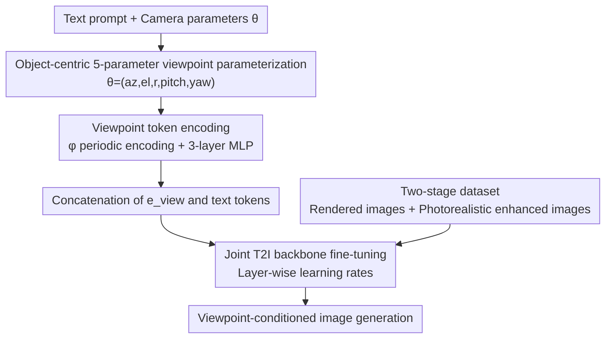

# Camera Control for Text-to-Image Generation via Learning Viewpoint Tokens

**Conference**: CVPR 2026  
**Paper**: [CVF Open Access](https://openaccess.thecvf.com/content/CVPR2026/html/Lu_Camera_Control_for_Text-to-Image_Generation_via_Learning_Viewpoint_Tokens_CVPR_2026_paper.html)  
**Code**: [Project Page](https://randdl.github.io/viewtoken_control/)  
**Area**: Image Generation / Controllable Generation / Text-to-Image  
**Keywords**: Camera viewpoint control, Viewpoint token, Text-to-image, Geometric decoupling, Dataset design  

## TL;DR
This paper adds a lightweight MLP to encode 5D camera parameters into a viewpoint token for text-to-image models. This token is concatenated with text tokens for joint fine-tuning. Combined with a two-stage dataset consisting of "3D renders (geometric supervision) + photorealism-enhanced images (appearance diversity)," the method enables fine-grained camera control over azimuth, elevation, radius, pitch, and yaw, while generalizing to unseen object categories.

## Background & Motivation
**Background**: Diffusion-based text-to-image (T2I) models (such as SD, SD3, and unified multimodal models like Harmon) are highly capable in semantic fidelity and visual realism, but they struggle to follow **geometric instructions** like "rear view," "30 degrees left," or "45-degree high-angle shot."

**Limitations of Prior Work**: Natural language descriptions of viewpoints are inherently discrete and ambiguous. Consequently, models frequently hallucinate incorrect poses, collapse to the "front face/eye-level" views preferred by the training distribution, or generate geometrically inconsistent results over multiple runs with the exact same prompt. Testing on powerful models like GPT-5 and Nano Banana shows that given explicit descriptions like "left 45°/right 30°," the generated outputs exhibit almost the same orientation, failing to produce distinct perspectives.

**Key Challenge**: Existing controllable generation methods either require additional geometric inputs (e.g., depth, edge maps, or reference images in ControlNet and novel-view synthesis), sacrificing the flexibility of "text-only" generation, or require multi-view supervision of each specific object like View-NeTI. On the other hand, methods like Compass Control **can only control the single-axis azimuth** and restrict the cross-attention of the viewpoint to local object regions using attention masks, which leads to a loss of global scene understanding and severe overfitting to the appearance of training objects—changing to an unseen object (e.g., Santa Claus, dolphin) results in generating completely different animals.

**Goal**: To support **multi-parameter, precise, and generalizable** camera viewpoint control for text-to-image models without introducing any additional geometric reference inputs.

**Key Insight**: The authors hypothesize that an explicit 3D camera structure can be injected into the text-visual latent space. Rather than trapping the viewpoint information within local object regions using attention masks, it is highly beneficial to encode camera parameters into a **geometric token decoupled from the object identity**, allowing it to be learned jointly with the entire image (foreground and background) in the text input space.

**Core Idea**: A lightweight MLP is used to encode "5D camera parameters in an object-centric coordinate system" into a viewpoint token. This token is concatenated alongside the text tokens for joint fine-tuning. A two-stage dataset (a large scale of 3D renders for geometric supervision + a small set of photorealistic enhanced images to prevent collapse) is proposed to maintain generation quality and generalization capability.

## Method

### Overall Architecture
The method can be adapted to any text-to-image backbone that scales with text embeddings. Given a text prompt and a set of explicit camera parameters $\theta$, the viewpoint is first parameterized as a 5-dimensional vector in an **object-centric coordinate system**. It is then mapped to a viewpoint token $\mathbf{e}_\text{view}$ of the same dimension as the text tokens via a parameter encoding function $\phi$ and a 3-layer MLP. This token is inserted adjacent to the object description, and jointly fed into the T2I backbone (primarily Harmon) for unified fine-tuning. Consequently, the backbone learns to generate images adhering to both semantic content and camera viewpoints. The training data design is key: a vast number of canonically aligned 3D renders provide geometric supervision, while a small portion of photorealism-enhanced images maintain appearance diversity and scene complexity.

### Key Designs

**1. Object-centric 5-parameter factorized viewpoint representation: Defining "left, right, front, back" consistently across objects**

Directly using world coordinates or camera matrices as conditions makes linguistic concepts like "left" and "right" dependent on specific object orientations, making it difficult for the model to learn unified patterns. The authors fix the object at the origin and define the object's front to always face the $+x$ axis of the world coordinate system, thus standardizing "left/right, front/back" linguistically across all objects while the camera moves freely. The viewpoint is factorized into:
$$\boldsymbol{\theta} = (\theta_\text{az}, \theta_\text{el}, r, \theta_\text{pitch}, \theta_\text{yaw}) \in \mathbb{R}^5$$
where $(\theta_\text{az}, \theta_\text{el}, r)$ represents the camera's spherical coordinate position (radius $r$ is normalized by the object's bounding sphere diameter), and $(\theta_\text{pitch}, \theta_\text{yaw})$ denotes the camera's rotation relative to the direction pointing to the origin (positive for pitch-up, and positive for yaw-left), assuming roll=0 and FoV≈55°. This factorized representation, which **separates position from rotation**, is the fundamental reason why it significantly outperforms Plücker rays, 12D matrices, or sinusoidal encodings in the ablation study. Single-view T2I scenarios benefit more from "semantically decomposable orientation signals" rather than high-frequency representations designed for multi-view dense correspondence.

**2. Viewpoint token encoding: Translating camera parameters into the text space using a period-aware lightweight MLP**

Feeding 5D parameters directly into the network poses two challenges: azimuth is periodic (0° and 360° should be identical), and the scales of various parameters differ. The authors first apply parameter encoding:
$$\phi(\boldsymbol{\theta}) = [\sin(\theta_\text{az}), \cos(\theta_\text{az}), \theta_\text{el}, r, \theta_\text{pitch}, \theta_\text{yaw}] \in \mathbb{R}^{6}$$
where azimuth is mapped with sin/cos to handle periodicity, radius is normalized to $[0,1]$, and elevation, pitch, and yaw are directly represented in radians. This encoded vector is then mapped to the token space via a 3-layer MLP with ReLU activations:
$$\mathbf{e}_\text{view} = \text{MLP}_\text{view}(\phi(\boldsymbol{\theta})) \in \mathbb{R}^{d}$$
This token is **inserted adjacent to the object description**, allowing geometric information to flow through the model's self-attention mechanism alongside text. This stands in sharp contrast to Compass Control, which traps the viewpoint information in local regions using an attention mask. Limiting the attention forfeits global scene understanding, whereas this work allows both the foreground and background to be conditioned on the viewpoint.

**3. Two-stage dataset: Leveraging massive renders for geometry and small photorealistic images to prevent collapse**

Training solely on 3D rendered images causes the model to "forget" how to depict complex scenes or adhere to detailed text prompts (collapse). The authors decompose the dataset into two complementary parts: The **Large Render Dataset** selects 3,111 objects from TexVerse (across four categories: animals, vehicles, people, and furniture) canonically aligned to the front ($\theta_\text{az}=\theta_\text{el}=0$). For each object, 120 viewpoints are randomly sampled, resulting in approximately 373K images with transparent backgrounds to provide strong geometric supervision. The **Photorealistic Enhancement Dataset** selects 800 high-quality objects from this set, rendering 20 viewpoints for each. Diverse backgrounds and appearances (e.g., "a horse with a gold body and a light mane" or "a sports car with white racing stripes") are then edited using Nano Banana while preserving the original poses. After manual filtering, around 6.6K images are retained to preserve realism and appearance diversity. During training, both datasets are **sampled with equal probability**. This inclusion allows the model to learn precise geometry without losing the prompt-alignment capabilities of the backbone (removing the render dataset causes the azimuth error to spike from 18.11° to 22.98° in the ablation study).

### Loss & Training
No new loss is introduced; the standard image generation loss of the backbone is used to jointly fine-tune the backbone and the viewpoint MLP. The primary backbone is Harmon (LLM backbone + MAR decoder). Initialized from pretrained checkpoints, the model is fine-tuned for 7,500 steps with a batch size of 192 using AdamW. The key is **layer-wise learning rates**: the newly introduced ViewpointMLP uses a higher learning rate of $2\times10^{-4}$, while the pretrained Harmon LLM and MAR decoder use a lower learning rate of $2\times10^{-5}$. Fine-tuning takes about 28 hours on a single A100 (80GB) GPU. The ablation study shows that **freezing the backbone** causes the azimuth error to skyrocket to 40.19°, demonstrating that the backbone's text input space does not natively possess 3D geometric awareness and must be fine-tuned to incorporate it.

## Key Experimental Results

### Main Results
Evaluations are conducted on 11 "easy" test objects + 26 "diverse" objects (including 11 unseen categories during training), totaling 5,550 test samples. Measurements include error angles for azimuth, elevation, radius, yaw, and pitch, as well as CLIP similarity.

| Method | Input Type | Azimuth↓(Mean) | Elevation↓ | Yaw↓ | Pitch↓ | CLIP↑ |
|------|---------|------|------|------|------|------|
| ControlNet | Image + Oracle Depth | 25.65 | 5.77 | 0.80 | 0.94 | 0.3307 |
| SV-Camera | Image + Camera | 54.89 | 9.05 | 2.89 | 2.29 | 0.2596 |
| Compass | Text + Azimuth token | 31.07 | 14.49 | 2.03 | 2.61 | 0.3433 |
| **Ours (Harmon)** | Text + Camera token | **18.11** | **7.62** | **1.25** | **1.38** | **0.3555** |

This method achieves overall superior performance among methods that do not use oracle geometric information. ControlNet performs slightly better on certain parameters because it utilizes oracle depthmaps. Breaking down the azimuth error highlights the model's generalization capabilities: Compass has an error of 18.62° on the easy set but spikes to 37.29° on the diverse set, whereas the proposed method maintains 16.22° on the easy set and 19.06° on the diverse set with almost no degradation.

On GenEval text alignment (Single Obj. / Colors), this method only drops by -5.52 / -16.00 relative to the backbone, while Compass drops significantly by -14.28 / -33.82 compared to SD2.1, indicating that this work preserves the original prompt fidelity of the backbone.

### Ablation Study

| Configuration | Azimuth↓ | Elevation↓ | Yaw↓ | Pitch↓ | Description |
|------|---------|-----------|------|------|------|
| Ours (Harmon) Full | 18.11 | 7.62 | 1.25 | 1.38 | Main model |
| Ours (SD3.5) | 12.85 | 8.09 | 2.75 | 1.97 | Transferable to different backbones, proving the gains stem from the method |
| Plücker rays | 21.61 | 8.43 | 1.29 | 1.51 | Alternative viewpoint encoding, performance degrades |
| 12D Matrix | 24.44 | 8.74 | 4.89 | 4.66 | Entangled representation is hard to learn |
| Sinusoidal Encoding | 60.90 | 9.05 | 1.69 | 1.78 | High-frequency components introduce training instability |
| W/o render subset | 22.98 | 9.34 | 4.84 | 4.93 | Missing geometric supervision |
| Frozen backbone | 40.19 | 8.47 | 1.83 | 2.07 | No 3D geometric representation in original backbone |
| More tokens | 18.03 | 7.45 | 1.80 | 1.87 | No significant benefits |

### Key Findings
- **Factorized encoding vs. other encodings**: Plücker rays, 12D matrices, and sinusoidal encodings all yield worse results, with sinusoidal encoding showing an azimuth error of up to 60.90°. The authors state that single-view T2I benefits more from "semantically decomposable orientation signals," while high-frequency/entangled representations introduce training instability and hinder separating the camera position from its rotation.
- **Render subset and backbone fine-tuning are indispensable**: Excluding the render dataset or freezing the backbone doubles the azimuth error, showing that both geometric supervision and "fine-tuning 3D awareness into the text space" are crucial.
- **Generalization and Overfitting Mitigation**: On three test objects ("Santa Claus," "dolphin," and "rabbit"), Compass overfits to the training categories and generates lions, ostriches, shoes, sofas, or teddy bears 94.2% of the time. This method exhibits no noticeable overfitting, demonstrating successful decoupling of the viewpoint token from object identity.
- **Extreme Viewpoints**: On an extra 2,220 samples of rear views and high elevation angles, the azimuth error of this method only degrades by +5.16°, whereas Compass degrades by +8.00° and fails more drastically overall.

## Highlights & Insights
- **Injecting 3D camera structure into the text latent space**: The core insight is that the text-visual latent space can be endowed with an explicit 3D camera structure, making "geometry-aware prompting" possible. This approach is more elegant than using attention masks to restrict local regions, as it allows the viewpoint to act on both the foreground and background, yielding a globally consistent composition (e.g., the horizon moves accordingly as the elevation angle changes).
- **Object-centric coordinates are an underappreciated design**: Fixing the object's front towards $+x$ ensures consistent semantics for "left/right/front/back" across all objects. This is the underlying prerequisite for the token to generalize across categories and is more fundamental than simply scaling up data.
- **"Geometry vs. Realism" ratio in two-stage data**: Using synthetic renders to feed geometry and a small amount of photorealistic enhancement to prevent collapse provides a "main course + seasoning" data formulation that can be transferred to any fine-tuning task where one wants to inject precise conditions without compromising the backbone's original capabilities.
- **Backbone-agnostic method**: The effectiveness holds on SD2.1, SD3.5, and Harmon, demonstrating that the improvements stem from the encoding strategy and data design rather than a specific backbone, indicating high reusability.

## Limitations & Future Work
- The authors acknowledge that T2I backbones exhibit strong priors for "eye-level, horizontally centered" views, especially for famous landmarks (e.g., the Taj Mahal), which can bias the viewpoint control.
- Occasional generation degradation of human faces and fine structures can occur.
- Nano Banana occasionally fails to generate data enhancements under extreme elevation angles (75°) and roll (30°), limiting the physical range covered by the enhanced dataset.
- *Self-observation:* The 5-parameter setup assumes roll=0 and a fixed FoV, thus failing to cover roll and focal length variations. Moreover, the scale of the photorealistic enhancement dataset (6.6K) is vastly smaller than the render dataset (373K), suggesting that appearance diversity might still be a bottleneck.

## Related Work & Insights
- **vs. Compass Control**: Both perform "text + viewpoint token" and do not require multi-view images. However, Compass only controls the single-axis azimuth, uses attention masks to isolate local object regions, and severely overfits to training objects (drawing incorrect categories when the class is changed). In contrast, this method controls 5 parameters, allows global token participation, and decouples viewpoint from object identity, resulting in significantly better generalization.
- **vs. View-NeTI**: View-NeTI learns decoupled object and viewpoint tokens but requires multi-view supervision for each specific object. Without such multi-view data, it cannot generate geometrically consistent novel views. This method requires only camera parameters and the two-stage dataset, removing the need for object-specific multi-views.
- **vs. ControlNet-Depth / Novel-View Synthesis (SV-Camera, etc.)**: These methods require additional geometric inputs like depth maps, edges, or reference images. This method achieves accurate control using only the text and camera token, requiring no references during inference.

## Rating
- Novelty: ⭐⭐⭐⭐ Encoding factorized camera parameters into tokens to inject into the text space, coupled with a two-stage dataset to preserve generalization. Clear and effective approach.
- Experimental Thoroughness: ⭐⭐⭐⭐ Solid ablations covering multiple backbones, various encoding methods, extreme viewpoints, and quantitative evaluation of overfitting.
- Writing Quality: ⭐⭐⭐⭐ Clear explanation of motivation and methodology. Comparison tables and qualitative analysis of failures are well-presented.
- Value: ⭐⭐⭐⭐ Provides a practical, reusable, and precise viewpoint control solution for T2I generation without requiring extra geometric inputs.

<!-- RELATED:START -->

## Related Papers

- [\[CVPR 2026\] Taming Video Models for 3D and 4D Generation via Zero-Shot Camera Control](taming_video_models_for_3d_and_4d_generation_via_zero-shot_camera_control.md)
- [\[CVPR 2026\] TokenLight: Precise Lighting Control in Images using Attribute Tokens](tokenlight_precise_lighting_control_in_images_using_attribute_tokens.md)
- [\[CVPR 2025\] PreciseCam: Precise Camera Control for Text-to-Image Generation](../../CVPR2025/image_generation/precisecam_precise_camera_control_for_text-to-image_generation.md)
- [\[CVPR 2026\] Resolving the Identity Crisis in Text-to-Image Generation](resolving_the_identity_crisis_in_text-to-image_generation.md)
- [\[CVPR 2026\] The Image as Its Own Reward: Reinforcement Learning with Adversarial Reward for Image Generation](the_image_as_its_own_reward_reinforcement_learning_with_adversarial_reward_for_i.md)

<!-- RELATED:END -->
