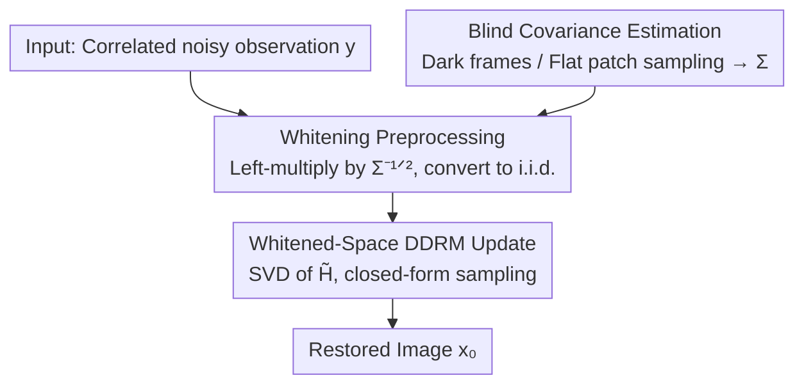

# CARD: Correlation Aware Restoration with Diffusion

**Conference**: CVPR 2026  
**Paper**: [CVF Open Access](https://openaccess.thecvf.com/content/CVPR2026/html/Nezakati_CARD_Correlation_Aware_Restoration_with_Diffusion_CVPR_2026_paper.html)  
**Code**: None (Not publicly released; based on modified DDRM codebase)  
**Area**: Diffusion Models / Image Restoration  
**Keywords**: Correlated Noise, Diffusion Inverse Problems, DDRM, Noise Whitening, Covariance Estimation

## TL;DR
CARD generalizes the DDRM diffusion inverse problem solver from the "i.i.d. Gaussian noise" assumption to the "spatially correlated noise" found in real sensors. By applying the inverse square root of the covariance matrix $\Sigma^{-1/2}$ to whiten observations into i.i.d. noise, it performs DDRM closed-form updates in the whitened measurement space. The method is entirely training-free and consistently outperforms existing methods in denoising, deblurring, and super-resolution on both synthetic correlated noise and the newly collected real rolling-shutter dataset CIN-D.

## Background & Motivation

**Background**: Recent state-of-the-art (SOTA) image restoration (denoising, deblurring, super-resolution) results predominantly utilize diffusion priors. Among these, the Denoising Diffusion Restoration Model (DDRM) is representative: it treats a pre-trained unconditional diffusion model as a prior, performs Singular Value Decomposition (SVD) on the degradation operator $H$, and derives **closed-form** posterior updates in the spectral domain. This allows for efficient solving of linear inverse problems without task-specific retraining.

**Limitations of Prior Work**: Almost all existing methods—ranging from classical BM3D and supervised models like Restormer/DnCNN to diffusion-based DDRM/DDNM—rely on the common assumption that noise is independent and identically distributed (i.e., i.i.d. Gaussian). However, real camera CMOS sensors, particularly rolling-shutter sensors in smartphones and DSLRs, exhibit **strongly correlated** spatial noise due to row-by-row readout mechanisms. Row-banding correlated noise structures are clearly visible in dark frames. Applying existing methods to such real-world sensor noise results in significant restoration quality degradation.

**Key Challenge**: The core reason DDRM can derive closed-form updates is the i.i.d. assumption—under the spectral basis, each component degrades into a one-dimensional independent Gaussian, allowing for an analytical solution. When noise covariance $\Sigma$ is non-diagonal, it **couples** the spectral components, causing the analytical conditional sampling of DDRM to fail.

**Limitations of existing correlated noise methods**: Prior works addressing correlated noise (e.g., information-theoretic supervision, spatially adaptive losses, burst pseudo-labeling) typically require **retraining** and often rely on heuristics to approximate correlations rather than direct covariance modeling.

**Goal / Core Idea**: The objective is to enable DDRM to handle correlated noise **without retraining** or modifying the pre-trained diffusion model. The **Key Insight** is straightforward: since DDRM is valid only under i.i.d. conditions, the correlated noise is "straightened" into i.i.d. noise first. By using the inverse square root of the noise covariance to whiten the observations, the problem is transformed into an equivalent measurement space with independent noise, where the original closed-form DDRM sampling can be reused. In short: **whiten first, then DDRM**.

## Method

### Overall Architecture

CARD is a completely training-free two-step framework requiring only two components: an estimate of the noise covariance matrix $\Sigma$ and a pre-trained unconditional diffusion model.

The degradation model is generalized from the standard DDRM version:

$$y = Hx_0 + z,\quad z \sim \mathcal{N}(0,\sigma_y^2 I)$$

to a version with correlated noise:

$$y = Hx_0 + n,\quad n \sim \mathcal{N}(0,\sigma_y^2\Sigma)$$

where $y$ is the degraded observation, $H$ is the degradation operator, $x_0$ is the clean image, and $\Sigma$ is a symmetric positive definite covariance matrix capturing spatial correlation between pixels. The pipeline involves: Estimating $\Sigma$ from dark frames or the noise itself (blindly) → Whitening the observation using $\Sigma^{-1/2}$ to convert correlated noise to i.i.d. → Performing SVD on the whitened operator $\tilde H$ and running DDRM closed-form updates → Outputting the restored image $x_0$.

### Key Designs

**1. Whitening Preprocessing: Straightening correlated noise via $\Sigma^{-1/2}$**

This step directly addresses the core contradiction where correlated noise invalidates DDRM. The measurement equation is left-multiplied by the symmetric inverse square root of the covariance matrix $\Sigma^{-1/2}$:

$$\Sigma^{-1/2}y = \Sigma^{-1/2}Hx_0 + \Sigma^{-1/2}n$$

Let $\tilde y = \Sigma^{-1/2}y$, $\tilde H = \Sigma^{-1/2}H$, and $\tilde n = \Sigma^{-1/2}n$. The whitened noise $\tilde n \sim \mathcal{N}(0,\sigma_y^2 I)$ becomes i.i.d., resulting in a standard measurement form $\tilde y = \tilde H x_0 + \tilde n$ which satisfies the independence requirement of DDRM. Intuitively, $\Sigma^{-1/2}$ acts as a "de-correlation" linear transform that absorbs the correlation structure into the degradation operator ($H \to \tilde H$). Implementation uses Cholesky decomposition $LL^\top=\Sigma$ and $W=L^{-1}$ (where $W\Sigma W^\top=I$) for numerical stability and efficiency.

**2. Whitened-Space DDRM Update: Reusing DDRM in the spectral basis of $\tilde H$**

Whitening moves the problem to a new space, but restoration still depends on the diffusion prior. CARD applies the DDRM framework within the whitened measurement space. SVD is performed on the whitened operator $\tilde H = \tilde U \tilde S \tilde V^\top$, and variables are projected into this new spectral basis:

$$\bar{\tilde x}_t = \tilde V^\top x_t,\quad \bar{\tilde y} = \tilde S^\dagger \tilde U^\top \tilde y$$

The key difference is that while original DDRM uses singular values $s_i$ of the **original operator** $H$, CARD uses singular values $\tilde s_i$ of the **whitened operator** $\tilde H$ to drive the same closed-form interpolation (interpolating between the network prediction $x_{\theta,t}=f_\theta(x_{t+1},t+1)$ and whitened measurements). Since noise is now i.i.d., individual spectral components are independent 1D Gaussians, allowing CARD to inherit the sampling efficiency (20 NFEs) of DDRM while extending applicability to correlated noise.

**3. Blind Covariance Estimation + CIN-D Dataset: Enabling real-world application**

Whitening requires knowing $\Sigma$. In ideal cases, $\Sigma$ is estimated from **dark frames** (captured with a lens cap at identical exposure/gain). When calibration data is unavailable, CARD performs **blind** estimation by extracting non-overlapping patches from the noisy image and selecting spatially flat regions using a gradient-based score. The sample covariance of these patches is used for Cholesky decomposition. To demonstrate that correlated noise is a significant issue, the authors introduced the **CIN-D (Correlated Image Noise Dataset)**: 400 images (real scenes and dark frames) captured using a FLIR Blackfly rolling-shutter camera across 3 noise levels. For high-resolution images, whitening and sampling are performed using non-overlapping tiles, a reasonable approximation since sensor correlation is typically short-range.

### Loss & Training
CARD requires **no training**. All hyperparameters are adopted from DDRM, except for the measurement parameter $\eta$, which was tuned for correlated noise (grid search result $\eta=0.80$, while $\eta_b=1.0$ remains consistent with DDRM). A uniform timestep schedule with 20 Neural Function Evaluations (NFE) is used.

## Key Experimental Results

Evaluations were performed on three tasks: denoising under correlated Gaussian noise, deblurring with three kernels (uniform/isotropic Gaussian/anisotropic Gaussian), and 2×/4× super-resolution. Tests were conducted on ImageNet, LSUN-Bed/Cat (with synthetic correlated noise $\Sigma_{\text{synth}}=\sigma^2(I+\alpha B)+\varepsilon I$), and the CIN-D dataset. Metrics include PSNR / LPIPS.

### Main Results

ImageNet Denoising (PSNR↑ / LPIPS↓, three noise levels $\sigma_0$):

| Method | $\sigma_0$=0.1 | $\sigma_0$=0.5 | $\sigma_0$=0.9 |
|------|------|------|------|
| Restormer (i.i.d. supervised) | 31.3 / 0.10 | 23.9 / 0.28 | 18.5 / 0.59 |
| BM3D (i.i.d. prior) | 30.1 / 0.11 | 25.8 / 0.33 | 22.4 / 0.50 |
| DDRM (i.i.d. diffusion, strong baseline) | 31.0 / 0.14 | 24.8 / 0.33 | 22.7 / 0.40 |
| **CARD (Ours)** | **34.0 / 0.07** | **29.1 / 0.15** | **26.7 / 0.22** |

CARD leads across all noise levels, with the **Gain** increasing as noise intensity grows: at high noise ($\sigma_0$=0.9), DDRM becomes unstable (22.7 dB), while CARD maintains 26.7 dB. Deblurring and Super-resolution show similar leads:

| Task / ImageNet | DDRM | CARD (Ours) |
|------|------|------|
| Gaussian Deblur $\sigma_0$=0.2 | 24.3 / 0.36 | **26.6 / 0.23** |
| Gaussian Deblur $\sigma_0$=0.5 | 22.2 / 0.42 | **24.4 / 0.30** |
| 2× SR $\sigma_0$=0.2 | 25.7 / 0.32 | **28.0 / 0.20** |
| 2× SR $\sigma_0$=0.5 | 22.7 / 0.41 | **25.1 / 0.33** |

Real Correlated Noise (CIN-D Denoising, PSNR↑ / LPIPS↓):

| Method | Low | High |
|------|------|------|
| PCST (i.i.d. learning) | 37.2 / 0.20 | 29.4 / 0.40 |
| DDRM (i.i.d. diffusion) | 35.3 / 0.28 | 30.8 / 0.39 |
| APRRD-NBSN (correlated noise learning) | 17.0 / 0.28 | 17.1 / 0.38 |
| **CARD (Ours)** | **38.1 / 0.19** | **31.5 / 0.34** |

Notably, methods trained specifically for correlated noise (APRRD) generalized poorly (~17 dB), showing that "explicit whitening + general diffusion prior" is more robust than retraining on specific noise statistics.

### Ablation Study

Sensitivity to covariance estimation error (Denoising PSNR with random perturbations to the whitening transform):

| Covariance Perturbation | CARD PSNR | Baseline DDRM |
|------|------|------|
| 0% (Perfectly known) | 29.6 dB | 25.0 dB |
| 5% (Small error) | 26.5 dB | — |
| 20% (Mid-high error) | 23.6 dB | — |

### Key Findings
- **Advantage scales with noise intensity**: While methods are comparable at low noise, CARD's advantage is significant at mid-to-high noise levels. Whitening allows the prior to act correctly, whereas without it, correlated noise structures are mistakenly preserved as image content.
- **Graceful degradation**: Performance drops slightly with a 5% covariance perturbation but remains superior to DDRM. A 20% perturbation drops performance to 23.6 dB, indicating reasonable tolerance for calibration errors.
- **Cross-sensor transferability**: Covariance $\Sigma$ estimated from Blackfly dark frames successfully improves restoration on Nikon Z30 images, suggesting commonalities in spatial correlation structures across similar rolling-shutter sensors.
- **Poor generalization of retraining-based methods**: Methodologies like APRRD failed on CIN-D, highlighting the utility of CARD's "training-free general prior" approach.

## Highlights & Insights
- **Transformation over brute-force**: The core trick is whitening. Rather than modifying the diffusion model, the input is transformed into a format the existing solver can handle. This mindset is applicable to any inverse problem solver with strong noise distribution assumptions.
- **Plug-and-play**: CARD is decoupled from pre-trained diffusion models. Adding one linear whitening step expands DDRM's boundary from ideal noise to real-world sensor noise at nearly zero extra cost.
- **Dataset Contribution**: CIN-D fills a void as the first public evaluation set explicitly featuring real spatially correlated noise with accompanying dark frames.
- **Blind Estimation**: The capability to estimate $\Sigma$ from noisy images via flat-patch sampling reduces the dependency on camera calibration.

## Limitations & Future Work
- **Dependency on $\Sigma$ quality**: Performance is fundamentally tied to the accuracy of the covariance estimate; large errors (e.g., 20% perturbation) significantly degrade results.
- **Short-range approximation**: High-resolution tiling assumes correlations only span a few neighboring pixels. For long-range correlations (e.g., global stripes), this approximation might be insufficient.
- **Linear inverse problems only**: Inheriting the DDRM framework limits the method to linear degradation operators (denoising, deblurring, super-resolution), excluding non-linear cases like JPEG or complex ISPs.
- **CIN-D Scale**: With only 100 static scenes and a few camera models, broader validation across more sensors and dynamic scenes is required.

## Related Work & Insights
- **vs DDRM**: CARD is a direct extension of DDRM, reusing its closed-form spectral basis updates while adding a pre-whitening step and using singular values of $\tilde H$.
- **vs DDNM / DPS / DiffIR**: These zero-shot diffusion methods assume i.i.d. noise; CARD fills the gap for correlated noise where these methods (especially DDNM) show limited robustness.
- **vs Learning-based methods (AP-BSN / APRRD)**: CARD avoids the generalization issues and retraining requirements of heuristic-based learning methods.

## Rating
- Novelty: ⭐⭐⭐⭐ Simple but elegant—using whitening to generalize DDRM to correlated noise.
- Experimental Thoroughness: ⭐⭐⭐⭐ Covers various tasks, synthetic/real noise, and sensitivity tests.
- Writing Quality: ⭐⭐⭐⭐ Clear motivation and concise derivations.
- Value: ⭐⭐⭐⭐ High practical value for real-world camera restoration through zero-shot application and the CIN-D dataset.

<!-- RELATED:START -->

## Related Papers

- [\[AAAI 2026\] CAD-VAE: Leveraging Correlation-Aware Latents for Comprehensive Fair Disentanglement](../../AAAI2026/image_generation/cad-vae_leveraging_correlation-aware_latents_for_comprehensive_fair_disentanglem.md)
- [\[CVPR 2026\] Residual Diffusion Bridge Model for Image Restoration](residual_diffusion_bridge_model_for_image_restoration.md)
- [\[CVPR 2026\] Face2Scene: Using Facial Degradation as an Oracle for Diffusion-Based Scene Restoration](face2scene_using_facial_degradation_as_an_oracle_for_diffusion-based_scene_resto.md)
- [\[CVPR 2026\] Reward Sharpness-Aware Fine-Tuning for Diffusion Models](reward_sharpness-aware_fine-tuning_for_diffusion_models.md)
- [\[CVPR 2026\] SPREAD: Spatial-Physical REasoning via geometry Aware Diffusion](spread_spatial-physical_reasoning_via_geometry_aware_diffusion.md)

<!-- RELATED:END -->
