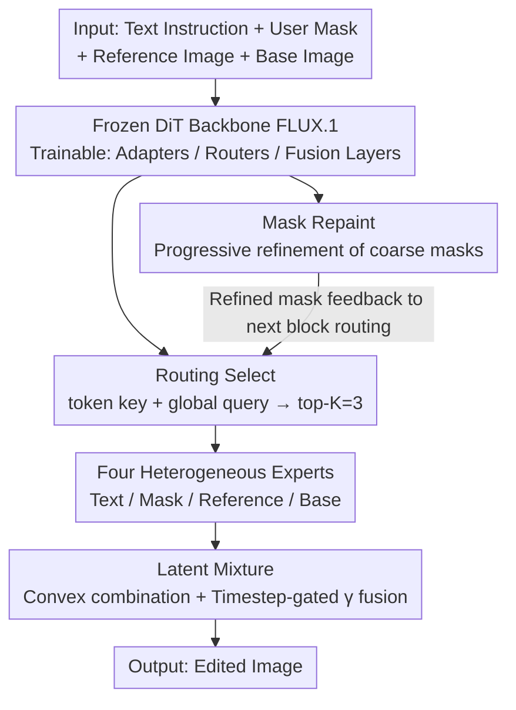

# CARE-Edit: Condition-Aware Routing of Experts for Contextual Image Editing

**Conference**: CVPR2026  
**arXiv**: [2603.08589](https://arxiv.org/abs/2603.08589)  
**Code**: To be released  
**Area**: Image Generation  
**Keywords**: Image Editing, Mixture-of-Experts, Condition-Aware Routing, Diffusion Transformer, Multimodal Fusion

## TL;DR

Ours proposes CARE-Edit, a condition-aware expert routing framework. By utilizing heterogeneous experts (Text/Mask/Reference/Base) coupled with a lightweight latent-attention router on a DiT backbone, it achieves dynamic computation allocation. This effectively resolves issues like color bleeding and identity drift caused by conflicting multimodal signals (text, mask, reference images) in unified image editors.

## Background & Motivation

1. **Task interference in unified editors**: Existing unified diffusion editors (e.g., OmniGen2, ACE++) use fixed shared backbones to process all editing tasks, failing to adapt to heterogeneous requirements (local vs. global, semantic vs. photometric), which leads to reciprocal interference between tasks.

2. **Limitations of Prior Work in static fusion**: Methods like ControlNet and OmniControl fuse multimodal conditions (text, mask, reference images) via simple concatenation or additive adapters. They cannot dynamically adjust the priority of different signals based on the denoising process, often causing text semantics to override mask constraints or incorrect application of reference identities/styles.

3. **Time-varying importance of condition signals**: In diffusion denoising trajectories, the importance of different conditions changes across timesteps—early steps focus on semantic layout, while later steps focus on boundary refinement and style consistency. Static methods fail to adapt to this dynamic balance.

4. **Specific manifestations of multi-condition conflicts**: Color bleeding at mask boundaries, identity/style drift from reference images, global adjustments intruding into regions that should be preserved, and unpredictable behavior under multi-condition inputs.

5. **Uncontrollable user mask quality**: Coarse masks provided by users often do not align with target object boundaries. Direct usage leads to editing artifacts, necessitating dynamic mask refinement during the denoising process.

6. **Insufficient MoE application in image editing**: Existing diffusion MoE (e.g., EC-DiT) uses homogeneous experts and lacks heterogeneous designs for different modalities/conditions, failing to fundamentally resolve multi-condition conflicts.

## Method

### Overall Architecture

CARE-Edit aims to address common issues in unified image editors: a fixed shared backbone processing all tasks where heterogeneous conditions (text, mask, reference images) are statically concatenated, resulting in text semantics overpowering mask constraints, identity drift, and color bleeding. The core idea is to integrate a condition-aware expert routing system into a frozen DiT backbone (FLUX.1 Dev), training only lightweight adapters, routers, and fusion layers. The mechanism links four components: four heterogeneous experts (Text/Mask/Reference/Base) managing specific modalities; Routing Select dynamically choosing experts based on tokens and editing goals; Mask Repaint progressively refining coarse masks and feeding results back to the router; and Latent Mixture merging expert outputs via weights and timestep-gated fusion to ensure different conditions function at appropriate stages of the denoising trajectory.

### Key Designs

**1. Four Heterogeneous Experts: Specialization by modality**

Existing diffusion MoE (like EC-DiT) uses homogeneous experts, which cannot resolve multi-condition conflicts. CARE-Edit designs four specialized experts: the Text expert performs semantic reasoning and object synthesis via cross-attention with text tokens; the Mask expert ensures spatial precision and boundary refinement via convolutions with refined masks; the Reference expert learns identity/style-consistent transformations via FiLM modulation; and the Base expert maintains global consistency and background fidelity via cross-attention with base image features. Outputs are unified via LayerNorm + Linear projections. Experiments confirm different tasks activate different experts—e.g., the Mask expert dominates structural editing.

**2. Routing Select: Token-level Top-K routing for demand-based prioritization**

Static fusion cannot dynamically adjust weights during denoising. Routing Select calculates a token-specific key (encoding local information) and a global conditioning query (encoding editing goals) for each token. These are processed via an MLP to obtain expert logits, followed by a softmax to select top-K ($K=3$) experts. To stabilize training, the routing temperature $\tau$ is gradually annealed, EMA smoothing is applied to logits to reduce variance, and a fixed ratio $\lambda_{\text{shared}}$ of tokens always passes through a shared expert to prevent routing collapse. Finally, outputs are aggregated via convex residual fusion.

**3. Mask Repaint: Progressive self-refinement of coarse masks**

User-provided masks often misalign with target boundaries. Mask Repaint uses the current latent, reference encoding, and the previous predicted mask at each diffusion step $t$ to estimate a residual mask field $\Delta m$ via convolution. This is added to the previous mask after a sigmoid: $\hat{M}(t) = \text{clip}(\hat{M}(t-1) + \Delta m, 0, 1)$. Training incorporates boundary consistency losses (gradient alignment + smoothing regularization) for progressive boundary tightening, and the refined mask is fed back to the routing of the next DiT block.

**4. Latent Mixture: Integrating expert outputs via tokens and timesteps**

Expert outputs must be blended smoothly. Latent Mixture first performs a token-wise convex combination of expert outputs based on routing weights $w_e$. Then, a learned timestep-dependent gate $\gamma$ mixes the fused result with the Base expert output (timestep-adaptive), while TV regularization encourages spatial smoothness of weight maps. This naturally addresses time-varying needs: semantic layout in early steps and boundary/style refinement in later steps.

### Loss & Training

A progressive curriculum is adopted: the first 40K steps use basic single-task data to establish general representations; the subsequent 60K steps switch to complex multi-task data to evolve the routing layer from general to specialized. Total training takes 100K steps on 8×NVIDIA L20, with a learning rate of 1e-4 and a batch size of 16.

## Key Experimental Results

### Table 1: Performance comparison on instruction-based editing (EMU-Edit & MagicBrush)

| Method | Type | EMU-Edit CLIPim↑ | CLIPout↑ | L1↓ | DINO↑ | MagicBrush CLIPout↑ | DINO↑ |
|------|------|-----------------|----------|-----|-------|-------------------|-------|
| InstructPix2Pix | Specialized | 0.834 | 0.219 | 0.121 | 0.762 | 0.245 | 0.767 |
| EMU-Edit | Specialized | 0.859 | 0.231 | 0.094 | 0.819 | 0.261 | 0.879 |
| OmniGen2 | Unified | 0.865 | 0.306 | 0.088 | 0.832 | 0.306 | 0.889 |
| AnyEdit | Unified | 0.866 | 0.284 | 0.095 | 0.812 | 0.273 | 0.877 |
| **Ours** | Unified | **0.868** | **0.313** | **0.082** | **0.835** | **0.324** | 0.885 |

### Table 2: Ablation Study (DreamBench++ Multi-object Setting)

| Variant | DINO-I↑ | CLIP-I↑ | CLIP-T↑ |
|------|---------|---------|---------|
| w/o Experts | 0.485 | 0.652 | 0.296 |
| w/o Latent Mixture | 0.509 | 0.678 | 0.301 |
| w/o Mask Repaint | 0.523 | 0.693 | 0.304 |
| K=2 | 0.541 | 0.707 | 0.312 |
| K=4 | 0.562 | 0.716 | 0.325 |
| **Full Model (K=3)** | **0.568** | **0.720** | **0.327** |

Removing expert routing significantly degrades performance, validating the core value of condition-aware dynamic allocation. K=3 is found to be optimal.

## Highlights & Insights

1. **Heterogeneous expert design directly addresses editing needs**: Four types of experts handle semantics, space, style, and global consistency respectively. Unlike traditional homogeneous MoE, each expert has clear modality specialization.
2. **Task-aware dynamic routing**: Experimental analysis shows different tasks (erasing/replacing/style transfer/text editing) activate distinct expert combinations—validating the effectiveness of condition-aware routing.
3. **Mask Repaint facilitates progressive refinement**: It utilizes latent information from the diffusion process itself to correct coarse masks without needing external segmentation models.
4. **Experimental Thoroughness**: Reaches performance competitive with OmniGen2 using only 120K training samples, demonstrating high data efficiency.
5. **DreamBench++ Leading Performance**: Outperforms strong baselines like OmniGen2 and UNO in both single-object and multi-object settings.

## Limitations & Future Work

1. **Hyperparameter sensitivity**: MoE-specific hyperparameters such as top-K values, temperature annealing strategies, and $\lambda_{\text{shared}}$ require meticulous tuning.
2. **Fixed expert set**: Current experts cover common modalities, but new editing types (e.g., 3D-aware or physics-consistent editing) may require dynamic expert loading or expansion.
3. **Computational overhead**: Although it uses sparse routing and a frozen backbone, the additional computation from four expert branches, the router, and Mask Repaint is not explicitly quantified.
4. **Dependency on FLUX.1**: The framework's generalizability is limited by the DiT backbone; its applicability to other backbones (e.g., SD3, SDXL) remains unverified.
5. **MagicBrush DINO metric**: Slightly lower than OmniGen2 on specific benchmarks.

## Related Work & Insights

- **vs. OmniGen2/ACE++**: Unified editor baselines use fixed shared backbones. CARE-Edit surpasses them on most metrics via condition-aware dynamic computation allocation.
- **vs. ControlNet/OmniControl**: These fuse signals through static concatenation. CARE-Edit's top-K routing enables token-level condition selection and suppression of conflicting modalities.
- **vs. EC-DiT**: While both use diffusion MoE, EC-DiT uses homogeneous experts for general generation. CARE-Edit introduces heterogeneous experts specialized by modality to resolve multi-condition editing conflicts.
- **vs. DreamBooth/BLIP-Diffusion**: Subject-driven methods rely on embedding learning or adapters, often leading to overfitting. CARE-Edit treats reference guidance as a specialized expert capability.

## Rating

- Novelty: ⭐⭐⭐⭐ — Introducing heterogeneous MoE to solve multi-condition conflicts in image editing is a novel entry point.
- Experimental Thoroughness: ⭐⭐⭐⭐ — Covers instruction-based and subject-driven scenarios with complete ablations, though computational cost quantification is missing.
- Writing Quality: ⭐⭐⭐⭐ — Clear problem definition with strong interpretability through expert activation analysis.
- Value: ⭐⭐⭐⭐ — Provides an effective solution for condition conflicts in unified editors with high practical utility.

<!-- RELATED:START -->

## Related Papers

- [\[CVPR 2026\] HP-Edit: A Human-Preference Post-Training Framework for Image Editing](hp-edit_a_human-preference_post-training_framework_for_image_editing.md)
- [\[CVPR 2026\] TAG-MoE: Task-Aware Gating for Unified Generative Mixture-of-Experts](tag-moe_task-aware_gating_for_unified_generative_mixture-of-experts.md)
- [\[CVPR 2026\] Group Editing: Edit Multiple Images in One Go](group_editing_edit_multiple_images_in_one_go.md)
- [\[CVPR 2026\] Mixture of States: Routing Token-Level Dynamics for Multimodal Generation](mixture_of_states_routing_token-level_dynamics_for_multimodal_generation.md)
- [\[CVPR 2025\] h-Edit: Effective and Flexible Diffusion-Based Editing via Doob's h-Transform](../../CVPR2025/image_generation/h-edit_effective_and_flexible_diffusion-based_editing_via_doobs_h-transform.md)

<!-- RELATED:END -->
