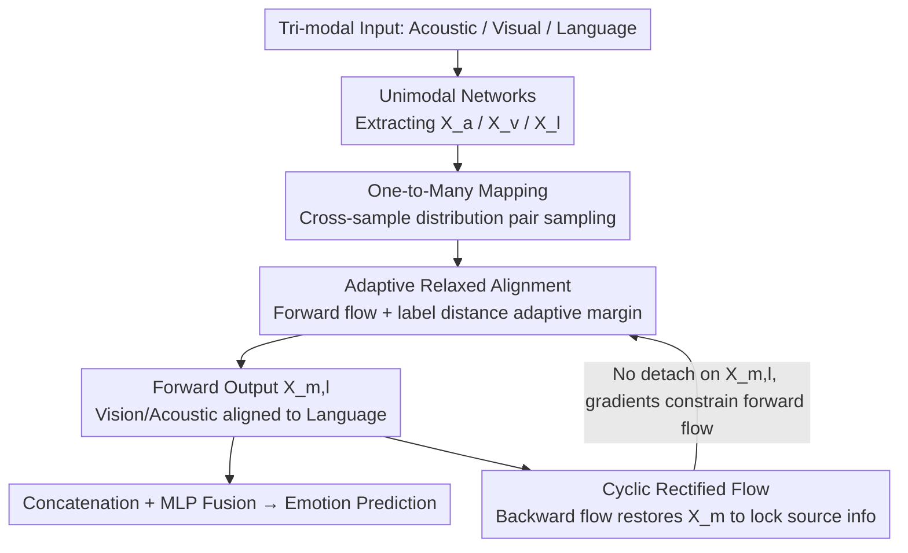

# CaReFlow: Cyclic Adaptive Rectified Flow for Multimodal Fusion

**Conference**: CVPR 2026  
**arXiv**: [2602.19140](https://arxiv.org/abs/2602.19140)  
**Code**: To be confirmed  
**Area**: Image Generation  
**Keywords**: rectified flow, modality gap, multimodal fusion, affective computing, distribution mapping

## TL;DR
The paper proposes CaReFlow, the first to use rectified flow for multimodal distribution mapping to bridge the modality gap. Through one-to-many mapping, source modality data points observe the global distribution of the target modality; adaptive relaxed alignment applies varying alignment strengths to modality pairs with different correlations; and cyclic rectified flow ensures no information is lost after mapping. It achieves SOTA on multiple multimodal affective computing benchmarks even with simple concatenation fusion.

## Background & Motivation
**Background**: Multimodal Affective Computing (MAC) requires fusing visual, acoustic, and language modalities to analyze human emotional states. The core challenge lies in the significant differences in feature distributions across modalities (modality gap), making simple multimodal concatenation fusion sometimes perform worse than pure language models.

**Limitations of Prior Work**: Existing methods for bridging the modality gap (Contrastive Learning, GANs, Diffusion Models, etc.) mostly employ one-to-one alignment—mapping each source modality data point to a fixed target point. This presents two issues: (a) insufficient alignment due to too few intra-sample pairs; (b) lack of robustness as source data points cannot perceive the global distribution of the target modality.

**Key Challenge**: One-to-one mapping limits the source modality's perception of the global target distribution. Conversely, directly using one-to-many mapping (like original rectified flow) leads to ambiguous flow directions (one source point matching multiple target points simultaneously) and requires multiple recursive training rounds to learn straight trajectories.

**Goal**: (a) Enable the source modality to perceive the global target distribution. (b) Avoid ambiguity under one-to-many mapping. (c) Prevent information loss during the mapping process.

**Key Insight**: Rectified flow naturally maps one distribution to another, and the learned trajectories are straight (simulatable with few Euler steps). The authors observe that the training process of rectified flow is inherently one-to-many—randomly sampling distribution pairs for training—which happens to expose global distribution information.

**Core Idea**: Utilize rectified flow for modality distribution mapping, resolving ambiguity through adaptive relaxed alignment and preserving source information through cyclic flow.

## Method

### Overall Architecture
Input: Tri-modal feature sequences $\mathbf{U}_m \in \mathbb{R}^{T_m \times d_m}$ ($m \in \{a, v, l\}$, representing acoustic, visual, and language) are processed by unimodal networks to extract representations $\mathbf{X}_m \in \mathbb{R}^d$. Since language is the dominant modality in MAC, CaReFlow maps the distributions of visual and acoustic modalities to the language modality distribution: $\mathbf{X}_{m,l} = \text{CaReFlow}_{m,l}(\mathbf{X}_m)$, followed by fusion and prediction using simple concatenation + MLP. At inference, distribution conversion is completed in 2 Euler steps. Internally, this mapping consists of a forward + backward cyclic rectified flow: the forward flow perceives the global distribution via One-to-Many Mapping and resolves ambiguity via Adaptive Relaxed Alignment, while the backward Cyclic Rectified Flow restores the mapping result to the source to lock in information.

### Key Designs

**1. One-to-Many Mapping: Exposing the Global Target Distribution to the Source**

Traditional alignment methods focus each source point on a single target point within the same sample, resulting in sparse pairs and non-robust alignment. CaReFlow leverages the property of rectified flow training: within each mini-batch, it constructs modality pairs within the same sample and additionally samples cross-sample modality pairs to train the velocity field $\mathbf{V}_{m_1,m_2}$. The ratio of cross-sample pairs to same-sample pairs is controlled by hyperparameter $\beta$ (stable between 3–7). Consequently, each source data point is pushed toward many different target points during training, naturally "seeing" the overall shape of the target distribution. This is the most critical module in ablation—removing it drops MOSI Acc2 by 2.8 and CH-SIMS-v2 Acc2 by 3.1.

**2. Adaptive Relaxed Alignment: Determining Alignment Stringency via Label Distance**

Direct one-to-many mapping introduces ambiguity: a single source point is required to match multiple target points simultaneously, causing conflicting flow directions. CaReFlow solves this by adding an adaptive margin $\eta_{m_1,m_2}$ to the alignment objective, penalizing errors only outside this margin:

$$\mathcal{L}^f_{m_1,m_2} = \mathbb{E}\left[\max\left(\|\mathbf{V}_{m_1,m_2}(\mathbf{X}^t_{m_1,m_2}, t) - (\mathbf{X}_{m_2} - \mathbf{X}_{m_1})\|_2 - \eta_{m_1,m_2}, 0\right)\right]$$

For modality pairs from the same sample, $\eta=0$, degrading to standard rectified flow for strict alignment. For cross-sample pairs, $\eta_{m_1,m_2} = \epsilon + \|y_i - y_j\|_2$, where relaxation is adaptively determined by the emotion label distance. Intuitively, "pairs that should be close align tightly, while those with differences are given leeway," maintaining global vision while eliminating ambiguity and recursive training overhead.

**3. Cyclic Rectified Flow: Locking Source Information via Backward Flow**

During the distribution transfer toward language, the discriminative information of the source modality can be flattened. CaReFlow trains an additional backward velocity field $\hat{\mathbf{V}}_{m_1,m_2}$ to restore the forward mapping output $\mathbf{X}_{m_1,m_2}$ back to the original $\mathbf{X}_{m_1}$:

$$\mathcal{L}^b_{m_1,m_2} = \mathbb{E}\left[\|\hat{\mathbf{V}}_{m_1,m_2}(\hat{\mathbf{X}}^t_{m_1,m_2}, t) - (\mathbf{X}_{m_1} - \mathbf{X}_{m_1,m_2})\|_2\right]$$

Crucial gradient detail: the backward loss is detached from target $\mathbf{X}_{m_1}$ but **not** from forward output $\mathbf{X}_{m_1,m_2}$. Thus, gradients from "restoration quality" flow back to influence the forward rectified flow, forcing it to preserve source information.

**4. Velocity Field Network and Detach Decoupling: Separating Alignment and Main Tasks**

The velocity field $\mathbf{V}_{m_1,m_2}$ is implemented as a lightweight MLP using sine/cosine positional encoding for time step $t$ ($\mathbf{TE}^t$). Crucially, the forward loss $\mathcal{L}^f$ detaches the input features—gradients update only the velocity field, not the unimodal network. This decouples the distribution alignment task from the emotion prediction task, preventing gradient competition.

### Loss & Training
$$\mathcal{L}_{total} = \mathcal{L} + \sum_{m \in \{a,v\}} (\alpha_f \times \mathcal{L}^f_{m,l} + \alpha_b \times \mathcal{L}^b_{m,l})$$
where $\mathcal{L}$ is the main task prediction loss, and $\alpha_f, \alpha_b$ are weights. $\alpha_f$ requires a larger value for sufficient mapping, while $\alpha_b$ should be moderate.

## Key Experimental Results

### Main Results: MSA (CMU-MOSI & CMU-MOSEI)

| Method | Conference | MOSI Acc7 | MOSI Acc2 | MOSI MAE↓ | MOSEI Acc2 | MOSEI MAE↓ |
|------|------|-----------|-----------|-----------|------------|------------|
| ITHP | ICLR 2024 | 47.7 | 88.5 | 0.663 | 87.1 | 0.550 |
| DLF | AAAI 2025 | 49.4 | 88.7 | 0.669 | 87.5 | 0.515 |
| AtCAF | IF 2025 | 46.5 | 88.6 | 0.650 | 87.0 | 0.508 |
| **Ours** | - | **50.6** | **89.8** | **0.616** | **87.9** | **0.504** |

On CH-SIMS-v2, Acc5 reached 57.9 (Prev. SOTA KuDA was 53.1, Gain +4.8), and Acc2 reached 82.9 (Prev. SOTA AV-MC was 80.6, Gain +2.3).

### Ablation Study

| Configuration | CH-SIMS-v2 Acc5 | CH-SIMS-v2 Acc2 | MOSI Acc7 | MOSI Acc2 |
|------|-----------------|-----------------|-----------|-----------|
| W/O Distribution Alignment | 55.1 | 78.4 | 45.9 | 86.7 |
| W/O Cyclic Information Flow | 56.3 | 81.7 | 47.2 | 87.9 |
| W/O Adaptive Relaxed Alignment | 56.8 | 82.4 | 47.9 | 88.5 |
| W/O One-to-Many Mapping | 57.4 | 79.8 | 47.2 | 87.0 |
| **Full CaReFlow** | **57.9** | **82.9** | **50.6** | **89.8** |

### Comparison with Distribution Mapping Methods

| Method | Type | MOSI Acc7 | MOSI Acc2 | Parameters | CH-SIMS-v2 Acc5 |
|------|------|-----------|-----------|--------|-----------------|
| ARGF | GAN | 50.5 | 87.4 | 184.43M | 51.8 |
| MulT | Transformer | 40.7 | 88.1 | 185.51M | 54.6 |
| CLGSI | Contrastive | 45.8 | 89.0 | 186.31M | 52.5 |
| Diffusion Bridge | Diffusion | 47.3 | 86.9 | 185.46M | 52.5 |
| **Ours** | Rectified Flow | **50.6** | **89.8** | **185.38M** | **57.9** |

### Key Findings
- **One-to-Many provides largest contribution**: Removing it drops performance significantly, proving its criticality.
- **Hyperparameter Robustness**: Stability across cross-modal contrastive ratio $\beta$ (3-7); minimal change with Euler steps (2-5), indicating straight trajectories.
- Efficiency: Parameter count (185.38M) is lower than CLGSI or MulT; gains come from alignment efficacy rather than model scaling.
- Visualization: t-SNE shows CaReFlow bridges the modality gap more effectively than GANs or Diffusion Bridges.

## Highlights & Insights
- **New Perspective on Modality Alignment**: Redefines the modality gap as a distribution mapping task, utilizing the geometric intuition of rectified flow (straight trajectories) to bridge it faster and simpler than GANs or Diffusion.
- **Clever Adaptive Margin**: Using label distance $\|y_i - y_j\|$ to control relaxation benefits from the global vision of one-to-many mapping while guiding the model on what to align versus what to loosen.
- **Task Decoupling via Detach**: Precise gradient control via detach operations allows distribution alignment and the main task to optimize independently.
- **Fusion-Agnostic**: Functions as a preprocessing module that can be plugged into any multimodal system.

## Limitations & Future Work
- Validated only on MAC tasks; performance on broader multimodal tasks like Vision-Language understanding is untested.
- Relies on language as the fixed target modality; selection criteria for the target in non-language-dominant tasks are unclear.
- Velocity field utilizes a simple MLP, which may lack expressive power for more complex mapping scenarios.
- Requires some hyperparameter tuning for specific datasets.

## Related Work & Insights
- **vs. Diffusion Bridge**: Both use generative models for mapping, but Diffusion is slow and one-to-one; CaReFlow is one-to-many and requires only 2 steps.
- **vs. CLGSI (Contrastive)**: CLGSI handles one-to-many via same-class pairs but doesn't differentiate importance like the adaptive margin in CaReFlow.
- **vs. ARGF (GAN)**: GANs are unstable and struggle with information preservation, which CaReFlow addresses via cyclic flow.

## Rating
- Novelty: ⭐⭐⭐⭐ First application of rectified flow to modality alignment with interconnected innovations.
- Experimental Thoroughness: ⭐⭐⭐⭐ 5 datasets across 3 tasks with extensive ablations.
- Writing Quality: ⭐⭐⭐⭐ Clear motivation and solid mathematical formalization.
- Value: ⭐⭐⭐⭐ Addresses the core bottleneck of multimodal fusion with a concise, effective solution.

<!-- RELATED:START -->

## Related Papers

- [\[NeurIPS 2025\] Efficient Rectified Flow for Image Fusion](../../NeurIPS2025/image_generation/efficient_rectified_flow_for_image_fusion.md)
- [\[CVPR 2026\] Delta Rectified Flow Sampling for Text-to-Image Editing](delta_rectified_flow_sampling_for_text-to-image_editing.md)
- [\[CVPR 2026\] NAMI: Efficient Image Generation via Bridged Progressive Rectified Flow Transformers](nami_efficient_image_generation_via_bridged_progressive_rectified_flow_transform.md)
- [\[CVPR 2026\] VDE: Training-Free Accelerating Rectified Flow Model via Velocity Decomposition and Estimation](vde_training-free_accelerating_rectified_flow_model_via_velocity_decomposition_a.md)
- [\[CVPR 2026\] RecTok: Reconstruction Distillation along Rectified Flow](rectok_reconstruction_distillation_along_rectified_flow.md)

<!-- RELATED:END -->
